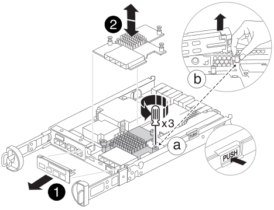

= Ersetzen Sie die Hardware des Controller-Moduls – FAS2800
:allow-uri-read: 
:icons: font
:imagesdir: ../media/

[role="lead"]
Ersetzen Sie die Hardware des beeinträchtigten Controller-Moduls, indem Sie den beeinträchtigten Controller entfernen, FRU-Komponenten in das Ersatz-Controller-Modul verschieben, das Ersatz-Controller-Modul im Gehäuse installieren und dann das Ersatz-Controller-Modul starten.

.Animation - ein Controller-Modul ersetzen
video::c83a3301-3161-4d65-86e8-af540147576a[panopto]

== Schritt 1: Controller-Modul entfernen

Entfernen Sie das Controller-Modul für beeinträchtigte Störungen aus dem Gehäuse.

. Wenn Sie nicht bereits geerdet sind, sollten Sie sich richtig Erden.
. Lösen Sie den Haken- und Schlaufenriemen, mit dem die Kabel am Kabelführungsgerät befestigt sind, und ziehen Sie dann die Systemkabel und SFPs (falls erforderlich) vom Controller-Modul ab, um zu verfolgen, wo die Kabel angeschlossen waren.
+
Lassen Sie die Kabel im Kabelverwaltungs-Gerät so, dass bei der Neuinstallation des Kabelverwaltungsgeräts die Kabel organisiert sind.

. Entfernen Sie die Kabelführungsgeräte von der linken und rechten Seite des Controller-Moduls und stellen Sie sie zur Seite.
. Wenn Sie die SFP-Module nach dem Entfernen der Kabel im System belassen haben, bringen Sie sie in das Ersatz-Controller-Modul.
. Drücken Sie die Verriegelung am Nockengriff, bis sie loslässt, öffnen Sie den Nockengriff vollständig, um das Controller-Modul aus der Mittelplatine zu lösen, und ziehen Sie das Controller-Modul anschließend mit zwei Händen aus dem Gehäuse heraus.
+
image::../media/drw_2240_x_opening_cam_latch.svg[drw 2240 x Öffnungsnockenverriegelung]

. Drehen Sie das Controller-Modul um und legen Sie es auf eine flache, stabile Oberfläche.
. Öffnen Sie die Abdeckung, indem Sie die blauen Tasten an den Seiten des Controller-Moduls drücken, um die Abdeckung zu lösen, und drehen Sie dann die Abdeckung nach oben und von dem Controller-Modul.
+
image::../media/drw_2850_open_controller_module_cover_IEOPS-695.svg[drw 2850 Open-Controller-Modulabdeckung IEOPS 695]

[cols="1,3"]
|===

 a| 
image::../media/legend_icon_01.svg[Legende Symbol 01]
 a| 
Entriegelungstaste der Steuermodulabdeckung

|===

== Schritt 2: Verschieben Sie den NVMEM-Akku

Entfernen Sie den NVMEM-Akku aus dem Controller-Modul für beeinträchtigte Verwendung, und installieren Sie ihn in das Controller-Ersatzmodul.

NOTE: Schließen Sie den NVMEM-Akku erst an, wenn Sie dazu aufgefordert werden.

image::../media/drw_2850_replace_nvbattery_IEOPS-715.svg[drw 2850 nvbattery IEOPS 715 ersetzen]

[cols="1,3"]
|===

 a| 
image::../media/legend_icon_01.svg[Legende Symbol 01]
 a| 
NVMEM Batterie-Release-Taste

 a| 
image::../media/legend_icon_02.svg[Legende Symbol 02]
 a| 
NVMEM-Batteriestecker

|===
. Entfernen Sie den Akku aus dem Controller-Modul:
+
.. Drücken Sie die blaue Taste an der Seite des Controller-Moduls.
.. Schieben Sie den Akku nach oben, bis er die Halteklammern freigibt, und heben Sie den Akku aus dem Controller-Modul heraus.
.. Ziehen Sie den Batteriestecker, indem Sie den Clip an der Vorderseite des Batteriesteckers zusammendrücken, um den Stecker aus der Steckdose zu lösen, und ziehen Sie dann das Batteriekabel aus der Steckdose.

. Setzen Sie den Akku in das neue Controller-Modul ein, und setzen Sie ihn ein:
+
.. Ausrichten der Batterie an den Haltehalterungen an der Blechseitenwand.
.. Schieben Sie den Akku nach unten, bis die Akkuverriegelung einrastet und in die Öffnung an der Seitenwand einrastet.
+

NOTE: Schließen Sie den Akku noch nicht an.  Sie schließen es an, sobald die restlichen Komponenten in das Ersatz-Controller-Modul verschoben wurden.

== Schritt 3: Entfernen Sie die Zusatzkarte

Entfernen Sie die E/A-Platte und die PCIe-Zusatzkarte aus dem Controller-Modul für beeinträchtigte Vorgänge.

[cols="1,3"]
|===

 a| 
image::../media/legend_icon_01.svg[Legende Symbol 01]
 a| 
E/A-Platte

 a| 
image::../media/legend_icon_02.svg[Legende Symbol 02]
 a| 
PCIe-Zusatzkarte

|===
. Entfernen Sie die E/A-Platte, indem Sie sie gerade aus dem Controller-Modul herausschieben.
. Lösen Sie die Rändelschrauben auf der Zusatzkarte.
+

NOTE: Sie können die Rändelschrauben mit den Fingern oder einem Schraubendreher lösen.

. Heben Sie die Zusatzkarte gerade nach oben und legen Sie sie auf eine antistatische Oberfläche.

== Schritt 4: Verschieben Sie die Startmedien

Entfernen Sie das Startmedium aus dem Controller-Modul für beeinträchtigten Betrieb, und setzen Sie es in das Ersatz-Controller-Modul ein.

. Suchen Sie nach dem Entfernen der Mezzanine-Karte das Boot-Medium anhand der folgenden Abbildung oder der FRU-Zuordnung auf dem Controller-Modul:
+
image::../media/drw_2850_replace_boot_media_IEOPS-696.svg[drw 2850 Boot-Medium IEOPS 696 ersetzen]

+
[cols="1,3"]
|===

 a| 
image::../media/legend_icon_01.svg[Legende Symbol 01]
 a| 
Startmedien-Entriegelungstaste

|===
. Entfernen Sie das Startmedium:
+
.. Drücken Sie die blaue Taste am Gehäuse des Bootmediums, um das Boot-Medium aus dem Gehäuse zu lösen.
.. Drehen Sie die Startmedien nach oben, und ziehen Sie sie vorsichtig gerade aus dem Startmediensockel heraus.
+

NOTE: Drehen oder ziehen Sie die Boot-Medien nicht gerade nach oben, da dadurch der Sockel oder das Boot-Medium beschädigt werden kann.

. Installieren Sie das Startmedium am Ersatz-Controller-Modul:
+
.. Richten Sie die Kanten des Ersatzstartmediums an der Buchse des Boot-Mediums aus, und schieben Sie ihn dann vorsichtig in die Buchse.
.. Überprüfen Sie die Startmedien, um sicherzustellen, dass sie ganz und ganz in der Steckdose sitzt.
+
Entfernen Sie gegebenenfalls die Startmedien, und setzen Sie sie wieder in den Sockel ein.

.. Drücken Sie die blaue Verriegelungstaste am Startmediengehäuse, drehen Sie die Startmedien ganz nach unten, und lassen Sie dann die Verriegelungstaste los, um das Startmedium zu verriegeln.

== Schritt 5: Installieren Sie die Zusatzkarte im Ersatzcontroller

Installieren Sie die Zusatzkarte im Ersatz-Controller-Modul.

. Setzen Sie die Zusatzkarte wieder ein:
+
.. Richten Sie die Zusatzkarte am Anschluss auf der Hauptplatine aus.
.. Drücken Sie die Karte vorsichtig nach unten, um sie in den Steckplatz zu setzen.
.. Ziehen Sie die drei Rändelschrauben auf der Zusatzkarte fest.

. Setzen Sie die E/A-Platte wieder ein.

== Schritt 6: Verschieben Sie die DIMMs

Entfernen Sie die DIMMs aus dem Controller-Modul für beeinträchtigte Störungen, und setzen Sie sie in das Ersatz-Controller-Modul ein.

image::../media/drw_2850_replace_dimms_IEOPS-699.svg[drw 2850 dimms IEOPS 699 ersetzen]

[cols="1,3"]
|===

 a| 
image::../media/legend_icon_01.svg[Legende Symbol 01]
 a| 
DIMM-Verriegelungsriegel

 a| 
image::../media/legend_icon_02.svg[Legende Symbol 02]
 a| 
DIMM

|===
. Suchen Sie die DIMMs auf dem Controller-Modul
+

NOTE: Notieren Sie sich die Position des DIMM-Moduls in den Sockeln, damit Sie das DIMM an der gleichen Stelle in das Ersatz-Controller-Modul und in der richtigen Ausrichtung einsetzen können.

. Entfernen Sie die DIMMs aus dem Controller-Modul für beeinträchtigte Störungen:
+
.. Entfernen Sie das DIMM-Modul aus dem Steckplatz, indem Sie die beiden DIMM-Auswurfhalterungen auf beiden Seiten des DIMM langsam auseinander drücken.
+
Das DIMM dreht sich ein wenig nach oben.

.. Drehen Sie das DIMM-Modul so weit wie möglich, und schieben Sie es dann aus dem Sockel.
+

NOTE: Halten Sie das DIMM vorsichtig an den Rändern, um Druck auf die Komponenten auf der DIMM-Leiterplatte zu vermeiden.

. Stellen Sie sicher, dass die NVMEM-Batterie nicht an das Ersatz-Controller-Modul angeschlossen ist.
. Installieren Sie die DIMMs in der Ersatzsteuerung an derselben Stelle, an der sie sich im außer Betrieb genommenen Controller befanden:
+
.. Drücken Sie vorsichtig, aber fest auf die Oberseite des DIMM, bis die Auswurfklammern über den Kerben an den Enden des DIMM einrasten.
+
Das DIMM passt eng in den Steckplatz, sollte aber leicht einpassen. Falls nicht, richten Sie das DIMM-Modul mit dem Steckplatz aus und setzen Sie es wieder ein.

+

NOTE: Prüfen Sie das DIMM visuell, um sicherzustellen, dass es gleichmäßig ausgerichtet und vollständig in den Steckplatz eingesetzt ist.

. Wiederholen Sie diese Schritte für das andere DIMM.

== Schritt 7: Verschieben Sie ein Cache-Modul

Entfernen Sie das Cache-Modul aus dem Controller-Modul für beeinträchtigte Störungen, und setzen Sie es in das Controller-Ersatzmodul ein.

image::../media/drw_2850_replace_caching module_IEOPS-697.svg[drw 2850 Caching-Modul IEOPS 697 ersetzen]

[cols="1,3"]
|===

 a| 
image::../media/legend_icon_01.svg[Legende Symbol 01]
 a| 
Sperrtaste für Caching-Modul

|===
. Suchen Sie das Caching-Modul in der Nähe der Rückseite des Controller-Moduls, und entfernen Sie es:
+
.. Drücken Sie die blaue Verriegelungstaste, und drehen Sie das Zwischenspeichermodul nach oben.
.. Ziehen Sie das Zwischenmodul vorsichtig gerade aus dem Gehäuse heraus.

. Installieren Sie das Caching-Modul im Ersatz-Controller-Modul:
+
.. Richten Sie die Kanten des Cache-Moduls an der Buchse im Gehäuse aus, und schieben Sie sie dann vorsichtig in die Buchse.
.. Vergewissern Sie sich, dass das Caching-Modul ganz und ganz im Sockel sitzt.
+
Entfernen Sie gegebenenfalls das Cache-Modul, und setzen Sie es wieder in den Sockel ein.

.. Drücken Sie die blaue Sperrtaste, drehen Sie das Caching-Modul ganz nach unten, und lassen Sie dann die Sperrtaste los, um das Caching-Modul zu verriegeln.

. Schließen Sie die NVMEM-Batterie an.
+
Vergewissern Sie sich, dass der Stecker in der Akkusteckdose auf der Hauptplatine einrastet.

+

NOTE: Wenn das Anschließen der Batterie schwierig ist, entfernen Sie die Batterie aus dem Controller-Modul, schließen Sie sie an, und setzen Sie sie dann wieder in das Controller-Modul ein.

. Bringen Sie die Abdeckung des Controller-Moduls wieder an.

== Schritt 8: Installieren Sie die NV-Batterie

Setzen Sie die NV-Batterie in das neue Controller-Modul ein.

. Stecken Sie den Batteriestecker wieder in die Buchse am Controller-Modul.
+
Vergewissern Sie sich, dass der Stecker in der Akkubuchse auf der Hauptplatine einrastet.

. Ausrichten der Batterie an den Haltehalterungen an der Blechseitenwand.
. Schieben Sie den Akku nach unten, bis die Akkuverriegelung einrastet und in die Öffnung an der Seitenwand einrastet.
. Setzen Sie die Abdeckung des Controller-Moduls wieder ein, und verriegeln Sie sie.

== Schritt 9: Installieren Sie den Controller

Installieren Sie das Ersatz-Controller-Modul im Systemgehäuse und starten Sie den ONTAP.

NOTE: Möglicherweise wird die System-Firmware beim Booten des Systems aktualisiert. Diesen Vorgang nicht abbrechen. Das Verfahren erfordert, dass Sie den Bootvorgang unterbrechen, den Sie in der Regel jederzeit nach der entsprechenden Aufforderung durchführen können. Wenn das System jedoch beim Booten der System die System-Firmware aktualisiert, müssen Sie nach Abschluss der Aktualisierung warten, bevor Sie den Bootvorgang unterbrechen.

. Wenn Sie nicht bereits geerdet sind, sollten Sie sich richtig Erden.
. Wenn dies noch nicht geschehen ist, bringen Sie die Abdeckung am Controller-Modul wieder an.
. Drehen Sie das Controller-Modul.
. Richten Sie das Ende des Controller-Moduls an der Öffnung im Gehäuse aus, und drücken Sie dann vorsichtig das Controller-Modul zur Hälfte in das System.
+

NOTE: Setzen Sie das Controller-Modul erst dann vollständig in das Chassis ein, wenn Sie dazu aufgefordert werden.

. Führen Sie die Neuinstallation des Controller-Moduls durch:
+
.. Schieben Sie das Steuermodul fest in die offene Position, bis es auf die Mittelebene trifft und vollständig sitzt, und schließen Sie dann den Nockengriff in die verriegelte Position.
+

NOTE: Beim Einschieben des Controller-Moduls in das Gehäuse keine übermäßige Kraft verwenden, um Schäden an den Anschlüssen zu vermeiden.

+
Der Controller beginnt zu booten, sobald er im Gehäuse sitzt.

.. Wenn Sie dies noch nicht getan haben, installieren Sie das Kabelverwaltungsgerät neu.
.. Verbinden Sie die Kabel mit dem Haken- und Schlaufenband mit dem Kabelmanagement-Gerät.
+

NOTE: Sie müssen nach einer Konsolenmeldung für das automatische Firmware-Update suchen. Wenn die Aktualisierungsmeldung angezeigt wird, drücken Sie nicht `Ctrl-C` So unterbrechen Sie den Bootvorgang, bis eine Meldung angezeigt wird, die bestätigt, dass die Aktualisierung abgeschlossen ist. Wenn die Firmware-Aktualisierung abgebrochen wird, wird der Boot-Prozess zur LOADER-Eingabeaufforderung beendet. Sie müssen den ausführen `update_flash` Befehl, und geben Sie dann ein `bye -g` Um das System neu zu starten.

*Wichtig:* während des Startvorgangs werden möglicherweise folgende Eingabeaufforderungen angezeigt:

* Eine Warnmeldung über eine nicht übereinstimmende System-ID und die Aufforderung, die System-ID außer Kraft zu setzen. Antworten `y` Zu dieser Eingabeaufforderung.
* Eine Eingabeaufforderung mit einer Warnmeldung, dass Sie beim Aufrufen des Wartungsmodus in einer HA-Konfiguration sicherstellen müssen, dass der gesunde Controller weiterhin ausgefallen ist. Antworten `y` Zu dieser Eingabeaufforderung.

