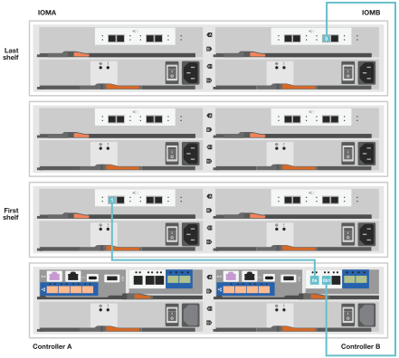

= Detaillierte Schritte - FAS2800
:allow-uri-read: 
:icons: font
:imagesdir: ../media/

[role="lead"]
Dieses Verfahren enthält detaillierte Schritt-für-Schritt-Anweisungen zur Installation eines typischen NetApp-Speichersystems. Gehen Sie wie folgt vor, wenn Sie ausführlichere Installationsanweisungen wünschen.

== Schritt 1: Installation vorbereiten

.Bevor Sie beginnen
Folgendes müssen Sie an Ihrer Website angeben:

* Rack-Platz für das Speichersystem in einem Telco-Rack oder Systemschrank.
+
** 2 HE für das Storage-System
** 2 oder 4 HE für jedes Laufwerk-Shelf im System

* Kreuzschlitzschraubendreher #2
* Zusätzliche Netzwerkkabel zum Anschließen des Speichersystems an den Netzwerk-Switch und Laptop oder die Konsole über einen Webbrowser
* Ein Laptop oder eine Konsole mit einer RJ-45-Verbindung und Zugriff auf einen Webbrowser
+
** Zugriff auf die https://hwu.netapp.com["NetApp Hardware Universe"] Für Informationen über Standortanforderungen sowie zusätzliche Informationen über Ihr konfiguriertes Speichersystem.
** Möglicherweise möchten Sie auch Zugriff auf den haben http://mysupport.netapp.com/documentation/productlibrary/index.html?productID=62286["Versionshinweise für Ihre Version von ONTAP 9"] Für Ihre Version von ONTAP finden Sie weitere Informationen zu diesem Storage-System.

.Schritte
. Packen Sie alle Kartons aus und inventarisieren Sie den Inhalt.
+

IMPORTANT: Kunden mit speziellen Anforderungen an die Stromversorgung müssen diese überprüfen https://hwu.netapp.com["NetApp Hardware Universe"] Für ihre Konfigurationsoptionen.

. Auf das zugreifen https://docs.netapp.com/us-en/ontap/task_configure_ontap.html#assign-a-node-management-ip-address["Konfigurieren Sie ONTAP mit System Manager in einem neuen Cluster"^]
+
.. Lesen Sie die amd-Verfahrensschritte zu den Anforderungen.
.. Erfassen Sie Informationen über Ihr Storage-System, indem Sie das abschließen https://docs.netapp.com/us-en/ontap/task_configure_ontap.html["Arbeitsblatt einrichten^ (URL zum Arbeitsblatt erforderlich)"].
.. Notieren Sie die Seriennummer des Storage-Systems von den Controllern.
+
image::../media/drw_ssn_label.svg[Beispiel für die Seriennummer des Systems]

In der folgenden Tabelle sind die Kabeltypen aufgeführt, die Sie möglicherweise erhalten können. Wenn Sie ein Kabel erhalten, das nicht in der Tabelle aufgeführt ist, lesen Sie die https://hwu.netapp.com["NetApp Hardware Universe"] Um das Kabel zu lokalisieren und dessen Verwendung zu identifizieren.

[cols="1,2,1,2"]
|===
| Kabeltyp... | Teilenummer und Länge | Steckverbindertyp | Für... 

 a| 
10 GbE, SFP28 Kabel (abhängig von der Bestellung)
 a| 
X6566B-05-R6, .5,

X6566B-2-R6, 2 m
 a| 
image::../media/oie_cable_sfp_gbe_copper.png[GbE SFP Kupfer Connector]
 a| 
Netzwerkkabel

 a| 
25 GB Ethernet, SFP28
 a| 
X66240A-05, 0,5 m

X66240-2, 2 m

X66240A-5, 5 m
 a| 
image::../media/oie_cable_25Gb_Ethernet_SFP28_IEOPS-1069.svg[oie-Kabel 25 GB Ethernet SFP28 IEOPS 1069]
 a| 
Netzwerkkabel

 a| 
32 GB Fibre Channel,
SFP+ (Target/Initiator)
 a| 
X66250-2, 2 m

X66250-5, 5 m

X66250-15, 15 m
 a| 
image::../media/oie_cable_sfp_gbe_copper.png[GbE SFP Kupfer Connector]
 a| 
FC-Netzwerk

 a| 
CAT 6, RJ-45 (je nach Bestellung)
 a| 
X6561-R6

X6562-R6
 a| 
image::../media/oie_cable_rj45.png[RJ-45-Kabel]
 a| 
Managementnetzwerk und Ethernet-Daten

 a| 
Storage
 a| 
X66030A, 0,5 m

X66031A, 1 m

X66032A, 2 m
 a| 
image::../media/oie_cable_mini_sas_hd_to_mini_sas_hd.svg[oie Kabel Mini sas hd auf Mini sas hd]
 a| 
Storage

 a| 
USB-C-Konsolenkabel
 a| 
Kein Etikett mit der Teilenummer
 a| 
image::../media/oie_cable_micro_usb.png[Micro-USB-Anschluss]
 a| 
Verbindung über die Konsole während der Software-Einrichtung auf Laptops/Konsolen, die nicht von Windows stammen

 a| 
Stromkabel
 a| 
Kein Etikett mit der Teilenummer
 a| 
image::../media/oie_cable_power.png[oie-Kabel mit Strom]
 a| 
Einschalten des Storage-Systems

 a| 
Optionales FC-Kabel
 a| 
Optionales FC-Kabel
 a| 
image::../media/oie_cable_fiber_lc_connector.png[LC-Glasfaseranschluss]
 a| 
Zusätzliches FC-Netzwerkkabel

|===

== Schritt 2: Installieren Sie die Hardware

Installieren Sie Ihr Storage-System gegebenenfalls in einem Telekommunikationsrack oder NetApp Storage-Systemschrank.

.Schritte
. Installieren Sie die Schienensatz nach Bedarf.
. Installieren und sichern Sie Ihr Speichersystem gemäß den Anweisungen im Schienensatz.
+

NOTE: Sie müssen sich der Sicherheitsbedenken im Zusammenhang mit dem Gewicht des Speichersystems bewusst sein.

+
image::../media/oie_fas2800_weight_caution_IEOPS-1070.svg[oie fas2800 Gewicht Vorsicht IEOPS 1070]

. Schließen Sie Kabelmanagement-Geräte (wie abgebildet) an.
+
image::../media/drw_cable_management_arm_install.svg[drw-Kabelmanagement-ARM-Installation]

. Platzieren Sie die Blende auf der Vorderseite des Speichersystems.

== Schritt 3: Controller mit Ihrem Netzwerk verbinden

Verkabeln Sie die Controller entweder als zwei-Node-Cluster ohne Switches oder als Switched-Cluster mit dem Netzwerk.

Die folgende Tabelle zeigt den Kabeltyp mit der Aufrufnummer und der Kabelfarbe in den Abbildungen für Cluster mit zwei Nodes ohne Switch und mit Switch.

[cols="20%,80%"]
|===
| Verkabelung | Verbindungstyp 

 a| 
image::../media/icon_square_1_green.png[Legende Nummer 3]]
 a| 
Cluster Interconnect

 a| 
image::../media/icon_square_2_yellow.png[Legende Nummer 2]
 a| 
Management-Netzwerk-Switch

 a| 
image::../media/icon_square_3_orange.png[Legende Nummer 3]
 a| 
Host-Netzwerk-Switches

|===
.Bevor Sie beginnen
* Wenden Sie sich an Ihren Netzwerkadministrator, um Informationen über das Anschließen des Speichersystems an die Switches zu erhalten.
* Prüfen Sie den Pfeil auf der Abbildung, ob die Zuglasche des Kabelsteckers richtig ausgerichtet ist.
+
** Wenn Sie den Anschluss einsetzen, sollten Sie spüren, dass er einrastet. Wenn Sie ihn nicht einrasten, entfernen Sie ihn, drehen Sie den Kabelkopf um und versuchen Sie es erneut.
** Stecken Sie beim Anschließen an einen optischen Switch den SFP-Port in den Controller-Port, bevor Sie die Verkabelung zum Port durchführen.

image::../media/oie_cable_pull_tab_down.svg[ziehen Sie die Lasche des oie-Kabels nach unten]

[role="tabbed-block"]
====
.Option 1: Verkabeln eines 2-Node-Clusters ohne Switches
--
Verkabeln Sie die Netzwerkverbindungen und die Cluster-Interconnect-Ports für ein Cluster mit zwei Nodes ohne Switches.

.Über diese Aufgabe
Verwenden Sie die Animation oder die Schritt-für-Schritt-Anleitung, um die Verkabelung zwischen den Controllern und den Switches abzuschließen.

.Animation – Verkabelung einer 2-Node-Cluster-Verkabelung ohne Switches
video::90577508-fa79-46cf-b18a-afe8016325af[panopto]
.Schritte
. Verkabeln Sie die Cluster Interconnect Ports e0a mit e0a und e0b mit e0b mit dem Cluster Interconnect-Kabel:
+
image::../media/oie_cable_25Gb_Ethernet_SFP28_IEOPS-1069.svg[oie-Kabel 25 GB Ethernet SFP28 IEOPS 1069]

+
*Cluster-Verbindungskabel*

+
image::../media/drw_2800_tnsc_cluster_cabling_IEOPS-892.svg[drw 2800 Tnsc-Clusterverkabelung IEOPS 892]

. Verkabeln Sie die E0M-Ports mit den Management-Netzwerk-Switches mit den RJ45-Kabeln:
+
image::../media/oie_cable_rj45.png[RJ-45-Kabel]

+
*RJ45-Kabel*

+
image::../media/drw_2800_management_connection_IEOPS-1077.svg[drw 2800 Managementverbindung IEOPS 1077]

. Verkabeln Sie die Ports der Zusatzkarte mit dem Hostnetzwerk.
+
image::../media/drw_2800_network_cabling_IEOPS-894.svg[drw 2800 Netzwerkverkabelung IEOPS 894]

+
.. Wenn Sie über ein 4-Port-Ethernet-Datennetzwerk verfügen, verbinden Sie die Ports e1a über e1d mit Ihrem Ethernet-Datennetzwerk.
+
*** 4-Port, 10 GB Ethernet, SFP28
+
image::../media/oie_cable_sfp_gbe_copper.png[GbE SFP Kupfer Connector]

+
image::../media/oie_cable_25Gb_Ethernet_SFP28_IEOPS-1069.svg[oie-Kabel 25 GB Ethernet SFP28 IEOPS 1069]

*** 4 PORTS, 10GBASE-T, RJ45
+
image::../media/oie_cable_rj45.png[RJ-45-Kabel]

.. Wenn Sie über ein Fibre-Channel-Datennetzwerk mit 4 Ports verfügen, verkabeln Sie die Ports 1a bis 1d für das FC-Netzwerk.
+
*** 4-Port, 32 GB Fibre Channel, SFP+ (nur Target)
+
image::../media/oie_cable_sfp_gbe_copper.png[GbE SFP Kupfer Connector]

*** 4-Port, 32 GB Fibre Channel, SFP+ (Initiator/Ziel)
+
image::../media/oie_cable_sfp_gbe_copper.png[GbE SFP Kupfer Connector]

.. Wenn Sie über eine 2+2-Karte (2 Ports mit Ethernet-Verbindungen und 2 Ports mit Fibre-Channel-Verbindungen) verfügen, verkabeln Sie die Ports e1a und e1b mit Ihrem FC-Datennetzwerk und die Ports e1c und e1d mit Ihrem Ethernet-Datennetzwerk.
+
*** 2-Port, 10 GB Ethernet (SFP28) + 2-Port 32 GB FC (SFP+)
+
image::../media/oie_cable_sfp_gbe_copper.png[GbE SFP Kupfer Connector]

+
image::../media/oie_cable_sfp_gbe_copper.png[GbE SFP Kupfer Connector]

IMPORTANT: Schließen Sie DIE Netzkabel NICHT an.

--
.Option 2: Kabel ein geschalteter Cluster
--
Verkabeln Sie die Netzwerkverbindungen und die Cluster Interconnect Ports für ein Switch Cluster.

.Über diese Aufgabe
Verwenden Sie die Animation oder die Schritt-für-Schritt-Anleitung, um die Verkabelung zwischen den Controllern und den Switches abzuschließen.

.Animation - Switch Cluster Verkabelung
video::6553a3db-57dd-4247-b34a-afe8016315d4[panopto]
.Schritte
. Verkabeln Sie die Cluster Interconnect Ports e0a mit e0a und e0b mit e0b mit dem Cluster Interconnect-Kabel:
+
image::../media/oie_cable_25Gb_Ethernet_SFP28_IEOPS-1069.svg[oie-Kabel 25 GB Ethernet SFP28 IEOPS 1069]

+
image::../media/drw_2800_switched_cluster_cabling_IEOPS-893.svg[drw 2800 Switch-Cluster-Verkabelung IEOPS 893]

. Verkabeln Sie die E0M-Ports mit den Management-Netzwerk-Switches mit den RJ45-Kabeln:
+
image::../media/oie_cable_rj45.png[RJ-45-Kabel]

+
image::../media/drw_2800_management_connection_IEOPS-1077.svg[drw 2800 Managementverbindung IEOPS 1077]

. Verkabeln Sie die Ports der Zusatzkarte mit dem Hostnetzwerk.
+
image::../media/drw_2800_network_cabling_IEOPS-894.svg[drw 2800 Netzwerkverkabelung IEOPS 894]

+
.. Wenn Sie über ein 4-Port-Ethernet-Datennetzwerk verfügen, verbinden Sie die Ports e1a über e1d mit Ihrem Ethernet-Datennetzwerk.
+
*** 4-Port, 10 GB Ethernet, SFP28
+
image::../media/oie_cable_sfp_gbe_copper.png[GbE SFP Kupfer Connector]

+
image::../media/oie_cable_25Gb_Ethernet_SFP28_IEOPS-1069.svg[oie-Kabel 25 GB Ethernet SFP28 IEOPS 1069]

*** 4 PORTS, 10GBASE-T, RJ45
+
image::../media/oie_cable_rj45.png[RJ-45-Kabel]

.. Wenn Sie über ein Fibre-Channel-Datennetzwerk mit 4 Ports verfügen, verkabeln Sie die Ports 1a bis 1d für das FC-Netzwerk.
+
*** 4-Port, 32 GB Fibre Channel, SFP+ (nur Target)
+
image::../media/oie_cable_sfp_gbe_copper.png[GbE SFP Kupfer Connector]

*** 4-Port, 32 GB Fibre Channel, SFP+ (Initiator/Ziel)
+
image::../media/oie_cable_sfp_gbe_copper.png[GbE SFP Kupfer Connector]

.. Wenn Sie über eine 2+2-Karte (2 Ports mit Ethernet-Verbindungen und 2 Ports mit Fibre-Channel-Verbindungen) verfügen, verkabeln Sie die Ports e1a und e1b mit Ihrem FC-Datennetzwerk und die Ports e1c und e1d mit Ihrem Ethernet-Datennetzwerk.
+
*** 2-Port, 10 GB Ethernet (SFP28) + 2-Port 32 GB FC (SFP+)
+
image::../media/oie_cable_sfp_gbe_copper.png[GbE SFP Kupfer Connector]

+
image::../media/oie_cable_sfp_gbe_copper.png[GbE SFP Kupfer Connector]

IMPORTANT: Schließen Sie DIE Netzkabel NICHT an.

--
====

== Schritt 4: Controller mit Laufwerk-Shelfs verkabeln

Verkabeln Sie Ihre Controller mit einem externen Speicher.

Die folgende Tabelle zeigt den Kabeltyp mit der Aufrufnummer und der Kabelfarbe in den Abbildungen zur Verkabelung der Festplatten-Shelfs mit dem Storage-System.

NOTE: Das Beispiel verwendet DS224C. Die Verkabelung ist ähnlich wie bei anderen unterstützten Festplatten-Shelfs. Weitere Informationen finden Sie unter link:../sas3/install-new-system.html["Einbau- und Kabelregale für eine neue Systeminstallation - Regale mit IOM12/IOM12B-Modulen"] .

[cols="20%,80%"]
|===
| Verkabelung | Verbindungstyp 

 a| 
image::../media/icon_square_1_blue.png[Symbol Quadrat 1 blau]
 a| 
Shelf-zu-Shelf-Verkabelung

 a| 
image::../media/icon_square_2_yellow.png[Symbol Quadrat 2 gelb]
 a| 
Controller A zu den Laufwerk-Shelfs

 a| 
image::../media/icon_square_3_orange.png[Symbol Quadrat 3 orange]
 a| 
Controller B zu den Laufwerk-Shelfs

|===
Prüfen Sie unbedingt den Abbildungspfeil, um die richtige Ausrichtung des Kabelanschlusses zu prüfen.

image::../media/oie_cable_pull_tab_down.svg[ziehen Sie die Lasche des oie-Kabels nach unten]

.Über diese Aufgabe
Verwenden Sie die Animation oder die Schritt-für-Schritt-Anleitung, um die Verkabelung zwischen den Controllern und den Laufwerk-Shelfs abzuschließen.

IMPORTANT: Verwenden Sie nicht Port 0b2 an einer FAS2800. Dieser SAS-Port wird von ONTAP nicht verwendet und ist immer deaktiviert. Weitere Informationen finden Sie unter link:../sas3/install-new-system.html["Installieren Sie ein Shelf in einem neuen Storage-System"^] .

.Animation: Kabel für Laufwerkseinschübe
video::b2a7549d-8141-47dc-9e20-afe8016f4386[panopto]
.Schritte
. Verkabeln Sie die Shelf-zu-Shelf-Ports.
+
.. Port 1 auf IOM A zu Port 3 auf IOM A auf dem Shelf direkt unten.
.. Port 1 auf IOM B zu Port 3 auf IOM B auf dem Shelf direkt unten.
+
image::../media/oie_cable_mini_sas_hd_to_mini_sas_hd.svg[oie Kabel Mini sas hd auf Mini sas hd]

+
*Mini-SAS HD auf Mini-SAS HD Kabel*

+
image::../media/drw_2800_shelf-to-shelf_cabling_IEOPS-895.svg[drw 2800 Shelf-zu-Shelf-Verkabelung IEOPS 895]

. Verkabeln Sie Controller A mit den Laufwerk-Shelfs.
+
.. Controller A-Port 0a zu IOM B-Port 1 am ersten Festplatten-Shelf im Stack.
.. Controller A-Port 0b1 zu IOM A-Port 3 auf dem letzten Festplatten-Shelf im Stack.
+
image::../media/oie_cable_mini_sas_hd_to_mini_sas_hd.svg[oie Kabel Mini sas hd auf Mini sas hd]

+
*Mini-SAS HD auf Mini-SAS HD Kabel*

+
image::../media/dwr-2800_controller1-to shelves_IEOPS-896.svg[dwr 2800 Controller1 zu den Shelfs IEOPS 896]

. Controller B mit den Laufwerk-Shelfs verbinden.
+
.. Controller B Port 0a zu IOM A Port 1 am ersten Festplatten-Shelf im Stack.
.. Controller B Port 0b1 zu IOM B Port 3 auf dem letzten Festplatten-Shelf im Stack.
+
image::../media/oie_cable_mini_sas_hd_to_mini_sas_hd.svg[oie Kabel Mini sas hd auf Mini sas hd]

+
*Mini-SAS HD auf Mini-SAS HD Kabel*

+

== Schritt 5: Vollständige Einrichtung und Konfiguration des Storage-Systems

Führen Sie die Einrichtung und Konfiguration des Speichersystems mit einer der folgenden Optionen durch: Wenn die Netzwerkerkennung aktiviert ist, oder mit Option 2: Wenn die Netzwerkerkennung nicht aktiviert ist.

[role="tabbed-block"]
====
.Option 1: Wenn die Netzwerkerkennung aktiviert ist
--
Wenn die Netzwerkerkennung auf Ihrem Laptop aktiviert ist, schließen Sie die Einrichtung und Konfiguration des Storage-Systems mithilfe der automatischen Cluster-Erkennung ab.

.Schritte
. Verwenden Sie die folgende Animation, um die Shelf-Stromversorgung einzuschalten und Shelf-IDs festzulegen.
+
.Animation: Legen Sie die Festplatten-Shelf-IDs fest
video::c600f366-4d30-481a-89d9-ab1b0066589b[panopto]
. Schalten Sie die Controller ein
+
.. Schließen Sie die Stromkabel an die Controller-Netzteile an, und schließen Sie sie dann an Stromquellen auf verschiedenen Stromkreisen an.
.. Schalten Sie die Netzschalter an beide Knoten ein.
+

NOTE: Das erste Booten kann bis zu acht Minuten dauern.

+
image::../media/dwr_2800_turn_on_power_IEOPS-898.svg[dwr 2800 Einschalten des IEOPS 898]

. Stellen Sie sicher, dass die Netzwerkerkennung auf Ihrem Laptop aktiviert ist.
+
Weitere Informationen finden Sie in der Online-Hilfe Ihres Notebooks.

. Schließen Sie Ihren Laptop an den Management-Switch an.
. Verwenden Sie die Grafik oder die Schritte, um den Storage-System-Node zu ermitteln und Folgendes zu konfigurieren:
+
image::../media/drw_autodiscovery_controler_select.svg[wählen sie den drw-Kontroller für die automatische Ermittlung aus]

+
.. Öffnen Sie Den Datei-Explorer.
.. Klicken Sie im linken Bereich auf Netzwerk.
.. Mit der rechten Maustaste klicken und Aktualisieren auswählen.
.. Doppelklicken Sie auf das ONTAP-Symbol, und akzeptieren Sie alle auf dem Bildschirm angezeigten Zertifikate.
+

NOTE: XXXXX ist die Seriennummer des Storage-Systems für den Ziel-Node.

+
System Manager wird geöffnet.

. Konfigurieren Sie mithilfe der von System Manager gesteuerten Einrichtung Ihr Storage-System mithilfe der in erfassten Daten <<Schritt 1: Installation vorbereiten>>.
. Erstellen Sie ein Konto oder melden Sie sich bei Ihrem Konto an.
+
.. Klicken Sie Auf https://mysupport.netapp.com["mysupport.netapp.com"]
.. Klicken Sie auf _Konto erstellen_, wenn Sie ein Konto erstellen oder sich bei Ihrem Konto anmelden müssen.

. Herunterladen und installieren https://mysupport.netapp.com/site/tools["Active IQ Config Advisor"]
+
.. Überprüfen Sie den Zustand Ihres Storage-Systems durch Ausführen von Active IQ Config Advisor.

. Registrieren Sie Ihr System unter https://mysupport.netapp.com/site/systems/register[].
. Wechseln Sie nach Abschluss der Erstkonfiguration mit dem https://www.netapp.com/support-and-training/documentation/["NetApp ONTAP-Ressourcen"] Seite für Informationen über das Konfigurieren zusätzlicher Funktionen in ONTAP.

--
.Option 2: Wenn die Netzwerkerkennung nicht aktiviert ist
--
Wenn die Netzwerkerkennung auf Ihrem Laptop nicht aktiviert ist, führen Sie die Konfiguration und Einrichtung manuell durch.

.Schritte
. Laptop oder Konsole verkabeln und konfigurieren:
+
.. Stellen Sie den Konsolenport des Laptops oder der Konsole auf 115,200 Baud mit N-8-1 ein.
+

NOTE: Informationen zur Konfiguration des Konsolenport finden Sie in der Online-Hilfe Ihres Laptops oder der Konsole.

.. Schließen Sie das Konsolenkabel an den Laptop oder die Konsole an und verbinden Sie den Konsolenport am Controller mithilfe des Konsolenkabels, das mit dem Storage-System geliefert wurde, und dann den Laptop oder die Konsole mit dem Switch im Management-Subnetz.
+
image::../media/drw_2800_laptop_to_switch_to_controller_IEOPS-1084.svg[drw 2800 Laptop zum Umschalten auf Controller IEOPS 1084]

.. Weisen Sie dem Laptop oder der Konsole eine TCP/IP-Adresse zu. Verwenden Sie dabei eine Adresse, die sich im Management-Subnetz befindet.

. Mithilfe der folgenden Animation können Sie eine oder mehrere Laufwerk-Shelf-IDs festlegen:
+
.Animation: Legen Sie die Festplatten-Shelf-IDs fest
video::c600f366-4d30-481a-89d9-ab1b0066589b[panopto]
. Schließen Sie die Stromkabel an die Controller-Netzteile an, und schließen Sie sie dann an Stromquellen auf verschiedenen Stromkreisen an.
. Schalten Sie die Netzschalter an beide Knoten ein.
+
image::../media/dwr_2800_turn_on_power_IEOPS-898.svg[dwr 2800 Einschalten des IEOPS 898]

+

NOTE: Das erste Booten kann bis zu acht Minuten dauern.

. Weisen Sie einem der Nodes eine erste Node-Management-IP-Adresse zu.
+
[cols="20%,80%"]
|===
| Wenn das Managementnetzwerk DHCP enthält... | Dann... 

 a| 
Konfiguriert
 a| 
Notieren Sie die IP-Adresse, die den neuen Controllern zugewiesen ist.

 a| 
Nicht konfiguriert
 a| 
.. Öffnen Sie eine Konsolensitzung mit PuTTY, einem Terminalserver oder dem entsprechenden Betrag für Ihre Umgebung.
+

NOTE: Überprüfen Sie die Online-Hilfe Ihres Laptops oder Ihrer Konsole, wenn Sie nicht wissen, wie PuTTY konfiguriert werden soll.

.. Geben Sie die Management-IP-Adresse ein, wenn Sie dazu aufgefordert werden.

|===
. Konfigurieren Sie das Cluster unter System Manager auf Ihrem Laptop oder Ihrer Konsole:
+
.. Rufen Sie die Node-Management-IP-Adresse im Browser auf.
+

NOTE: Das Format für die Adresse ist +https://x.x.x.x.+

.. Konfigurieren Sie das Speichersystem mithilfe der in erfassten Daten <<Schritt 1: Installation vorbereiten>>..

. Erstellen Sie ein Konto oder melden Sie sich bei Ihrem Konto an.
+
.. Klicken Sie Auf https://mysupport.netapp.com["mysupport.netapp.com"]
.. Klicken Sie auf _Konto erstellen_, wenn Sie ein Konto erstellen oder sich bei Ihrem Konto anmelden müssen.

. Herunterladen und installieren https://mysupport.netapp.com/site/tools["Active IQ Config Advisor"]
+
.. Überprüfen Sie den Zustand Ihres Storage-Systems durch Ausführen von Active IQ Config Advisor.

. Registrieren Sie Ihr System unter https://mysupport.netapp.com/site/systems/register[].
. Wechseln Sie nach Abschluss der Erstkonfiguration mit dem https://www.netapp.com/support-and-training/documentation/["NetApp ONTAP-Ressourcen"] Seite für Informationen über das Konfigurieren zusätzlicher Funktionen in ONTAP.

--
====