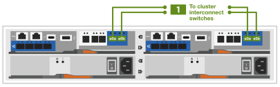

= Detaillierte Schritte - FAS2800
:allow-uri-read: 
:icons: font
:imagesdir: ../media/

[role="lead"]
Dieser Leitfaden enthält detaillierte Schritt-für-Schritt-Anleitungen zur Installation eines typischen NetApp Systems. In diesem Handbuch finden Sie weitere detaillierte Installationsanweisungen.

== Schritt 1: Installation vorbereiten

Um Ihr FAS2800 System zu installieren, müssen Sie ein Konto auf der NetApp Support-Website erstellen, Ihr System registrieren und Lizenzschlüssel erhalten. Außerdem müssen Sie die entsprechende Anzahl und den entsprechenden Kabeltyp für Ihr System inventarisieren und bestimmte Netzwerkinformationen erfassen.

Sie müssen Zugriff auf die haben https://hwu.netapp.com["NetApp Hardware Universe"] Weitere Informationen zu Standortanforderungen sowie zusätzliche Informationen zu Ihrem konfigurierten System. Möglicherweise möchten Sie auch Zugriff auf den haben http://mysupport.netapp.com/documentation/productlibrary/index.html?productID=62286["Versionshinweise für Ihre Version von ONTAP 9"] Für Ihre Version von ONTAP finden Sie weitere Informationen zu diesem System.

Folgendes müssen Sie an Ihrer Website angeben:

* Rack-Platz für das Storage-System
* Kreuzschlitzschraubendreher #2
* Zusätzliche Netzwerkkabel zum Anschließen des Systems an den Netzwerk-Switch und Laptop oder die Konsole über einen Webbrowser
* Ein Laptop oder eine Konsole mit einer RJ-45-Verbindung und Zugriff auf einen Webbrowser

.Schritte
. Packen Sie den Inhalt aller Boxen aus.
. Notieren Sie die Seriennummer des Systems von den Controllern.
+
image::../media/drw_ssn_label.svg[drw ssn-Etikett]

. Richten Sie Ihr Konto ein:
+
.. Melden Sie sich bei Ihrem bestehenden Konto an oder erstellen Sie ein Konto.
.. Registrieren Sie Ihr System über  https://mysupport.netapp.com/eservice/registerSNoAction.do?moduleName=RegisterMyProduct["NetApp Produktregistrierung"]

. Herunterladen und installieren https://mysupport.netapp.com/site/tools/tool-eula/activeiq-configadvisor["Config Advisor"] Auf Ihrem Laptop.
. Notieren Sie sich die Anzahl und die Kabeltypen, die Sie erhalten haben.
+
In der folgenden Tabelle sind die Kabeltypen aufgeführt, die Sie möglicherweise erhalten können. Wenn Sie ein Kabel erhalten, das nicht in der Tabelle aufgeführt ist, lesen Sie die https://hwu.netapp.com["NetApp Hardware Universe"] Um das Kabel zu lokalisieren und dessen Verwendung zu identifizieren.

+
[cols="1,2,1,2"]
|===
| Kabeltyp... | Teilenummer und Länge | Steckverbindertyp | Für... 

 a| 
10 GbE, SFP28 Kabel (abhängig von der Bestellung)
 a| 
X6566B-05-R6, .5,

X6566B-2-R6, 2 m
 a| 
image::../media/oie_cable_sfp_gbe_copper.svg[oie-Kabel sfp gbe Kupfer]
 a| 
Netzwerkkabel

 a| 
25 GB Ethernet, SFP28
 a| 
X66240A-05, 0,5 m

X66240-2, 2 m

X66240A-5, 5 m
 a| 
image::../media/oie_cable_25Gb_Ethernet_SFP28_IEOPS-1069.svg[oie-Kabel 25 GB Ethernet SFP28 IEOPS 1069]
 a| 
Netzwerkkabel

 a| 
32 GB Fibre Channel,
SFP+ (Target/Initiator)
 a| 
X66250-2, 2 m

X66250-5, 5 m

X66250-15, 15 m
 a| 
image::../media/oie_cable_sfp_gbe_copper.svg[oie-Kabel sfp gbe Kupfer]
 a| 
FC-Netzwerk

 a| 
CAT 6, RJ-45 (je nach Bestellung)
 a| 
X6561-R6

X6562-R6
 a| 
image::../media/oie_cable_rj45.svg[oie-Kabel rj45]
 a| 
Managementnetzwerk und Ethernet-Daten

 a| 
Storage
 a| 
X66030A, 0,5 m

X66031A, 1 m

X66032A, 2 m
 a| 
image::../media/oie_cable_mini_sas_hd_to_mini_sas_hd.svg[oie Kabel Mini sas hd auf Mini sas hd]
 a| 
Storage

 a| 
USB-C-Konsolenkabel
 a| 
Keine Angabe
 a| 
image::../media/oie_cable_micro_usb.svg[oie-Kabel Micro-usb]
 a| 
Verbindung über die Konsole während der Software-Einrichtung auf Laptops/Konsolen, die nicht von Windows stammen

 a| 
Stromkabel
 a| 
Keine Angabe
 a| 
image::../media/oie_cable_power.svg[oie-Kabel mit Strom]
 a| 
System einschalten

 a| 
Optionales FC-Kabel
 a| 
Optionales FC-Kabel
 a| 
image::../media/oie_cable_fiber_lc_connector.svg[oie-Kabel-Glasfaser-lc-Anschluss]
 a| 
Zusätzliches FC-Netzwerkkabel

|===
. Laden Sie die Arbeitsblätter in herunter, und füllen Sie sie aus  https://docs.netapp.com/us-en/ontap/software_setup/concept_set_up_the_cluster.html#cluster-setup-worksheets["Richten Sie das Cluster mit der ONTAP CLI ein"^].

== Schritt 2: Installieren Sie die Hardware

Sie müssen das System je nach Bedarf in einem 4-Säulen-Rack oder NetApp Systemschrank installieren.

.Schritte
. Installieren Sie die Schienensatz nach Bedarf.
. Installieren und sichern Sie das System anhand der im Schienensatz enthaltenen Anweisungen.
+

NOTE: Sie müssen sich der Sicherheitsbedenken im Zusammenhang mit dem Gewicht des Systems bewusst sein.

+
image::../media/oie_fas2800_weight_caution_IEOPS-1070.svg[oie fas2800 Gewicht Vorsicht IEOPS 1070]

. Schließen Sie Kabelmanagement-Geräte (wie abgebildet) an.
+
image::../media/drw_cable_management_arm_install.svg[drw-Kabelmanagement-ARM-Installation]

. Bringen Sie die Blende auf die Vorderseite des Systems an.

== Schritt 3: Controller mit Ihrem Netzwerk verbinden

Verkabeln Sie die Controller mit dem Netzwerk mithilfe der Cluster-Methode ohne zwei Nodes oder mithilfe der Cluster Interconnect-Netzwerkmethode.

In der folgenden Tabelle wird der Kabeltyp mit der Aufrufnummer und der Kabelfarbe in den Abbildungen für Cluster-Netzwerkverkabelungen ohne zwei Knoten und geswitchte Cluster-Netzwerkverkabelungen aufgeführt.

[cols="20%,80%"]
|===
| Verkabelung | Verbindungstyp 

 a| 
image::../media/oie_legend_icon_1_lg.svg[oie-Legende-Symbol 1 lg]
 a| 
Cluster Interconnect

 a| 
image::../media/oie_legend_icon_2_lp.svg[oie Legend Icon 2 lp]
 a| 
Management-Netzwerk-Switch

 a| 
image::../media/oie_legend_icon_3_o.svg[oie-Legende-Symbol 3 o]
 a| 
Host-Netzwerk-Switches

|===
[role="tabbed-block"]
====
.Option 1: Verkabeln eines 2-Node-Clusters ohne Switches
--
Verkabeln Sie die Netzwerkverbindungen und die Cluster-Interconnect-Ports für ein Cluster mit zwei Nodes ohne Switches.

.Bevor Sie beginnen
Wenden Sie sich an den Netzwerkadministrator, um Informationen zum Anschließen des Systems an die Switches zu erhalten.

Prüfen Sie unbedingt den Abbildungspfeil, um die richtige Ausrichtung des Kabelanschlusses zu prüfen.

image::../media/oie_cable_pull_tab_down.svg[ziehen Sie die Lasche des oie-Kabels nach unten]

NOTE: Wenn Sie den Anschluss einsetzen, sollten Sie spüren, dass er einrastet. Wenn Sie ihn nicht einrasten, entfernen Sie ihn, drehen Sie den Kabelkopf um und versuchen Sie es erneut.

NOTE: Stecken Sie beim Anschließen an einen optischen Switch den SFP-Port in den Controller-Port, bevor Sie die Verkabelung zum Port durchführen.

.Über diese Aufgabe
Sie können die Verkabelung zwischen den Controllern und den Switches mithilfe der Grafik oder der Schritt-für-Schritt-Anleitung abschließen.

.Animation – Verkabelung einer 2-Node-Cluster-Verkabelung ohne Switches
video::90577508-fa79-46cf-b18a-afe8016325af[panopto]
.Schritte
. Verkabeln Sie die Cluster Interconnect Ports e0a mit e0a und e0b mit e0b mit dem Cluster Interconnect-Kabel:
+
image::../media/oie_cable_25Gb_Ethernet_SFP28_IEOPS-1069.svg[oie-Kabel 25 GB Ethernet SFP28 IEOPS 1069]

+
*Cluster-Verbindungskabel*

+
image::../media/drw_2800_tnsc_cluster_cabling_IEOPS-892.svg[drw 2800 Tnsc-Clusterverkabelung IEOPS 892]

. Verkabeln Sie die E0M-Ports mit den Management-Netzwerk-Switches mit den RJ45-Kabeln:
+
image::../media/oie_cable_rj45.svg[oie-Kabel rj45]

+
*RJ45-Kabel*

+
image::../media/drw_2800_management_connection_IEOPS-1077.svg[drw 2800 Managementverbindung IEOPS 1077]

. Verkabeln Sie die Ports der Zusatzkarte mit dem Hostnetzwerk.
+
image::../media/drw_2800_network_cabling_IEOPS-894.svg[drw 2800 Netzwerkverkabelung IEOPS 894]

+
.. Wenn Sie über ein 4-Port-Ethernet-Datennetzwerk verfügen, verbinden Sie die Ports e1a über e1d mit Ihrem Ethernet-Datennetzwerk.
+
*** 4-Port, 10 GB Ethernet, SFP28
+
image::../media/oie_cable_sfp_gbe_copper.svg[oie-Kabel sfp gbe Kupfer]

+
image::../media/oie_cable_25Gb_Ethernet_SFP28_IEOPS-1069.svg[oie-Kabel 25 GB Ethernet SFP28 IEOPS 1069]

*** 4 PORTS, 10GBASE-T, RJ45
+
image::../media/oie_cable_rj45.svg[oie-Kabel rj45]

.. Wenn Sie über ein Fibre-Channel-Datennetzwerk mit 4 Ports verfügen, verkabeln Sie die Ports 1a bis 1d für das FC-Netzwerk.
+
*** 4-Port, 32 GB Fibre Channel, SFP+ (nur Target)
+
image::../media/oie_cable_sfp_gbe_copper.svg[oie-Kabel sfp gbe Kupfer]

*** 4-Port, 32 GB Fibre Channel, SFP+ (Initiator/Ziel)
+
image::../media/oie_cable_sfp_gbe_copper.svg[oie-Kabel sfp gbe Kupfer]

.. Wenn Sie über eine 2+2-Karte (2 Ports mit Ethernet-Verbindungen und 2 Ports mit Fibre-Channel-Verbindungen) verfügen, verkabeln Sie die Ports e1a und e1b mit Ihrem FC-Datennetzwerk und die Ports e1c und e1d mit Ihrem Ethernet-Datennetzwerk.
+
*** 2-Port, 10 GB Ethernet (SFP28) + 2-Port 32 GB FC (SFP+)
+
image::../media/oie_cable_sfp_gbe_copper.svg[oie-Kabel sfp gbe Kupfer]

+
image::../media/oie_cable_sfp_gbe_copper.svg[oie-Kabel sfp gbe Kupfer]

IMPORTANT: Schließen Sie DIE Netzkabel NICHT an.

--
.Option 2: Kabel ein geschalteter Cluster
--
Verkabeln Sie die Netzwerkverbindungen und die Cluster Interconnect Ports für ein Switch Cluster.

NOTE: Sie müssen sich an den Netzwerkadministrator wenden, um Informationen über das Anschließen des Systems an die Switches zu erhalten.

Prüfen Sie unbedingt den Abbildungspfeil, um die richtige Ausrichtung des Kabelanschlusses zu prüfen.

image::../media/oie_cable_pull_tab_down.svg[ziehen Sie die Lasche des oie-Kabels nach unten]

NOTE: Wenn Sie den Anschluss einsetzen, sollten Sie spüren, dass er einrastet. Wenn Sie ihn nicht einrasten, entfernen Sie ihn, drehen Sie den Kabelkopf um und versuchen Sie es erneut.

.Über diese Aufgabe
Sie können die Verkabelung zwischen den Controllern und den Switches mithilfe der Grafik oder der Schritt-für-Schritt-Anleitung abschließen.

.Animation - Switch Cluster Verkabelung
video::6553a3db-57dd-4247-b34a-afe8016315d4[panopto]
.Schritte
. Verkabeln Sie die Cluster Interconnect Ports e0a mit e0a und e0b mit e0b mit dem Cluster Interconnect-Kabel:
+
image::../media/oie_cable_25Gb_Ethernet_SFP28_IEOPS-1069.svg[oie-Kabel 25 GB Ethernet SFP28 IEOPS 1069]

+

. Verkabeln Sie die E0M-Ports mit den Management-Netzwerk-Switches mit den RJ45-Kabeln:
+
image::../media/oie_cable_rj45.svg[oie-Kabel rj45]

+
image::../media/drw_2800_management_connection_IEOPS-1077.svg[drw 2800 Managementverbindung IEOPS 1077]

. Verkabeln Sie die Ports der Zusatzkarte mit dem Hostnetzwerk.
+
image::../media/drw_2800_network_cabling_IEOPS-894.svg[drw 2800 Netzwerkverkabelung IEOPS 894]

+
.. Wenn Sie über ein 4-Port-Ethernet-Datennetzwerk verfügen, verbinden Sie die Ports e1a über e1d mit Ihrem Ethernet-Datennetzwerk.
+
*** 4-Port, 10 GB Ethernet, SFP28
+
image::../media/oie_cable_sfp_gbe_copper.svg[oie-Kabel sfp gbe Kupfer]

+
image::../media/oie_cable_25Gb_Ethernet_SFP28_IEOPS-1069.svg[oie-Kabel 25 GB Ethernet SFP28 IEOPS 1069]

*** 4 PORTS, 10GBASE-T, RJ45
+
image::../media/oie_cable_rj45.svg[oie-Kabel rj45]

.. Wenn Sie über ein Fibre-Channel-Datennetzwerk mit 4 Ports verfügen, verkabeln Sie die Ports 1a bis 1d für das FC-Netzwerk.
+
*** 4-Port, 32 GB Fibre Channel, SFP+ (nur Target)
+
image::../media/oie_cable_sfp_gbe_copper.svg[oie-Kabel sfp gbe Kupfer]

*** 4-Port, 32 GB Fibre Channel, SFP+ (Initiator/Ziel)
+
image::../media/oie_cable_sfp_gbe_copper.svg[oie-Kabel sfp gbe Kupfer]

.. Wenn Sie über eine 2+2-Karte (2 Ports mit Ethernet-Verbindungen und 2 Ports mit Fibre-Channel-Verbindungen) verfügen, verkabeln Sie die Ports e1a und e1b mit Ihrem FC-Datennetzwerk und die Ports e1c und e1d mit Ihrem Ethernet-Datennetzwerk.
+
*** 2-Port, 10 GB Ethernet (SFP28) + 2-Port 32 GB FC (SFP+)
+
image::../media/oie_cable_sfp_gbe_copper.svg[oie-Kabel sfp gbe Kupfer]

+
image::../media/oie_cable_sfp_gbe_copper.svg[oie-Kabel sfp gbe Kupfer]

IMPORTANT: Schließen Sie DIE Netzkabel NICHT an.

--
====

== Schritt 4: Controller mit Laufwerk-Shelfs verkabeln

Verkabeln Sie Ihre Controller mit einem externen Speicher.

NOTE: Das Beispiel verwendet DS224C. Die Verkabelung ist ähnlich wie bei anderen unterstützten Festplatten-Shelfs.

Prüfen Sie unbedingt den Abbildungspfeil, um die richtige Ausrichtung des Kabelanschlusses zu prüfen.

image::../media/oie_cable_pull_tab_down.svg[ziehen Sie die Lasche des oie-Kabels nach unten]

.Über diese Aufgabe
Sie können die Verkabelung zwischen den Controllern und den Laufwerk-Shelfs mithilfe der Grafik oder der Schritt-für-Schritt-Anleitung abschließen.

.Animation: Kabel für Laufwerkseinschübe
video::b2a7549d-8141-47dc-9e20-afe8016f4386[panopto]

NOTE: Verwenden Sie nicht Port 0b2 an einer FAS2800. Dieser SAS-Port wird von ONTAP nicht verwendet und ist immer deaktiviert. Siehe https://docs.netapp.com/us-en/ontap-systems/sas3/install-new-system.html["Installieren Sie ein Shelf in einem neuen Storage-System"^] Finden Sie weitere Informationen.

In der folgenden Tabelle wird der Kabeltyp mit der Aufrufnummer und der Kabelfarbe in den Abbildungen für Cluster-Netzwerkverkabelungen ohne zwei Knoten und geswitchte Cluster-Netzwerkverkabelungen aufgeführt.

[cols="20%,80%"]
|===
| Verkabelung | Verbindungstyp 

 a| 
image::../media/oie_legend_icon_1_lo.svg[oie-Legende Symbol 1 Lo]
 a| 
Cluster Interconnect

 a| 

 a| 
Management-Netzwerk-Switch

 a| 
image::../media/oie_legend_icon_3_t.svg[oie-Legendensymbol 3 t]
 a| 
Host-Netzwerk-Switches

|===
.Schritte
. Verkabeln Sie die Shelf-zu-Shelf-Ports.
+
.. Port 1 auf IOM A zu Port 3 auf IOM A auf dem Shelf direkt unten.
.. Port 1 auf IOM B zu Port 3 auf IOM B auf dem Shelf direkt unten.
+
image::../media/oie_cable_mini_sas_hd_to_mini_sas_hd.svg[oie Kabel Mini sas hd auf Mini sas hd]

+
*Mini-SAS HD auf Mini-SAS HD Kabel*

+
image::../media/drw_2800_shelf-to-shelf_cabling_IEOPS-895.svg[drw 2800 Shelf-zu-Shelf-Verkabelung IEOPS 895]

. Verkabeln Sie Controller A mit den Laufwerk-Shelfs.
+
.. Controller A-Port 0a zu IOM B-Port 1 am ersten Festplatten-Shelf im Stack.
.. Controller A-Port 0b1 zu IOM A-Port 3 auf dem letzten Festplatten-Shelf im Stack.
+
image::../media/oie_cable_mini_sas_hd_to_mini_sas_hd.svg[oie Kabel Mini sas hd auf Mini sas hd]

+
*Mini-SAS HD auf Mini-SAS HD Kabel*

+
image::../media/dwr-2800_controller1-to shelves_IEOPS-896.svg[dwr 2800 Controller1 zu den Shelfs IEOPS 896]

. Controller B mit den Laufwerk-Shelfs verbinden.
+
.. Controller B Port 0a zu IOM A Port 1 am ersten Festplatten-Shelf im Stack.
.. Controller B Port 0b1 zu IOM B Port 3 auf dem letzten Festplatten-Shelf im Stack.
+
image::../media/oie_cable_mini_sas_hd_to_mini_sas_hd.svg[oie Kabel Mini sas hd auf Mini sas hd]

+
*Mini-SAS HD auf Mini-SAS HD Kabel*

+
image::../media/dwr-2800_controller2-to shelves_IEOPS-897.svg[dwr 2800 Controller2 zu den Shelfs IEOPS 897]

== Schritt 5: System-Setup und -Konfiguration abschließen

Die Einrichtung und Konfiguration des Systems kann mithilfe der Cluster-Erkennung nur mit einer Verbindung zum Switch und Laptop abgeschlossen werden. Sie können auch direkt eine Verbindung zu einem Controller im System herstellen und dann eine Verbindung zum Management Switch herstellen.

[role="tabbed-block"]
====
.Option 1: Wenn die Netzwerkerkennung aktiviert ist
--
Wenn die Netzwerkerkennung auf Ihrem Laptop aktiviert ist, schließen Sie die Systemeinrichtung und -Konfiguration mithilfe der automatischen Clustererkennung ab.

.Schritte
. Mithilfe der folgenden Animation können Sie eine oder mehrere Laufwerk-Shelf-IDs festlegen
+
.Animation: Legen Sie die Festplatten-Shelf-IDs fest
video::c600f366-4d30-481a-89d9-ab1b0066589b[panopto]
. Schließen Sie die Stromkabel an die Controller-Netzteile an, und schließen Sie sie dann an Stromquellen auf verschiedenen Stromkreisen an.
. Schalten Sie die Netzschalter an beide Knoten ein.
+
image::../media/dwr_2800_turn_on_power_IEOPS-898.svg[dwr 2800 Einschalten des IEOPS 898]

+

NOTE: Das erste Booten kann bis zu acht Minuten dauern.

. Stellen Sie sicher, dass die Netzwerkerkennung auf Ihrem Laptop aktiviert ist.
+
Weitere Informationen finden Sie in der Online-Hilfe Ihres Notebooks.

. Schließen Sie Ihren Laptop mithilfe der folgenden Animation an den Management-Switch an.
+
.Animation - Verbinden Sie Ihren Laptop mit dem Management-Switch
video::d61f983e-f911-4b76-8b3a-ab1b0066909b[panopto]
. Wählen Sie ein ONTAP-Symbol aus, um es zu ermitteln:
+
image::../media/drw_autodiscovery_controler_select.svg[wählen sie den drw-Kontroller für die automatische Ermittlung aus]

+
.. Öffnen Sie Den Datei-Explorer.
.. Klicken Sie im linken Bereich auf Netzwerk.
.. Mit der rechten Maustaste klicken und Aktualisieren auswählen.
.. Doppelklicken Sie auf das ONTAP-Symbol, und akzeptieren Sie alle auf dem Bildschirm angezeigten Zertifikate.
+

NOTE: XXXXX ist die Seriennummer des Systems für den Ziel-Node.

+
System Manager wird geöffnet.

. Konfigurieren Sie das System mithilfe von System Manager geführten Setups anhand der Daten, die Sie im erfasst haben https://library.netapp.com/ecm/ecm_download_file/ECMLP2862613["ONTAP Konfigurationsleitfaden"]
. Überprüfen Sie den Systemzustand Ihres Systems, indem Sie Config Advisor ausführen.
. Wechseln Sie nach Abschluss der Erstkonfiguration mit dem https://www.netapp.com/data-management/oncommand-system-documentation/["ONTAP  ONTAP System Manager; Dokumentationsressourcen"] Seite für Informationen über das Konfigurieren zusätzlicher Funktionen in ONTAP.

--
.Option 2: Wenn die Netzwerkerkennung nicht aktiviert ist
--
Wenn die Netzwerkerkennung auf Ihrem Laptop nicht aktiviert ist, führen Sie die Konfiguration und Einrichtung manuell durch.

.Schritte
. Laptop oder Konsole verkabeln und konfigurieren:
+
.. Stellen Sie den Konsolenport des Laptops oder der Konsole auf 115,200 Baud mit N-8-1 ein.
+

NOTE: Informationen zur Konfiguration des Konsolenport finden Sie in der Online-Hilfe Ihres Laptops oder der Konsole.

.. Schließen Sie das Konsolenkabel an den Laptop oder die Konsole an, und schließen Sie den Konsolenport am Controller mithilfe des Konsolenkabels, das im Lieferumfang des Systems enthalten ist, an. Anschließend schließen Sie den Laptop oder die Konsole an den Switch im Management-Subnetz an.
+
image::../media/drw_2800_laptop_to_switch_to_controller_IEOPS-1084.svg[drw 2800 Laptop zum Umschalten auf Controller IEOPS 1084]

.. Weisen Sie dem Laptop oder der Konsole eine TCP/IP-Adresse zu. Verwenden Sie dabei eine Adresse, die sich im Management-Subnetz befindet.

. Mithilfe der folgenden Animation können Sie eine oder mehrere Laufwerk-Shelf-IDs festlegen:
+
.Animation: Legen Sie die Festplatten-Shelf-IDs fest
video::c600f366-4d30-481a-89d9-ab1b0066589b[panopto]
. Schließen Sie die Stromkabel an die Controller-Netzteile an, und schließen Sie sie dann an Stromquellen auf verschiedenen Stromkreisen an.
. Schalten Sie die Netzschalter an beide Knoten ein.
+
image::../media/dwr_2800_turn_on_power_IEOPS-898.svg[dwr 2800 Einschalten des IEOPS 898]

+

NOTE: Das erste Booten kann bis zu acht Minuten dauern.

. Weisen Sie einem der Nodes eine erste Node-Management-IP-Adresse zu.
+
[cols="20%,80%"]
|===
| Wenn das Managementnetzwerk DHCP enthält... | Dann... 

 a| 
Konfiguriert
 a| 
Notieren Sie die IP-Adresse, die den neuen Controllern zugewiesen ist.

 a| 
Nicht konfiguriert
 a| 
.. Öffnen Sie eine Konsolensitzung mit PuTTY, einem Terminalserver oder dem entsprechenden Betrag für Ihre Umgebung.
+

NOTE: Überprüfen Sie die Online-Hilfe Ihres Laptops oder Ihrer Konsole, wenn Sie nicht wissen, wie PuTTY konfiguriert werden soll.

.. Geben Sie die Management-IP-Adresse ein, wenn Sie dazu aufgefordert werden.

|===
. Konfigurieren Sie das Cluster unter System Manager auf Ihrem Laptop oder Ihrer Konsole:
+
.. Rufen Sie die Node-Management-IP-Adresse im Browser auf.
+

NOTE: Das Format für die Adresse lautet https://x.x.x.x[].

.. Konfigurieren Sie das System anhand der Daten, die Sie im erfasst haben https://library.netapp.com/ecm/ecm_download_file/ECMLP2862613["ONTAP Konfigurationsleitfaden"].

. Überprüfen Sie den Systemzustand Ihres Systems, indem Sie Config Advisor ausführen.
. Nachdem Sie die Erstkonfiguration abgeschlossen haben, fahren Sie mit fort  https://www.netapp.com/data-management/oncommand-system-documentation/["ONTAP  ONTAP System Manager; Dokumentationsressourcen"] Für Informationen über das Konfigurieren zusätzlicher Funktionen in ONTAP.

--
====