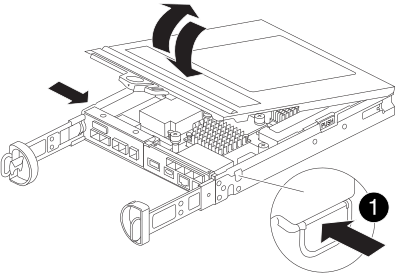

= Ersetzen Sie eine Zusatzkarte - FAS2820
:allow-uri-read: 
:icons: font
:imagesdir: ../media/

[role="lead"]
Tauschen Sie die Mezzanine-Karte in Ihrem FAS2820-System aus, wenn die Karte defekt ist, oder aktualisieren Sie sie auf ein anderes Protokoll, indem Sie eine neue Karte installieren.

* Verwenden Sie dieses Verfahren mit jeder von Ihrem System unterstützten ONTAP-Version.
* Ersetzen Sie die Mezzanine-Karte durch eine Karte desselben Typs oder eine Karte eines anderen Typs.
* Notieren Sie sich die ifgrp- und VLAN-Informationen, bevor Sie den Controller herunterfahren.
* Wenn Sie die Mezzanine-Kartentypen ändern, ändern Sie die LIF- und Port-Einstellungen nach dem Neustart des Controllers.
* Überprüfen Sie, ob alle anderen Systemkomponenten funktionieren. Sollte das Problem weiterhin bestehen, wenden Sie sich an den technischen Support.

.Animation - Ersetzen Sie die Mezzanine-Karte
video::a8ec891d-f6f6-4479-9ca2-af47017254ff[panopto]

== Schritt 1: Schalten Sie den beeinträchtigten Regler aus

.Bevor Sie beginnen
* Wenn Sie die Mezzanine-Kartentypen ändern, erfassen Sie die ifgrp- und VLAN-Informationen des betroffenen Knotens.
+
[source, cli]
----
network port vlan show -node _impaired_node_name_
network port ifgrp show -node _impaired_node_name_
----

Übernehmen Sie den fehlerhaften Controller und stoppen Sie ihn, damit der intakte Controller weiterhin Daten aus dem Speicher des fehlerhaften Controllers bereitstellt. Dazu unterdrücken Sie die automatische Fallerstellung in AutoSupport, deaktivieren die automatische Rückgabe und bringen den fehlerhaften Controller zur LOADER-Eingabeaufforderung. Die LOADER-Eingabeaufforderung ist der sichere, angehaltene Zustand, aus dem Sie die FRU ersetzen können.

Wenn Sie über ein Cluster mit mehr als zwei Nodes verfügen, muss es sich im Quorum befinden. Wenn sich das Cluster nicht im Quorum befindet oder ein gesunder Controller FALSE anzeigt, um die Berechtigung und den Zustand zu erhalten, müssen Sie das Problem korrigieren, bevor Sie den beeinträchtigten Controller herunterfahren; siehe link:https://docs.netapp.com/us-en/ontap/system-admin/synchronize-node-cluster-task.html?q=Quorum["Synchronisieren eines Node mit dem Cluster"^].

.Schritte
. Wenn AutoSupport aktiviert ist, unterdrücken Sie die automatische Erstellung eines Cases durch Aufrufen einer AutoSupport Meldung: `system node autosupport invoke -node * -type all -message MAINT=_number_of_hours_down_h`
+
Die folgende AutoSupport Meldung unterdrückt die automatische Erstellung von Cases für zwei Stunden: `cluster1:*> system node autosupport invoke -node * -type all -message MAINT=2h`

. Wenn der beeinträchtigte Controller Teil eines HA-Paars ist, deaktivieren Sie das automatische Giveback von der Konsole des gesunden Controllers: `storage failover modify -node local -auto-giveback false`
. Nehmen Sie den beeinträchtigten Controller zur LOADER-Eingabeaufforderung:
+
[cols="1,2"]
|===
| Wenn der eingeschränkte Controller angezeigt wird... | Dann... 

 a| 
Die LOADER-Eingabeaufforderung
 a| 
Wechseln Sie zu Controller-Modul entfernen.

 a| 
Warten auf Giveback...
 a| 
Drücken Sie Strg-C, und antworten Sie dann `y`.

 a| 
Eingabeaufforderung des Systems oder Passwort (Systempasswort eingeben)
 a| 
Übernehmen oder stoppen Sie den beeinträchtigten Regler von der gesunden Steuerung: `storage failover takeover -ofnode _impaired_node_name_`

Wenn der Regler „beeinträchtigt“ auf Zurückgeben wartet... anzeigt, drücken Sie Strg-C, und antworten Sie dann `y`.

|===

== Schritt 2: Entfernen Sie das Controller-Modul

Entfernen Sie das Controller-Modul und dessen Abdeckung.

.Schritte
. Wenn Sie nicht bereits geerdet sind, sollten Sie sich richtig Erden.
. Lösen Sie den Klettverschluss, merken Sie sich, wo die Kabel angeschlossen sind, und trennen Sie dann die Systemkabel und SFPs (falls erforderlich).
+
Lassen Sie die Kabel im Kabelmanagement-Gerät, damit sie organisiert bleiben.

. Entfernen Sie die Kabelführungsgeräte von der linken und rechten Seite des Controller-Moduls und stellen Sie sie zur Seite.
. Den Nockengriffverschluss lösen, vollständig öffnen und das Steuermodul aus dem Gehäuse herausziehen.
+
image::../media/drw_2850_pcm_remove_install_IEOPS-694.svg[Entfernen Sie den Controller]

. Drehen Sie den Controller um und legen Sie ihn auf eine ebene, stabile Oberfläche.
. Drücken Sie die blauen Knöpfe an den Seiten des Controllermoduls, um die Abdeckung zu entriegeln. Klappen Sie die Abdeckung nach oben und nehmen Sie sie vom Controllermodul ab.
+

[cols="1,3"]
|===

 a| 
image::../media/icon_round_1.png[Legende Nummer 1]
 a| 
Entriegelungstaste der Steuermodulabdeckung

|===

== Schritt 3: Ersetzen Sie die Zusatzkarte

Setzen Sie die Zusatzkarte wieder ein.

. Wenn Sie nicht bereits geerdet sind, sollten Sie sich richtig Erden.
. Entfernen Sie die Mezzanine-Karte mithilfe der folgenden Abbildung oder der FRU-Zuordnung auf dem Controller-Modul:
+
image::../media/drw_2850_replace_HIC_IEOPS-700.svg[Ersetzen einer Zusatzkarte]

+
[cols="1,3"]
|===

 a| 
image::../media/icon_round_1.png[Legende Nummer 1]
 a| 
E/A-Platte

 a| 
image::../media/icon_round_2.png[Legende Nummer 2]
 a| 
PCIe-Zusatzkarte

|===
+
.. Entfernen Sie die E/A-Platte, indem Sie sie gerade aus dem Controller-Modul herausschieben.
.. Lösen Sie die Rändelschrauben auf der Zusatzkarte, und heben Sie die Zusatzkarte gerade nach oben.
+

NOTE: Sie können die Rändelschrauben mit den Fingern oder einem Schraubendreher lösen. Wenn Sie Ihre Finger verwenden, müssen Sie den NV-Akku möglicherweise nach oben drehen, um den Finger besser an der Daumenschraube daneben zu kaufen.

. Setzen Sie die Zusatzkarte wieder ein:
+
.. Richten Sie den Anschluss der Ersatz-Mezzaninekarte an der Buchse auf dem Motherboard aus und setzen Sie die Karte dann vorsichtig und gerade in die Buchse ein.
.. Ziehen Sie die drei Rändelschrauben auf der Zusatzkarte fest.
.. Setzen Sie die E/A-Platte wieder ein.

. Setzen Sie die Abdeckung des Controller-Moduls wieder auf und verriegeln Sie sie.

== Schritt 4: Controller-Modul installieren und neu starten

Installieren Sie das Controller-Modul neu und starten Sie es neu.

.Schritte
. Wenn Sie nicht bereits geerdet sind, sollten Sie sich richtig Erden.
. Drehen Sie das Controller-Modul um und richten Sie das Ende an der Öffnung im Gehäuse aus.
. Schieben Sie das Steuermodul vorsichtig bis zur Hälfte in das Gehäuse.
+

NOTE: Setzen Sie das Controller-Modul erst dann vollständig in das Chassis ein, wenn Sie dazu aufgefordert werden.

. Schließen Sie die Systemkabel bei Bedarf wieder an.
+
Wenn Sie die Medienkonverter (QSFPs oder SFPs) entfernt haben, sollten Sie diese erneut installieren, wenn Sie Glasfaserkabel verwenden.

. Führen Sie die Neuinstallation des Controller-Moduls durch:
+
.. Bei geöffnetem Nockengriff das Steuermodul fest hineindrücken, bis es vollständig eingerastet ist. Nockengriff zum Verriegeln schließen.
+

NOTE: Beim Einschieben des Controller-Moduls in das Gehäuse keine übermäßige Kraft verwenden, um Schäden an den Anschlüssen zu vermeiden.

+
Der Controller beginnt zu booten, sobald er im Gehäuse sitzt.

.. Wenn Sie dies noch nicht getan haben, installieren Sie das Kabelverwaltungsgerät neu.
.. Befestigen Sie die Kabel mit dem Klettband am Kabelmanagement-Gerät. == Schritt 5: Konfigurieren Sie die Mezzanine-Karte neu (falls der Typ geändert wurde)

Nach dem Neustart des Controllers müssen die Einstellungen der Mezzanine-Karte an die neue Karte angepasst werden, falls Sie diese durch einen anderen Kartentyp ersetzt haben.

[role="tabbed-block"]
====
.Option 1: Fibre Channel zu Ethernet Mezzanine-Karte
--
Konfigurieren Sie die Ethernet-Ersatz-Mezzanine-Karte, indem Sie die LIFs und Port-Einstellungen nach Bedarf aktualisieren.

.Schritte
. Verwenden Sie den  `network port show` Befehl, um neue Portnamen und Verbindungszustände zu bestätigen.
. Stellen Sie alle ifgrps und VLANs auf den neuen Ethernet-Mezzanine-Ports wieder her.
. Ordnen Sie die neuen Ports bzw. ifgrp/VLAN-Ports den korrekten Broadcast-Domänen und IPspaces zu und legen Sie die MTU-Werte fest.
. Aktualisieren Sie die betroffenen LIF-Heimatport- und Failover-Einstellungen.
. Löschen Sie nicht mehr benötigte LIFs.

Siehe link:https://docs.netapp.com/us-en/ontap/networking/configure_network_ports_cluster_administrators_only_overview.html["Erfahren Sie mehr über ONTAP Netzwerkportkonfiguration"] für weitere detaillierte Informationen zur Konfiguration von Ethernet in ONTAP.

--
.Option 2: Ethernet-zu-Fibre-Channel-Mezzaninekarte
--
Konfigurieren Sie die Ersatz-FC-Mezzanine-Karte, indem Sie die LIFs und Port-Einstellungen nach Bedarf aktualisieren.

.Schritte
. Aktivieren Sie FCP auf den relevanten SVMs. Erstellen Sie neue Daten-LIFs.
. Aktualisieren Sie die Fabric-Zonierung und die Hostpfade. Aktualisieren Sie die Portset-, Initiatorgruppe- und LUN-Zuordnungen nach Bedarf.
. Überprüfen Sie die Multipath-Konfiguration des Hosts. Stellen Sie sicher, dass keine veralteten Pfade vorhanden sind und dass die Pfade zwischen optimierten und nicht optimierten Pfaden ausgeglichen sind.
. Prüfen Sie, ob keine LIFs an entfernten Ethernet-Ports angeschlossen sind, alle FC-LIFs aktiv sind und E/A-Operationen ausführen und die AutoSupport-Überwachung die neue Konfiguration widerspiegelt.

Siehe link:https://docs.netapp.com/us-en/ontap/san-admin/index.html["SAN-Managementübersicht"] für detailliertere Informationen zur Konfiguration von Fibre Channel in ONTAP.

--
====

== Schritt 6: Den Controller wieder in den Normalbetrieb versetzen

Geben Sie dem betroffenen Controller den Speicherplatz zurück, stellen Sie die automatische Rückgabe wieder her und beenden Sie das AutoSupport Wartungsfenster.

. Stellen Sie über die Eingabeaufforderung eines fehlerfreien Controllers oder eines Cluster-Administrators den normalen Betrieb des Controllers wieder her, indem Sie seinen Speicher wiederherstellen: `storage failover giveback -ofnode _impaired_node_name_`
. Stellen Sie mithilfe der die automatische Rückgabe wieder her `storage failover modify -node local -auto-giveback true` Befehl.
. Wenn ein AutoSupport-Wartungsfenster ausgelöst wurde, beenden Sie das Fenster mit. Verwenden Sie dazu die `system node autosupport invoke -node * -type all -message MAINT=END` Befehl.

== Schritt 7: Senden Sie das fehlgeschlagene Teil an NetApp zurück

Senden Sie das fehlerhafte Teil wie in den dem Kit beiliegenden RMA-Anweisungen beschrieben an NetApp zurück.  https://mysupport.netapp.com/site/info/rma["Rückgabe und Austausch von Teilen"]Weitere Informationen finden Sie auf der Seite.
