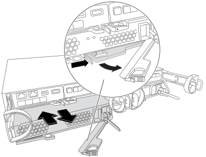

= Austausch eines Netzteils - FAS2820
:allow-uri-read: 
:icons: font
:imagesdir: ../media/

[role="lead"]
Beim Austausch eines Netzteils muss das funktionsunbestimmte Netzteil ausgeschaltet, getrennt und entfernt werden. Außerdem muss das Ersatznetzteil installiert, angeschlossen und eingeschaltet werden.

Alle anderen Komponenten des Systems müssen ordnungsgemäß funktionieren. Falls nicht, müssen Sie sich an den technischen Support wenden.

* Die Netzteile sind redundant und Hot-Swap-fähig.
* Dieses Verfahren ist für den Austausch eines Netzteils nach dem anderen beschrieben.
+

NOTE: Als Best Practice empfiehlt es sich, das Netzteil innerhalb von zwei Minuten vom Gehäuse zu ersetzen. Das System funktioniert weiterhin, aber ONTAP sendet Meldungen an die Konsole über das beeinträchtigte Netzteil, bis das Netzteil ersetzt wird.

* Die Netzteile haben einen automatischen Bereich.

.Animation: Ersetzen Sie das Netzteil
video::0631b48a-ad6f-4433-a2bd-af54014778c2[panopto]
.Schritte
. Identifizieren Sie das zu ersetzenden Netzteil anhand von Konsolenfehlern oder über die LEDs an den Netzteilen.
. Wenn Sie nicht bereits geerdet sind, sollten Sie sich richtig Erden.
. Schalten Sie das Netzteil aus und trennen Sie die Netzkabel:
+
.. Schalten Sie den Netzschalter am Netzteil aus.
.. Öffnen Sie die Netzkabelhalterung, und ziehen Sie dann das Netzkabel vom Netzteil ab.
.. Ziehen Sie das Netzkabel von der Stromversorgung ab.

. Drücken Sie die Verriegelung am Handgriff der Stromversorgungs-Nockenwelle, und öffnen Sie dann den Nockengriff, um das Netzteil vollständig von der Mittelebene zu lösen.
+

. Schieben Sie die Stromversorgung mit dem Nockengriff aus dem System heraus.
+

CAUTION: Wenn Sie ein Netzteil entfernen, verwenden Sie immer zwei Hände, um sein Gewicht zu stützen.

. Stellen Sie sicher, dass sich der ein-/Ausschalter des neuen Netzteils in der Stellung aus befindet.
. Halten und richten Sie die Kanten des Netzteils mit beiden Händen an der Öffnung im Systemgehäuse aus, und drücken Sie dann vorsichtig das Netzteil mithilfe des Nockengriffs in das Gehäuse.
+
Die Netzteile sind codiert und können nur auf eine Weise installiert werden.

+

NOTE: Beim Einschieben des Netzteils in das System keine übermäßige Kraft verwenden. Sie können den Anschluss beschädigen.

. Schließen Sie den Nockengriff, so dass die Verriegelung in die verriegelte Position einrastet und das Netzteil vollständig eingesetzt ist.
. Schließen Sie die Verkabelung des Netzteils wieder an:
+
.. Schließen Sie das Netzkabel wieder an das Netzteil und die Stromversorgung an.
.. Befestigen Sie das Netzkabel mithilfe der Netzkabelhalterung am Netzteil.

+
Sobald die Stromversorgung wiederhergestellt ist, sollte die Status-LED grün leuchten.

. Schalten Sie das neue Netzteil ein, und überprüfen Sie dann den Betrieb der Aktivitäts-LEDs für das Netzteil.
+
Die Netzteil-LEDs leuchten, wenn das Netzteil online geschaltet wird.

. Senden Sie das fehlerhafte Teil wie in den dem Kit beiliegenden RMA-Anweisungen beschrieben an NetApp zurück.  https://mysupport.netapp.com/site/info/rma["Rückgabe und Austausch von Teilen"^]Weitere Informationen finden Sie auf der Seite.

