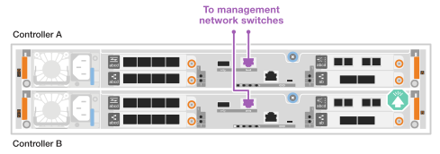
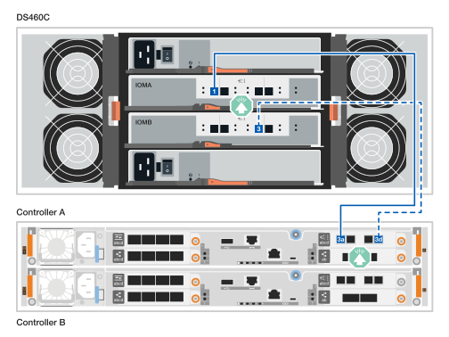
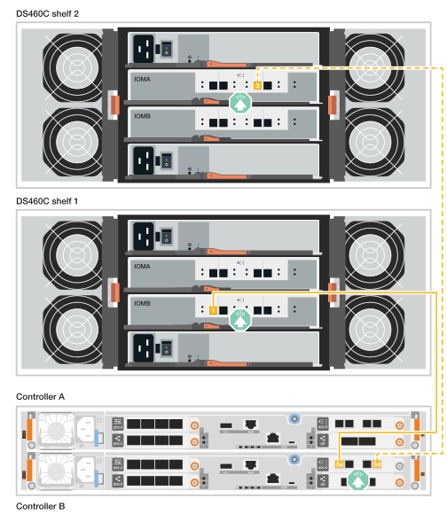

= Verkabelung der Hardware - FAS50
:allow-uri-read: 
:icons: font
:imagesdir: ../media/

[role="lead"]
Nachdem Sie die Hardware Ihres FAS50 Storage-Systems installiert haben, verkabeln Sie die Controller mit dem Netzwerk und den Shelfs.

.Bevor Sie beginnen
Wenden Sie sich an Ihren Netzwerkadministrator, um Informationen über das Anschließen des Speichersystems an die Netzwerk-Switches zu erhalten.

.Über diese Aufgabe
* Die Verkabelungsgrafiken haben Pfeilsymbole, die die richtige Ausrichtung (nach oben oder unten) des Kabelsteckers zeigen, wenn ein Anschluss in einen Anschluss eingesetzt wird.
+
Wenn Sie den Anschluss einsetzen, sollten Sie das Gefühl haben, dass er einrasten kann. Wenn Sie nicht das Gefühl haben, dass er klickt, entfernen Sie ihn, drehen Sie ihn um und versuchen Sie es erneut.

+
image:../media/drw_cable_pull_tab_direction_ieops-1699.svg["Richtung der Zuglasche des Kabels"]

* Wenn Sie eine Verkabelung zu einem optischen Switch vornehmen, stecken Sie den optischen Transceiver in den Controller-Port, bevor Sie ihn mit dem Switch-Port verbinden.

== Schritt 1: Cluster/HA-Verbindungen verkabeln

Erstellen Sie die ONTAP-Cluster-Verbindungen. Bei Clustern ohne Switch verbinden Sie die Controller miteinander. Verbinden Sie bei geswitchten Clustern die Controller mit den Cluster-Netzwerk-Switches.

[NOTE]
====
Die Cluster-/HA-Verkabelungsbeispiele zeigen gängige Konfigurationen.

Wenn Sie Ihre Konfiguration hier nicht sehen, finden Sie unter link:https://hwu.netapp.com["NetApp Hardware Universe"^]umfassende Informationen zur Konfiguration und Steckplatzpriorität, um das Storage-System zu verkabeln.

====
[role="tabbed-block"]
====
.Cluster-Verkabelung ohne Switch
--
.FAS50 mit einem 40/100 GbE I/O-Modul mit 2 Ports
[%collapsible]
=====
.Schritte
. Verkabeln der Cluster/HA Interconnect-Verbindungen:
+

NOTE: Der Cluster-Interconnect-Verkehr und der HA-Verkehr teilen sich dieselben physischen Ports (auf dem I/O-Modul in Steckplatz 4). Die Ports sind 40/100 GbE.

+
.. Kabel-Controller A-Anschluss e4a zu Controller B-Anschluss e4a.
.. Kabel Controller A-Port e4b zu Controller B-Port e4b.
+
*100 GbE Cluster/HA Interconnect-Kabel*

+
image::../media/oie_cable100_gbe_qsfp28.png[Cluster HA 100-GbE-Kabel]

+
image::../media/drw_isi_fas50_switchless_2p_100gbe_cabling_ieops-1937.svg[Diagramm der Switch-losen Cluster-Verkabelung mit einem 100-gbe-io-Modul]

=====
--
.Switch-Cluster-Verkabelung
--
.FAS50 mit einem 40/100 GbE I/O-Modul mit 2 Ports
[%collapsible]
=====
. Verkabeln Sie die Controller mit den Cluster-Netzwerk-Switches:
+

NOTE: Der Cluster-Interconnect-Verkehr und der HA-Verkehr teilen sich dieselben physischen Ports (auf dem I/O-Modul in Steckplatz 4). Die Ports sind 40/100 GbE.

+
.. Verbinden Sie Controller A-Port e4a mit Cluster-Netzwerk-Switch A.
.. Verbinden Sie den Controller A-Port e4b mit dem Cluster-Netzwerk-Switch B.
.. Verbinden Sie Controller B-Port e4a mit Cluster-Netzwerk-Switch A.
.. Verbinden Sie Controller B-Port e4b mit Cluster-Netzwerk-Switch B.
+
*40/100 GbE Cluster/HA Interconnect-Kabel*

+
image::../media/oie_cable100_gbe_qsfp28.png[Cluster HA 40/100-GbE-Kabel]

+
image:../media/drw_isi_fas50_2p_100gbe_switched_cluster_cabling_ieops-1936.svg["Fas50 Switch-Cluster-Verkabelungsdiagramm mit einem 100-gbe-io-Modul"]

=====
--
====

== Schritt 2: Verkabeln Sie die Host-Netzwerkverbindungen

Verkabeln Sie die Controller mit dem Ethernet- oder FC-Hostnetzwerk.

[NOTE]
====
Die Beispiele für die Hostnetzwerkverkabelung zeigen gängige Konfigurationen.

Wenn Sie Ihre Konfiguration hier nicht sehen, finden Sie unter link:https://hwu.netapp.com["NetApp Hardware Universe"^]umfassende Informationen zur Konfiguration und Steckplatzpriorität, um das Storage-System zu verkabeln.

====
[role="tabbed-block"]
====
.Ethernet-Hostverkabelung
--
.FAS50 mit einem 10/25 GbE I/O-Modul mit 4 Ports
[%collapsible]
=====
.Schritte
. Verkabeln Sie bei jedem Controller die Ports e2a, e2b, e2c und e2d mit den Ethernet-Host-Netzwerk-Switches.
+
*10/25-GbE-Kabel*

+
image:../media/oie_cable_sfp_gbe_copper.png["GbE SFP Kupfer Connector, Breite=100px"]

+
image::../media/drw_isi_fas50_4p_25gbe_optional_cabling_ieops-1934.svg[Verkabelung der ethernet Host-Netzwerk-Switches von 50 bis 10 gbe]

=====
--
.FC-Host-Verkabelung
--
.FAS50 mit einem 64-Gbit/s-FC-I/O-Modul mit 4 Ports
[%collapsible]
=====
.Schritte
. Verkabeln Sie an jedem Controller die Ports 1a, 1b, 1c und 1d mit den FC-Host-Netzwerk-Switches.
+
*64 Gbit/s FC-Kabel*

+
image:../media/oie_cable_sfp_gbe_copper.png["64-GB-fc-Kabel, Breite=100 px"]

+
image::../media/drw_isi_fas50_4p_64gb_fc_optional_cabling_ieops-1935.svg[Verkabelung zu 64 gb fc Host Netzwerk-Switches]

=====
--
====

== Schritt 3: Verkabelung der Management-Netzwerkverbindungen

Verkabeln Sie die Controller mit dem Managementnetzwerk.

. Verkabeln Sie die Managementports (Schraubenschlüssel) an jedem Controller mit den Managementnetzwerk-Switches.
+
* 1000BASE-T RJ-45 KABEL*

+
image::../media/oie_cable_rj45.png[RJ-45-Kabel]

+

IMPORTANT: Stecken Sie die Netzkabel noch nicht ein.

== Schritt 4: Verkabeln Sie die Shelf-Verbindungen

Die folgenden Verfahren zeigen, wie die Controller mit einem oder zwei DS460C Shelfs verkabelt werden.

.Über diese Aufgabe
* Die Beispiele für die Verkabelung zeigen DS460C Shelfs. Zusätzliche SAS Shelfs werden unterstützt, siehe link:https://hwu.netapp.com["NetApp Hardware Universe"^].
+
Die Verkabelung für andere unterstützte SAS-Shelves ist ähnlich. Siehe link:../sas3/install-new-system.html["Installieren und verkabeln Sie Shelfs für eine Neuinstallation des Systems"^]. Sie können sich auch auf link:../sas3/overview-cabling-rules-examples.html["Übersicht über SAS-Verkabelungen, Worksheets und Beispiele"^].

* Die maximale Anzahl der für Ihr Speichersystem unterstützten Einschübe und alle Verkabelungsoptionen, wie link:https://hwu.netapp.com["NetApp Hardware Universe"^]z. B. optische und Switch-Attached, finden Sie unter .
* Die Grafik zeigt die Verkabelung von Controller A blau und Controller B gelb.
* Verwenden Sie die im Lieferumfang des Storage-Systems angegebenen Speicherkabel. Dabei kann es sich um den folgenden Kabeltyp handelt:
+
*Mini-SAS-HD-Kabel*

+
image::../media/oie_cable_mini_sas_hd_to_mini_sas_hd.svg[Mini-SAS-HD-Kabel]

[role="tabbed-block"]
====
.Option 1: Ein DS460C Shelf
--
Verkabeln Sie jeden Controller mit jedem IOM12-Modul im DS460C Shelf.

.Schritte
. Controller A am Shelf verkabeln:
+
.. Verbinden Sie Controller A-Port 3a mit IOMA-Port 1.
.. Verbinden Sie Controller A-Port 3d mit IOMB-Port 3.
+

. Controller B am Shelf verkabeln:
+
.. Verbinden Sie Controller B-Port 3a mit IOMB-Port 1.
.. Kabel Controller B Port 3d zu IOMA Port 3.
+
image:../media/drw_isi_fas50_1_ds460c_controller_b_cabling_ieops-2169.svg["Controller B-Ports 3a und 3d, die mit einem DS460C Shelf verbunden sind"]

--
.Option 2: Zwei DS460C Shelfs
--
Schließen Sie jeden Controller an die IOM12-Module auf beiden DS460C Shelfs an.

. Verkabeln Sie die Shelf-zu-Shelf-Verbindungen:
+
.. Verkabeln Sie Shelf 1 IOMA-Port 3 zu Shelf 2 IOMA-Port 1.
.. Verkabeln Sie Shelf 1 IOMB-Port 3 zu Shelf 2 IOMB-Port 1.
+
image:../media/drw_isi_fas50_2_ds460c_shelf_to_shelf_ieops-2172.svg["Verkabelung von Shelf- zu Shelf-Verbindungen"]

. Verbinden Sie Controller A mit den Shelfs:
+
.. Verkabeln Sie Controller A-Port 3a mit Shelf 1 IOMA-Port 1.
.. Verbinden Sie Controller A-Port 3d mit Shelf 2 IOMB-Port 3.
+
image:../media/drw_isi_fas50_2_ds460c_controller_a_cabling_ieops-2170.svg["Controller A-Ports 3a und 3d, verkabelt mit zwei DS460C Shelfs"]

. Controller B mit den Shelfs verkabeln:
+
.. Verkabeln Sie Controller B, Port 3a, mit Shelf 1, IOMB-Port 1.
.. Verbinden Sie Controller B-Port 3d mit Shelf 2 IOMA-Port 3.
+

--
====
.Was kommt als Nächstes?
Nachdem Sie die Hardware für Ihr Speichersystem verkabelt haben, können Sie link:install-power-hardware.html["Schalten Sie das Speichersystem ein"].
