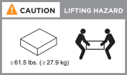

= Anforderungen für die Installation des FAS50 Storage-Systems
:allow-uri-read: 
:icons: font
:imagesdir: ../media/

[role="lead"]
Überprüfen Sie die Anforderungen für Ihr FAS50 Storage-System.

[[equipment-needed-for-install]]
== Für die Installation erforderliche Ausrüstung

Zur Installation des Storage-Systems benötigen Sie die folgenden Geräte und Tools:

* Zugriff auf einen Webbrowser zur Konfiguration des Speichersystems
* Band für elektrostatische Entladung (ESD)
* Taschenlampe
* Laptop oder Konsole mit USB-/serieller Verbindung
* Kreuzschlitzschraubendreher #2

[[lifting-precautions]]
== Vorsichtsmaßnahmen beim Anheben

Storage-Systeme und Shelves sind schwer. Gehen Sie beim Anheben und Bewegen dieser Gegenstände vorsichtig vor.

[[storage-system-weight]]
=== Gewicht des Storage-Systems

Treffen Sie die erforderlichen Vorsichtsmaßnahmen, wenn Sie das Speichersystem bewegen oder anheben.

Das Speichersystem kann bis zu 24.4 kg (53.8 lbs) wiegen. Zum Anheben des Lagersystems zwei Personen oder einen Hydraulikhub verwenden.

[[shelf-weight]]
=== Regalgewicht

Treffen Sie die erforderlichen Vorsichtsmaßnahmen, wenn Sie Ihr Regal bewegen oder anheben.

Ein DS460C-Regal kann bis zu 260,4 lbs (118,1 kg) wiegen. Zum Anheben des Regals könnten bis zu fünf Personen oder ein hydraulischer Lift erforderlich sein. Alle Komponenten sollten sich im Regal befinden (sowohl vorne als auch hinten), um ein Ungleichgewicht des Regalgewichts zu vermeiden.

image::../media/drw_ds460c_weight_warning_ieops-1932.svg[DS460C Vorsicht beim Anheben]

.Verwandte Informationen
* https://library.netapp.com/ecm/ecm_download_file/ECMP12475945["Sicherheitsinformationen und gesetzliche Hinweise"^]

.Was kommt als Nächstes?
Nachdem Sie die Installationsanforderungen und Überlegungen für Ihr Speichersystem überprüft haben, müssen Sie die link:install-prepare.html["Vorbereiten der Installation"].
