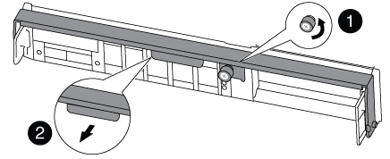

= Ersetzen Sie die Controller-Modul-Hardware – FAS8200
:allow-uri-read: 
:icons: font
:imagesdir: ../media/

[role="lead"]
Um die Hardware des Controller-Moduls zu ersetzen, müssen Sie den beeinträchtigten Controller entfernen, die FRU-Komponenten in das Ersatzcontrollermodul verschieben, das Ersatzcontrollermodul im Gehäuse installieren und das System dann in den Wartungsmodus booten.

== Schritt 1: Öffnen Sie das Controller-Modul

Zum Austauschen des Controller-Moduls müssen Sie zuerst das alte Controller-Modul aus dem Chassis entfernen.

. Wenn Sie nicht bereits geerdet sind, sollten Sie sich richtig Erden.
. Lösen Sie den Haken- und Schlaufenriemen, mit dem die Kabel am Kabelführungsgerät befestigt sind, und ziehen Sie dann die Systemkabel und SFPs (falls erforderlich) vom Controller-Modul ab, um zu verfolgen, wo die Kabel angeschlossen waren.
+
Lassen Sie die Kabel im Kabelverwaltungs-Gerät so, dass bei der Neuinstallation des Kabelverwaltungsgeräts die Kabel organisiert sind.

. Entfernen Sie die Kabelführungsgeräte von der linken und rechten Seite des Controller-Moduls und stellen Sie sie zur Seite.
+
image::../media/drw_32xx_cbl_mgmt_arm.png[Entfernen der Kabelführungsarme]

. Wenn Sie nach dem Entfernen der Kabel die SFP-Module im System belassen, verschieben Sie sie in das neue Controller-Modul.
. Lösen Sie die Daumenschraube am Nockengriff am Controller-Modul.
+

+
[cols="1,4"]
|===

 a| 
image:../media/icon_round_1.png["Legende Nummer 1"]
 a| 
Flügelschraube

 a| 
image:../media/icon_round_2.png["Legende Nummer 2"]
 a| 
CAM-Griff

|===
. Ziehen Sie den Nockengriff nach unten, und schieben Sie das Controller-Modul aus dem Gehäuse.
+
Stellen Sie sicher, dass Sie die Unterseite des Controller-Moduls unterstützen, während Sie es aus dem Gehäuse schieben.

== Schritt 2: Bewegen Sie das Startgerät

Sie müssen das Bootmedium ausfindig machen und die Anweisungen befolgen, um es aus dem alten Controller zu entfernen und in den neuen Controller einzufügen.

. Suchen Sie das Boot-Medium mithilfe der folgenden Abbildung oder der FRU-Zuordnung auf dem Controller-Modul:
+

. Drücken Sie die blaue Taste am Startmediengehäuse, um die Startmedien aus dem Gehäuse zu lösen, und ziehen Sie sie vorsichtig gerade aus der Buchse des Boot-Mediums heraus.
+

NOTE: Drehen oder ziehen Sie die Boot-Medien nicht gerade nach oben, da dadurch der Sockel oder das Boot-Medium beschädigt werden kann.

. Bewegen Sie die Startmedien auf das neue Controller-Modul, richten Sie die Kanten des Startmediums am Buchsengehäuse aus, und schieben Sie sie dann vorsichtig in die Buchse.
. Überprüfen Sie die Startmedien, um sicherzustellen, dass sie ganz und ganz in der Steckdose sitzt.
+
Entfernen Sie gegebenenfalls die Startmedien, und setzen Sie sie wieder in den Sockel ein.

. Drücken Sie die Startmedien nach unten, um die Verriegelungstaste am Startmediengehäuse zu betätigen.

== Schritt 3: Verschieben Sie die NVMEM-Batterie

Um die NVMEM-Batterie vom alten Controller-Modul in das neue Controller-Modul zu verschieben, müssen Sie eine bestimmte Sequenz von Schritten durchführen.

. Überprüfen Sie die NVMEM-LED:
+
** Wenn sich Ihr System in einer HA-Konfiguration befindet, fahren Sie mit dem nächsten Schritt fort.
** Wenn sich das System in einer eigenständigen Konfiguration befindet, fahren Sie das Controller-Modul ordnungsgemäß herunter, und überprüfen Sie dann die NVRAM-LED, die durch das NV-Symbol gekennzeichnet ist.
+
image::../media/drw_hw_nvram_icon.png[NV-LED]

+

NOTE: Die NVRAM-LED blinkt während des Auslagerung des Inhalts in den Flash-Speicher, wenn Sie das System anhalten. Nach Abschluss der Abscheidungen schaltet sich die LED aus.

+
*** Wenn die Stromversorgung ohne eine saubere Abschaltung unterbrochen wird, blinkt die NVMEM-LED bis zum Abschluss des Destages und die LED erlischt.
*** Wenn die LED eingeschaltet ist und eingeschaltet ist, werden nicht geschriebene Daten auf NVMEM gespeichert.
+
Dies tritt in der Regel während eines unkontrollierten Herunterfahrens auf, nachdem ONTAP erfolgreich gestartet wurde.

. Öffnen Sie den CPU-Luftkanal, und suchen Sie den NVMEM-Akku.
+
image::../media/drw_rxl_nvmem_battery.png[Austausch der NVMEM-Batterie]

+
[cols="1,4"]
|===

 a| 
image:../media/icon_round_1.png["Legende Nummer 1"]
 a| 
Verriegelungslasche

 a| 
image:../media/icon_round_2.png["Legende Nummer 2"]
 a| 
NVMEM-Akku

|===
. Fassen Sie den Akku an, und drücken Sie die blaue Verriegelungslasche, die mit DRUCKTASTE gekennzeichnet ist, und heben Sie den Akku aus dem Halter und dem Controller-Modul heraus.
. Entfernen Sie den Akku aus dem Controller-Modul und legen Sie ihn beiseite.

== Schritt 4: Verschieben Sie die DIMMs

Um die DIMMs zu bewegen, suchen und bewegen Sie sie vom alten Controller in den Ersatz-Controller und befolgen Sie die entsprechenden Schritte.

. Suchen Sie die DIMMs auf dem Controller-Modul.
. Beachten Sie die Ausrichtung des DIMM-Moduls in den Sockel, damit Sie das DIMM-Modul in die richtige Ausrichtung einsetzen können.
. Werfen Sie das DIMM aus dem Steckplatz, indem Sie die beiden DIMM-Auswerferlaschen auf beiden Seiten des DIMM langsam auseinander drücken und dann das DIMM aus dem Steckplatz schieben.
+

NOTE: Halten Sie das DIMM vorsichtig an den Rändern, um Druck auf die Komponenten auf der DIMM-Leiterplatte zu vermeiden.

+
Die Anzahl und Anordnung der System-DIMMs hängt vom Modell Ihres Systems ab.

+
Die folgende Abbildung zeigt die Position der System-DIMMs:

+
image::../media/drw_rxl_dimms.png[Ersetzen von DIMMs]

. Suchen Sie den Steckplatz, in dem Sie das DIMM installieren.
. Vergewissern Sie sich, dass sich die DIMM-Auswerferlaschen am Anschluss in der geöffneten Position befinden und setzen Sie das DIMM-Auswerfer anschließend in den Steckplatz ein.
+
Das DIMM passt eng in den Steckplatz, sollte aber leicht einpassen. Falls nicht, richten Sie das DIMM-Modul mit dem Steckplatz aus und setzen Sie es wieder ein.

+

NOTE: Prüfen Sie das DIMM visuell, um sicherzustellen, dass es gleichmäßig ausgerichtet und vollständig in den Steckplatz eingesetzt ist.

. Wiederholen Sie diese Schritte für die übrigen DIMMs.
. Verschieben Sie die NVMEM-Batterie in das Ersatz-Controller-Modul.
. Richten Sie die Lasche oder Laschen am Batteriehalter an den Kerben auf der Seite des Controller-Moduls aus, und drücken Sie dann vorsichtig das Batteriegehäuse nach unten, bis das Batteriegehäuse einrastet.

== Schritt 5: Verschieben Sie eine PCIe-Karte

Um PCIe-Karten zu verschieben, suchen und verschieben Sie sie vom alten Controller in den Ersatz-Controller und befolgen Sie die spezifischen Schritte.

Sie müssen das neue Controller-Modul bereit haben, damit Sie die PCIe-Karten direkt vom alten Controller-Modul in die entsprechenden Steckplätze im neuen bewegen können.

. Lösen Sie die Flügelschraube an der Seitenabdeckung des Controller-Moduls.
. Drehen Sie die Seitenabdeckung vom Controller-Modul ab.
+
image::../media/drw_rxl_pcie.png[Entfernen oder Installieren einer PCIe-Karte]

+
[cols="1,4"]
|===

 a| 
image:../media/icon_round_1.png["Legende Nummer 1"]
 a| 
Seitenabdeckung

 a| 
image:../media/icon_round_2.png["Legende Nummer 2"]
 a| 
PCIe-Karte

|===
. Entfernen Sie die PCIe-Karte aus dem alten Controller-Modul und legen Sie sie beiseite.
+
Stellen Sie sicher, dass Sie verfolgen, in welchem Steckplatz die PCIe-Karte sich befand.

. Wiederholen Sie den vorherigen Schritt für die übrigen PCIe-Karten im alten Controller-Modul.
. Öffnen Sie ggf. die Seitenverkleidung des neuen Controller-Moduls, und schieben Sie die PCIe-Karteneinfüllplatte nach Bedarf ab, und installieren Sie die PCIe-Karte sorgfältig.
+
Achten Sie darauf, dass Sie die Karte richtig im Steckplatz ausrichten und sogar Druck auf die Karte ausüben, wenn Sie sie in der Steckdose einsetzen. Die Karte muss vollständig und gleichmäßig im Steckplatz eingesetzt sein.

. Wiederholen Sie den vorherigen Schritt für die restlichen PCIe-Karten, die Sie beiseite gesetzt haben.
. Schließen Sie die Seitenabdeckung, und ziehen Sie die Daumenschraube fest.

== Schritt 6: Verschieben Sie ein Caching-Modul

Beim Austausch eines Controller-Moduls müssen Sie die Cache-Module von den beeinträchtigten Controller-Modulen auf das Ersatzcontrollermodul verschieben.

. Suchen Sie das Caching-Modul auf der Rückseite des Controller-Moduls, und entfernen Sie es:
+
.. Drücken Sie die Freigabelasche.
.. Entfernen Sie den Kühlkörper.
+
Das Speichersystem verfügt über zwei Steckplätze für das Caching-Modul und standardmäßig ist nur ein Steckplatz belegt.

+
image::../media/drw_rxl_fcache.png[Entfernen Sie das Cache-Modul und bauen Sie es wieder ein]

. Verschieben Sie das Caching-Modul auf das neue Controller-Modul, richten Sie die Kanten des Cache-Moduls am Sockelgehäuse aus und schieben Sie es vorsichtig in den Sockel.
. Vergewissern Sie sich, dass das Caching-Modul ganz und ganz im Sockel sitzt. Entfernen Sie gegebenenfalls das Cache-Modul, und setzen Sie es wieder in den Sockel ein.
. Setzen Sie den Kühlkörper wieder ein, und drücken Sie ihn nach unten, um die Verriegelungstaste am Gehäuse des Speichermoduls zu einrasten.
. Wiederholen Sie die Schritte, wenn Sie ein zweites Cache-Modul haben. Schließen Sie die Abdeckung des Controller-Moduls.

== Schritt 7: Installieren Sie den Controller

Nachdem Sie die Komponenten aus dem alten Controller-Modul in das neue Controller-Modul installiert haben, müssen Sie das neue Controller-Modul im Systemgehäuse installieren und das Betriebssystem booten.

Bei HA-Paaren mit zwei Controller-Modulen im selben Chassis ist die Sequenz, in der Sie das Controller-Modul installieren, besonders wichtig, da sie versucht, neu zu booten, sobald Sie es vollständig im Chassis einsetzen.

NOTE: Möglicherweise wird die System-Firmware beim Booten des Systems aktualisiert. Diesen Vorgang nicht abbrechen. Das Verfahren erfordert, dass Sie den Bootvorgang unterbrechen, den Sie in der Regel jederzeit nach der entsprechenden Aufforderung durchführen können. Wenn das System jedoch beim Booten der System die System-Firmware aktualisiert, müssen Sie nach Abschluss der Aktualisierung warten, bevor Sie den Bootvorgang unterbrechen.

. Wenn Sie nicht bereits geerdet sind, sollten Sie sich richtig Erden.
. Wenn Sie dies noch nicht getan haben, schließen Sie den CPU-Luftkanal.
. Richten Sie das Ende des Controller-Moduls an der Öffnung im Gehäuse aus, und drücken Sie dann vorsichtig das Controller-Modul zur Hälfte in das System.
+

NOTE: Setzen Sie das Controller-Modul erst dann vollständig in das Chassis ein, wenn Sie dazu aufgefordert werden.

. Verkabeln Sie nur die Management- und Konsolen-Ports, sodass Sie auf das System zugreifen können, um die Aufgaben in den folgenden Abschnitten auszuführen.
+

NOTE: Sie schließen die übrigen Kabel später in diesem Verfahren an das Controller-Modul an.

. Führen Sie die Neuinstallation des Controller-Moduls durch:
+
[cols="1,2"]
|===
| Ihr System befindet sich in... | Führen Sie dann folgende Schritte aus... 

 a| 
Ein HA-Paar
 a| 
 The controller module begins to boot as soon as it is fully seated in the chassis. Be prepared to interrupt the boot process.
.. Schieben Sie das Steuermodul fest in die offene Position, bis es auf die Mittelebene trifft und vollständig sitzt, und schließen Sie dann den Nockengriff in die verriegelte Position. Ziehen Sie die Flügelschraube am Nockengriff auf der Rückseite des Controller-Moduls fest.
+

NOTE: Beim Einschieben des Controller-Moduls in das Gehäuse keine übermäßige Kraft verwenden, um Schäden an den Anschlüssen zu vermeiden.

+
Der Controller beginnt zu booten, sobald er im Gehäuse sitzt.

.. Wenn Sie dies noch nicht getan haben, installieren Sie das Kabelverwaltungsgerät neu.
.. Verbinden Sie die Kabel mit dem Haken- und Schlaufenband mit dem Kabelmanagement-Gerät.
.. Wenn die Meldung angezeigt wird `Press Ctrl-C for Boot Menu`, Drücken Sie `Ctrl-C` Um den Bootvorgang zu unterbrechen.
+

NOTE: Wenn die Eingabeaufforderung nicht angezeigt wird und das Controller-Modul im ONTAP gebootet wird, geben Sie ein `halt`, Und geben Sie an der LOADER-Eingabeaufforderung ein `boot_ontap`, Drücken Sie `Ctrl-C` Wenn Sie dazu aufgefordert werden, und starten Sie dann in den Wartungsmodus.

.. Wählen Sie im angezeigten Menü die Option zum Starten im Wartungsmodus aus.

 a| 
Eine eigenständige Konfiguration
 a| 
.. Schieben Sie das Steuermodul fest in die offene Position, bis es auf die Mittelebene trifft und vollständig sitzt, und schließen Sie dann den Nockengriff in die verriegelte Position. Ziehen Sie die Flügelschraube am Nockengriff auf der Rückseite des Controller-Moduls fest.
+

NOTE: Beim Einschieben des Controller-Moduls in das Gehäuse keine übermäßige Kraft verwenden, um Schäden an den Anschlüssen zu vermeiden.

.. Wenn Sie dies noch nicht getan haben, installieren Sie das Kabelverwaltungsgerät neu.
.. Verbinden Sie die Kabel mit dem Haken- und Schlaufenband mit dem Kabelmanagement-Gerät.
.. Schließen Sie die Stromkabel wieder an die Netzteile und an die Stromquellen an, schalten Sie den Netzstrom ein, um den Bootvorgang zu starten, und drücken Sie dann `Ctrl-C` Nachdem Sie den gesehen haben `Press Ctrl-C for Boot Menu` Nachricht:
+

NOTE: Wenn die Eingabeaufforderung nicht angezeigt wird und das Controller-Modul im ONTAP gebootet wird, geben Sie ein `halt`, Und geben Sie an der LOADER-Eingabeaufforderung ein `boot_ontap`, Drücken Sie `Ctrl-C` Wenn Sie dazu aufgefordert werden, und starten Sie dann in den Wartungsmodus.

.. Wählen Sie im Startmenü die Option Wartungsmodus aus.

|===
+
*Wichtig:* während des Startvorgangs werden möglicherweise folgende Eingabeaufforderungen angezeigt:

+
** Eine Warnmeldung über eine nicht übereinstimmende System-ID und die Aufforderung, die System-ID außer Kraft zu setzen.
** Eine Eingabeaufforderung mit einer Warnmeldung, dass Sie beim Aufrufen des Wartungsmodus in einer HA-Konfiguration sicherstellen müssen, dass der gesunde Controller weiterhin ausgefallen ist. Sie können sicher reagieren `y` Um diese Eingabeaufforderungen.

