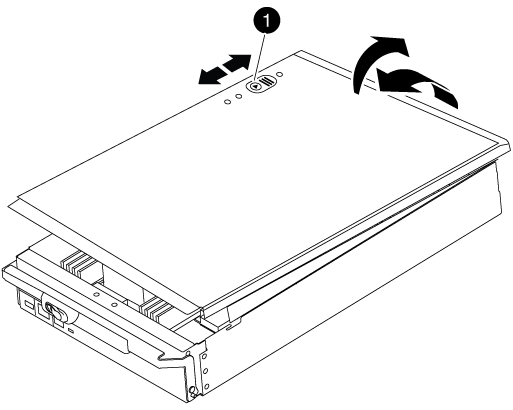

= Ersetzen Sie die Hardware des Controller-Moduls – FAS9000
:allow-uri-read: 
:icons: font
:imagesdir: ../media/

[role="lead"]
Um die Hardware des Controller-Moduls zu ersetzen, müssen Sie den beeinträchtigten Knoten entfernen, die FRU-Komponenten in das Ersatzcontrollermodul verschieben, das Ersatzcontrollermodul im Gehäuse installieren und das System dann in den Wartungsmodus booten.

== Schritt 1: Entfernen Sie das Controller-Modul

Um auf Komponenten innerhalb des Controllers zuzugreifen, müssen Sie zuerst das Controller-Modul aus dem System entfernen und dann die Abdeckung am Controller-Modul entfernen.

.Schritte
. Wenn Sie nicht bereits geerdet sind, sollten Sie sich richtig Erden.
. Ziehen Sie die Kabel vom beeinträchtigten Controller-Modul ab, und verfolgen Sie, wo die Kabel angeschlossen waren.
. Schieben Sie die orangefarbene Taste am Nockengriff nach unten, bis sie entsperrt ist.

image::../media/drw_9000_remove_pcm.png[drw 9000 PCM entfernen]

|===

 a| 
image:../media/legend_icon_01.png[""]

 a| 
Freigabetaste für den CAM-Griff

 a| 
image:../media/legend_icon_02.png[""]

 a| 
CAM-Griff

|===
. Drehen Sie den Nockengriff so, dass er das Controller-Modul vollständig aus dem Gehäuse herausrückt, und schieben Sie dann das Controller-Modul aus dem Gehäuse.
+
Stellen Sie sicher, dass Sie die Unterseite des Controller-Moduls unterstützen, während Sie es aus dem Gehäuse schieben.

. Setzen Sie die Abdeckung des Controller-Moduls auf eine stabile, flache Oberfläche, drücken Sie die blaue Taste auf der Abdeckung, schieben Sie die Abdeckung auf die Rückseite des Controller-Moduls, und schwenken Sie sie dann nach oben und heben Sie sie vom Controller-Modul ab.
+

+
|===

 a| 
image:../media/legend_icon_01.png[""]

 a| 
Verriegelungstaste für die Controllermodulabdeckung

|===

== Schritt 2: Verschieben Sie die Startmedien

Sie müssen das Bootmedium ausfindig machen und die Anweisungen befolgen, um es aus dem alten Controller zu entfernen und in den neuen Controller einzufügen.

.Schritte
. Heben Sie den schwarzen Luftkanal auf der Rückseite des Controller-Moduls an, und suchen Sie dann mithilfe der folgenden Abbildung oder der FRU-Karte am Controller-Modul die Bootmedien:
+
image::../media/drw_9000_remove_boot_dev.gif[drw 9000 Entw. Entfernen]

+
|===

 a| 
image:../media/legend_icon_01.png[""]

 a| 
Drücken Sie die Freigabelasche

 a| 
image:../media/legend_icon_02.png[""]

 a| 
Boot-Medien

|===
. Drücken Sie die blaue Taste am Startmediengehäuse, um die Startmedien aus dem Gehäuse zu lösen, und ziehen Sie sie vorsichtig gerade aus der Buchse des Boot-Mediums heraus.
+

NOTE: Drehen oder ziehen Sie die Boot-Medien nicht gerade nach oben, da dadurch der Sockel oder das Boot-Medium beschädigt werden kann.

. Bewegen Sie die Startmedien auf das neue Controller-Modul, richten Sie die Kanten des Startmediums am Buchsengehäuse aus, und schieben Sie sie dann vorsichtig in die Buchse.
. Überprüfen Sie die Startmedien, um sicherzustellen, dass sie ganz und ganz in der Steckdose sitzt.
+
Entfernen Sie gegebenenfalls die Startmedien, und setzen Sie sie wieder in den Sockel ein.

. Drücken Sie die Startmedien nach unten, um die Verriegelungstaste am Startmediengehäuse zu betätigen.

== Schritt 3: Verschieben Sie die System-DIMMs

Um die DIMMs zu bewegen, suchen und bewegen Sie sie vom alten Controller in den Ersatz-Controller und befolgen Sie die entsprechenden Schritte.

.Schritte
. Wenn Sie nicht bereits geerdet sind, sollten Sie sich richtig Erden.
. Suchen Sie die DIMMs auf dem Controller-Modul.
. Beachten Sie die Ausrichtung des DIMM-Moduls in den Sockel, damit Sie das DIMM-Modul in die richtige Ausrichtung einsetzen können.
. Werfen Sie das DIMM aus dem Steckplatz, indem Sie die beiden DIMM-Auswerferlaschen auf beiden Seiten des DIMM langsam auseinander drücken und dann das DIMM aus dem Steckplatz schieben.
+

NOTE: Halten Sie das DIMM vorsichtig an den Rändern, um Druck auf die Komponenten auf der DIMM-Leiterplatte zu vermeiden.

+
image::../media/drw_9000_replace_pcm_dimms.png[drw 9000 Austauschen der pcm-dimms]

+
|===

 a| 
image:../media/legend_icon_01.png[""]

 a| 
DIMM-Auswerferlaschen

 a| 
image:../media/legend_icon_02.png[""]

 a| 
DIMM

|===
. Suchen Sie den Steckplatz, in dem Sie das DIMM installieren.
. Vergewissern Sie sich, dass sich die DIMM-Auswerferlaschen am Anschluss in der geöffneten Position befinden und setzen Sie das DIMM-Auswerfer anschließend in den Steckplatz ein.
+
Das DIMM passt eng in den Steckplatz, sollte aber leicht einpassen. Falls nicht, richten Sie das DIMM-Modul mit dem Steckplatz aus und setzen Sie es wieder ein.

+

NOTE: Prüfen Sie das DIMM visuell, um sicherzustellen, dass es gleichmäßig ausgerichtet und vollständig in den Steckplatz eingesetzt ist.

. Setzen Sie das DIMM-Modul in den Steckplatz ein.
+
Das DIMM passt eng in den Steckplatz, sollte aber leicht einpassen. Falls nicht, richten Sie das DIMM-Modul mit dem Steckplatz aus und setzen Sie es wieder ein.

+

NOTE: Prüfen Sie das DIMM visuell, um sicherzustellen, dass es gleichmäßig ausgerichtet und vollständig in den Steckplatz eingesetzt ist.

. Drücken Sie vorsichtig, aber fest auf die Oberseite des DIMM, bis die Auswurfklammern über den Kerben an den Enden des DIMM einrasten.
. Wiederholen Sie diese Schritte für die übrigen DIMMs.

== Schritt 4: Installieren Sie den Controller

Nachdem Sie die Komponenten im Controller-Modul installiert haben, müssen Sie das Controller-Modul wieder in das Systemgehäuse installieren und das Betriebssystem booten.

Bei HA-Paaren mit zwei Controller-Modulen im selben Chassis ist die Sequenz, in der Sie das Controller-Modul installieren, besonders wichtig, da sie versucht, neu zu booten, sobald Sie es vollständig im Chassis einsetzen.

NOTE: Möglicherweise wird die System-Firmware beim Booten des Systems aktualisiert. Diesen Vorgang nicht abbrechen. Das Verfahren erfordert, dass Sie den Bootvorgang unterbrechen, den Sie in der Regel jederzeit nach der entsprechenden Aufforderung durchführen können. Wenn das System jedoch beim Booten der System die System-Firmware aktualisiert, müssen Sie nach Abschluss der Aktualisierung warten, bevor Sie den Bootvorgang unterbrechen.

.Schritte
. Wenn Sie nicht bereits geerdet sind, sollten Sie sich richtig Erden.
. Wenn dies noch nicht geschehen ist, bringen Sie die Abdeckung am Controller-Modul wieder an.
. Richten Sie das Ende des Controller-Moduls an der Öffnung im Gehäuse aus, und drücken Sie dann vorsichtig das Controller-Modul zur Hälfte in das System.
+

NOTE: Setzen Sie das Controller-Modul erst dann vollständig in das Chassis ein, wenn Sie dazu aufgefordert werden.

. Verkabeln Sie nur die Management- und Konsolen-Ports, sodass Sie auf das System zugreifen können, um die Aufgaben in den folgenden Abschnitten auszuführen.
+

NOTE: Sie schließen die übrigen Kabel später in diesem Verfahren an das Controller-Modul an.

. Führen Sie die Neuinstallation des Controller-Moduls durch:
+
.. Wenn Sie dies noch nicht getan haben, installieren Sie das Kabelverwaltungsgerät neu.
.. Drücken Sie das Controller-Modul fest in das Gehäuse, bis es auf die Mittelebene trifft und vollständig sitzt.
+
Die Verriegelungen steigen, wenn das Controller-Modul voll eingesetzt ist.

+

NOTE: Beim Einschieben des Controller-Moduls in das Gehäuse keine übermäßige Kraft verwenden, um Schäden an den Anschlüssen zu vermeiden.

+
Das Controller-Modul beginnt zu booten, sobald es vollständig im Gehäuse sitzt. Bereiten Sie sich darauf vor, den Bootvorgang zu unterbrechen.

.. Drehen Sie die Verriegelungsriegel nach oben, und kippen Sie sie so, dass sie die Sicherungsstifte entfernen und dann in die verriegelte Position absenken.
.. Unterbrechen Sie den Bootvorgang, indem Sie auf drücken `Ctrl-C` Wenn Sie sehen `Press Ctrl-C for Boot Menu`.
.. Wählen Sie im angezeigten Menü die Option zum Starten im Wartungsmodus aus.

