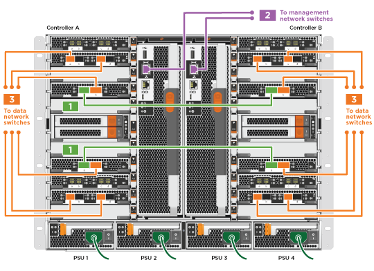

= Detaillierter Leitfaden - FAS9000
:allow-uri-read: 
:icons: font
:imagesdir: ../media/

[role="lead"]
Dieser Leitfaden enthält detaillierte Schritt-für-Schritt-Anleitungen zur Installation eines typischen NetApp Systems. In diesem Handbuch finden Sie weitere detaillierte Installationsanweisungen.

== Schritt 1: Installation vorbereiten

Um Ihr System zu installieren, müssen Sie auf der NetApp Support Site ein Konto erstellen, Ihr System registrieren und Lizenzschlüssel abrufen. Außerdem müssen Sie die entsprechende Anzahl und den entsprechenden Kabeltyp für Ihr System inventarisieren und bestimmte Netzwerkinformationen erfassen.

.Bevor Sie beginnen
Sie müssen Zugriff auf das Hardware Universe haben, um Informationen zu den Standortanforderungen sowie zusätzliche Informationen über Ihr konfiguriertes System zu erhalten. Möglicherweise möchten Sie auch Zugriff auf die Versionshinweise für Ihre Version von ONTAP haben, um weitere Informationen zu diesem System zu erhalten.

https://hwu.netapp.com["NetApp Hardware Universe"]

http://mysupport.netapp.com/documentation/productlibrary/index.html?productID=62286["Finden Sie die Versionshinweise für Ihre Version von ONTAP 9"]

Folgendes müssen Sie an Ihrer Website angeben:

* Rack-Platz für das Storage-System
* Kreuzschlitzschraubendreher #2
* Zusätzliche Netzwerkkabel zum Anschließen des Systems an den Netzwerk-Switch und Laptop oder die Konsole über einen Webbrowser

.Schritte
. Packen Sie den Inhalt aller Boxen aus.
. Notieren Sie die Seriennummer des Systems von den Controllern.
+
image::../media/drw_ssn_label.png[Beispiel für die Seriennummer des Systems]

. Notieren Sie sich die Anzahl und die Kabeltypen, die Sie erhalten haben.
+
In der folgenden Tabelle sind die Kabeltypen aufgeführt, die Sie möglicherweise erhalten können. Wenn Sie ein Kabel empfangen, das nicht in der Tabelle aufgeführt ist, finden Sie im Hardware Universe das Kabel und dessen Verwendung.

+
https://hwu.netapp.com["NetApp Hardware Universe"]

+
[cols="1,2,1,2"]
|===
| Kabeltyp... | Teilenummer und Länge | Steckverbindertyp | Für... 

 a| 
10-GbE-Netzwerkkabel
 a| 
X6566B-2-R6 (112-00299), 2 m

X6566B-3-R6, 112-00300, 3m

X6566B-5-R6 , 112-00301, 5 m
 a| 
image:../media/oie_cable_sfp_gbe_copper.png["GbE SFP Kupfer Connector"]
 a| 
Netzwerkkabel

 a| 
40-GbE-Netzwerkkabel

40-GbE-Cluster Interconnect
 a| 
X66100-1,112-00542, 1 m

X66100-3,112-00543, 3 m
 a| 
image:../media/oie_cable100_gbe_qsfp28.png["100-GbE-QSFP28-Anschluss"]
 a| 
40-GbE-Netzwerk

Cluster Interconnect

 a| 
100-GbE-Netzwerkkabel

100-GbE-Speicherkabel
 a| 
X6211A-05 (112-00595), 0,5 m

X6211A-1 (112-00573), 1 m

X6211A-2 (112-00574), 2 m

X6211A-5 (112-00574), 5 m
 a| 
image:../media/oie_cable100_gbe_qsfp28.png["100-GbE-QSFP28-Anschluss"]
 a| 
Netzwerkkabel

Speicherkabel

NOTE: Dieses Kabel gilt nur für AFF A700.

 a| 
Optische Netzwerkkabel (je nach Bestellung)
 a| 
X6553-R6 (112-00188), 2 m

X6536-R6 (112-00090), 5 m
 a| 
image:../media/oie_cable_fiber_lc_connector.png["LC-Glasfaseranschluss"]
 a| 
FC-Host-Netzwerk

 a| 
CAT 6, RJ-45 (je nach Bestellung)
 a| 
Teilenummern X6585-R6 (112-00291), 3m

X6562-R6 (112-00196), 5 m
 a| 
image:../media/oie_cable_rj45.png["RJ-45-Kabelanschluss"]
 a| 
Managementnetzwerk und Ethernet-Daten

 a| 
Storage
 a| 
X66031A (112-00436), 1 m

X66032A (112-00437), 2 m

X66033A (112-00438), 3 m
 a| 
image:../media/oie_cable_mini_sas_hd_to_mini_sas_hd.png["Mini-SAS-zu-Mini-SAS-Anschluss"]
 a| 
Storage

 a| 
Micro-USB-Konsolenkabel
 a| 
Keine Angabe
 a| 
image:../media/oie_cable_micro_usb.png["Micro-USB-Anschluss"]
 a| 
Verbindung über die Konsole während der Software-Einrichtung auf Laptops/Konsolen, die nicht von Windows stammen

 a| 
Stromkabel
 a| 
Keine Angabe
 a| 
image:../media/oie_cable_power.png["Stromkabel"]
 a| 
System einschalten

|===
. Lesen Sie den _NetApp Leitfaden zur ONTAP-Konkuratierung_ und sammeln Sie die in diesem Leitfaden aufgeführten Informationen.
+
https://library.netapp.com/ecm/ecm_download_file/ECMLP2862613["ONTAP Konfigurationsleitfaden"]

== Schritt 2: Installieren Sie die Hardware

Sie müssen das System je nach Bedarf in einem 4-Säulen-Rack oder NetApp Systemschrank installieren.

.Schritte
. Installieren Sie die Schienensatz nach Bedarf.
. Installieren und sichern Sie das System anhand der im Schienensatz enthaltenen Anweisungen.
+

NOTE: Sie müssen sich der Sicherheitsbedenken im Zusammenhang mit dem Gewicht des Systems bewusst sein.

+
image::../media/drw_9000_lifting_icon.png[Etikett mit der Warnung für das Hebegewicht]

+

NOTE: Auf dem Etikett links wird ein leeres Gehäuse angezeigt, während das Etikett auf der rechten Seite auf ein vollständig bestücktes System hinweist.

. Schließen Sie Kabelmanagement-Geräte (wie abgebildet) an.
+
image::../media/drw_9000_cable_management_arms.png[Befestigen Sie die Kabelführungsarme]

. Bringen Sie die Blende auf die Vorderseite des Systems an.

== Schritt 3: Controller mit Ihrem Netzwerk verbinden

Sie können die Controller mithilfe der Switch-freien Cluster-Methode mit zwei Nodes oder des Cluster Interconnect-Netzwerks mit dem Netzwerk verkabeln.

=== Option 1: Cluster mit zwei Nodes ohne Switches

Managementnetzwerk, Datennetzwerk und Management-Ports auf den Controllern sind mit Switches verbunden. Die Cluster Interconnect-Ports sind an beiden Controllern verkabelt.

Sie müssen sich an den Netzwerkadministrator wenden, um Informationen über das Anschließen des Systems an die Switches zu erhalten.

Achten Sie beim Einsetzen der Kabel in die Anschlüsse darauf, die Richtung der Kabelabziehlaschen zu überprüfen. Die Kabelabziehlaschen sind für alle Netzwerkmodulanschlüsse nach oben.

image::../media/oie_cable_pull_tab_up.png[Kabelanschluss mit Zuglasche oben]

NOTE: Wenn Sie den Anschluss einsetzen, sollten Sie das Gefühl haben, dass er einrasten kann. Wenn Sie nicht das Gefühl haben, dass er klickt, entfernen Sie ihn, drehen Sie ihn um und versuchen Sie es erneut.

.Schritte
. Verwenden Sie die Animation oder Abbildung, um die Verkabelung zwischen den Controllern und den Switches abzuschließen:
+
.Animation – Verkabeln Sie einen 2-Node-Cluster ohne Switches
video::7a55b98a-e8b8-41d5-821f-ac5b0032ead0[panopto]
+

. Gehen Sie zu <<Schritt 4: Controller mit Laufwerk-Shelfs verkabeln>> Anleitung zur Verkabelung des Festplatten-Shelf

=== Option 2: Cluster mit Switch

Managementnetzwerk, Datennetzwerk und Management-Ports auf den Controllern sind mit Switches verbunden. Die Cluster Interconnect- und HA-Ports sind mit dem Cluster/HA-Switch verbunden.

Sie müssen sich an den Netzwerkadministrator wenden, um Informationen über das Anschließen des Systems an die Switches zu erhalten.

Achten Sie beim Einsetzen der Kabel in die Anschlüsse darauf, die Richtung der Kabelabziehlaschen zu überprüfen. Die Kabelabziehlaschen sind für alle Netzwerkmodulanschlüsse nach oben.

image::../media/oie_cable_pull_tab_up.png[Kabelanschluss mit Zuglasche oben]

NOTE: Wenn Sie den Anschluss einsetzen, sollten Sie das Gefühl haben, dass er einrasten kann. Wenn Sie nicht das Gefühl haben, dass er klickt, entfernen Sie ihn, drehen Sie ihn um und versuchen Sie es erneut.

.Schritte
. Verwenden Sie die Animation oder Abbildung, um die Verkabelung zwischen den Controllern und den Switches abzuschließen:
+
.Animation - Switch Cluster Verkabelung
video::6381b3f1-4ce5-4805-bd0a-ac5b0032f51d[panopto]
+
image:../media/drw_9000_switched_cluster_cabling.png["Verbundkabelplan für Switched Cluster"]

. Gehen Sie zu <<Schritt 4: Controller mit Laufwerk-Shelfs verkabeln>> Anleitung zur Verkabelung des Festplatten-Shelf

== Schritt 4: Controller mit Laufwerk-Shelfs verkabeln

Je nachdem, ob es sich um ein AFF- oder FAS-System handelt, können neue Systeme an DS212C-, DS224C- oder NS224-Shelfs angeschlossen werden.

=== Option 1: Controller mit DS212C- oder DS224C-Laufwerk-Shelfs verkabeln

Sie müssen die Shelf-zu-Shelf-Verbindungen verkabeln und dann beide Controller mit dem DS212C oder DS224C Laufwerk-Shelfs verkabeln.

Die Kabel werden mit den Pull-Tabs nach unten in das Festplatten-Shelf eingesetzt, während das andere Ende des Kabels mit den Pull-Tabs nach oben in die Controller-Storage-Module eingesetzt wird.

image::../media/oie_cable_pull_tab_down.png[Kabelanschluss mit Zuglasche unten]

image::../media/oie_cable_pull_tab_up.png[Kabelanschluss mit Zuglasche oben]

.Schritte
. Verwenden Sie die folgenden Animationen oder Illustrationen, um Ihre Laufwerk-Shelfs mit den Controllern zu verkabeln.
+

NOTE: In den Beispielen werden DS224C Shelfs verwendet. Die Verkabelung ist ähnlich wie bei anderen unterstützten SAS-Platten-Shelves.

+
** Verkabelung von SAS-Shelfs in FAS9000, AFF A700 und ASA AFF A700, ONTAP 9.7 und früher:
+
.Animation - SAS-Kabelspeicher - ONTAP 9.7 und früher
video::a312e09e-df56-47b3-9b5e-ab2300477f67[panopto]

+
image:../media/SAS_storage_ONTAP_9.7_and_earlier.png["SAS-Speicherverkabelung für ONTAP 9.7 und frühere Versionen"]

+
** Verkabelung von SAS-Shelfs in FAS9000, AFF A700 und ASA AFF A700, ONTAP 9.8 und höher:
+
.Animation - KabelSAS-Speicher - ONTAP 9.8 und höher
video::61d23302-9526-4a2b-9335-ac5b0032eafd[panopto]
+
image:../media/SAS_storage_ONTAP_9.8_and_later.png["SAS-Speicherverkabelung für ONTAP 9.8 und höher"]

+

NOTE: Wenn Sie über mehr als einen Festplatten-Shelf-Stack verfügen, lesen Sie die „_Installation and Cabling Guide_“ für den Laufwerk-Shelf-Typ.

+
link:../sas3/install-new-system.html["Einbau- und Kabelregale für eine neue Systeminstallation - Regale mit IOM12-Modulen"]

+
image:../media/Cable_shelves_new_system_IOM12_shelves.png["Verkabelung des Storage-Systems mit SAS Shelfs"]

. Gehen Sie zu <<Schritt 5: System-Setup und -Konfiguration abschließen>> Zum Abschließen der Einrichtung und Konfiguration des Systems.

=== Option 2: Verkabeln Sie die Controller nur mit einem einzelnen NS224-Festplatten-Shelf in ASA AFF A700 Systemen mit ONTAP 9.8 und höher

Sie müssen jeden Controller bei einer AFF A700 oder ASA AFF A700 mit System ONTAP 9.8 oder höher mit den NSM-Modulen am NS224 Drive-Shelf verkabeln.

* Dieser Vorgang gilt nur für ASA AFF A700 mit ONTAP 9.8 oder höher.
* Für die Systeme muss mindestens ein X91148A-Modul in den Steckplätzen 3 und/oder 7 pro Controller installiert sein. Die Animation oder Abbildungen zeigen, dass dieses Modul in den Steckplätzen 3 und 7 installiert ist.
* Prüfen Sie unbedingt den Abbildungspfeil, um die richtige Ausrichtung des Kabelanschlusses zu prüfen. Die Kabelabzieher für die Storage-Module sind nach oben und die Abziehlaschen an den Shelves sind nach unten.
+
image::../media/oie_cable_pull_tab_up.png[Kabelanschluss mit Zuglasche oben]

+
image::../media/oie_cable_pull_tab_down.png[Kabelanschluss mit Zuglasche unten]

+

NOTE: Wenn Sie den Anschluss einsetzen, sollten Sie das Gefühl haben, dass er einrasten kann. Wenn Sie nicht das Gefühl haben, dass er klickt, entfernen Sie ihn, drehen Sie ihn um und versuchen Sie es erneut.

.Schritte
. Verwenden Sie die folgende Animation oder Abbildungen, um Ihre Controller mit zwei X91148A Speichermodulen mit einem einzigen NS224-Laufwerkseinschub zu verbinden, oder verkabeln Sie Ihre Controller mithilfe der Abbildung mit einem X91148A-Speichermodul mit einem NS224-Laufwerkseinschub.
+
.Animation - Kabel ein einziges NS224 Regal - ONTAP 9.8 und höher
video::6520eb01-87b3-4520-9109-ac5b0032ea4e[panopto]
+
image::../media/drw_ns224_a700_1shelf.png[Verkabelung eines HA-Paars mit einem einzelnen Festplatten-Shelf]

+
image::../media/single_NS224_shelf.png[Einzel-Shelf-Verkabelung]

. Gehen Sie zu <<Schritt 5: System-Setup und -Konfiguration abschließen>> Zum Abschließen der Einrichtung und Konfiguration des Systems.

=== Option 3: Verkabeln Sie die Controller nur mit zwei NS224-Laufwerk-Shelfs in ASA AFF A700 Systemen mit ONTAP 9.8 und höher

Sie müssen jeden Controller bei einer AFF A700 oder ASA AFF A700 mit System ONTAP 9.8 oder höher mit den NSM-Modulen der NS224 Laufwerk-Shelfs verkabeln.

* Dieser Vorgang gilt nur für ASA AFF A700 mit ONTAP 9.8 oder höher.
* Die Systeme müssen zwei X91148A-Module pro Controller in den Steckplätzen 3 und 7 installiert sein.
* Prüfen Sie unbedingt den Abbildungspfeil, um die richtige Ausrichtung des Kabelanschlusses zu prüfen. Die Kabelabzieher für die Storage-Module sind nach oben und die Abziehlaschen an den Shelves sind nach unten.
+
image::../media/oie_cable_pull_tab_up.png[Kabelanschluss mit Zuglasche oben]

+
image::../media/oie_cable_pull_tab_down.png[Kabelanschluss mit Zuglasche unten]

+

NOTE: Wenn Sie den Anschluss einsetzen, sollten Sie das Gefühl haben, dass er einrasten kann. Wenn Sie nicht das Gefühl haben, dass er klickt, entfernen Sie ihn, drehen Sie ihn um und versuchen Sie es erneut.

.Schritte
. Verwenden Sie die folgenden Animationen oder Abbildungen, um Ihre Controller mit zwei NS224 Laufwerk-Shelfs zu verkabeln.
+
.Animation - Kabel zwei NS224 Regale - ONTAP 9.8 und höher
video::34098e39-73ad-45de-9af7-ac5b0032ea9a[panopto]
+
image::../media/drw_ns224_a700_2shelves.png[Verkabelung eines HA-Paars mit zwei Festplatten-Shelfs]

+
image::../media/two_NS224_shelves.png[Duale Shelf-Verkabelung]

. Gehen Sie zu <<Schritt 5: System-Setup und -Konfiguration abschließen>> Zum Abschließen der Einrichtung und Konfiguration des Systems.

== Schritt 5: System-Setup und -Konfiguration abschließen

Die Einrichtung und Konfiguration des Systems kann mithilfe der Cluster-Erkennung nur mit einer Verbindung zum Switch und Laptop abgeschlossen werden. Sie können auch direkt eine Verbindung zu einem Controller im System herstellen und dann eine Verbindung zum Management Switch herstellen.

=== Option 1: Abschluss der Systemeinrichtung und -Konfiguration bei aktivierter Netzwerkerkennung

Wenn die Netzwerkerkennung auf Ihrem Laptop aktiviert ist, können Sie das System mit der automatischen Cluster-Erkennung einrichten und konfigurieren.

.Schritte
. Mithilfe der folgenden Animation können Sie eine oder mehrere Laufwerk-Shelf-IDs festlegen:
+
Wenn das System über NS224-Laufwerk-Shelfs verfügt, sind die Shelfs voreingestellt auf die Shelf-ID 00 und 01. Wenn Sie die Shelf-IDs ändern möchten, müssen Sie ein Werkzeug erstellen, um in die Öffnung einzufügen, an der sich die Schaltfläche befindet.

+
.Animation – legt SAS- oder NVMe-Laufwerk-Shelf-IDs fest
video::95a29da1-faa3-4ceb-8a0b-ac7600675aa6[panopto]
. Schließen Sie die Stromkabel an die Controller-Netzteile an, und schließen Sie sie dann an Stromquellen auf verschiedenen Stromkreisen an.
. Schalten Sie die Netzschalter an beide Knoten ein.
+
.Animation: Schalten Sie die Stromversorgung der Controller ein
video::bb04eb23-aa0c-4821-a87d-ab2300477f8b[panopto]
+

NOTE: Das erste Booten kann bis zu acht Minuten dauern.

. Stellen Sie sicher, dass die Netzwerkerkennung auf Ihrem Laptop aktiviert ist.
+
Weitere Informationen finden Sie in der Online-Hilfe Ihres Notebooks.

. Schließen Sie Ihren Laptop mithilfe der folgenden Animation an den Management-Switch an.
+
.Animation - Verbinden Sie Ihren Laptop mit dem Management-Switch
video::d61f983e-f911-4b76-8b3a-ab1b0066909b[panopto]
. Wählen Sie ein ONTAP-Symbol aus, um es zu ermitteln:
+
image::../media/drw_autodiscovery_controler_select.png[Wählen Sie ein ONTAP-Symbol aus]

+
.. Öffnen Sie Den Datei-Explorer.
.. Klicken Sie im linken Bereich auf Netzwerk.
.. Mit der rechten Maustaste klicken und Aktualisieren auswählen.
.. Doppelklicken Sie auf das ONTAP-Symbol, und akzeptieren Sie alle auf dem Bildschirm angezeigten Zertifikate.
+

NOTE: XXXXX ist die Seriennummer des Systems für den Ziel-Node.

+
System Manager wird geöffnet.

. Mit der systemgesteuerten Einrichtung konfigurieren Sie das System anhand der im _NetApp ONTAP Configuration Guide_ erfassten Daten.
+
https://library.netapp.com/ecm/ecm_download_file/ECMLP2862613["ONTAP Konfigurationsleitfaden"]

. Richten Sie Ihr Konto ein und laden Sie Active IQ Config Advisor herunter:
+
.. Melden Sie sich bei Ihrem bestehenden Konto an oder erstellen Sie ein Konto.
+
https://mysupport.netapp.com/eservice/public/now.do["NetApp Support-Registrierung"]

.. Registrieren Sie das System.
+
https://mysupport.netapp.com/eservice/registerSNoAction.do?moduleName=RegisterMyProduct["NetApp Produktregistrierung"]

.. Laden Sie Active IQ Config Advisor herunter.
+
https://mysupport.netapp.com/site/tools/tool-eula/activeiq-configadvisor["NetApp Downloads: Config Advisor"]

. Überprüfen Sie den Systemzustand Ihres Systems, indem Sie Config Advisor ausführen.
. Nachdem Sie die Erstkonfiguration abgeschlossen haben, finden Sie unter https://docs.netapp.com/us-en/ontap/index.html["ONTAP 9-Dokumentation"^] Informationen zum Konfigurieren zusätzlicher Funktionen in ONTAP.

=== Option 2: Abschluss der Systemeinrichtung und -Konfiguration, falls die Netzwerkerkennung nicht aktiviert ist

Wenn die Netzwerkerkennung auf Ihrem Laptop nicht aktiviert ist, müssen Sie die Konfiguration und das Setup mit dieser Aufgabe abschließen.

.Schritte
. Laptop oder Konsole verkabeln und konfigurieren:
+
.. Stellen Sie den Konsolenport des Laptops oder der Konsole auf 115,200 Baud mit N-8-1 ein.
+

NOTE: Informationen zur Konfiguration des Konsolenport finden Sie in der Online-Hilfe Ihres Laptops oder der Konsole.

.. Verbinden Sie das Konsolenkabel mit dem Laptop oder der Konsole über das im Lieferumfang des Systems mitgelieferte Konsolenkabel, und verbinden Sie dann den Laptop mit dem Management Switch im Management-Subnetz.
+
image::../media/drw_9000_cable_console_switch_controller.png[Verkabelung der Konsole]

.. Weisen Sie dem Laptop oder der Konsole eine TCP/IP-Adresse zu. Verwenden Sie dabei eine Adresse, die sich im Management-Subnetz befindet.

. Mithilfe der folgenden Animation können Sie eine oder mehrere Laufwerk-Shelf-IDs festlegen:
+
Wenn das System über NS224-Laufwerk-Shelfs verfügt, sind die Shelfs voreingestellt auf die Shelf-ID 00 und 01. Wenn Sie die Shelf-IDs ändern möchten, müssen Sie ein Werkzeug erstellen, um in die Öffnung einzufügen, an der sich die Schaltfläche befindet.

+
.Animation – legt SAS- oder NVMe-Laufwerk-Shelf-IDs fest
video::95a29da1-faa3-4ceb-8a0b-ac7600675aa6[panopto]
. Schließen Sie die Stromkabel an die Controller-Netzteile an, und schließen Sie sie dann an Stromquellen auf verschiedenen Stromkreisen an.
. Schalten Sie die Netzschalter an beide Knoten ein.
+
.Animation: Schalten Sie die Stromversorgung der Controller ein
video::bb04eb23-aa0c-4821-a87d-ab2300477f8b[panopto]
+

NOTE: Das erste Booten kann bis zu acht Minuten dauern.

. Weisen Sie einem der Nodes eine erste Node-Management-IP-Adresse zu.
+
[cols="1,3"]
|===
| Wenn das Managementnetzwerk DHCP enthält... | Dann... 

 a| 
Konfiguriert
 a| 
Notieren Sie die IP-Adresse, die den neuen Controllern zugewiesen ist.

 a| 
Nicht konfiguriert
 a| 
.. Öffnen Sie eine Konsolensitzung mit PuTTY, einem Terminalserver oder dem entsprechenden Betrag für Ihre Umgebung.
+

NOTE: Überprüfen Sie die Online-Hilfe Ihres Laptops oder Ihrer Konsole, wenn Sie nicht wissen, wie PuTTY konfiguriert werden soll.

.. Geben Sie die Management-IP-Adresse ein, wenn Sie dazu aufgefordert werden.

|===
. Konfigurieren Sie das Cluster unter System Manager auf Ihrem Laptop oder Ihrer Konsole:
+
.. Rufen Sie die Node-Management-IP-Adresse im Browser auf.
+

NOTE: Das Format für die Adresse ist +https://x.x.x.x.+

.. Konfigurieren Sie das System mit den im _NetApp ONTAP Configuration Guide_ erfassten Daten.
+
https://library.netapp.com/ecm/ecm_download_file/ECMLP2862613["ONTAP Konfigurationsleitfaden"]

. Richten Sie Ihr Konto ein und laden Sie Active IQ Config Advisor herunter:
+
.. Melden Sie sich bei Ihrem bestehenden Konto an oder erstellen Sie ein Konto.
+
https://mysupport.netapp.com/eservice/public/now.do["NetApp Support-Registrierung"]

.. Registrieren Sie das System.
+
https://mysupport.netapp.com/eservice/registerSNoAction.do?moduleName=RegisterMyProduct["NetApp Produktregistrierung"]

.. Laden Sie Active IQ Config Advisor herunter.
+
https://mysupport.netapp.com/site/tools/tool-eula/activeiq-configadvisor["NetApp Downloads: Config Advisor"]

. Überprüfen Sie den Systemzustand Ihres Systems, indem Sie Config Advisor ausführen.
. Nachdem Sie die Erstkonfiguration abgeschlossen haben, finden Sie unter https://docs.netapp.com/us-en/ontap/index.html["ONTAP 9-Dokumentation"^] Informationen zum Konfigurieren zusätzlicher Funktionen in ONTAP.

