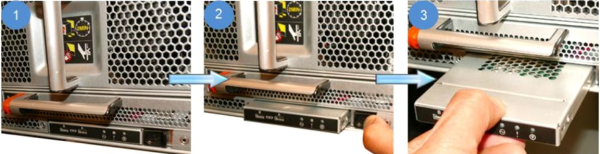

= Ersetzen Sie ein LED-USB-Modul - FAS9000
:allow-uri-read: 
:icons: font
:imagesdir: ../media/

[role="lead"]
Sie können ein LED-USB-Modul ersetzen, ohne den Betrieb zu unterbrechen.

Das FAS9000 oder AFF A700 LED USB-Modul bietet Konnektivität zu Konsolen-Ports und Systemstatus. Für den Austausch dieses Moduls sind keine Werkzeuge erforderlich.

.Schritte
. Entfernen Sie das alte LED-USB-Modul:
+

+
.. Wenn die Blende entfernt ist, suchen Sie das LED-USB-Modul an der Vorderseite des Gehäuses auf der unteren linken Seite.
.. Schieben Sie die Verriegelung, um das Modul teilweise auszuwerfen.
.. Ziehen Sie das Modul aus dem Schacht, um es von der Mittelplatine zu trennen. Lassen Sie den Steckplatz nicht leer.

. Installieren Sie das neue LED USB-Modul:
+
image::../media/led_4.png[Installieren Sie das LED-USB-Modile]

+
.. Richten Sie das Modul an dem Schacht aus, wobei die Aussparung in der Ecke des Moduls in der Nähe der Verriegelung am Gehäuse positioniert ist. Der Schacht verhindert, dass Sie das Modul auf der Oberseite nach unten einbauen.
.. Schieben Sie das Modul in den Schacht, bis es bündig mit dem Gehäuse sitzt.
+
Ein hörbarer Klick ist zu hören, wenn das Modul sicher ist und mit der Mittelplatine verbunden ist.

== Senden Sie das fehlerhafte Teil an NetApp zurück

Senden Sie das fehlerhafte Teil wie in den dem Kit beiliegenden RMA-Anweisungen beschrieben an NetApp zurück.  https://mysupport.netapp.com/site/info/rma["Rückgabe und Austausch von Teilen"]Weitere Informationen finden Sie auf der Seite.
