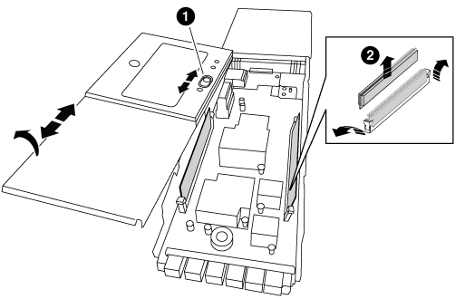

= Ersetzen Sie das NVRAM-Modul oder die NVRAM-DIMMs – FAS9000
:allow-uri-read: 
:icons: font
:imagesdir: ../media/

[role="lead"]
Das NVRAM-Modul besteht aus NVRAM10 und DIMMs und bis zu zwei NVMe SSD Flash Cache Module (FlashCache oder Caching-Module) pro NVRAM-Modul. Ein ausgefallenes NVRAM-Modul oder die DIMMs im NVRAM-Modul können Sie ersetzen.

Um ein ausgefallenes NVRAM-Modul zu ersetzen, müssen Sie es aus dem Chassis entfernen, das Flash Cache Modul oder die Module aus dem NVRAM-Modul entfernen, die DIMMs in das Ersatzmodul verschieben, das Flash Cache Modul oder die Module neu installieren und das Ersatz-NVRAM-Modul im Chassis installieren.

Da die System-ID vom NVRAM-Modul abgeleitet wird, werden beim Ersetzen des Moduls Festplatten, die zum System gehören, der neuen System-ID neu zugewiesen.

.Bevor Sie beginnen
* Alle Platten-Shelves müssen ordnungsgemäß funktionieren.
* Wenn sich Ihr System in einem HA-Paar befindet, muss der Partner-Node in der Lage sein, den Node, der dem zu ersetzenden NVRAM-Modul zugeordnet ist, zu übernehmen.
* Bei diesem Verfahren wird die folgende Terminologie verwendet:
+
** Der Node _Impared_ ist der Knoten, auf dem Sie Wartungsarbeiten durchführen.
** Der Node _Healthy_ ist der HA-Partner des Node mit beeinträchtigten Störungen.

* Dieses Verfahren umfasst Schritte zur automatischen oder manuellen Neuzuteilung von Festplatten an das Controller-Modul, das dem neuen NVRAM-Modul zugeordnet ist. Sie müssen die Festplatten neu zuweisen, wenn Sie dazu aufgefordert werden. Das Ausfüllen der Neuzuweisung von Festplatte vor dem Giveback kann Probleme verursachen.
* Sie müssen die fehlerhafte Komponente durch eine vom Anbieter empfangene Ersatz-FRU-Komponente ersetzen.
* Im Rahmen dieses Verfahrens können Festplatten oder Platten-Shelfs nicht geändert werden.

== Schritt 1: Schalten Sie den beeinträchtigten Regler aus

Fahren Sie den Regler herunter oder übernehmen Sie ihn mit einer der folgenden Optionen.

[role="tabbed-block"]
====
.Option 1: Die meisten Systeme
--
Um den beeinträchtigten Controller herunterzufahren, müssen Sie den Status des Controllers bestimmen und gegebenenfalls den Controller übernehmen, damit der gesunde Controller weiterhin Daten aus dem beeinträchtigten Reglerspeicher bereitstellen kann.

.Über diese Aufgabe
* Wenn Sie über ein SAN-System verfügen, müssen Sie Event-Meldungen ) für den beeinträchtigten Controller SCSI Blade überprüft haben  `cluster kernel-service show`. Mit dem `cluster kernel-service show` Befehl (im erweiterten Modus von priv) werden der Knotenname,  der Node, der Verfügbarkeitsstatus dieses Node und der Betriebsstatus dieses Node angezeigtlink:https://docs.netapp.com/us-en/ontap/system-admin/display-nodes-cluster-task.html["Quorum-Status"].
+
Jeder Prozess des SCSI-Blades sollte sich im Quorum mit den anderen Nodes im Cluster befinden. Probleme müssen behoben werden, bevor Sie mit dem Austausch fortfahren.

* Wenn Sie über ein Cluster mit mehr als zwei Nodes verfügen, muss es sich im Quorum befinden. Wenn sich das Cluster nicht im Quorum befindet oder ein gesunder Controller FALSE anzeigt, um die Berechtigung und den Zustand zu erhalten, müssen Sie das Problem korrigieren, bevor Sie den beeinträchtigten Controller herunterfahren; siehe link:https://docs.netapp.com/us-en/ontap/system-admin/synchronize-node-cluster-task.html?q=Quorum["Synchronisieren eines Node mit dem Cluster"^].

.Schritte
. Wenn AutoSupport aktiviert ist, können Sie die automatische Case-Erstellung durch Aufrufen einer AutoSupport Meldung unterdrücken: `system node autosupport invoke -node * -type all -message MAINT=<# of hours>h`
+
Die folgende AutoSupport Meldung unterdrückt die automatische Erstellung von Cases für zwei Stunden: `cluster1:> system node autosupport invoke -node * -type all -message MAINT=2h`

. Deaktivieren Sie das automatische Giveback von der Konsole des Controller mit dem ordnungsgemäßen Zustand: `storage failover modify -node local -auto-giveback false`
+

NOTE: Wenn Sie sehen _Möchten Sie Auto-Giveback deaktivieren?_, geben Sie ein `y`.

. Nehmen Sie den beeinträchtigten Controller zur LOADER-Eingabeaufforderung:
+
[cols="1,2"]
|===
| Wenn der eingeschränkte Controller angezeigt wird... | Dann... 

 a| 
Die LOADER-Eingabeaufforderung
 a| 
Fahren Sie mit dem nächsten Schritt fort.

 a| 
Warten auf Giveback...
 a| 
Drücken Sie Strg-C, und antworten Sie dann `y` Wenn Sie dazu aufgefordert werden.

 a| 
Eingabeaufforderung für das System oder Passwort
 a| 
Übernehmen oder stoppen Sie den beeinträchtigten Regler von der gesunden Steuerung: `storage failover takeover -ofnode _impaired_node_name_`

Wenn der Regler „beeinträchtigt“ auf Zurückgeben wartet... anzeigt, drücken Sie Strg-C, und antworten Sie dann `y`.

|===

--
.Option 2: Controller befindet sich in einem MetroCluster mit zwei Nodes
--
Um den beeinträchtigten Controller herunterzufahren, müssen Sie den Status des Controllers bestimmen und gegebenenfalls den Controller umschalten, damit der gesunde Controller weiterhin Daten aus dem beeinträchtigten Reglerspeicher bereitstellen kann.

.Über diese Aufgabe
* Sie müssen die Netzteile am Ende dieses Verfahrens einschalten, um den gesunden Controller mit Strom zu versorgen.

.Schritte
. Überprüfen Sie den MetroCluster-Status, um festzustellen, ob der beeinträchtigte Controller automatisch auf den gesunden Controller umgeschaltet wurde: `metrocluster show`
. Je nachdem, ob eine automatische Umschaltung stattgefunden hat, fahren Sie mit der folgenden Tabelle fort:
+
[cols="1,2"]
|===
| Wenn die eingeschränkte Steuerung... | Dann... 

 a| 
Ist automatisch umgeschaltet
 a| 
Fahren Sie mit dem nächsten Schritt fort.

 a| 
Nicht automatisch umgeschaltet
 a| 
Einen geplanten Umschaltvorgang vom gesunden Controller durchführen: `metrocluster switchover`

 a| 
Hat nicht automatisch umgeschaltet, haben Sie versucht, mit dem zu wechseln `metrocluster switchover` Befehl und Switchover wurde vetoed
 a| 
Überprüfen Sie die Veto-Meldungen, und beheben Sie das Problem, wenn möglich, und versuchen Sie es erneut. Wenn das Problem nicht behoben werden kann, wenden Sie sich an den technischen Support.

|===
. Synchronisieren Sie die Datenaggregate neu, indem Sie das ausführen `metrocluster heal -phase aggregates` Befehl aus dem verbleibenden Cluster.
+
[listing]
----
controller_A_1::> metrocluster heal -phase aggregates
[Job 130] Job succeeded: Heal Aggregates is successful.
----
+
Wenn die Heilung ein Vetorecht ist, haben Sie die Möglichkeit, das zurückzugeben `metrocluster heal` Befehl mit dem `-override-vetoes` Parameter. Wenn Sie diesen optionalen Parameter verwenden, überschreibt das System alle weichen Vetos, die die Heilung verhindern.

. Überprüfen Sie, ob der Vorgang mit dem befehl „MetroCluster Operation show“ abgeschlossen wurde.
+
[listing]
----
controller_A_1::> metrocluster operation show
    Operation: heal-aggregates
      State: successful
Start Time: 7/25/2016 18:45:55
   End Time: 7/25/2016 18:45:56
     Errors: -
----
. Überprüfen Sie den Status der Aggregate mit `storage aggregate show` Befehl.
+
[listing]
----
controller_A_1::> storage aggregate show
Aggregate     Size Available Used% State   #Vols  Nodes            RAID Status
--------- -------- --------- ----- ------- ------ ---------------- ------------
...
aggr_b2    227.1GB   227.1GB    0% online       0 mcc1-a2          raid_dp, mirrored, normal...
----
. Heilen Sie die Root-Aggregate mit dem `metrocluster heal -phase root-aggregates` Befehl.
+
[listing]
----
mcc1A::> metrocluster heal -phase root-aggregates
[Job 137] Job succeeded: Heal Root Aggregates is successful
----
+
Wenn die Heilung ein Vetorecht ist, haben Sie die Möglichkeit, das zurückzugeben `metrocluster heal` Befehl mit dem Parameter -override-vetoes. Wenn Sie diesen optionalen Parameter verwenden, überschreibt das System alle weichen Vetos, die die Heilung verhindern.

. Stellen Sie sicher, dass der Heilungsvorgang abgeschlossen ist, indem Sie den verwenden `metrocluster operation show` Befehl auf dem Ziel-Cluster:
+
[listing]
----

mcc1A::> metrocluster operation show
  Operation: heal-root-aggregates
      State: successful
 Start Time: 7/29/2016 20:54:41
   End Time: 7/29/2016 20:54:42
     Errors: -
----
. Trennen Sie am Controller-Modul mit eingeschränkter Betriebsstörung die Netzteile.

--
====

== Schritt 2: Ersetzen Sie das NVRAM-Modul

Zum Austauschen des NVRAM-Moduls suchen Sie es in Steckplatz 6 im Chassis und befolgen die spezifische Sequenz von Schritten.

.Schritte
. Wenn Sie nicht bereits geerdet sind, sollten Sie sich richtig Erden.
. Verschieben Sie das Flash Cache Modul vom alten NVRAM-Modul in das neue NVRAM-Modul:
+
image::../media/drw_9000_remove_flashcache.png[Ersetzen Sie das Caching-Modul]

+
[cols="1,4"]
|===

 a| 
image:../media/icon_round_1.png["Legende Nummer 1"]
 a| 
Orangefarbene Entriegelungstaste (grau in leeren FlashCache Modulen)

 a| 
image:../media/icon_round_2.png["Legende Nummer 2"]
 a| 
FlashCache Nockengriff

|===
+
.. Drücken Sie die orangefarbene Taste an der Vorderseite des FlashCache Moduls.
+

NOTE: Die Freigabetaste bei leeren FlashCache Modulen ist grau.

.. Drehen Sie den Nockengriff heraus, bis das Modul beginnt, aus dem alten NVRAM-Modul zu schieben.
.. Fassen Sie den Nockengriff des Moduls an, und schieben Sie ihn aus dem NVRAM-Modul und setzen Sie ihn an die Vorderseite des neuen NVRAM-Moduls.
.. Schieben Sie das FlashCache Modul vorsichtig ganz in das NVRAM-Modul und schwenken Sie dann den Nockengriff, bis das Modul einrastet.

. Entfernen des Ziel-NVRAM-Moduls aus dem Chassis:
+
.. Drücken Sie die Taste mit der Nummerierung und dem Buchstaben.
+
Die Nockentaste bewegt sich vom Gehäuse weg.

.. Drehen Sie die Nockenverriegelung nach unten, bis sie sich in horizontaler Position befindet.
+
Das NVRAM-Modul geht aus dem Chassis heraus und bewegt sich einige Zentimeter heraus.

.. Entfernen Sie das NVRAM-Modul aus dem Gehäuse, indem Sie an den Zuglaschen an den Seiten der Modulfläche ziehen.
+
image::../media/drw_9000_move_remove_nvram_module.png[Entfernen Sie das NVRAM-Modul]

+
[cols="1,4"]
|===

 a| 
image:../media/icon_round_1.png["Legende Nummer 1"]
 a| 
Gerettete und nummerierte E/A-Nockenverriegelung

 a| 
image:../media/icon_round_2.png["Legende Nummer 2"]
 a| 
E/A-Riegel vollständig entriegelt

|===

. Setzen Sie das NVRAM-Modul auf eine stabile Fläche und entfernen Sie die Abdeckung vom NVRAM-Modul, indem Sie die blaue Verriegelungstaste auf der Abdeckung nach unten drücken und dann, während Sie die blaue Taste gedrückt halten, den Deckel aus dem NVRAM-Modul schieben.
+

+
[cols="1,4"]
|===

 a| 
image:../media/icon_round_1.png["Legende Nummer 1"]
 a| 
Verriegelungsknopf für die Abdeckung

 a| 
image:../media/icon_round_2.png["Legende Nummer 2"]
 a| 
DIMM- und DIMM-Auswurfklammern

|===
. Entfernen Sie nacheinander die DIMMs aus dem alten NVRAM-Modul und installieren Sie sie im ErsatzNVRAM-Modul.
. Schließen Sie die Abdeckung am Modul.
. Installieren Sie das Ersatz-NVRAM-Modul in das Chassis:
+
.. Richten Sie das Modul an den Kanten der Gehäuseöffnung in Steckplatz 6 aus.
.. Schieben Sie das Modul vorsichtig in den Steckplatz, bis der vorletzte und nummerierte E/A-Nockenriegel mit dem E/A-Nockenstift einrastet. Drücken Sie dann die E/A-Nockenverriegelung ganz nach oben, um das Modul zu verriegeln.

== Schritt 3: Ersetzen Sie ein NVRAM-DIMM

Um NVRAM-DIMMs im NVRAM-Modul zu ersetzen, müssen Sie das NVRAM-Modul entfernen, das Modul öffnen und dann das Ziel-DIMM ersetzen.

.Schritte
. Wenn Sie nicht bereits geerdet sind, sollten Sie sich richtig Erden.
. Entfernen des Ziel-NVRAM-Moduls aus dem Chassis:
+
.. Drücken Sie die Taste mit der Nummerierung und dem Buchstaben.
+
Die Nockentaste bewegt sich vom Gehäuse weg.

.. Drehen Sie die Nockenverriegelung nach unten, bis sie sich in horizontaler Position befindet.
+
Das NVRAM-Modul geht aus dem Chassis heraus und bewegt sich einige Zentimeter heraus.

.. Entfernen Sie das NVRAM-Modul aus dem Gehäuse, indem Sie an den Zuglaschen an den Seiten der Modulfläche ziehen.
+
image::../media/drw_9000_move_remove_nvram_module.png[Entfernen Sie das NVRAM-Modul]

+
[cols="1,4"]
|===

 a| 
image:../media/icon_round_1.png["Legende Nummer 1"]
 a| 
Gerettete und nummerierte E/A-Nockenverriegelung

 a| 
image:../media/icon_round_2.png["Legende Nummer 2"]
 a| 
E/A-Riegel vollständig entriegelt

|===

. Setzen Sie das NVRAM-Modul auf eine stabile Fläche und entfernen Sie die Abdeckung vom NVRAM-Modul, indem Sie die blaue Verriegelungstaste auf der Abdeckung nach unten drücken und dann, während Sie die blaue Taste gedrückt halten, den Deckel aus dem NVRAM-Modul schieben.
+

+
[cols="1,4"]
|===

 a| 
image:../media/icon_round_1.png["Legende Nummer 1"]
 a| 
Verriegelungsknopf für die Abdeckung

 a| 
image:../media/icon_round_2.png["Legende Nummer 2"]
 a| 
DIMM- und DIMM-Auswurfklammern

|===
. Suchen Sie das DIMM, das im NVRAM-Modul ausgetauscht werden soll, und entfernen Sie es, indem Sie die DIMM-Verriegelungslaschen nach unten drücken und das DIMM aus dem Sockel heben.
. Installieren Sie das ErsatzDIMM, indem Sie das DIMM-Modul am Sockel ausrichten und das DIMM vorsichtig in den Sockel schieben, bis die Verriegelungslaschen einrasten.
. Schließen Sie die Abdeckung am Modul.
. Installieren Sie das Ersatz-NVRAM-Modul in das Chassis:
+
.. Richten Sie das Modul an den Kanten der Gehäuseöffnung in Steckplatz 6 aus.
.. Schieben Sie das Modul vorsichtig in den Steckplatz, bis der vorletzte und nummerierte E/A-Nockenriegel mit dem E/A-Nockenstift einrastet. Drücken Sie dann die E/A-Nockenverriegelung ganz nach oben, um das Modul zu verriegeln.

== Schritt 4: Starten Sie den Controller nach dem FRU-Austausch neu

Nachdem Sie die FRU ersetzt haben, müssen Sie das Controller-Modul neu booten.

.Schritt
. Um ONTAP von der LOADER-Eingabeaufforderung zu booten, geben Sie ein `bye`.

== Schritt 5: Festplatten neu zuweisen

Je nachdem, ob Sie über ein HA-Paar oder eine MetroCluster Konfiguration mit zwei Nodes verfügen, müssen Sie entweder die Neuzuweisung von Festplatten an das neue Controller-Modul überprüfen oder die Festplatten manuell neu zuweisen.

Wählen Sie eine der folgenden Optionen aus, um Anweisungen zur Neuzuweisung von Laufwerken an den neuen Controller zu erhalten.

[role="tabbed-block"]
====
.Option 1: ID überprüfen (HA-Paar)
--
.Überprüfen Sie, ob sich die System-ID auf einem HA-System ändert
Sie müssen die Änderung der System-ID beim Booten des Node _Replacement_ bestätigen und anschließend überprüfen, ob die Änderung implementiert wurde.

CAUTION: Eine Neuzuweisung der Festplatte ist nur erforderlich, wenn das NVRAM-Modul ersetzt wird. Dies gilt nicht für den Austausch des NVRAM-DIMM.

.Schritte
. Wenn sich der Ersatz-Node im Wartungsmodus befindet (zeigt das an `*>` Eingabeaufforderung, beenden Sie den Wartungsmodus und gehen Sie zur LOADER-Eingabeaufforderung: `halt`
. Booten Sie an der LOADER-Eingabeaufforderung beim Ersatz-Node den Node und geben Sie ein `y` Wenn Sie aufgrund einer nicht übereinstimmenden System-ID aufgefordert werden, die System-ID außer Kraft zu setzen.
+
``boot_ontap bye``

+
Der Node wird neu gebootet, wenn Autoboot festgelegt ist.

. Warten Sie, bis der `Waiting for giveback...` Die Meldung wird auf der Konsole „_Replacement_ Node“ angezeigt und anschließend vom gesunden Node aus überprüfen, ob die neue Partner-System-ID automatisch zugewiesen wurde: `storage failover show`
+
In der Befehlsausgabe sollte eine Meldung angezeigt werden, dass sich die System-ID auf dem Knoten „beeinträchtigt“ geändert hat und die korrekten alten und neuen IDs angezeigt werden. Im folgenden Beispiel wurde node2 ersetzt und hat eine neue System-ID von 151759706.

+
[listing]
----
node1> `storage failover show`
                                    Takeover
Node              Partner           Possible     State Description
------------      ------------      --------     -------------------------------------
node1             node2             false        System ID changed on partner (Old:
                                                  151759755, New: 151759706), In takeover
node2             node1             -            Waiting for giveback (HA mailboxes)
----
. Vergewissern Sie sich am gesunden Knoten, dass alle Corestapy gespeichert sind:
+
.. Ändern Sie die erweiterte Berechtigungsebene: `set -privilege advanced`
+
Sie können antworten `Y` Wenn Sie aufgefordert werden, den erweiterten Modus fortzusetzen. Die Eingabeaufforderung für den erweiterten Modus wird angezeigt (*>).

.. Speichern von CoreDumps: `system node run -node _local-node-name_ partner savecore`
.. Warten Sie, bis der Befehl `savecore`abgeschlossen ist, bevor Sie das Giveback ausgeben.
+
Sie können den folgenden Befehl eingeben, um den Fortschritt des Befehls savecore zu überwachen: `system node run -node _local-node-name_ partner savecore -s`

.. Zurück zur Administratorberechtigungsebene: `set -privilege admin`

. Geben Sie den Knoten zurück:
+
.. Geben Sie vom ordnungsgemäßen Node den Speicher des ersetzten Node wieder: `storage failover giveback -ofnode _replacement_node_name_`
+
Der Node _Replacement_ nimmt seinen Storage wieder ein und schließt den Booten ab.

+
Wenn Sie aufgrund einer nicht übereinstimmenden System-ID aufgefordert werden, die System-ID außer Kraft zu setzen, sollten Sie eingeben `y`.

+

NOTE: Wenn das Rückübertragung ein Vetorecht ist, können Sie erwägen, das Vetos außer Kraft zu setzen.

+
http://mysupport.netapp.com/documentation/productlibrary/index.html?productID=62286["Finden Sie den Hochverfügbarkeits-Leitfaden für Ihre Version von ONTAP 9"]

.. Nachdem das Giveback abgeschlossen ist, bestätigen Sie, dass das HA-Paar sich gesund befindet und ein Takeover möglich ist: `storage failover show`
+
Die Ausgabe von der `storage failover show` Der Befehl sollte nicht enthalten `System ID changed on partner` Nachricht:

. Überprüfen Sie, ob die Festplatten ordnungsgemäß zugewiesen wurden: `storage disk show -ownership`
+
Die Festplatten, die zum Node _Replacement_ gehören, sollten die neue System-ID anzeigen. Im folgenden Beispiel zeigen die Festplatten von node1 jetzt die neue System-ID, 1873775277:

+
[listing]
----
node1> `storage disk show -ownership`

Disk  Aggregate Home  Owner  DR Home  Home ID    Owner ID  DR Home ID Reserver  Pool
----- ------    ----- ------ -------- -------    -------    -------  ---------  ---
1.0.0  aggr0_1  node1 node1  -        1873775277 1873775277  -       1873775277 Pool0
1.0.1  aggr0_1  node1 node1           1873775277 1873775277  -       1873775277 Pool0
.
.
.
----
. Wenn sich das System in einer MetroCluster-Konfiguration befindet, überwachen Sie den Status des Node: `metrocluster node show`
+
Die MetroCluster-Konfiguration dauert einige Minuten nach dem Austausch und kehrt in den normalen Zustand zurück. Zu diesem Zeitpunkt zeigt jeder Node einen konfigurierten Status mit aktivierter DR-Spiegelung und einem normalen Modus. Der `metrocluster node show -fields node-systemid` In der Befehlsausgabe wird die alte System-ID angezeigt, bis die MetroCluster-Konfiguration den normalen Status aufweist.

. Wenn sich der Node abhängig vom MetroCluster-Status in einer MetroCluster-Konfiguration befindet, vergewissern Sie sich, dass im Feld für die DR-Home-ID der ursprüngliche Eigentümer der Festplatte angezeigt wird, wenn der ursprüngliche Eigentümer ein Node am Disaster-Standort ist.
+
Dies ist erforderlich, wenn beide der folgenden Werte erfüllt sind:

+
** Die MetroCluster Konfiguration befindet sich in einem Switchover-Zustand.
** Der Node _Replacement_ ist der aktuelle Besitzer der Festplatten am Disaster-Site.
+
https://docs.netapp.com/us-en/ontap-metrocluster/manage/concept_understanding_mcc_data_protection_and_disaster_recovery.html#disk-ownership-changes-during-ha-takeover-and-metrocluster-switchover-in-a-four-node-metrocluster-configuration["Änderungen am Festplattenbesitz während HA Takeover und MetroCluster Switchover in einer MetroCluster Konfiguration mit vier Nodes"]

. Wenn sich Ihr System in einer MetroCluster-Konfiguration befindet, vergewissern Sie sich, dass jeder Node konfiguriert ist: `metrocluster node show - fields configuration-state`
+
[listing]
----
node1_siteA::> metrocluster node show -fields configuration-state

dr-group-id            cluster node           configuration-state
-----------            ---------------------- -------------- -------------------
1 node1_siteA          node1mcc-001           configured
1 node1_siteA          node1mcc-002           configured
1 node1_siteB          node1mcc-003           configured
1 node1_siteB          node1mcc-004           configured

4 entries were displayed.
----
. Vergewissern Sie sich, dass die erwarteten Volumes für jeden Node vorhanden sind: `vol show -node node-name`
. Wenn Sie die automatische Übernahme beim Neustart deaktiviert haben, aktivieren Sie sie vom gesunden Knoten: `storage failover modify -node replacement-node-name -onreboot true`

--
.Option 2: ID neu zuweisen (MetroCluster-Konfiguration)
--
.Weisen Sie die System-ID in einer MetroCluster Konfiguration mit zwei Nodes neu zu
Bei einer MetroCluster-Konfiguration mit zwei Knoten, in der ONTAP ausgeführt wird, müssen Sie Festplatten manuell der System-ID des neuen Controllers zuweisen, bevor Sie den normalen Betrieb des Systems zurückgeben.

.Über diese Aufgabe
Dieses Verfahren gilt nur für Systeme in einer MetroCluster-Konfiguration mit zwei Nodes, auf denen ONTAP ausgeführt wird.

Sie müssen sicherstellen, dass Sie die Befehle in diesem Verfahren auf dem richtigen Node eingeben:

* Der Node _Impared_ ist der Knoten, auf dem Sie Wartungsarbeiten durchführen.
* Der Node _Replacement_ ist der neue Node, der den beeinträchtigten Knoten im Rahmen dieses Verfahrens ersetzt.
* Der Node _Healthy_ ist der DR-Partner des beeinträchtigten Knotens.

.Schritte
. Falls Sie dies noch nicht getan haben, starten Sie den Node _Replacement_ neu, unterbrechen Sie den Bootvorgang, indem Sie eingeben `Ctrl-C`, Und wählen Sie dann die Option zum Starten in den Wartungsmodus aus dem angezeigten Menü.
+
Eingabe ist erforderlich `Y` Wenn Sie aufgefordert werden, die System-ID aufgrund einer nicht übereinstimmenden System-ID zu überschreiben.

. Zeigen Sie die alten System-IDs vom gesunden Knoten an: ``metrocluster node show -fields node-systemid`,dr-Partner-System`
+
In diesem Beispiel ist der Node_B_1 der alte Node mit der alten System-ID von 118073209:

+
[listing]
----
dr-group-id cluster         node                 node-systemid dr-partner-systemid
 ----------- --------------------- -------------------- ------------- -------------------
 1           Cluster_A             Node_A_1             536872914     118073209
 1           Cluster_B             Node_B_1             118073209     536872914
 2 entries were displayed.
----
. Zeigen Sie die neue System-ID an der Eingabeaufforderung für den Wartungsmodus auf dem Knoten „beeinträchtigt“ an: `disk show`
+
In diesem Beispiel lautet die neue System-ID 118065481:

+
[listing]
----
Local System ID: 118065481
    ...
    ...
----
. Weisen Sie die Eigentumsrechte an der Festplatte (für FAS Systeme) oder an der LUN-Eigentumsrechte (für FlexArray Systeme) neu zu. Verwenden Sie dazu die System-ID-Informationen, die Sie über den Befehl „Festplatte anzeigen“ erhalten haben: `disk reassign -s old system ID`
+
Im Fall des vorhergehenden Beispiels lautet der Befehl: `disk reassign -s 118073209`

+
Sie können antworten `Y` Wenn Sie dazu aufgefordert werden, fortzufahren.

. Überprüfen Sie, ob die Festplatten (oder FlexArray LUNs) korrekt zugeordnet sind: `disk show -a`
+
Vergewissern Sie sich, dass die Festplatten, die zum Node _Replacement_ gehören, die neue System-ID für den Node _Replacement_ anzeigen. Im folgenden Beispiel zeigen die Festplatten von System-1 jetzt die neue System-ID, 118065481:

+
[listing]
----
*> disk show -a
Local System ID: 118065481

  DISK     OWNER                 POOL   SERIAL NUMBER  HOME
-------    -------------         -----  -------------  -------------
disk_name   system-1  (118065481) Pool0  J8Y0TDZC       system-1  (118065481)
disk_name   system-1  (118065481) Pool0  J8Y09DXC       system-1  (118065481)
.
.
.
----
. Vergewissern Sie sich am gesunden Knoten, dass alle Corestapy gespeichert sind:
+
.. Ändern Sie die erweiterte Berechtigungsebene: `set -privilege advanced`
+
Sie können antworten `Y` Wenn Sie aufgefordert werden, den erweiterten Modus fortzusetzen. Die Eingabeaufforderung für den erweiterten Modus wird angezeigt (*>).

.. Vergewissern Sie sich, dass die Corestapes gespeichert sind: `system node run -node _local-node-name_ partner savecore`
+
Wenn die Befehlsausgabe angibt, dass savecore gerade ist, warten Sie, bis savecore abgeschlossen ist, bevor Sie das Giveback ausgeben. Sie können den Fortschritt des Savecore mit dem überwachen `system node run -node _local-node-name_ partner savecore -s command`.</info>.

.. Zurück zur Administratorberechtigungsebene: `set -privilege admin`

. Wenn sich der Node _Replacement_ im Wartungsmodus befindet (mit der Eingabeaufforderung *>), beenden Sie den Wartungsmodus, und wechseln Sie zur LOADER-Eingabeaufforderung: `halt`
. Starten Sie den Node _Replacement_: `boot_ontap`
. Nachdem der Node _Replacement_ vollständig gestartet wurde, führen Sie einen Wechsel zurück durch: `metrocluster switchback`
. Überprüfen Sie die MetroCluster Konfiguration: `metrocluster node show - fields configuration-state`
+
[listing]
----
node1_siteA::> metrocluster node show -fields configuration-state

dr-group-id            cluster node           configuration-state
-----------            ---------------------- -------------- -------------------
1 node1_siteA          node1mcc-001           configured
1 node1_siteA          node1mcc-002           configured
1 node1_siteB          node1mcc-003           configured
1 node1_siteB          node1mcc-004           configured

4 entries were displayed.
----
. Überprüfen Sie den Betrieb der MetroCluster-Konfiguration in Data ONTAP:
+
.. Überprüfen Sie auf beiden Clustern auf Zustandswarnmeldungen: `system health alert show`
.. Vergewissern Sie sich, dass die MetroCluster konfiguriert ist und sich im normalen Modus befindet: `metrocluster show`
.. Durchführen einer MetroCluster-Prüfung: `metrocluster check run`
.. Ergebnisse der MetroCluster-Prüfung anzeigen: `metrocluster check show`
.. Nutzen Sie Config Advisor. Wechseln Sie zur Config Advisor-Seite auf der NetApp Support Site unter https://mysupport.netapp.com/site/tools/tool-eula/activeiq-configadvisor/["support.netapp.com/NOW/download/tools/config_advisor/"].
+
Überprüfen Sie nach dem Ausführen von Config Advisor die Ausgabe des Tools und befolgen Sie die Empfehlungen in der Ausgabe, um die erkannten Probleme zu beheben.

. Simulation eines Switchover-Vorgangs:
+
.. Ändern Sie von der Eingabeaufforderung eines beliebigen Node auf die erweiterte Berechtigungsebene: `set -privilege advanced`
+
Sie müssen mit reagieren `y` Wenn Sie dazu aufgefordert werden, den erweiterten Modus fortzusetzen und die Eingabeaufforderung für den erweiterten Modus (*>) anzuzeigen.

.. Führen Sie den Wechsel zurück mit dem Parameter -Simulate durch: `metrocluster switchover -simulate`
.. Zurück zur Administratorberechtigungsebene: `set -privilege admin`

--
====

== Schritt 6: Senden Sie das fehlgeschlagene Teil an NetApp zurück

Senden Sie das fehlerhafte Teil wie in den dem Kit beiliegenden RMA-Anweisungen beschrieben an NetApp zurück.  https://mysupport.netapp.com/site/info/rma["Rückgabe und Austausch von Teilen"]Weitere Informationen finden Sie auf der Seite.
