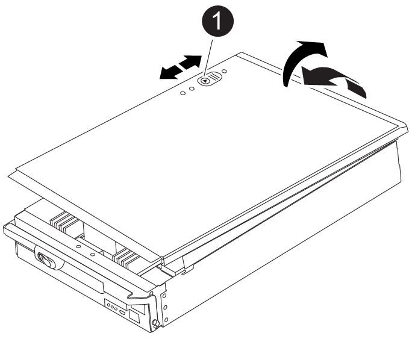

= Ersetzen Sie das Startmedium für die automatische Startwiederherstellung – FAS9500
:allow-uri-read: 
:icons: font
:imagesdir: ../media/

[role="lead"]
Das Bootmedium in Ihrem FAS9500 System speichert wichtige Firmware- und Konfigurationsdaten.  Der Austauschvorgang umfasst das Entfernen und Öffnen des Controllermoduls, das Entfernen des beschädigten Startmediums, das Installieren des Ersatz-Startmediums im Controllermodul und die anschließende Neuinstallation des Controllermoduls.

Der automatisierte Boot-Medien-Wiederherstellungsprozess wird nur in ONTAP 9.17.1 und höher unterstützt. Wenn Ihr Speichersystem eine frühere Version von ONTAP verwendet, verwenden Sie die link:bootmedia-replace-workflow.html["manuelle Boot-Wiederherstellung"] .

Das Startmedium befindet sich im Controllermodul unter dem Luftkanal und ist zugänglich, indem das Controllermodul aus dem System entfernt wird.

.Schritte
. Wenn Sie nicht bereits geerdet sind, sollten Sie sich richtig Erden.
. Ziehen Sie die Kabel vom beeinträchtigten Controller-Modul ab, und verfolgen Sie, wo die Kabel angeschlossen waren.
. Schieben Sie die Terrakotta-Taste am Nockengriff nach unten, bis sie entsperrt wird.
+
.Animation - Entfernen Sie den Controller
video::256721fd-4c2e-40b3-841a-adf2000df5fa[panopto]
+
image::../media/drw_a900_remove_PCM.png[Lassen Sie den Controller los]

+
[cols="1,4"]
|===

 a| 
image:../media/icon_round_1.png["Legende Nummer 1"]
 a| 
Freigabetaste für den CAM-Griff

 a| 
image:../media/icon_round_2.png["Legende Nummer 2"]
 a| 
CAM-Griff

|===
. Drehen Sie den Nockengriff so, dass er das Controller-Modul vollständig aus dem Gehäuse herausrückt, und schieben Sie dann das Controller-Modul aus dem Gehäuse.
+
Stellen Sie sicher, dass Sie die Unterseite des Controller-Moduls unterstützen, während Sie es aus dem Gehäuse schieben.

. Setzen Sie die Abdeckung des Controller-Moduls auf eine stabile, flache Oberfläche, drücken Sie die blaue Taste auf der Abdeckung, schieben Sie die Abdeckung auf die Rückseite des Controller-Moduls, und schwenken Sie sie dann nach oben und heben Sie sie vom Controller-Modul ab.
+

+
[cols="1,4"]
|===

 a| 
image:../media/icon_round_1.png["Legende Nummer 1"]
 a| 
Verriegelungstaste für die Controllermodulabdeckung

|===
. Ersetzen Sie die Startmedien:
+
.. Heben Sie den schwarzen Luftkanal auf der Rückseite des Controller-Moduls an, und suchen Sie dann mithilfe der folgenden Abbildung oder der FRU-Karte am Controller-Modul die Bootmedien:
+
.Animation - Bootmedium ersetzen
video::c5080658-765e-4d29-8456-adf2000e1495[panopto]
+
image::../media/drw_9000_remove_boot_dev.svg[Startmedien entfernen]

+
[cols="1,4"]
|===

 a| 
image:../media/icon_round_1.png["Legende Nummer 1"]
 a| 
Drücken Sie die Freigabelasche

 a| 
image:../media/icon_round_2.png["Legende Nummer 2"]
 a| 
Boot-Medien

|===
.. Drücken Sie die blaue Taste am Startmediengehäuse, um die Startmedien aus dem Gehäuse zu lösen, und ziehen Sie sie vorsichtig gerade aus der Buchse des Boot-Mediums heraus.
+

NOTE: Drehen oder ziehen Sie die Boot-Medien nicht gerade nach oben, da dadurch der Sockel oder das Boot-Medium beschädigt werden kann.

.. Richten Sie die Kanten des Ersatzstartmediums an der Buchse des Boot-Mediums aus, und schieben Sie ihn dann vorsichtig in die Buchse.
.. Überprüfen Sie die Startmedien, um sicherzustellen, dass sie ganz und ganz in der Steckdose sitzt.
+
Entfernen Sie gegebenenfalls die Startmedien, und setzen Sie sie wieder in den Sockel ein.

.. Drücken Sie die Startmedien nach unten, um die Verriegelungstaste am Startmediengehäuse zu betätigen.

. Bringen Sie die Abdeckung des Controller-Moduls wieder an, indem Sie die Stifte auf dem Deckel an die Schlitze auf dem Motherboard-Träger ausrichten und den Deckel dann in die richtige Position schieben.
. Installieren Sie das Controllermodul neu:
+
.. Richten Sie das Ende des Controller-Moduls an der Öffnung im Gehäuse aus, und drücken Sie dann vorsichtig das Controller-Modul zur Hälfte in das System.
.. Das Controller-Modul nach Bedarf wieder einschalten.
.. Das Controller-Modul ganz in das System schieben, sicherstellen, dass der Nockengriff das USB-Flash-Laufwerk löscht, den Nockengriff fest drücken, um den Sitz des Controller-Moduls zu beenden, und dann den Nockengriff in die geschlossene Position drücken.
+
Der Controller beginnt zu booten, sobald er vollständig im Chassis installiert ist.

+
Wenn Sie diese Meldung verpassen, drücken Sie Strg-C, wählen Sie die Option zum Booten im Wartungsmodus aus, und halten Sie dann den Controller zum Booten in LOADER an.

. Wenn sich der Controller in einem Stretch- oder Fabric-Attached MetroCluster befindet, müssen Sie die FC-Adapterkonfiguration wiederherstellen:
+
.. Start in Wartungsmodus: `boot_ontap maint`
.. Legen Sie die MetroCluster-Ports als Initiatoren fest: `ucadmin modify -m fc -t iniitator adapter_name`
.. Anhalten, um zum Wartungsmodus zurückzukehren: `halt`

.Wie es weiter geht
Nach dem physischen Austausch der gestörten Startmedien, link:bootmedia-recovery-image-boot-bmr.html["Stellen Sie das ONTAP-Image vom Partner-Node wieder her"].
