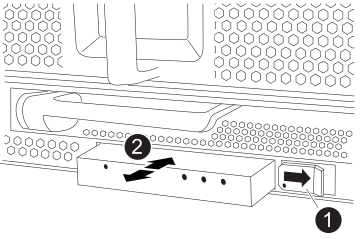

= Verschieben und ersetzen Sie die Hardware FAS9500
:allow-uri-read: 
:icons: font
:imagesdir: ../media/

[role="lead"]
Um das Gehäuse auszutauschen, müssen Sie die Komponenten aus dem Gehäuse für beeinträchtigte Geräte entfernen und sie in das Ersatzgehäuse einsetzen.

== Schritt 1: Entfernen Sie die Netzteile

Beim Entfernen der Netzteile beim Austausch eines Gehäuses müssen die vier Netzteile ausgeschaltet, getrennt und anschließend von der Rückseite des Gehäuses entfernt werden.

. Wenn Sie nicht bereits geerdet sind, sollten Sie sich richtig Erden.
. Schalten Sie das Netzteil aus und trennen Sie die Netzkabel:
+
.. Schalten Sie den Netzschalter am Netzteil aus.
.. Öffnen Sie die Netzkabelhalterung, und ziehen Sie dann das Netzkabel vom Netzteil ab.
.. Ziehen Sie das Netzkabel von der Stromversorgung ab.

. Halten Sie die Terrakotta-Verriegelungstaste am Griff des Netzteils gedrückt, und ziehen Sie das Netzteil aus dem Gehäuse.
+

NOTE: Wenn Sie ein Netzteil entfernen, verwenden Sie immer zwei Hände, um sein Gewicht zu stützen.

+
.Animation - Netzteil entfernen/installieren
video::590b3414-6ea5-42b2-b7f4-ae78004b86a4[panopto]
+
image::../media/drw_9500_remove_install_PSU_module.svg[drw 9500 das Einbauen des Netzteilmoduls entfernen]

+
[cols="20%,80%"]
|===

 a| 
image::../media/legend_icon_01.svg[Legende Symbol 01]
 a| 
Terrakotta-Verriegelungstaste

|===
. Wiederholen Sie die vorherigen Schritte für alle weiteren Netzteile.

== Schritt 2: Entfernen Sie die Lüfter

Sie müssen die sechs Lüftermodule, die sich an der Vorderseite des Gehäuses befinden, entfernen, wenn Sie das Gehäuse austauschen.

. Wenn Sie nicht bereits geerdet sind, sollten Sie sich richtig Erden.
. Entfernen Sie die Blende (falls erforderlich) mit zwei Händen, indem Sie die Öffnungen auf beiden Seiten der Blende fassen und dann zu Ihnen ziehen, bis sich die Blende von den Kugelknöpfen am Rahmen des Chassis löst.
. Drücken Sie die Terrakotta-Verriegelungstaste am Lüftermodul, und ziehen Sie das Lüftermodul gerade aus dem Gehäuse, um sicherzustellen, dass Sie es mit der freien Hand abstützen.
+

NOTE: Die Lüftermodule sind kurz. Unterstützen Sie das Lüftermodul immer mit Ihrer freien Hand, damit es nicht plötzlich vom Gehäuse abfällt und Sie verletzt.

+
.Animation - Lüfter entfernen/installieren
video::86b0ed39-1083-4b3a-9e9c-ae78004c2ffc[panopto]
+
image::../media/drw_9500_remove_install_fan.svg[drw 9500 Ausbau des Lüfters]

+
[cols="20%,80%"]
|===

 a| 
image:../media/legend_icon_01.svg["Breite = 20"]
 a| 
Terrakotta-Verriegelungstaste

 a| 
image:../media/legend_icon_02.svg["Breite = 20"]
 a| 
Schieben Sie den Lüfter in das Gehäuse ein-/heraus

|===
. Setzen Sie das Lüftermodul beiseite.
. Wiederholen Sie die vorherigen Schritte für alle verbleibenden Lüftermodule.

== Schritt 3: Entfernen Sie das Controller-Modul

Um das Gehäuse auszutauschen, müssen Sie das oder die Controller-Module aus dem Gehäuse für beeinträchtigte Geräte entfernen.

. Wenn Sie nicht bereits geerdet sind, sollten Sie sich richtig Erden.
. Ziehen Sie die Kabel vom beeinträchtigten Controller-Modul ab, und verfolgen Sie, wo die Kabel angeschlossen waren.
. Schieben Sie die Verriegelungstaste für Terrakotta am Nockengriff nach unten, bis sie entriegelt wird.
+
.Animation - Controller-Modul entfernen
video::5e029a19-8acc-4fa1-be5d-ae78004b365a[panopto]
+
image::../media/drw_9500_remove_PCM.svg[drw 9500 PCM entfernen]

+
[cols="20%,80%"]
|===

 a| 
image:../media/legend_icon_01.svg["Breite = 20"]
 a| 
Verriegelungstaste am Nockengriff

 a| 
image:../media/legend_icon_02.svg["Breite = 20"]
 a| 
CAM-Griff

|===
. Drehen Sie den Nockengriff so, dass er das Controller-Modul vollständig aus dem Gehäuse herausrückt, und schieben Sie dann das Controller-Modul aus dem Gehäuse.
+
Stellen Sie sicher, dass Sie die Unterseite des Controller-Moduls unterstützen, während Sie es aus dem Gehäuse schieben.

. Legen Sie das Controller-Modul an einem sicheren Ort beiseite und verfolgen Sie, aus welchem Gehäusesteckplatz es stammt, damit es in denselben Steckplatz im Ersatzgehäuse eingesetzt werden kann.
. Wiederholen Sie diese Schritte, wenn sich ein weiteres Controller-Modul im Chassis befindet.

== Schritt 4: Entfernen Sie die E/A-Module

Um E/A-Module aus dem Gehäuse für beeinträchtigte Zugriffe, einschließlich der NVRAM-Module, zu entfernen, befolgen Sie die angegebenen Schritte. Sie müssen das FlashCache Modul, falls vorhanden, nicht aus dem NVRAM-Modul entfernen, wenn Sie es in ein Ersatzgehäuse verschieben.

. Wenn Sie nicht bereits geerdet sind, sollten Sie sich richtig Erden.
. Trennen Sie alle Kabel, die mit dem Ziel-E/A-Modul verbunden sind.
+
Achten Sie darauf, dass Sie die Kabel so kennzeichnen, dass Sie wissen, woher sie stammen.

. Entfernen Sie das Ziel-I/O-Modul aus dem Gehäuse:
+
.. Drücken Sie die Verriegelungstaste für die nummerierte und beschriftene Nocke.
+
Die Nockenverriegelungstaste bewegt sich vom Gehäuse weg.

.. Drehen Sie die Nockenverriegelung nach unten, bis sie sich in horizontaler Position befindet.
+
Das I/O-Modul wird aus dem Gehäuse entfernt und bewegt sich ca. 1/2 Zoll aus dem I/O-Steckplatz.

.. Entfernen Sie das E/A-Modul aus dem Gehäuse, indem Sie an den Zuglaschen an den Seiten der Modulfläche ziehen.
+
Stellen Sie sicher, dass Sie den Steckplatz verfolgen, in dem sich das I/O-Modul befand.

+
.Animation - E/A-Modul entfernen/installieren
video::0903b1f9-187b-4bb8-9548-ae9b0012bb21[panopto]
+
image::../media/drw_9500_remove_PCIe_module.svg[drw 9500 entfernen das PCIe-Modul]

+
[cols="20%,80%"]
|===

 a| 
image::../media/legend_icon_01.svg[Legende Symbol 01]
 a| 
Gerettete und nummerierte E/A-Nockenverriegelung

 a| 
image::../media/legend_icon_02.svg[Legende Symbol 02]
 a| 
E/A-Nockenverriegelung vollständig entriegelt

|===

. Legen Sie das E/A-Modul beiseite.
. Wiederholen Sie den vorherigen Schritt für die verbleibenden I/O-Module im Gehäuse für beeinträchtigte Zugriffe.

== Schritt 5: Entfernen Sie das Leistungsmodul des De-Stage-Controllers

Entfernen Sie die beiden destufigen Controller-Stromversorgungsmodule von der Vorderseite des Gehäuses für die Außerbetriebnahme.

. Wenn Sie nicht bereits geerdet sind, sollten Sie sich richtig Erden.
. Drücken Sie die Terrakotta-Verriegelungstaste am Modulgriff, und schieben Sie die DCPM aus dem Gehäuse.
+
.Animation - DCPM entfernen/installieren
video::c067cf9d-35b8-4fbe-9573-ae78004c2328[panopto]
+
image::../media/drw_9500_remove_NV_battery.svg[drw 9500 NV-Batterie entfernen]

+
[cols="20%,80%"]
|===

 a| 
image::../media/legend_icon_01.svg[Legende Symbol 01]
 a| 
VERRIEGELUNGSTASTE DCPM Terrakotta

|===
. LEGEN Sie DIE DCPM an einem sicheren Ort beiseite, und wiederholen Sie diesen Schritt für die verbleibenden DCPM.

== Schritt 6: Entfernen Sie das USB-LED-Modul

Entfernen Sie die USB-LED-Module.

.Animation - USB-Modul entfernen/installieren
video::bc46a3e8-6541-444e-973b-ae78004bf153[panopto]

[cols="20%,80%"]
|===

 a| 
image::../media/legend_icon_01.svg[Legende Symbol 01]
 a| 
Das Modul auswerfen.

 a| 
image:../media/legend_icon_02.svg["Breite = 20"]
 a| 
Schieben Sie es aus dem Chassis heraus.

|===
. Suchen Sie das USB-LED-Modul auf der Vorderseite des Gehäuses mit eingeschränkter Stromversorgung direkt unter den Netzteilschächten.
. Drücken Sie die schwarze Verriegelungstaste auf der rechten Seite des Moduls, um das Modul aus dem Gehäuse zu lösen, und schieben Sie es dann aus dem Gehäuse für beeinträchtigte Personen heraus.
. Stellen Sie das Modul an einem sicheren Ort zur Seite.

== Schritt 7: Austausch eines Chassis aus dem Geräte-Rack oder Systemschrank heraus

Sie müssen das vorhandene Chassis aus dem Rack oder dem Systemschrank entfernen, bevor Sie das Ersatzgehäuse installieren können.

. Entfernen Sie die Schrauben von den Montagepunkten des Gehäuses.
+

NOTE: Wenn sich das System in einem Systemschrank befindet, müssen Sie möglicherweise die hintere Abklemme entfernen.

. Schieben Sie mit Hilfe von zwei oder drei Personen das Gehäuse für beeinträchtigte Personen von den Rack-Schienen in einem Systemschrank oder _L_ Halterungen in einem Geräterahmen und legen Sie es dann beiseite.
. Wenn Sie nicht bereits geerdet sind, sollten Sie sich richtig Erden.
. Installieren Sie das Ersatzgehäuse mithilfe von zwei oder drei Personen in das Rack oder den Systemschrank des Geräts, indem Sie das Chassis an die Rack-Schienen in einem Systemschrank oder _L_ -Halterungen in einem Rack führen.
. Schieben Sie das Chassis vollständig in das Rack oder den Systemschrank der Ausrüstung.
. Befestigen Sie die Vorderseite des Gehäuses mit den Schrauben, die Sie aus dem Gehäuse für beeinträchtigte Geräte entfernt haben, am Geräte-Rack oder Systemschrank.
. Befestigen Sie die Rückseite des Chassis am Rack oder am Systemschrank des Geräts.
. Wenn Sie die Kabelhalterungen verwenden, entfernen Sie sie aus dem Gehäuse für beeinträchtigte Personen, und installieren Sie sie dann auf dem Ersatzgehäuse.

== Schritt 8: Beim Austausch des Gehäuses das Modul für das Abschalten des Controllers einbauen

Sobald das Ersatzgehäuse in das Rack oder den Systemschrank eingebaut ist, müssen Sie die entstufigen Controller-Stromversorgungsmodule in diesem wieder einbauen.

. Wenn Sie nicht bereits geerdet sind, sollten Sie sich richtig Erden.
. Richten Sie das Ende der DCPM an der Gehäuseöffnung aus, und schieben Sie es vorsichtig in das Gehäuse, bis es einrastet.
+

NOTE: Modul und Steckplatz sind codiert. Das Modul nicht in die Öffnung zwingen. Wenn das Modul nicht leicht einarbeitet, richten Sie das Modul aus und schieben Sie es in das Gehäuse.

. Wiederholen Sie diesen Schritt für die verbleibenden DCPM.

== Schritt 9: Installieren Sie die Lüfter im Gehäuse

Um die Lüftermodule beim Austausch des Gehäuses zu installieren, müssen Sie eine bestimmte Sequenz von Aufgaben durchführen.

. Wenn Sie nicht bereits geerdet sind, sollten Sie sich richtig Erden.
. Richten Sie die Kanten des Ersatzlüftermoduls an der Öffnung im Gehäuse aus, und schieben Sie es dann in das Gehäuse, bis es einrastet.
+
Wenn das Lüftermodul erfolgreich in das Gehäuse eingesetzt wurde, blinkt die gelbe Warn-LED viermal.

. Wiederholen Sie diese Schritte für die übrigen Lüftermodule.
. Richten Sie die Blende an den Kugelknöpfen aus, und drücken Sie dann vorsichtig die Blende auf die Kugelbolzen.

== Schritt 10: E/A-Module installieren

Um I/O-Module, einschließlich NVRAM/FlashCache-Module, aus dem Gehäuse für beeinträchtigte Vorgänge zu installieren, folgen Sie den spezifischen Schritten.

Das Gehäuse muss installiert sein, damit Sie die E/A-Module in die entsprechenden Steckplätze im Ersatzgehäuse einsetzen können.

. Wenn Sie nicht bereits geerdet sind, sollten Sie sich richtig Erden.
. Nachdem das Ersatzgehäuse im Rack oder Schrank installiert wurde, installieren Sie die E/A-Module in die entsprechenden Steckplätze im Ersatzgehäuse, indem Sie das E/A-Modul vorsichtig in den Steckplatz schieben, bis sich die nummerierte und letzte E/A-Nockenverriegelung einlässt. Drücken Sie dann die E/A-Nockenverriegelung ganz nach oben, um das Modul zu verriegeln.
. E/A-Modul nach Bedarf wieder aufführen.
. Wiederholen Sie den vorherigen Schritt für die restlichen I/O-Module, die Sie beiseite gelegt haben.
+

NOTE: Wenn das Gehäuse für den beeinträchtigten Betrieb über leere E/A-Platten verfügt, bringen Sie diese zu diesem Zeitpunkt in das Ersatzgehäuse.

== Schritt 11: Installieren Sie die Netzteile

Beim Ersetzen eines Gehäuses installieren Sie die Netzteile beim Installieren eines Gehäuses, indem Sie die Netzteile in das Ersatzgehäuse und den Anschluss an die Stromversorgung anschließen.

. Wenn Sie nicht bereits geerdet sind, sollten Sie sich richtig Erden.
. Stellen Sie sicher, dass sich die Kipper des Netzteiles in der Position aus befinden.
. Halten und richten Sie die Kanten des Netzteils mit beiden Händen an der Öffnung im Systemgehäuse aus, und drücken Sie dann vorsichtig das Netzteil in das Gehäuse, bis es einrastet.
+
Die Netzteile sind codiert und können nur auf eine Weise installiert werden.

+

IMPORTANT: Beim Einschieben des Netzteils in das System keine übermäßige Kraft verwenden. Sie können den Anschluss beschädigen.

. Schließen Sie das Netzkabel wieder an, und befestigen Sie es mithilfe des Verriegelungsmechanismus für Netzkabel am Netzteil.
+

IMPORTANT: Schließen Sie das Netzkabel nur an das Netzteil an. Schließen Sie das Netzkabel derzeit nicht an eine Stromquelle an.

. Wiederholen Sie die vorherigen Schritte für alle weiteren Netzteile.

== Schritt 12 Installieren Sie die USB-LED-Module

Installieren Sie die USB-LED-Module im Ersatzgehäuse.

. Suchen Sie den USB-LED-Modulsteckplatz auf der Vorderseite des Ersatzgehäuses direkt unter den DCPM-Schächten.
. Richten Sie die Kanten des Moduls am USB-LED-Schacht aus, und schieben Sie das Modul vorsichtig bis zum Klicken in das Gehäuse.

== Schritt 13: Installieren Sie den Controller

Nachdem Sie das Controller-Modul und andere Komponenten in das Ersatzgehäuse eingebaut haben, starten Sie das System.

. Wenn Sie nicht bereits geerdet sind, sollten Sie sich richtig Erden.
. Schließen Sie die Netzteile an verschiedene Stromquellen an, und schalten Sie sie dann ein.
. Richten Sie das Ende des Controller-Moduls an der Öffnung im Gehäuse aus, und drücken Sie dann vorsichtig das Controller-Modul zur Hälfte in das System.
+

NOTE: Setzen Sie das Controller-Modul erst dann vollständig in das Chassis ein, wenn Sie dazu aufgefordert werden.

. Führen Sie die Konsole wieder mit dem Controller-Modul aus, und schließen Sie den Management-Port wieder an.
. Schieben Sie das Controller-Modul mit dem Nockengriff in die offene Position in das Gehäuse und schieben Sie das Controller-Modul fest hinein, bis es auf die Mittelebene trifft und vollständig sitzt. Schließen Sie dann den Nockengriff, bis er in die verriegelte Position einrastet.
+

IMPORTANT: Beim Einschieben des Controller-Moduls in das Gehäuse keine übermäßige Kraft verwenden, da die Anschlüsse beschädigt werden können.

+
Das Controller-Modul beginnt zu booten, sobald es vollständig im Gehäuse sitzt.

. Wiederholen Sie die vorherigen Schritte, um den zweiten Controller im Ersatzgehäuse zu installieren.
. Starten Sie jeden Controller.

