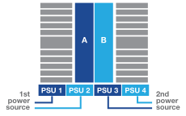
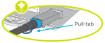
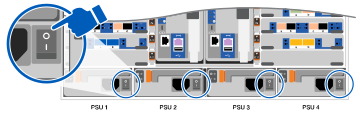

= Detaillierte Schritte – FAS9500
:allow-uri-read: 
:icons: font
:imagesdir: ../media/

[role="lead"]
Dieser Artikel enthält Schritt-für-Schritt-Anleitungen zur Installation eines typischen NetApp Systems. Verwenden Sie diesen Artikel, wenn Sie detailliertere Installationsanweisungen wünschen.

== Schritt 1: Installation vorbereiten

Um Ihr System zu installieren, müssen Sie auf der NetApp Support Site ein Konto erstellen, Ihr System registrieren und Lizenzschlüssel abrufen. Außerdem müssen Sie die entsprechende Anzahl und den entsprechenden Kabeltyp für Ihr System inventarisieren und bestimmte Netzwerkinformationen erfassen.

Sie müssen Zugriff auf die haben https://hwu.netapp.com["NetApp Hardware Universe"^] Weitere Informationen zu Standortanforderungen sowie zusätzliche Informationen zu Ihrem konfigurierten System.

.Was Sie brauchen
Möglicherweise möchten Sie auch Zugriff auf den haben http://mysupport.netapp.com/documentation/productlibrary/index.html?productID=62286["Versionshinweise zu ONTAP 9"^] Für Ihre Version von ONTAP finden Sie weitere Informationen zu diesem System.

Folgendes müssen Sie an Ihrer Website angeben:

* Rack-Platz für das Storage-System
* Kreuzschlitzschraubendreher #2
* Zusätzliche Netzwerkkabel zum Anschließen des Systems an den Netzwerk-Switch und Laptop oder die Konsole über einen Webbrowser

.Schritte
. Packen Sie den Inhalt aller Boxen aus.
. Notieren Sie die Seriennummer des Systems von den Controllern.
+
image::../media/drw_ssn_label.svg[Beispiel für die Seriennummer des Systems, die den Standort der Nummer anzeigt]

. Notieren Sie sich die Anzahl und die Kabeltypen, die Sie erhalten haben.
+
In der folgenden Tabelle sind die Kabeltypen aufgeführt, die Sie möglicherweise erhalten können. Wenn Sie ein Kabel empfangen, das nicht in der Tabelle aufgeführt ist, finden Sie im Hardware Universe das Kabel und dessen Verwendung.

+
https://hwu.netapp.com["NetApp Hardware Universe"^]

+
[cols="1,2,1,2"]
|===
| Kabeltyp... | Teilenummer und Länge | Steckverbindertyp | Für... 

 a| 
25-GbE-Datenkabel
 a| 
X66240A-05 (112-00639), 0,5 m

X66240A-2 (112-00598), 2 m

X66240A-5 (112-00600), 5 m
 a| 
image::../media/oie_cable_sfp_gbe_copper.svg[oie-Kabel sfp gbe Kupfer]
 a| 
Netzwerkkabel

 a| 
32 Gbit FC (SFP+ Op)
 a| 
X66250-2 (112-00342), 2 m

X66250-5 (112-00344), 5 m

X66250-15 (112-00346), 15 m
 a| 
image::../media/oie_cable_sfp_gbe_copper.svg[oie-Kabel sfp gbe Kupfer]
 a| 
Optisches FC-Netzwerkkabel

 a| 
40-GbE-Netzwerkkabel
 a| 
X66100-1 (112-00542), 1 m

X66100-3 (112-00543), 3 m

X66100-5 (112-00544), 5 m
 a| 
image::../media/oie_cable100_gbe_qsfp28.svg[oie Cable100 gbe qsfp28]
 a| 
Ethernet-Daten, Cluster-Netzwerk

 a| 
100-GbE-Kabel
 a| 
X6211B-1 (112-00573), 1 m

X6211B-2 (112-00574), 2 m

X6211B-5 (112-00576), 5 m
 a| 
image::../media/oie_cable100_gbe_qsfp28.svg[oie Cable100 gbe qsfp28]
 a| 
Netzwerk,

Ethernet-Daten,

Cluster-Netzwerk

 a| 
Optische Kabel
 a| 
X66031A (112-00436), 1 m

X66032A (112-00437), 2 m

X66033A (112-00438), 3 m
 a| 
image::../media/oie_cable_fiber_lc_connector.svg[oie-Kabel-Glasfaser-lc-Anschluss]
 a| 
Optisches FC-Netzwerk

 a| 
CAT 6, RJ-45 (je nach Bestellung)
 a| 
Teilenummern X6585-R6 (112-00291), 3m

X6562-R6 (112-00196), 5 m
 a| 
image::../media/oie_cable_rj45.svg[oie-Kabel rj45]
 a| 
Managementnetzwerk und Ethernet-Daten

 a| 
Storage
 a| 
X66031A (112-00436), 1 m

X66032A (112-00437), 2 m

X66033A (112-00438), 3 m
 a| 
image::../media/oie_cable_mini_sas_hd_to_mini_sas_hd.svg[oie Kabel Mini sas hd auf Mini sas hd]
 a| 
Storage

 a| 
Micro-USB-Konsolenkabel
 a| 
Keine Angabe
 a| 
image::../media/oie_cable_micro_usb.svg[oie-Kabel Micro-usb]
 a| 
Verbindung über die Konsole während der Software-Einrichtung auf Laptops/Konsolen, die nicht von Windows stammen

 a| 
Stromkabel
 a| 
Keine Angabe
 a| 
image::../media/oie_cable_power.svg[oie-Kabel mit Strom]
 a| 
System einschalten

|===
. Überprüfen Sie die https://library.netapp.com/ecm/ecm_download_file/ECMLP2862613["ONTAP Konfigurationsleitfaden"^] Und sammeln Sie die in diesem Handbuch aufgeführten erforderlichen Informationen.

== Schritt 2: Installieren Sie die Hardware

Sie müssen das System je nach Bedarf in einem 4-Säulen-Rack oder NetApp Systemschrank installieren.

. Installieren Sie die Schienensatz nach Bedarf.
. Installieren und sichern Sie das System anhand der im Schienensatz enthaltenen Anweisungen.
+

NOTE: Sie müssen sich der Sicherheitsbedenken im Zusammenhang mit dem Gewicht des Systems bewusst sein.

+
Auf dem Etikett links wird ein leeres Gehäuse angezeigt, während das Etikett auf der rechten Seite auf ein vollständig bestücktes System hinweist.

+
image::../media/drw_9500_lifting_icon.svg[Warnschild für Gewichtheben]

. Schließen Sie Kabelmanagement-Geräte (wie abgebildet) an.
+
image::../media/drw_9500_cable_management_arms.svg[Hebegriffe und Kabelführungs-Vorrichtung]

. Bringen Sie die Blende auf die Vorderseite des Systems an.

== Schritt 3: Controller mit Ihrem Netzwerk verbinden

Sie können die Controller mithilfe der Switch-freien Cluster-Methode mit zwei Nodes oder des Cluster Interconnect-Netzwerks mit dem Netzwerk verkabeln.

[role="tabbed-block"]
====
.Option 1: Cluster mit zwei Nodes ohne Switches
--
Managementnetzwerk, Datennetzwerk und Management-Ports auf den Controllern sind mit Switches verbunden. Die Cluster Interconnect-Ports sind an beiden Controllern verkabelt.

.Bevor Sie beginnen
Sie müssen sich an den Netzwerkadministrator wenden, um Informationen über das Anschließen des Systems an die Switches zu erhalten.

Achten Sie beim Einsetzen der Kabel in die Anschlüsse darauf, die Richtung der Kabelabziehlaschen zu überprüfen. Die Kabelabziehlaschen sind für alle Netzwerkmodulanschlüsse nach oben.

image::../media/oie_cable_pull_tab_up.svg[Richtung der Zuglasche des Kabels]

NOTE: Wenn Sie den Anschluss einsetzen, sollten Sie das Gefühl haben, dass er einrasten kann. Wenn Sie nicht das Gefühl haben, dass er klickt, entfernen Sie ihn, drehen Sie ihn um und versuchen Sie es erneut.

. Verwenden Sie die Animation oder Abbildung, um die Verkabelung zwischen den Controllern und den Switches abzuschließen:
+
.Animation – 2-Node-Cluster-Verkabelung ohne Switches
video::da08295f-ba8c-4de7-88c3-ae7c0170408d[panopto]
+
image::../media/drw_9500_tnsc_network_cabling.svg[drw 9500 tnsc Netzwerkverkabelung]

+
|===
| Schritt | Führen Sie an jedem Controller aus 

 a| 
image::../media/oie_legend_icon_1_lg.svg[oie-Legende-Symbol 1 lg]
 a| 
Verkabelung der Cluster Interconnect Ports:

** Steckplatz A4 und B4 (e4a)
** Steckplatz A8 und B8 (e8a)

image::../media/oie_cable100_gbe_qsfp28.svg[oie Cable100 gbe qsfp28]

 a| 
image::../media/oie_legend_icon_2_lp.svg[oie Legend Icon 2 lp]
 a| 
Controller-Management-Ports (Schraubenschlüssel) verkabeln.

image::../media/oie_cable_rj45.svg[oie-Kabel rj45]

 a| 

 a| 
32-GB-FC-Netzwerk-Switches verkabeln:

Ports in Steckplatz A3 und B3 (e3a und e3c) und Steckplatz A9 und B9 (e9a und e9c) zu den 32 GB FC Netzwerk-Switches.

image::../media/oie_cable_sfp_gbe_copper.svg[oie-Kabel sfp gbe Kupfer]

40-GbE-Host-Netzwerk-Switches:

Kabel-Host-Anschlüsse Seite b‐Steckplatz A4 und B4 (e4b) und Steckplatz A8 und B8 (e8b) am Host-Switch.

image::../media/oie_cable100_gbe_qsfp28.svg[oie Cable100 gbe qsfp28]

 a| 
image::../media/oie_legend_icon_4_dr.svg[oie-Legende Symbol 4 dr]
 a| 
25-GbE-Verbindungen verkabeln:

Kabelanschlüsse in Steckplatz A5 und B5 (5a, 5b, 5c und 5d) sowie in den Steckplätzen A7 und B7 (7a, 7b, 7c und 7d) an die 25-GbE-Netzwerk-Switches.

image::../media/oie_cable_sfp_gbe_copper.svg[oie-Kabel sfp gbe Kupfer]

 a| 
** Befestigen Sie die Kabel mit den Kabelführungsarmen (nicht abgebildet).
** Schließen Sie die Stromkabel an die Netzteile an, und schließen Sie sie an verschiedene Stromquellen an (nicht abgebildet). PSU 1 und 3 versorgen alle Komponenten der Seite A mit Strom, während PSU2 und PSU4 alle Komponenten der Seite B mit Strom versorgen.

 a| 
image::../media/oie_cable_power.svg[oie-Kabel mit Strom]

|===

--
.Option 2: Cluster mit Switch
--
Managementnetzwerk, Datennetzwerk und Management-Ports auf den Controllern sind mit Switches verbunden. Die Cluster Interconnect- und HA-Ports sind mit dem Cluster/HA-Switch verbunden.

.Bevor Sie beginnen
Sie müssen sich an den Netzwerkadministrator wenden, um Informationen über das Anschließen des Systems an die Switches zu erhalten.

Achten Sie beim Einsetzen der Kabel in die Anschlüsse darauf, die Richtung der Kabelabziehlaschen zu überprüfen. Die Kabelabziehlaschen sind für alle Netzwerkmodulanschlüsse nach oben.

image::../media/oie_cable_pull_tab_up.svg[Richtung der Zuglasche des Kabels]

NOTE: Wenn Sie den Anschluss einsetzen, sollten Sie das Gefühl haben, dass er einrasten kann. Wenn Sie nicht das Gefühl haben, dass er klickt, entfernen Sie ihn, drehen Sie ihn um und versuchen Sie es erneut.

. Verwenden Sie die Animation oder Abbildung, um die Verkabelung zwischen den Controllern und den Switches abzuschließen:
+
.Animation - Switch Cluster Verkabelung
video::3ad3f118-8339-4683-865f-ae7c0170400c[panopto]
+
image::../media/drw_9500_switched_network_cabling.svg[drw 9500-geschaltete Netzwerkverkabelung]

+
|===
| Schritt | Führen Sie an jedem Controller aus 

 a| 
image::../media/oie_legend_icon_1_lg.svg[oie-Legende-Symbol 1 lg]
 a| 
Cluster-Interconnect-Ports verkabeln:

** Steckplatz A4 und B4 (e4a) zum Cluster-Netzwerk-Switch.
** Steckplatz A8 und B8 (e8a) zum Cluster-Netzwerk-Switch

image::../media/oie_cable100_gbe_qsfp28.svg[oie Cable100 gbe qsfp28]

 a| 
image::../media/oie_legend_icon_2_lp.svg[oie Legend Icon 2 lp]
 a| 
Controller-Management-Ports (Schraubenschlüssel) verkabeln.

image::../media/oie_cable_rj45.svg[oie-Kabel rj45]

 a| 

 a| 
32-GB-FC-Netzwerk-Switches verkabeln:

Ports in Steckplatz A3 und B3 (e3a und e3c) und Steckplatz A9 und B9 (e9a und e9c) zu den 32 GB FC Netzwerk-Switches.

image::../media/oie_cable_sfp_gbe_copper.svg[oie-Kabel sfp gbe Kupfer]

40-GbE-Host-Netzwerk-Switches:

Kabel-Host-Anschlüsse Seite b‐Steckplatz A4 und B4 (e4b) und Steckplatz A8 und B8 (e8b) am Host-Switch.

image::../media/oie_cable100_gbe_qsfp28.svg[oie Cable100 gbe qsfp28]

 a| 
image::../media/oie_legend_icon_4_dr.svg[oie-Legende Symbol 4 dr]
 a| 
25-GbE-Verbindungen verkabeln:

Kabelanschlüsse in Steckplatz A5 und B5 (5a, 5b, 5c und 5d) sowie in den Steckplätzen A7 und B7 (7a, 7b, 7c und 7d) an die 25-GbE-Netzwerk-Switches.

image::../media/oie_cable_sfp_gbe_copper.svg[oie-Kabel sfp gbe Kupfer]

 a| 
** Befestigen Sie die Kabel mit den Kabelführungsarmen (nicht abgebildet).
** Schließen Sie die Stromkabel an die Netzteile an, und schließen Sie sie an verschiedene Stromquellen an (nicht abgebildet). PSU 1 und 3 versorgen alle Komponenten der Seite A mit Strom, während PSU2 und PSU4 alle Komponenten der Seite B mit Strom versorgen.

 a| 
image::../media/oie_cable_power.svg[oie-Kabel mit Strom]

|===

--
====

== Schritt 4: Controller mit Laufwerk-Shelfs verkabeln

Verbinden Sie DS212C- oder DS224C Laufwerk-Shelfs mit den Controllern.

NOTE: Weitere Informationen und Arbeitsblätter zur SAS-Verkabelung finden Sie unter link:../sas3/overview-cabling-rules-examples.html["SAS-Verkabelungsregeln, Arbeitsblätter und Beispiele – Regale mit IOM12-Modulen"]

.Bevor Sie beginnen
* Füllen Sie das SAS-Verkabelungsarbeitsblatt für Ihr System aus. Siehe link:../sas3/overview-cabling-rules-examples.html["SAS-Verkabelungsregeln, Arbeitsblätter und Beispiele – Regale mit IOM12-Modulen"].
* Prüfen Sie unbedingt den Abbildungspfeil, um die richtige Ausrichtung des Kabelanschlusses zu prüfen. Die Kabelabzieher für die Storage-Module sind nach oben und die Abziehlaschen an den Shelves sind nach unten.

image::../media/oie_cable_pull_tab_up.svg[Richtung der Zuglasche des Kabels]

NOTE: Wenn Sie den Anschluss einsetzen, sollten Sie das Gefühl haben, dass er einrasten kann. Wenn Sie nicht das Gefühl haben, dass er klickt, entfernen Sie ihn, drehen Sie ihn um und versuchen Sie es erneut.

. Die folgenden Animationen oder Zeichnungen verwenden Sie, um Ihre Controller mit drei (1 Stack eines Laufwerks-Shelfs und einem Stack mit zwei Laufwerk-Shelfs) DS224C-Laufwerk-Shelfs zu verkabeln.
+
.Animation - Verkabeln Sie Ihre Laufwerk-Regale
video::c958aae6-9d08-4d3d-a213-ae7c017040cd[panopto]
+
image::../media/drw_9500_sas_shelf_cabling.svg[drw 9500-sas-Shelf-Verkabelung]

+
[cols="20%,80%"]
|===
| Schritt | Führen Sie an jedem Controller aus 

 a| 

 a| 
Verbinden Sie den Laufwerk-Shelf-Stack mithilfe der Grafik als Referenz mit den Controllern.

image::../media/oie_cable_mini_sas_hd_to_mini_sas_hd.svg[oie Kabel Mini sas hd auf Mini sas hd]

Mini-SAS-Kabel

 a| 
image::../media/oie_legend_icon_2_t.svg[oie-Legende Symbol 2 t]
 a| 
Verbinden Sie den Laufwerk-Shelf-Stack 2 mit den Controllern. Verwenden Sie dazu die Grafik als Referenz.

image::../media/oie_cable_mini_sas_hd_to_mini_sas_hd.svg[oie Kabel Mini sas hd auf Mini sas hd]

Mini-SAS-Kabel

|===

== Schritt 5: System-Setup und -Konfiguration abschließen

Die Einrichtung und Konfiguration des Systems kann mithilfe der Cluster-Erkennung nur mit einer Verbindung zum Switch und Laptop abgeschlossen werden. Sie können auch direkt eine Verbindung zu einem Controller im System herstellen und dann eine Verbindung zum Management Switch herstellen.

[role="tabbed-block"]
====
.Option 1: Wenn die Netzwerkerkennung aktiviert ist
--
Wenn die Netzwerkerkennung auf Ihrem Laptop aktiviert ist, können Sie das System mit der automatischen Cluster-Erkennung einrichten und konfigurieren.

. Verwenden Sie die folgende Animation oder Zeichnung, um eine oder mehrere Laufwerk-Shelf-IDs festzulegen:
+
.Animation - Festlegen der Shelf-ID&#8217;s
video::95a29da1-faa3-4ceb-8a0b-ac7600675aa6[panopto]
+
image::../media/drw_power-on_set_shelf_ID_set.svg[drw-Laufwerk für Set-Shelf-ID]

+
[cols="20%,80%"]
|===

 a| 
image::../media/legend_icon_01.svg[Legende Symbol 01]
 a| 
Entfernen Sie die Endkappe.

 a| 
image::../media/legend_icon_02.svg[Legende Symbol 02]
 a| 
Halten Sie die erste Shelf-ID-Taste gedrückt, bis die erste Ziffer blinkt. Drücken Sie dann, um den Status 0 bis 9 zu erweitern.

NOTE: Die erste Ziffer blinkt weiterhin

 a| 
image::../media/legend_icon_03.svg[Legende Symbol 03]
 a| 
Halten Sie die Shelf-ID-Taste gedrückt, bis die zweite Ziffer blinkt. Drücken Sie dann, um den Status 0 bis 9 zu erweitern.

NOTE: Die erste Ziffer hört auf zu blinken, und die zweite Ziffer blinkt weiterhin.

 a| 
image::../media/legend_icon_04.svg[Legende Symbol 04]
 a| 
Die Endkappe austauschen.

 a| 
image::../media/legend_icon_05.svg[Legende Symbol 05]
 a| 
Warten Sie 10 Sekunden auf die Bernstein-LED (!) Um angezeigt zu werden, schalten Sie dann das Laufwerk-Shelf aus und wieder ein, um die Shelf-ID festzulegen.

|===
. Schalten Sie die Netzschalter an den Netzteilen beider Knoten ein.
+
.Animation: Schalten Sie die Stromversorgung der Controller ein
video::a905e56e-c995-4704-9673-adfa0005a891[panopto]
+

+

NOTE: Das erste Booten kann bis zu acht Minuten dauern.

. Stellen Sie sicher, dass die Netzwerkerkennung auf Ihrem Laptop aktiviert ist.
+
Weitere Informationen finden Sie in der Online-Hilfe Ihres Notebooks.

. Schließen Sie Ihren Laptop mithilfe der folgenden Animation an den Management-Switch an.
+
.Animation - Verbinden Sie Ihren Laptop mit dem Management-Switch
video::d61f983e-f911-4b76-8b3a-ab1b0066909b[panopto]
+
image::../media/dwr_laptop_to_switch_only.svg[dwr-Laptop nur zum Umschalten]

. Wählen Sie ein ONTAP-Symbol aus, um es zu ermitteln:
+
image::../media/drw_autodiscovery_controler_select.svg[wählen sie den drw-Kontroller für die automatische Ermittlung aus]

+
.. Öffnen Sie Den Datei-Explorer.
.. Klicken Sie im linken Bereich auf Netzwerk.
.. Mit der rechten Maustaste klicken und Aktualisieren auswählen.
.. Doppelklicken Sie auf das ONTAP-Symbol, und akzeptieren Sie alle auf dem Bildschirm angezeigten Zertifikate.
+

NOTE: XXXXX ist die Seriennummer des Systems für den Ziel-Node.

+
System Manager wird geöffnet.

. Konfigurieren Sie das System mithilfe von System Manager geführten Setups anhand der Daten, die Sie im erfasst haben https://library.netapp.com/ecm/ecm_download_file/ECMLP2862613["ONTAP Konfigurationsleitfaden"^].
. Richten Sie Ihr Konto ein und laden Sie Active IQ Config Advisor herunter:
+
.. Melden Sie sich bei Ihrem bestehenden Konto an oder erstellen Sie ein Konto.
+
https://mysupport.netapp.com/eservice/public/now.do["NetApp Support-Registrierung"^]

.. Registrieren Sie das System.
+
https://mysupport.netapp.com/eservice/registerSNoAction.do?moduleName=RegisterMyProduct["NetApp Produktregistrierung"^]

.. Laden Sie Active IQ Config Advisor herunter.
+
https://mysupport.netapp.com/site/tools/tool-eula/activeiq-configadvisor["NetApp Downloads: Config Advisor"^]

. Überprüfen Sie den Systemzustand Ihres Systems, indem Sie Config Advisor ausführen.
. Wechseln Sie nach Abschluss der Erstkonfiguration mit dem https://www.netapp.com/data-management/oncommand-system-documentation/["ONTAP  ONTAP System Manager; Dokumentationsressourcen"^] Seite für Informationen über das Konfigurieren zusätzlicher Funktionen in ONTAP.

--
.Option 2: Wenn die Netzwerkerkennung nicht aktiviert ist
--
Wenn Sie keinen Windows- oder Mac-basierten Laptop oder keine Konsole verwenden oder die automatische Erkennung nicht aktiviert ist, müssen Sie die Konfiguration und das Setup mit dieser Aufgabe abschließen.

. Laptop oder Konsole verkabeln und konfigurieren:
+
.. Stellen Sie den Konsolenport des Laptops oder der Konsole auf 115,200 Baud mit N-8-1 ein.
+

NOTE: Informationen zur Konfiguration des Konsolenport finden Sie in der Online-Hilfe Ihres Laptops oder der Konsole.

.. Verbinden Sie das Konsolenkabel mit dem Laptop oder der Konsole über das im Lieferumfang des Systems enthalten Konsolenkabel, und verbinden Sie dann den Laptop mit dem Switch im Management-Subnetz.
+

.. Weisen Sie dem Laptop oder der Konsole eine TCP/IP-Adresse zu. Verwenden Sie dabei eine Adresse, die sich im Management-Subnetz befindet.

. Mithilfe der folgenden Animation können Sie eine oder mehrere Laufwerk-Shelf-IDs festlegen:
+
.Animation - Festlegen der Shelf-ID&#8217;s
video::95a29da1-faa3-4ceb-8a0b-ac7600675aa6[panopto]
+
image::../media/drw_power-on_set_shelf_ID_set.svg[drw-Laufwerk für Set-Shelf-ID]

+
[cols="20%,80%"]
|===

 a| 
image::../media/legend_icon_01.svg[Legende Symbol 01]
 a| 
Entfernen Sie die Endkappe.

 a| 
image::../media/legend_icon_02.svg[Legende Symbol 02]
 a| 
Halten Sie die erste Shelf-ID-Taste gedrückt, bis die erste Ziffer blinkt. Drücken Sie dann, um den Status 0 bis 9 zu erweitern.

NOTE: Die erste Ziffer blinkt weiterhin

 a| 
image::../media/legend_icon_03.svg[Legende Symbol 03]
 a| 
Halten Sie die Shelf-ID-Taste gedrückt, bis die zweite Ziffer blinkt. Drücken Sie dann, um den Status 0 bis 9 zu erweitern.

NOTE: Die erste Ziffer hört auf zu blinken, und die zweite Ziffer blinkt weiterhin.

 a| 
image::../media/legend_icon_04.svg[Legende Symbol 04]
 a| 
Die Endkappe austauschen.

 a| 
image::../media/legend_icon_05.svg[Legende Symbol 05]
 a| 
Warten Sie 10 Sekunden auf die Bernstein-LED (!) Um angezeigt zu werden, schalten Sie dann das Laufwerk-Shelf aus und wieder ein, um die Shelf-ID festzulegen.

|===
. Schalten Sie die Netzschalter an den Netzteilen beider Knoten ein.
+
.Animation: Schalten Sie die Stromversorgung der Controller ein
video::a905e56e-c995-4704-9673-adfa0005a891[panopto]
+

NOTE: Das erste Booten kann bis zu acht Minuten dauern.

. Weisen Sie einem der Nodes eine erste Node-Management-IP-Adresse zu.
+
[cols="1,2"]
|===
| Wenn das Managementnetzwerk DHCP enthält... | Dann... 

 a| 
Konfiguriert
 a| 
Notieren Sie die IP-Adresse, die den neuen Controllern zugewiesen ist.

 a| 
Nicht konfiguriert
 a| 
.. Öffnen Sie eine Konsolensitzung mit PuTTY, einem Terminalserver oder dem entsprechenden Betrag für Ihre Umgebung.
+

NOTE: Überprüfen Sie die Online-Hilfe Ihres Laptops oder Ihrer Konsole, wenn Sie nicht wissen, wie PuTTY konfiguriert werden soll.

.. Geben Sie die Management-IP-Adresse ein, wenn Sie dazu aufgefordert werden.

|===
. Konfigurieren Sie das Cluster unter System Manager auf Ihrem Laptop oder Ihrer Konsole:
+
.. Rufen Sie die Node-Management-IP-Adresse im Browser auf.
+

NOTE: Das Format für die Adresse ist +https://x.x.x.x+.

.. Konfigurieren Sie das System anhand der Daten, die Sie im erfasst haben https://library.netapp.com/ecm/ecm_download_file/ECMLP2862613["ONTAP Konfigurationsleitfaden"^] .

. Richten Sie Ihr Konto ein und laden Sie Active IQ Config Advisor herunter:
+
.. Melden Sie sich bei Ihrem bestehenden Konto an oder erstellen Sie ein Konto.
+
https://mysupport.netapp.com/eservice/public/now.do["NetApp Support-Registrierung"^]

.. Registrieren Sie das System.
+
https://mysupport.netapp.com/eservice/registerSNoAction.do?moduleName=RegisterMyProduct["NetApp Produktregistrierung"^]

.. Laden Sie Active IQ Config Advisor herunter.
+
https://mysupport.netapp.com/site/tools/tool-eula/activeiq-configadvisor["NetApp Downloads: Config Advisor"^]

. Überprüfen Sie den Systemzustand Ihres Systems, indem Sie Config Advisor ausführen.
. Wechseln Sie nach Abschluss der Erstkonfiguration mit dem https://www.netapp.com/data-management/oncommand-system-documentation/["ONTAP  ONTAP System Manager; Dokumentationsressourcen"^] Seite für Informationen über das Konfigurieren zusätzlicher Funktionen in ONTAP.

--
====