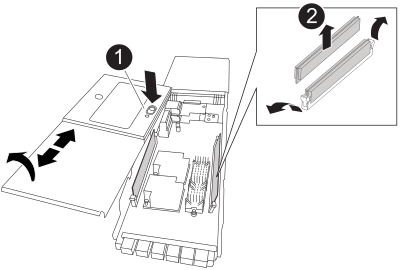

= Ersetzen Sie das NVRAM-Modul und/oder NVRAM DIMMs - FAS9500
:allow-uri-read: 
:icons: font
:imagesdir: ../media/

[role="lead"]
Das NVRAM-Modul besteht aus NVRAM11 und DIMMs. Ein ausgefallenes NVRAM-Modul oder die DIMMs im NVRAM-Modul können Sie ersetzen. Um ein ausgefallenes NVRAM-Modul zu ersetzen, müssen Sie es aus dem Chassis entfernen, die DIMMs in das Ersatzmodul verschieben und das Ersatz-NVRAM-Modul im Chassis installieren.

Zum Austauschen und NVRAM-DIMM müssen Sie das NVRAM-Modul aus dem Chassis entfernen, das fehlerhafte DIMM im Modul ersetzen und dann das NVRAM-Modul neu installieren.

.Über diese Aufgabe
Da die System-ID vom NVRAM-Modul abgeleitet wird, werden beim Ersetzen des Moduls Festplatten, die zum System gehören, einer neuen System-ID neu zugewiesen.

.Bevor Sie beginnen
* Alle Platten-Shelves müssen ordnungsgemäß funktionieren.
* Wenn sich Ihr System in einem HA-Paar befindet, muss der Partner-Controller den Controller übernehmen können, der dem zu ersetzenden NVRAM-Modul zugeordnet ist.
* Bei diesem Verfahren wird die folgende Terminologie verwendet:
+
** Der beeinträchtigte Controller ist der Controller, an dem Sie Wartungsarbeiten durchführen.
** Der gesunde Controller ist der HA-Partner des beeinträchtigten Controllers.

* Dieses Verfahren umfasst Schritte zur automatischen Neuzuteilung von Festplatten an das Controller-Modul, das dem neuen NVRAM-Modul zugeordnet ist. Sie müssen die Festplatten neu zuweisen, wenn Sie dazu aufgefordert werden. Das Ausfüllen der Neuzuweisung von Festplatte vor dem Giveback kann Probleme verursachen.
* Sie müssen die fehlerhafte Komponente durch eine vom Anbieter empfangene Ersatz-FRU-Komponente ersetzen.
* Im Rahmen dieses Verfahrens können Festplatten oder Platten-Shelfs nicht geändert werden.

== Schritt 1: Schalten Sie den beeinträchtigten Regler aus

Um den beeinträchtigten Controller herunterzufahren, müssen Sie den Status des Controllers bestimmen und gegebenenfalls den Controller übernehmen, damit der gesunde Controller weiterhin Daten aus dem beeinträchtigten Reglerspeicher bereitstellen kann.

.Über diese Aufgabe
Wenn Sie über ein Cluster mit mehr als zwei Nodes verfügen, muss es sich im Quorum befinden. Wenn sich das Cluster nicht im Quorum befindet oder ein gesunder Controller FALSE anzeigt, um die Berechtigung und den Zustand zu erhalten, müssen Sie das Problem korrigieren, bevor Sie den beeinträchtigten Controller herunterfahren; siehe link:https://docs.netapp.com/us-en/ontap/system-admin/synchronize-node-cluster-task.html?q=Quorum["Synchronisieren eines Node mit dem Cluster"^].

.Schritte
. Wenn AutoSupport aktiviert ist, unterdrücken Sie die automatische Fallerstellung durch Aufruf eines AutoSupport-Meldungsbefehls: `system node autosupport invoke -node * -type all -message MAINT=number_of_hours_downh`
+
Mit dem folgenden AutoSupport-Befehl wird die automatische Erstellung von Fällen zwei Stunden lang unterdrückt: `cluster1:*> system node autosupport invoke -node * -type all -message MAINT=2h`

. Deaktivieren Sie das automatische Giveback von der Konsole des gesunden Controllers: `storage failover modify –node local -auto-giveback false`
. Nehmen Sie den beeinträchtigten Controller zur LOADER-Eingabeaufforderung:
+
[cols="1,2"]
|===
| Wenn der eingeschränkte Controller angezeigt wird... | Dann... 

 a| 
Die LOADER-Eingabeaufforderung
 a| 
Fahren Sie mit dem nächsten Schritt fort.

 a| 
`Waiting for giveback...`
 a| 
Drücken Sie Strg-C, und antworten Sie dann `y` Wenn Sie dazu aufgefordert werden.

 a| 
Eingabeaufforderung des Systems oder Passwort (Systempasswort eingeben)
 a| 
Halten Sie den Controller für den beeinträchtigten Betrieb an oder übernehmen Sie ihn vom Controller für den ordnungsgemäßen Betrieb: `storage failover takeover -ofnode _impaired_node_name_`

Wenn der Regler „beeinträchtigt“ auf Zurückgeben wartet... anzeigt, drücken Sie Strg-C, und antworten Sie dann `y`.

|===

== Schritt 2: Ersetzen Sie das NVRAM-Modul

Um das NVRAM-Modul auszutauschen, befindet es sich in Steckplatz 6 im Gehäuse und befolgen Sie die Schritte in der angegebenen Reihenfolge.

. Wenn Sie nicht bereits geerdet sind, sollten Sie sich richtig Erden.
. Entfernen des Ziel-NVRAM-Moduls aus dem Chassis:
+
.. Drücken Sie den mit Buchstaben versehenen und nummerierten Nockenriegel.
+
Die Nockenverriegelung bewegt sich vom Gehäuse weg.

.. Drehen Sie die Nockenverriegelung nach unten, bis sie sich in horizontaler Position befindet.
+
Das NVRAM-Modul geht aus dem Chassis heraus und bewegt sich einige Zentimeter heraus.

.. Entfernen Sie das NVRAM-Modul aus dem Gehäuse, indem Sie an den Zuglaschen an den Seiten der Modulfläche ziehen.
+
.Animation: Ersetzen Sie das NVRAM-Modul
video::228cbd14-4cb2-49b5-88f1-ae78004b9d84[panopto]
+
image::../media/drw_9500_move-remove_NVRAM_module.svg[ddw 9500 Move entfernen NVRAM-Modul]

+
[cols="20%,90%"]
|===

 a| 
image::../media/icon_round_1.png[Legende Nummer 1]
 a| 
Gerettete und nummerierte E/A-Nockenverriegelung

 a| 
image::../media/icon_round_2.png[Legende Nummer 2]
 a| 
E/A-Riegel vollständig entriegelt

|===

. Setzen Sie das NVRAM-Modul auf eine stabile Fläche und entfernen Sie die Abdeckung vom NVRAM-Modul, indem Sie die blaue Verriegelungstaste auf der Abdeckung nach unten drücken und dann, während Sie die blaue Taste gedrückt halten, den Deckel aus dem NVRAM-Modul schieben.
+

+
[cols="20%,80%"]
|===

 a| 
image::../media/icon_round_1.png[Legende Nummer 1]
 a| 
Verriegelungsknopf für die Abdeckung

 a| 
image::../media/icon_round_2.png[Legende Nummer 2]
 a| 
DIMM- und DIMM-Auswurfklammern

|===
. Entfernen Sie nacheinander die DIMMs aus dem alten NVRAM-Modul und installieren Sie sie im ErsatzNVRAM-Modul.
. Schließen Sie die Abdeckung am Modul.
. Installieren Sie das Ersatz-NVRAM-Modul in das Chassis:
+
.. Richten Sie das Modul an den Kanten der Gehäuseöffnung in Steckplatz 6 aus.
.. Schieben Sie das Modul vorsichtig in den Steckplatz, bis der vorletzte und nummerierte E/A-Nockenriegel mit dem E/A-Nockenstift einrastet. Drücken Sie dann die E/A-Nockenverriegelung ganz nach oben, um das Modul zu verriegeln.

== Schritt 3: Ersetzen Sie ein NVRAM-DIMM

Um NVRAM-DIMMs im NVRAM-Modul zu ersetzen, müssen Sie das NVRAM-Modul entfernen, das Modul öffnen und dann das Ziel-DIMM ersetzen.

. Wenn Sie nicht bereits geerdet sind, sollten Sie sich richtig Erden.
. Entfernen des Ziel-NVRAM-Moduls aus dem Chassis:
+
.. Drücken Sie den mit Buchstaben versehenen und nummerierten Nockenriegel.
+
Die Nockenverriegelung bewegt sich vom Gehäuse weg.

.. Drehen Sie die Nockenverriegelung nach unten, bis sie sich in horizontaler Position befindet.
+
Das NVRAM-Modul geht aus dem Chassis heraus und bewegt sich einige Zentimeter heraus.

.. Entfernen Sie das NVRAM-Modul aus dem Gehäuse, indem Sie an den Zuglaschen an den Seiten der Modulfläche ziehen.
+
.Animation: Ersetzen Sie das NVRAM-Modul
video::228cbd14-4cb2-49b5-88f1-ae78004b9d84[panopto]
+
image::../media/drw_9500_move-remove_NVRAM_module.svg[ddw 9500 Move entfernen NVRAM-Modul]

+
[cols="20%,80%"]
|===

 a| 
image::../media/icon_round_1.png[Legende Nummer 1]
 a| 
Gerettete und nummerierte E/A-Nockenverriegelung

 a| 
image::../media/icon_round_2.png[Legende Nummer 2]
 a| 
E/A-Riegel vollständig entriegelt

|===

. Setzen Sie das NVRAM-Modul auf eine stabile Fläche und entfernen Sie die Abdeckung vom NVRAM-Modul, indem Sie die blaue Verriegelungstaste auf der Abdeckung nach unten drücken und dann, während Sie die blaue Taste gedrückt halten, den Deckel aus dem NVRAM-Modul schieben.
+

+
[cols="20%,80%"]
|===

 a| 
image::../media/icon_round_1.png[Legende Nummer 1]
 a| 
Verriegelungsknopf für die Abdeckung

 a| 
image::../media/icon_round_2.png[Legende Nummer 2]
 a| 
DIMM- und DIMM-Auswurfklammern

|===
. Suchen Sie das DIMM, das im NVRAM-Modul ausgetauscht werden soll, und entfernen Sie es, indem Sie die DIMM-Verriegelungslaschen nach unten drücken und das DIMM aus dem Sockel heben.
. Installieren Sie das ErsatzDIMM, indem Sie das DIMM-Modul am Sockel ausrichten und das DIMM vorsichtig in den Sockel schieben, bis die Verriegelungslaschen einrasten.
. Schließen Sie die Abdeckung am Modul.
. Installieren Sie das NVRAM-Modul in das Chassis:
+
.. Richten Sie das Modul an den Kanten der Gehäuseöffnung in Steckplatz 6 aus.
.. Schieben Sie das Modul vorsichtig in den Steckplatz, bis der vorletzte und nummerierte E/A-Nockenriegel mit dem E/A-Nockenstift einrastet. Drücken Sie dann die E/A-Nockenverriegelung ganz nach oben, um das Modul zu verriegeln.

== Schritt 4: Starten Sie den Controller nach dem FRU-Austausch neu

Nachdem Sie die FRU ersetzt haben, müssen Sie das Controller-Modul neu booten.

. Um ONTAP von der LOADER-Eingabeaufforderung zu booten, geben Sie ein `bye`.

== Schritt 5: Festplatten neu zuweisen

Sie müssen die Änderung der System-ID beim Booten des Ersatz-Controllers bestätigen und anschließend überprüfen, ob die Änderung implementiert wurde.

CAUTION: Eine Neuzuweisung der Festplatte ist nur erforderlich, wenn das NVRAM-Modul ersetzt wird. Dies gilt nicht für den Austausch des NVRAM-DIMM.

.Schritte
. Wenn sich der Ersatz-Controller im Wartungsmodus befindet (zeigt das an `*>` Eingabeaufforderung), beenden Sie den Wartungsmodus und gehen Sie zur LOADER-Eingabeaufforderung: `halt`
. Booten Sie an der LOADER-Eingabeaufforderung auf dem Ersatz-Controller den Controller und geben Sie „y“ ein, wenn Sie aufgrund von nicht übereinstimmenden System-ID aufgefordert werden, die System-ID außer Kraft zu setzen.
. Warten Sie, bis Sie auf das Giveback warten... Die Meldung wird auf der Konsole des Controllers mit dem Ersatzmodul angezeigt und anschließend vom gesunden Controller aus überprüfen, ob die neue Partner-System-ID automatisch zugewiesen wurde: `storage failover show`
+
In der Befehlsausgabe sollte eine Meldung angezeigt werden, dass sich die System-ID auf dem beeinträchtigten Controller geändert hat und die korrekten alten und neuen IDs angezeigt werden. Im folgenden Beispiel wurde node2 ersetzt und hat eine neue System-ID von 151759706.

+
[listing]
----
node1:> storage failover show
                                    Takeover
Node              Partner           Possible     State Description
------------      ------------      --------     -------------------------------------
node1             node2             false        System ID changed on partner (Old:
                                                  151759755, New: 151759706), In takeover
node2             node1             -            Waiting for giveback (HA mailboxes)
----
. Geben Sie den Controller zurück:
+
.. Geben Sie von dem ordnungsgemäßen Controller den Storage des ersetzten Controllers wieder: `storage failover giveback -ofnode replacement_node_name`
+
Der Ersatz-Controller benötigt wieder Storage und läuft ab.

+
Wenn Sie aufgrund einer nicht übereinstimmenden System-ID aufgefordert werden, die System-ID außer Kraft zu setzen, sollten Sie eingeben `y`.

+

NOTE: Wenn das Rückübertragung ein Vetorecht ist, können Sie erwägen, das Vetos außer Kraft zu setzen.

+
Weitere Informationen finden Sie im https://docs.netapp.com/us-en/ontap/high-availability/ha_manual_giveback.html#if-giveback-is-interrupted["Manuelle Giveback-Befehle"^] Thema, um das Veto zu überschreiben.

.. Nachdem das Giveback abgeschlossen ist, bestätigen Sie, dass das HA-Paar sich gesund befindet und ein Takeover möglich ist: `storage failover show`
+
Die Ausgabe von der `storage failover show` Befehl sollte nicht die in der Partnernachricht geänderte System-ID enthalten.

. Überprüfen Sie, ob die Festplatten ordnungsgemäß zugewiesen wurden: `storage disk show -ownership`
+
Bei den Festplatten, die zum Ersatz-Controller gehören, sollte die neue System-ID angezeigt werden. Im folgenden Beispiel zeigen die Festplatten von node1 jetzt die neue System-ID, 151759706:

+
[listing]
----
node1:> storage disk show -ownership

Disk  Aggregate Home  Owner  DR Home  Home ID    Owner ID  DR Home ID Reserver  Pool
----- ------    ----- ------ -------- -------    -------    -------  ---------  ---
1.0.0  aggr0_1  node1 node1  -        151759706  151759706  -       151759706 Pool0
1.0.1  aggr0_1  node1 node1           151759706  151759706  -       151759706 Pool0
.
.
.
----
. Wenn sich das System in einer MetroCluster-Konfiguration befindet, überwachen Sie den Status des Controllers: `metrocluster node show`
+
Die MetroCluster-Konfiguration dauert einige Minuten nach dem Austausch und kehrt in den normalen Zustand zurück. Zu diesem Zeitpunkt zeigt jeder Controller einen konfigurierten Status mit aktivierter DR-Spiegelung und einem normalen Modus an. Der `metrocluster node show -fields node-systemid` In der Befehlsausgabe wird die alte System-ID angezeigt, bis die MetroCluster-Konfiguration den normalen Status aufweist.

. Wenn der Controller in einer MetroCluster-Konfiguration befindet, überprüfen Sie abhängig vom Status des MetroCluster, ob im Feld für die DR-Home-ID der ursprüngliche Eigentümer der Festplatte angezeigt wird, wenn der ursprüngliche Eigentümer ein Controller am Disaster-Standort ist.
+
Dies ist erforderlich, wenn beide der folgenden Werte erfüllt sind:

+
** Die MetroCluster Konfiguration befindet sich in einem Switchover-Zustand.
** Der Ersatz-Controller ist der aktuelle Besitzer der Festplatten am Disaster-Standort.
+
Siehe https://docs.netapp.com/us-en/ontap-metrocluster/manage/concept_understanding_mcc_data_protection_and_disaster_recovery.html#disk-ownership-changes-during-ha-takeover-and-metrocluster-switchover-in-a-four-node-metrocluster-configuration["Änderungen am Festplattenbesitz während HA Takeover und MetroCluster Switchover in einer MetroCluster Konfiguration mit vier Nodes"] Finden Sie weitere Informationen.

. Wenn sich das System in einer MetroCluster-Konfiguration befindet, vergewissern Sie sich, dass jeder Controller konfiguriert ist: `metrocluster node show - fields configuration-state`
+
[listing]
----
node1_siteA::> metrocluster node show -fields configuration-state

dr-group-id            cluster node           configuration-state
-----------            ---------------------- -------------- -------------------
1 node1_siteA          node1mcc-001           configured
1 node1_siteA          node1mcc-002           configured
1 node1_siteB          node1mcc-003           configured
1 node1_siteB          node1mcc-004           configured

4 entries were displayed.
----
. Vergewissern Sie sich, dass die erwarteten Volumes für jeden Controller vorhanden sind: `vol show -node node-name`
. Wenn die Speicherverschlüsselung aktiviert ist, müssen Sie die Funktion wiederherstellen.
. Wenn Sie die automatische Übernahme beim Neustart deaktiviert haben, aktivieren Sie sie vom gesunden Controller: `storage failover modify -node replacement-node-name -onreboot true`

== Schritt 6: Senden Sie das fehlgeschlagene Teil an NetApp zurück

Senden Sie das fehlerhafte Teil wie in den dem Kit beiliegenden RMA-Anweisungen beschrieben an NetApp zurück.  https://mysupport.netapp.com/site/info/rma["Rückgabe und Austausch von Teilen"]Weitere Informationen finden Sie auf der Seite.
