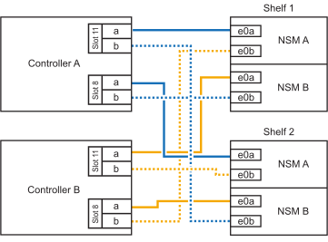

= Shelf zu ASA Systemen verkabeln – NS224-Shelfs
:allow-uri-read: 
:icons: font
:imagesdir: ../media/

[role="lead"]
Sie verkabeln jedes NS224-Shelf, das Sie im laufenden Betrieb hinzufügen, so dass jedes Shelf über zwei Verbindungen mit jedem Controller im HA-Paar verfügt.

.Über diese Aufgabe
Ihr Hardwaresystem ist möglicherweise mit NS224-Shelfs mit NSM100-Modulen und NS224-Shelfs mit NSM100B-Modulen kompatibel. Informationen zur Überprüfung der Kompatibilität und der Portnamen für Ihre Hardware und Shelves finden Sie unter https://hwu.netapp.com["NetApp Hardware Universe"].

.Kabeleinschub zu ASA A1K
[%collapsible]
====
Bei laufendem Betrieb können Sie bis zu drei zusätzliche NS224 Shelfs (also insgesamt vier Shelfs) zu einem ASA A1K HA-Paar hinzufügen.

.Bevor Sie beginnen
* Sie müssen die überprüft haben link:requirements-hot-add-shelf.html["Hot-Add-Anforderungen und Best Practices"].
* Sie müssen die entsprechenden Verfahren in abgeschlossen haben link:prepare-hot-add-shelf.html["Bereiten Sie das Hot-Add eines Faches vor"].
* Sie müssen die Shelfs installiert, eingeschaltet und die Shelf-IDs wie in festgelegt haben link:prepare-hot-add-shelf.html["Installieren Sie ein Shelf für ein Hot-Add-System"].

.Über diese Aufgabe
* Bei dieser Vorgehensweise wird vorausgesetzt, dass Ihr HA-Paar mindestens ein vorhandenes NS224-Shelf hat.
* Dieses Verfahren behandelt die folgenden Hot-Add-Szenarien:
+
** Hinzufügen eines zweiten Shelf zu einem HA-Paar mit zwei RoCE-fähigen I/O-Modulen pro Controller während des laufenden Betriebs. (Sie haben ein zweites I/O-Modul installiert und das erste Shelf beiden I/O-Modulen erneut verkabelt oder das erste Shelf bereits mit zwei I/O-Modulen verkabelt. Sie verbinden das zweite Shelf mit beiden I/O-Modulen.)
** Hinzufügen eines dritten Shelf zu einem HA-Paar mit drei RoCE-fähigen I/O-Modulen pro Controller und während des laufenden Betriebs. (Sie haben ein drittes I/O-Modul installiert und verkabeln das dritte Shelf nur mit dem dritten I/O-Modul.)
** Hinzufügen eines dritten Shelf zu einem HA-Paar mit vier RoCE-fähigen I/O-Modulen pro Controller während des laufenden Betriebs (Sie haben ein drittes und viertes I/O-Modul installiert und verbinden das dritte Shelf mit dem dritten und vierten I/O-Modul).
** Hinzufügen eines vierten Shelfs zu einem HA-Paar mit vier RoCE-fähigen I/O-Modulen pro Controller während des laufenden Betriebs (Sie haben ein viertes I/O-Modul installiert und das dritte Shelf erneut mit den dritten und vierten I/O-Modulen verbunden oder das dritte Shelf bereits mit den dritten und vierten I/O-Modulen verkabelt. Sie verbinden das vierte Shelf mit dem dritten und vierten I/O-Modul).

.Schritte
. Wenn das NS224-Shelf, das Sie im Hot-Adding befinden, das zweite NS2224-Shelf im HA-Paar ist, führen Sie die folgenden Teilschritte aus.
+
Andernfalls fahren Sie mit dem nächsten Schritt fort.

+
.. Kabel-Shelf NSM A-Port e0a zu Controller A-Steckplatz 10 Port A (e10a)
.. Kabel-Shelf NSM A-Port e0b zum Controller B-Steckplatz 11 Port b (e11b).
.. Kabel-Shelf NSM B-Port e0a zu Controller B-Steckplatz 10 Port A (e10a)
.. Kabel-Shelf NSM B-Port e0b zum Controller A-Steckplatz 11 Port b (e11b).
+
In der folgenden Abbildung ist die Verkabelung des zweiten Shelf im HA-Paar mit zwei RoCE-fähigen I/O-Modulen pro Controller hervorgehoben:

+
image::../media/drw_ns224_vino_m_2shelves_2cards_ieops-1642.svg[Verkabelung für AFF/ASA A1K mit zwei Shelfs und zwei I/O-Modulen]

. Wenn das NS224-Shelf das dritte NS224-Shelf im HA-Paar mit drei RoCE-fähigen I/O-Modulen pro Controller ist, führen Sie die folgenden Teilschritte durch. Andernfalls fahren Sie mit dem nächsten Schritt fort.
+
.. Verkabeln Sie das Shelf NSM A-Port e0a mit Controller A, Steckplatz 9, Port A (e9a).
.. Verkabeln Sie den Port e0b des Shelf NSM A mit Controller B-Steckplatz 9, Port b (e9b).
.. Verkabeln Sie den Shelf NSM B-Port e0a mit Controller B-Steckplatz 9, Port A (e9a).
.. Verkabeln Sie den Shelf NSM B-Port e0b mit Controller A-Steckplatz 9, Port b (e9b).
+
In der folgenden Abbildung ist die Verkabelung des dritten Shelf im HA-Paar mit drei RoCE-fähigen I/O-Modulen pro Controller hervorgehoben:

+
image::../media/drw_ns224_vino_m_3shelves_3cards_ieops-1643.svg[Verkabelung für AFF/ASA A1K mit drei Shelfs und drei IO-Modulen]

. Wenn das NS224-Shelf das dritte NS224-Shelf im HA-Paar mit vier RoCE-fähigen I/O-Modulen pro Controller ist, führen Sie die folgenden Teilschritte durch. Andernfalls fahren Sie mit dem nächsten Schritt fort.
+
.. Verkabeln Sie das Shelf NSM A-Port e0a mit Controller A, Steckplatz 9, Port A (e9a).
.. Verkabeln Sie den Port e0b des Shelf NSM A mit Controller B-Steckplatz 8, Port b (e8b).
.. Verkabeln Sie den Shelf NSM B-Port e0a mit Controller B-Steckplatz 9, Port A (e9a).
.. Verkabeln Sie den Shelf NSM B-Port e0b mit Controller A-Steckplatz 8, Port b (e8b).
+
In der folgenden Abbildung ist die Verkabelung des dritten Shelf im HA-Paar mit vier RoCE-fähigen I/O-Modulen pro Controller hervorgehoben:

+
image::../media/drw_ns224_vino_m_3shelves_4cards_ieops-1644.svg[Verkabelung für AFF/ASA A1K mit drei Shelfs und vier I/O-Modulen]

. Wenn das NS224-Shelf, das Sie beim Hinzufügen verwenden, das vierte NS224-Shelf im HA-Paar mit vier RoCE-fähigen I/O-Modulen pro Controller ist, führen Sie die folgenden Teilschritte durch.
+
.. Verkabeln Sie das Shelf NSM A-Port e0a mit Controller A, Steckplatz 8, Port A (e8a).
.. Verkabeln Sie den Port e0b des Shelf NSM A mit Controller B-Steckplatz 9, Port b (e9b).
.. Verkabeln Sie den Shelf NSM B-Port e0a mit Controller B-Steckplatz 8, Port A (e8a).
.. Verkabeln Sie den Shelf NSM B-Port e0b mit Controller A-Steckplatz 9, Port b (e9b).
+
In der folgenden Abbildung ist die Verkabelung für das vierte Shelf im HA-Paar mit vier RoCE-fähigen I/O-Modulen pro Controller hervorgehoben:

+
image::../media/drw_ns224_vino_m_4shelves_4cards_ieops-1645.svg[Verkabelung für AFF/ASA A1K mit vier Shelfs und vier I/O-Modulen]

. Überprüfen Sie mit https://mysupport.netapp.com/site/tools/tool-eula/activeiq-configadvisor["Active IQ Config Advisor"^].
+
Wenn Verkabelungsfehler auftreten, befolgen Sie die entsprechenden Korrekturmaßnahmen.

.Was kommt als Nächstes?
Wenn Sie die automatische Laufwerkszuweisung als Teil der Vorbereitung für dieses Verfahren deaktiviert haben, müssen Sie manuell die Laufwerkseigentümer festlegen und die automatische Laufwerkszuweisung ggf. erneut aktivieren. Gehen Sie zu link:complete-hot-add-shelf.html["Füllen Sie das Hot Add aus"].

Andernfalls müssen Sie das Hot-Add-Regal verwenden.

====
.Kabeleinschub zu ASA A20
[%collapsible]
====
Sie können einem ASA A20 HA-Paar im laufenden Betrieb maximal ein NS224-Shelf hinzufügen, wenn zusätzlicher Storage (zum internen Shelf) erforderlich ist.

.Bevor Sie beginnen
* Sie müssen die überprüft haben link:requirements-hot-add-shelf.html["Hot-Add-Anforderungen und Best Practices"].
* Sie müssen die entsprechenden Verfahren in abgeschlossen haben link:prepare-hot-add-shelf.html["Bei laufendem Betrieb ein Shelf hinzufügen"].
* Sie müssen die Shelfs installiert, eingeschaltet und die Shelf-IDs wie in festgelegt haben link:prepare-hot-add-shelf.html["Installieren Sie ein Shelf für ein Hot-Add-System"].

.Über diese Aufgabe
* Bei diesem Verfahren wird vorausgesetzt, dass das HA-Paar nur über internen Storage verfügt (keine externen Shelves) und dass Sie bei laufendem Betrieb zu einem zusätzlichen Shelf hinzufügen.
* Dieses Verfahren behandelt die folgenden Hot-Add-Szenarien:
+
** Hinzufügen des ersten Shelfs zu einem HA-Paar mit einem RoCE-fähigen I/O-Modul pro Controller während des laufenden Betriebs
** Hinzufügen des ersten Shelfs zu einem HA-Paar mit zwei RoCE-fähigen I/O-Modulen pro Controller und während des laufenden Betriebs

* Diese Systeme sind mit NS224-Shelfs mit NSM100-Modulen und NS224-Shelfs mit NSM100B-Modulen kompatibel. Um sicherzustellen, dass Sie die Controller mit den richtigen Ports verkabeln, ersetzen Sie das „X“ in jedem Diagramm durch die richtige Portnummer für Ihr Modul:
+
[cols="1,4"]
|===
| Modultyp | Anschlusskennzeichnung 

 a| 
NSM100
 a| 
„0“

Beispiel e0a

 a| 
NSM100B
 a| 
„1“

Z. B. e1a

|===

.Schritte
. Wenn Sie während des laufenden Betriebs ein Shelf mit einem Satz RoCE-fähiger Ports (ein RoCE-fähiges I/O-Modul) in jedem Controller-Modul hinzufügen, und dies das einzige NS224-Shelf in Ihrem HA-Paar ist, führen Sie die folgenden Teilschritte durch.
+
Andernfalls fahren Sie mit dem nächsten Schritt fort.

+

NOTE: Bei diesem Schritt wird davon ausgegangen, dass Sie das RoCE-fähige I/O-Modul in Steckplatz 3 installiert haben.

+
.. Kabel-Shelf-Port NSM A Exa zu Controller A-Steckplatz 3, Port A (e3a).
.. Kabel-Shelf-Port NSM A EXB mit Controller B-Steckplatz 3, Port b (e3b).
.. Kabel-Shelf-Port NSM B Exa zu Controller B-Steckplatz 3, Port A (e3a).
.. Kabel-Shelf-Port NSM B EXB mit Controller A-Steckplatz 3, Port b (e3b).
+
Die folgende Abbildung zeigt die Verkabelung für ein Hot-Added Shelf mit einem RoCE-fähigen I/O-Modul pro Controller-Modul:

+
image::../media/drw_ns224_g_1shelf_1card_ieops-2002.svg[Verkabelung für AFF/ASA A20 mit einem Shelf und einem I/O-Modul]

. Wenn Sie jedem Controller-Modul ein Shelf mit zwei RoCE-fähigen Ports (zwei RoCE-fähige I/O-Module) während des laufenden Betriebs hinzufügen, führen Sie die folgenden Teilschritte durch.
+
.. Kabel NSM A Port Exa zu Controller A Steckplatz 3 Port A (e3a).
.. Kabel NSM A Port EXB zu Controller B Steckplatz 1 Port b (e1b).
.. Kabel NSM B Port Exa zu Controller B Steckplatz 3 Port A (e3a).
.. Kabel NSM B Port EXB zu Controller A Steckplatz 1 Port b (e1b).

Die folgende Abbildung zeigt die Verkabelung für ein Hot-Added Shelf mit zwei RoCE-fähigen I/O-Modulen pro Controller-Modul:

image::../media/drw_ns224_g_1shelf_2card_ieops-2005.svg[Verkabelung für AFF/ASA A20 mit einem Shelf und zwei I/O-Modulen]

. Überprüfen Sie mit https://mysupport.netapp.com/site/tools/tool-eula/activeiq-configadvisor["Active IQ Config Advisor"^].
+
Wenn Verkabelungsfehler auftreten, befolgen Sie die entsprechenden Korrekturmaßnahmen.

.Was kommt als Nächstes?
Wenn Sie die automatische Laufwerkszuweisung als Teil der Vorbereitung für dieses Verfahren deaktiviert haben, müssen Sie manuell die Laufwerkseigentümer festlegen und die automatische Laufwerkszuweisung ggf. erneut aktivieren. Gehen Sie zu link:complete-hot-add-shelf.html["Füllen Sie das Hot Add aus"].

Andernfalls müssen Sie das Hot-Add-Regal verwenden.

====
.Kabel-Shelf zu ASA A30 oder ASA A50
[%collapsible]
====
Wenn zusätzlicher Storage (zum internen Shelf) benötigt wird, können Sie im laufenden Betrieb bis zu zwei NS224-Shelfs zu einem ASA A30- oder A50-HA-Paar hinzufügen.

.Bevor Sie beginnen
* Sie müssen die überprüft haben link:requirements-hot-add-shelf.html["Hot-Add-Anforderungen und Best Practices"].
* Sie müssen die entsprechenden Verfahren in abgeschlossen haben link:prepare-hot-add-shelf.html["Bei laufendem Betrieb ein Shelf hinzufügen"].
* Sie müssen die Shelfs installiert, eingeschaltet und die Shelf-IDs wie in festgelegt haben link:prepare-hot-add-shelf.html["Installieren Sie ein Shelf für ein Hot-Add-System"].

.Über diese Aufgabe
* Bei diesem Verfahren wird vorausgesetzt, dass Ihr HA-Paar nur über internen Storage verfügt (keine externen Shelfs) und dass Sie das Hinzufügen von bis zu zwei zusätzlichen Shelfs und zwei RoCE-fähigen I/O-Modulen pro Controller Hot-hinzufügen.
* Dieses Verfahren behandelt die folgenden Hot-Add-Szenarien:
+
** Hinzufügen des ersten Shelfs zu einem HA-Paar mit einem RoCE-fähigen I/O-Modul pro Controller während des laufenden Betriebs
** Hinzufügen des ersten Shelfs zu einem HA-Paar mit zwei RoCE-fähigen I/O-Modulen pro Controller und während des laufenden Betriebs
** Hot-Hinzufügen des zweiten Shelf zu einem HA-Paar mit zwei RoCE-fähigen I/O-Modulen pro Controller.

* Diese Systeme sind mit NS224-Shelfs mit NSM100-Modulen und NS224-Shelfs mit NSM100B-Modulen kompatibel. Um sicherzustellen, dass Sie die Controller mit den richtigen Ports verkabeln, ersetzen Sie das „X“ in jedem Diagramm durch die richtige Portnummer für Ihr Modul:
+
[cols="1,4"]
|===
| Modultyp | Anschlusskennzeichnung 

 a| 
NSM100
 a| 
„0“

Beispiel e0a

 a| 
NSM100B
 a| 
„1“

Z. B. e1a

|===

.Schritte
. Wenn Sie während des laufenden Betriebs ein Shelf mit einem Satz RoCE-fähiger Ports (ein RoCE-fähiges I/O-Modul) in jedem Controller-Modul hinzufügen, und dies das einzige NS224-Shelf in Ihrem HA-Paar ist, führen Sie die folgenden Teilschritte durch.
+
Andernfalls fahren Sie mit dem nächsten Schritt fort.

+

NOTE: Bei diesem Schritt wird davon ausgegangen, dass Sie das RoCE-fähige I/O-Modul in Steckplatz 3 installiert haben.

+
.. Kabel-Shelf-Port NSM A Exa zu Controller A-Steckplatz 3, Port A (e3a).
.. Kabel-Shelf-Port NSM A EXB mit Controller B-Steckplatz 3, Port b (e3b).
.. Kabel-Shelf-Port NSM B Exa zu Controller B-Steckplatz 3, Port A (e3a).
.. Kabel-Shelf-Port NSM B EXB mit Controller A-Steckplatz 3, Port b (e3b).
+
Die folgende Abbildung zeigt die Verkabelung für ein Hot-Added Shelf mit einem RoCE-fähigen I/O-Modul pro Controller-Modul:

+
image::../media/drw_ns224_g_1shelf_1card_ieops-2002.svg[Verkabelung für AFF/ASA A30,452px,AFF/ASA A50]

. Wenn Sie ein oder zwei Shelfs mit zwei Sets von RoCE-fähigen Ports (zwei RoCE-fähige I/O-Module) in jedem Controller-Modul im laufenden Betrieb hinzufügen, füllen Sie die entsprechenden Teilschritte aus.
+

NOTE: Bei diesem Schritt wird davon ausgegangen, dass Sie die RoCE-fähigen I/O-Module in den Steckplätzen 3 und 1 installiert haben.

+
[cols="1,3"]
|===
| Shelfs | Verkabelung 

 a| 
Shelf 1
 a| 
.. Kabel NSM A Port Exa zu Controller A Steckplatz 3 Port A (e3a).
.. Kabel NSM A Port EXB zu Controller B Steckplatz 1 Port b (e1b).
.. Kabel NSM B Port Exa zu Controller B Steckplatz 3 Port A (e3a).
.. Kabel NSM B Port EXB zu Controller A Steckplatz 1 Port b (e1b).
.. Wenn Sie ein zweites Regalbrett im laufenden Betrieb hinzufügen, führen Sie die Teilschritte „Regalbrett 2“ aus; andernfalls fahren Sie mit dem nächsten Schritt fort.

Die folgende Abbildung zeigt die Verkabelung für ein Hot-Added Shelf mit zwei RoCE-fähigen I/O-Modulen pro Controller-Modul:

image::../media/drw_ns224_g_1shelf_2card_ieops-2005.svg[Verkabelung für AFF/ASA A30,452px,AFF/ASA A50]

 a| 
Shelf 2
 a| 
.. Kabel NSM A Port Exa zu Controller A Steckplatz 1 Port A (e1a).
.. Kabel NSM A-Port EXB zu Controller B-Steckplatz 3 Port b (e3b).
.. Kabel NSM B Port Exa zu Controller B Steckplatz 1 Port A (e1a).
.. Verbinden Sie den NSM B-Port EXB mit Controller A-Steckplatz 3, Port b (e3b).
.. Fahren Sie mit dem nächsten Schritt fort.

Die folgende Abbildung zeigt die Verkabelung für zwei Hot-Added Shelf mit zwei RoCE-fähigen I/O-Modulen pro Controller-Modul:

image::../media/drw_ns224_g_2shelf_2card_ieops-2003.svg[Verkabelung für AFF A30/ASA,452px,AFF/ASA A50]

|===
. Überprüfen Sie mit https://mysupport.netapp.com/site/tools/tool-eula/activeiq-configadvisor["Active IQ Config Advisor"^].
+
Wenn Verkabelungsfehler auftreten, befolgen Sie die entsprechenden Korrekturmaßnahmen.

.Was kommt als Nächstes?
Wenn Sie die automatische Laufwerkszuweisung als Teil der Vorbereitung für dieses Verfahren deaktiviert haben, müssen Sie manuell die Laufwerkseigentümer festlegen und die automatische Laufwerkszuweisung ggf. erneut aktivieren. Gehen Sie zu link:complete-hot-add-shelf.html["Füllen Sie das Hot Add aus"].

Andernfalls müssen Sie das Hot-Add-Regal verwenden.

====
.Kabeleinschub zu ASA A70 oder ASA A90
[%collapsible]
====
Wenn zusätzlicher Storage (zum internen Shelf) benötigt wird, können Sie im laufenden Betrieb bis zu zwei NS224 Shelfs zu einem ASA A70 oder ASA A90 HA-Paar hinzufügen.

.Bevor Sie beginnen
* Sie müssen die überprüft haben link:requirements-hot-add-shelf.html["Hot-Add-Anforderungen und Best Practices"].
* Sie müssen die entsprechenden Verfahren in abgeschlossen haben link:prepare-hot-add-shelf.html["Bei laufendem Betrieb ein Shelf hinzufügen"].
* Sie müssen die Shelfs installiert, eingeschaltet und die Shelf-IDs wie in festgelegt haben link:prepare-hot-add-shelf.html["Installieren Sie ein Shelf für ein Hot-Add-System"].

.Über diese Aufgabe
* Bei diesem Verfahren wird vorausgesetzt, dass Ihr HA-Paar nur über internen Storage verfügt (keine externen Shelfs) und dass Sie Hot-Hinzufügen von bis zu zwei zusätzlichen Shelfs und zwei RoCE-fähigen I/O-Modulen pro Controller durchführen.
* Dieses Verfahren behandelt die folgenden Hot-Add-Szenarien:
+
** Hinzufügen des ersten Shelfs zu einem HA-Paar mit einem RoCE-fähigen I/O-Modul pro Controller während des laufenden Betriebs
** Hinzufügen des ersten Shelfs zu einem HA-Paar mit zwei RoCE-fähigen I/O-Modulen pro Controller und während des laufenden Betriebs
** Hot-Hinzufügen des zweiten Shelf zu einem HA-Paar mit zwei RoCE-fähigen I/O-Modulen pro Controller.

.Schritte
. Wenn Sie während des laufenden Betriebs ein Shelf mit einem Satz RoCE-fähiger Ports (ein RoCE-fähiges I/O-Modul) in jedem Controller-Modul hinzufügen, und dies das einzige NS224-Shelf in Ihrem HA-Paar ist, führen Sie die folgenden Teilschritte durch.
+
Andernfalls fahren Sie mit dem nächsten Schritt fort.

+

NOTE: Bei diesem Schritt wird davon ausgegangen, dass Sie das RoCE-fähige I/O-Modul in Steckplatz 11 installiert haben.

+
.. Kabel-Shelf NSM A Port e0a zu Controller A-Steckplatz 11 Port A (e11a).
.. Kabel-Shelf NSM A-Port e0b zum Controller B-Steckplatz 11 Port b (e11b).
.. Kabel-Shelf NSM B-Port e0a zu Controller B-Steckplatz 11 Port A (e11A)
.. Kabel-Shelf NSM B-Port e0b zum Controller A-Steckplatz 11 Port b (e11b).
+
Die folgende Abbildung zeigt die Verkabelung für ein Hot-Added Shelf mit einem RoCE-fähigen I/O-Modul pro Controller-Modul:

+
image::../media/drw_ns224_vino_i_1shelf_1card_ieops-1639.svg[Verkabelung für AFF/ASA A70 oder A90 mit einem Shelf und einem I/O-Modul]

. Wenn Sie ein oder zwei Shelfs mit zwei Sets von RoCE-fähigen Ports (zwei RoCE-fähige I/O-Module) in jedem Controller-Modul im laufenden Betrieb hinzufügen, füllen Sie die entsprechenden Teilschritte aus.
+

NOTE: Bei diesem Schritt wird davon ausgegangen, dass Sie die RoCE-fähigen I/O-Module in den Steckplätzen 11 und 8 installiert haben.

+
[cols="1,3"]
|===
| Shelfs | Verkabelung 

 a| 
Shelf 1
 a| 
.. Verkabeln Sie den NSM A-Port e0a mit dem Controller A-Steckplatz 11, Port A (e11a).
.. Verkabeln Sie den NSM A-Port e0b mit Controller B-Steckplatz 8, Port b (e8b).
.. Verbinden Sie den NSM B-Port e0a mit Controller B-Steckplatz 11, Port A (e11a).
.. Verkabeln Sie den NSM B-Port e0b mit Controller A-Steckplatz 8, Port b (e8b).
.. Wenn Sie ein zweites Regalbrett im laufenden Betrieb hinzufügen, führen Sie die Teilschritte „Regalbrett 2“ aus; andernfalls fahren Sie mit dem nächsten Schritt fort.

Die folgende Abbildung zeigt die Verkabelung für ein Hot-Added Shelf mit zwei RoCE-fähigen I/O-Modulen pro Controller-Modul:

image::../media/drw_ns224_vino_i_1shelf_2cards_ieops-1640.svg[Verkabelung für AFF/ASA A70 oder A90 mit einem Shelf und zwei IO-Modulen]

 a| 
Shelf 2
 a| 
.. Verkabeln Sie den NSM A-Port e0a mit dem Controller A-Steckplatz 8, Port A (e8a).
.. Verkabeln Sie den NSM A-Port e0b mit Controller B-Steckplatz 11, Port b (e11b).
.. Verbinden Sie den NSM B-Port e0a mit Controller B-Steckplatz 8, Port A (e8a).
.. Verkabeln Sie den NSM B-Port e0b mit Controller A-Steckplatz 11, Port b (e11b).
.. Fahren Sie mit dem nächsten Schritt fort.

Die folgende Abbildung zeigt die Verkabelung für zwei Hot-Added Shelf mit zwei RoCE-fähigen I/O-Modulen pro Controller-Modul:

|===
. Überprüfen Sie mit https://mysupport.netapp.com/site/tools/tool-eula/activeiq-configadvisor["Active IQ Config Advisor"^].
+
Wenn Verkabelungsfehler auftreten, befolgen Sie die entsprechenden Korrekturmaßnahmen.

.Was kommt als Nächstes?
Wenn Sie die automatische Laufwerkszuweisung als Teil der Vorbereitung für dieses Verfahren deaktiviert haben, müssen Sie manuell die Laufwerkseigentümer festlegen und die automatische Laufwerkszuweisung ggf. erneut aktivieren. Gehen Sie zu link:complete-hot-add-shelf.html["Füllen Sie das Hot Add aus"].

Andernfalls müssen Sie das Hot-Add-Regal verwenden.

====
.Kabeleinschub zu ASA A250 oder ASA C250
[%collapsible]
====
Wenn zusätzlicher Storage benötigt wird, können Sie im laufenden Betrieb maximal ein NS224-Shelf zu einem ASA A250 oder ASA C250 HA-Paar hinzufügen.

.Bevor Sie beginnen
* Sie müssen die überprüft haben link:requirements-hot-add-shelf.html["Hot-Add-Anforderungen und Best Practices"].
* Sie müssen die entsprechenden Verfahren in abgeschlossen haben link:prepare-hot-add-shelf.html["Bei laufendem Betrieb ein Shelf hinzufügen"].
* Sie müssen die Shelfs installiert, eingeschaltet und die Shelf-IDs wie in festgelegt haben link:prepare-hot-add-shelf.html["Installieren Sie ein Shelf für ein Hot-Add-System"].

.Über diese Aufgabe
Wenn Sie von der Rückseite des Plattform-Chassis aus betrachtet werden, ist der RoCE-fähige Karten-Port auf der linken Seite Port „A“ (e1a) und der Port auf der rechten Seite der Port „b“ (e1b).

.Schritte
. Shelf-Verbindungen verkabeln:
+
.. Kabel-Shelf NSM A Port e0a zu Controller A-Steckplatz 1, Port A (e1a)
.. Kabel-Shelf NSM A-Port e0b zum Controller B-Steckplatz 1 Port b (e1b).
.. Kabel-Shelf NSM B-Port e0a zu Controller B, Steckplatz 1, Port A (e1a)
.. Kabel-Shelf NSM B-Port e0b zum Controller A-Steckplatz 1 Port b (e1b). + die folgende Abbildung zeigt die Shelf-Verkabelung, wenn der Vorgang abgeschlossen ist.
+
image::../media/drw_ns224_a250_c250_f500f_1shelf_ieops-1824.svg[Verkabelung für ein AFF/ASA A250 C250 oder FAS500f mit einem NS224-Shelf und einem Satz PCIe-Karten-Ports]

. Überprüfen Sie mit https://mysupport.netapp.com/site/tools/tool-eula/activeiq-configadvisor["Active IQ Config Advisor"^].
+
Wenn Verkabelungsfehler auftreten, befolgen Sie die entsprechenden Korrekturmaßnahmen.

.Was kommt als Nächstes?
Wenn Sie die automatische Laufwerkszuweisung als Teil der Vorbereitung für dieses Verfahren deaktiviert haben, müssen Sie manuell die Laufwerkseigentümer festlegen und die automatische Laufwerkszuweisung ggf. erneut aktivieren. Gehen Sie zu link:complete-hot-add-shelf.html["Füllen Sie das Hot Add aus"].

Andernfalls müssen Sie das Hot-Add-Regal verwenden.

====
.Kabel-Shelf zu ASA A400 oder ASA C400
[%collapsible]
====
Ob Sie ein NS224 Shelf für ein Hot-Add verkabeln, hängt davon ab, ob Sie ein ASA A400- oder ASA C400 HA-Paar besitzen.

.Bevor Sie beginnen
* Sie müssen die überprüft haben link:requirements-hot-add-shelf.html["Hot-Add-Anforderungen und Best Practices"].
* Sie müssen die entsprechenden Verfahren in abgeschlossen haben link:prepare-hot-add-shelf.html["Bei laufendem Betrieb ein Shelf hinzufügen"].
* Sie müssen die Shelfs installiert, eingeschaltet und die Shelf-IDs wie in festgelegt haben link:prepare-hot-add-shelf.html["Installieren Sie ein Shelf für ein Hot-Add-System"].

*Kabel-Shelf zu einem AFF A400 HA-Paar*

Bei einem AFF A400 HA-Paar können Sie bis zu zwei Shelves im laufenden Betrieb hinzufügen und Onboard Ports e0c/e0d und Ports in Steckplatz 5 je nach Bedarf verwenden.

.Schritte
. Wenn Sie jedem Controller ein Shelf Hot-hinzufügen und dabei nur einen Satz RoCE-fähiger Ports (Onboard RoCE-fähige Ports) verwenden, und dies das einzige NS224-Shelf in Ihrem HA-Paar ist, führen Sie die folgenden Teilschritte durch.
+
Andernfalls fahren Sie mit dem nächsten Schritt fort.

+
.. Kabel-Shelf NSM A Port e0a zu Controller A Port e0c.
.. Kabel-Shelf NSM A Port e0b zum Controller B Port e0d.
.. Kabel-Shelf NSM B-Port e0a zu Controller B-Port e0c.
.. Kabel-Shelf NSM B-Port e0b für Controller A-Port e0d.
+
In der folgenden Abbildung wird die Verkabelung für ein Hot-Added Shelf mit einem Satz RoCE-fähiger Ports an jedem Controller gezeigt:

+
image::../media/drw_ns224_a400_1shelf.png[Verkabelung für ein AFF/ASA A400 mit einem NS224-Shelf und einem Satz integrierter Ports]

. Wenn Sie jedem Controller ein oder zwei Shelfs während des laufenden Einsatzes mit zwei Sets von RoCE-fähigen Ports (Onboard- und PCIe-Karten-RoCE-fähigen Ports) hinzufügen, führen Sie die folgenden Teilschritte durch.
+
[cols="1,3"]
|===
| Shelfs | Verkabelung 

 a| 
Shelf 1
 a| 
.. Verbinden Sie NSM A Port e0a mit Controller A Port e0c.
.. Verkabeln Sie den NSM A-Port e0b mit Controller B-Steckplatz 5, Port 2 (e5b).
.. Verbinden Sie den NSM B-Port e0a mit Controller B-Port e0c.
.. Verkabeln Sie den NSM B-Port e0b mit Controller A-Steckplatz 5, Port 2 (e5b).
.. Wenn Sie ein zweites Regalbrett im laufenden Betrieb hinzufügen, führen Sie die Teilschritte „Regalbrett 2“ aus; andernfalls fahren Sie mit dem nächsten Schritt fort.

 a| 
Shelf 2
 a| 
.. Verkabeln Sie den NSM A-Port e0a mit Controller A-Steckplatz 5, Port 1 (e5a).
.. Verbinden Sie den NSM A-Port e0b mit dem Port e0d des Controllers.
.. Verkabeln Sie den NSM B-Port e0a mit Controller B-Steckplatz 5, Port 1 (e5a).
.. Verbinden Sie den NSM B-Port e0b mit Controller A-Port e0d.
.. Fahren Sie mit dem nächsten Schritt fort.

|===
+
Die folgende Abbildung zeigt die Verkabelung für zwei Hot-Added Shelves:

+
image::../media/drw_ns224_a400_2shelves_IEOPS-983.svg[Verkabelung für ein /ASA A400 mit zwei NS224-Shelfs und einem Satz integrierter Ports und einem Satz Ports auf PCIe-Karten]

. Überprüfen Sie mit https://mysupport.netapp.com/site/tools/tool-eula/activeiq-configadvisor["Active IQ Config Advisor"^].
+
Wenn Verkabelungsfehler auftreten, befolgen Sie die entsprechenden Korrekturmaßnahmen.

. Wenn Sie die automatische Laufwerkszuweisung als Teil der Vorbereitung für dieses Verfahren deaktiviert haben, müssen Sie manuell die Laufwerkseigentümer festlegen und bei Bedarf die automatische Laufwerkszuweisung wieder aktivieren. Siehe link:complete-hot-add-shelf.html["Füllen Sie das Hot Add aus"].
+
Andernfalls werden Sie mit diesem Verfahren durchgeführt.

*Kabel-Shelf zu einem AFF C400 HA-Paar*

Bei einem AFF C400 HA-Paar können Sie bei Bedarf bis zu zwei Shelfs im laufenden Betrieb hinzufügen und Ports in Steckplatz 4 und 5 verwenden.

.Schritte
. Wenn Sie bei jedem Controller ein Shelf mit einem Satz RoCE-fähiger Ports hinzufügen und dies das einzige NS224-Shelf in Ihrem HA-Paar ist, führen Sie die folgenden Teilschritte durch.
+
Andernfalls fahren Sie mit dem nächsten Schritt fort.

+
.. Verkabeln Sie das Shelf NSM A-Port e0a mit Controller A, Steckplatz 4, Port 1 (e4a).
.. Verkabeln Sie den Shelf NSM A-Port e0b mit Controller B-Steckplatz 4, Port 2 (e4b).
.. Verkabeln Sie den Shelf NSM B-Port e0a mit Controller B-Steckplatz 4, Port 1 (e4a).
.. Verkabeln Sie den Shelf NSM B-Port e0b mit Controller A-Steckplatz 4, Port 2 (e4b).
+
In der folgenden Abbildung wird die Verkabelung für ein Hot-Added Shelf mit einem Satz RoCE-fähiger Ports an jedem Controller gezeigt:

+
image::../media/drw_ns224_c400_1shelf_IEOPS-985.svg[Verkabelung für ein AFF/ASA C400 mit einem NS224-Shelf und einem Satz PCIe-Karten-Ports]

. Wenn Sie ein oder zwei Shelfs im laufenden Betrieb mit zwei Sets von RoCE-fähigen Ports an jedem Controller hinzufügen, führen Sie die folgenden Teilschritte durch.
+
[cols="1,3"]
|===
| Shelfs | Verkabelung 

 a| 
Shelf 1
 a| 
.. Verkabeln Sie den NSM A-Port e0a mit dem Controller A-Steckplatz 4, Port 1 (e4a).
.. Verkabeln Sie den NSM A-Port e0b mit Controller B-Steckplatz 5, Port 2 (e5b).
.. Verbinden Sie den NSM B-Port e0a mit Controller B-Port-Steckplatz 4 Port 1 (e4a).
.. Verkabeln Sie den NSM B-Port e0b mit Controller A-Steckplatz 5, Port 2 (e5b).
.. Wenn Sie ein zweites Regalbrett im laufenden Betrieb hinzufügen, führen Sie die Teilschritte „Regalbrett 2“ aus; andernfalls fahren Sie mit dem nächsten Schritt fort.

 a| 
Shelf 2
 a| 
.. Verkabeln Sie den NSM A-Port e0a mit Controller A-Steckplatz 5, Port 1 (e5a).
.. Verkabeln Sie den NSM A-Port e0b mit Controller B-Steckplatz 4, Port 2 (e4b).
.. Verkabeln Sie den NSM B-Port e0a mit Controller B-Steckplatz 5, Port 1 (e5a).
.. Verkabeln Sie den NSM B-Port e0b mit Controller A-Steckplatz 4, Port 2 (e4b).
.. Fahren Sie mit dem nächsten Schritt fort.

|===
+
Die folgende Abbildung zeigt die Verkabelung für zwei Hot-Added Shelves:

+
image::../media/drw_ns224_c400_2shelves_IEOPS-984.svg[Verkabelung für ein AFF/ASA C400 mit zwei NS224-Shelfs und zwei PCIe-Karten-Ports]

. Überprüfen Sie mit https://mysupport.netapp.com/site/tools/tool-eula/activeiq-configadvisor["Active IQ Config Advisor"^].
+
Wenn Verkabelungsfehler auftreten, befolgen Sie die entsprechenden Korrekturmaßnahmen.

.Was kommt als Nächstes?
Wenn Sie die automatische Laufwerkszuweisung als Teil der Vorbereitung für dieses Verfahren deaktiviert haben, müssen Sie manuell die Laufwerkseigentümer festlegen und die automatische Laufwerkszuweisung ggf. erneut aktivieren. Gehen Sie zu link:complete-hot-add-shelf.html["Füllen Sie das Hot Add aus"].

Andernfalls müssen Sie das Hot-Add-Regal verwenden.

====
.Shelf zu ASA A800 oder ASA C800 verkabeln
[%collapsible]
====
Wie Sie ein NS224-Shelf in einem ASA A800 oder ASA C800 HA-Paar verkabeln, hängt von der Anzahl der hinzuzufüenden Shelfs und der Anzahl der RoCE-fähigen Port-Sets (ein oder zwei), die Sie auf den Controllern verwenden, ab.

.Bevor Sie beginnen
* Sie müssen die überprüft haben link:requirements-hot-add-shelf.html["Hot-Add-Anforderungen und Best Practices"].
* Sie müssen die entsprechenden Verfahren in abgeschlossen haben link:prepare-hot-add-shelf.html["Bei laufendem Betrieb ein Shelf hinzufügen"].
* Sie müssen die Shelfs installiert, eingeschaltet und die Shelf-IDs wie in festgelegt haben link:prepare-hot-add-shelf.html["Installieren Sie ein Shelf für ein Hot-Add-System"].

.Schritte
. Wenn Sie bei Bedarf ein Shelf mit einem Satz RoCE-fähiger Ports (eine RoCE-fähige PCIe-Karte) an jedem Controller hinzufügen, und dies das einzige NS224-Shelf in Ihrem HA-Paar ist, führen Sie die folgenden Teilschritte durch.
+
Andernfalls fahren Sie mit dem nächsten Schritt fort.

+

NOTE: Bei diesem Schritt wird vorausgesetzt, dass Sie die RoCE-fähige PCIe-Karte in Steckplatz 5 installiert haben.

+
.. Verkabeln Sie das Shelf NSM A-Port e0a mit Controller A, Steckplatz 5, Port A (e5a).
.. Verkabeln Sie den Port e0b des Shelf NSM A mit Controller B-Steckplatz 5, Port b (e5b).
.. Verkabeln Sie den Shelf NSM B-Port e0a mit Controller B-Steckplatz 5, Port A (e5a).
.. Verkabeln Sie den Shelf NSM B-Port e0b mit Controller A-Steckplatz 5, Port b (e5b).
+
In der folgenden Abbildung wird die Verkabelung für ein Hot-Added Shelf mit einer RoCE-fähigen PCIe-Karte auf jedem Controller gezeigt:

+
image::../media/drw_ns224_a800_c800_1shelf_IEOPS-964.svg[Verkabelung für AFF/ASA A800 oder AFF/ASA C800 mit einem NS224 Shelf und einer PCIe-Karte]

. Wenn Sie jedem Controller ein oder zwei Shelfs im laufenden Betrieb mit zwei Sets von RoCE-fähigen Ports (zwei RoCE-fähige PCIe-Karten) hinzufügen, führen Sie die entsprechenden Teilschritte durch.
+

NOTE: Bei diesem Schritt wird vorausgesetzt, dass Sie die RoCE-fähigen PCIe-Karten in Steckplatz 5 und Steckplatz 3 installiert haben.

+
[cols="1,3"]
|===
| Shelfs | Verkabelung 

 a| 
Shelf 1
 a| 

NOTE: Diese Unterschritte gehen davon aus, dass Sie die Verkabelung des Shelf-Ports e0a zu der RoCE-fähigen PCIe-Karte in Steckplatz 5 anstatt in Steckplatz 3 beginnen.

.. Verkabeln Sie den NSM A-Port e0a mit dem Controller A-Steckplatz 5, Port A (e5a).
.. Verkabeln Sie den NSM A-Port e0b mit Controller B-Steckplatz 3, Port b (e3b).
.. Verkabeln Sie den NSM B-Port e0a mit Controller B-Steckplatz 5, Port A (e5a).
.. Verkabeln Sie den NSM B-Port e0b mit Controller A-Steckplatz 3, Port b (e3b).
.. Wenn Sie ein zweites Regalbrett im laufenden Betrieb hinzufügen, führen Sie die Teilschritte „Regalbrett 2“ aus; andernfalls fahren Sie mit dem nächsten Schritt fort.

 a| 
Shelf 2
 a| 

NOTE: Diese Unterschritte gehen davon aus, dass Sie die Verkabelung des Shelf-Ports e0a mit der RoCE-fähigen PCIe-Karte in Steckplatz 3 anstatt in Steckplatz 5 beginnen (der mit den Verkabelungsunterschritten für Shelf 1 korreliert).

.. Verkabeln Sie den NSM A-Port e0a mit dem Controller A-Steckplatz 3, Port A (e3a).
.. Verkabeln Sie den NSM A-Port e0b mit Controller B-Steckplatz 5, Port b (e5b).
.. Verbinden Sie den NSM B-Port e0a mit Controller B-Steckplatz 3, Port A (e3a).
.. Verkabeln Sie den NSM B-Port e0b mit Controller A-Steckplatz 5, Port b (e5b).
.. Fahren Sie mit dem nächsten Schritt fort.

|===
+
Die folgende Abbildung zeigt die Verkabelung für zwei Hot-Added Shelves:

+
image::../media/drw_ns224_a800_c800_2shelves_IEOPS-966.svg[drw ns224 a800 c800 2 Shelfs IEOPS 966]

. Überprüfen Sie mit https://mysupport.netapp.com/site/tools/tool-eula/activeiq-configadvisor["Active IQ Config Advisor"^].
+
Wenn Verkabelungsfehler auftreten, befolgen Sie die entsprechenden Korrekturmaßnahmen.

.Was kommt als Nächstes?
Wenn Sie die automatische Laufwerkszuweisung als Teil der Vorbereitung für dieses Verfahren deaktiviert haben, müssen Sie manuell die Laufwerkseigentümer festlegen und die automatische Laufwerkszuweisung ggf. erneut aktivieren. Gehen Sie zu link:complete-hot-add-shelf.html["Füllen Sie das Hot Add aus"].

Andernfalls müssen Sie das Hot-Add-Regal verwenden.

====
.Kabel-Shelf zu ASA A900
[%collapsible]
====
Wenn zusätzlicher Speicher benötigt wird, können Sie bis zu drei zusätzliche NS224 Laufwerk-Shelves (insgesamt vier Shelves) zu einem ASA A900 HA-Paar hinzufügen.

.Bevor Sie beginnen
* Sie müssen die überprüft haben link:requirements-hot-add-shelf.html["Hot-Add-Anforderungen und Best Practices"].
* Sie müssen die entsprechenden Verfahren in abgeschlossen haben link:prepare-hot-add-shelf.html["Bei laufendem Betrieb ein Shelf hinzufügen"].
* Sie müssen die Shelfs installiert, eingeschaltet und die Shelf-IDs wie in festgelegt haben link:prepare-hot-add-shelf.html["Installieren Sie ein Shelf für ein Hot-Add-System"].

.Über diese Aufgabe
* Bei diesem Verfahren wird vorausgesetzt, dass Ihr HA-Paar mindestens ein vorhandenes NS224-Shelf hat und dass Sie bis zu drei zusätzliche Shelves im laufenden Betrieb hinzufügen.
* Wenn Ihr HA-Paar nur ein vorhandenes NS224-Shelf hat, wird bei diesem Verfahren vorausgesetzt, dass das Shelf über zwei RoCE-fähige 100-GbE-I/O-Module auf jedem Controller verkabelt ist.

.Schritte
. Wenn das NS224-Shelf, das Sie im Hot-Adding befinden, das zweite NS2224-Shelf im HA-Paar ist, führen Sie die folgenden Teilschritte aus.
+
Andernfalls fahren Sie mit dem nächsten Schritt fort.

+
.. Kabel-Shelf NSM A-Port e0a zu Controller A-Steckplatz 10 Port A (e10a)
.. Kabel-Shelf NSM A-Port e0b bis Controller B-Steckplatz 2 Port b (e2b)
.. Kabel-Shelf NSM B-Port e0a zu Controller B-Steckplatz 10 Port A (e10a)
.. Kabel-Shelf NSM B-Port e0b für Controller A-Steckplatz 2-Port B (e2b)
+
Die folgende Abbildung zeigt die zweite Shelf-Verkabelung (und das erste Shelf).

+
image::../media/drw_ns224_a900_2shelves.png[Verkabelung für ein AFF/ASA A900 mit zwei NS224-Shelfs und zwei IO-Modulen]

. Wenn das NS224-Shelf, das Sie im Hot-Adding befinden, das dritte NS224-Shelf im HA-Paar ist, führen Sie die folgenden Teilschritte aus.
+
Andernfalls fahren Sie mit dem nächsten Schritt fort.

+
.. Kabel-Shelf NSM A Port e0a zu Controller A-Steckplatz 1, Port A (e1a)
.. Kabel-Shelf NSM A-Port e0b zum Controller B-Steckplatz 11 Port b (e11b).
.. Kabel-Shelf NSM B-Port e0a zu Controller B, Steckplatz 1, Port A (e1a)
.. Kabel-Shelf NSM B-Port e0b zum Controller A-Steckplatz 11 Port b (e11b).
+
Die folgende Abbildung zeigt die dritte Shelf-Verkabelung.

+
image::../media/drw_ns224_a900_3shelves.png[Verkabelung für ein AFF/ASA A900 mit drei NS224-Shelfs und vier E/A-Modulen]

. Wenn das NS224-Regal, das Sie im Hot-Adding befinden, das vierte NS224-Regal im HA-Paar ist, führen Sie die folgenden Teilschritte aus.
+
Andernfalls fahren Sie mit dem nächsten Schritt fort.

+
.. Kabel-Shelf NSM A Port e0a zu Controller A-Steckplatz 11 Port A (e11a).
.. Kabel-Shelf NSM A-Port e0b zum Controller B-Steckplatz 1 Port b (e1b).
.. Kabel-Shelf NSM B-Port e0a zu Controller B-Steckplatz 11 Port A (e11A)
.. Kabel-Shelf NSM B-Port e0b zum Controller A-Steckplatz 1 Port b (e1b).
+
Die folgende Abbildung zeigt die vierte Shelf-Verkabelung.

+
image::../media/drw_ns224_a900_4shelves.png[Verkabelung für ein AFF/ASA A900 mit vier NS224-Shelfs und vier E/A-Modulen]

. Überprüfen Sie mit https://mysupport.netapp.com/site/tools/tool-eula/activeiq-configadvisor["Active IQ Config Advisor"^].
+
Wenn Verkabelungsfehler auftreten, befolgen Sie die entsprechenden Korrekturmaßnahmen.

.Was kommt als Nächstes?
Wenn Sie die automatische Laufwerkszuweisung als Teil der Vorbereitung für dieses Verfahren deaktiviert haben, müssen Sie manuell die Laufwerkseigentümer festlegen und die automatische Laufwerkszuweisung ggf. erneut aktivieren. Gehen Sie zu link:complete-hot-add-shelf.html["Füllen Sie das Hot Add aus"].

Andernfalls müssen Sie das Hot-Add-Regal verwenden.

====