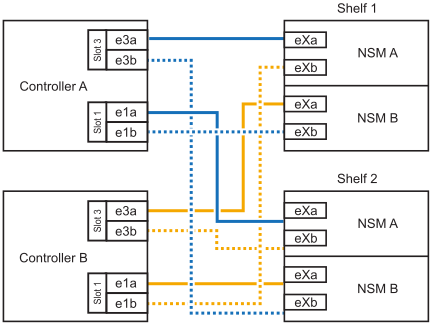

= Ein NS224 Shelf wird mit einem ASA A30 oder ASA A50 System verkabelt.
:allow-uri-read: 
:icons: font
:imagesdir: ../media/

[role="lead"]
Verkabeln Sie Ihr NS224-Shelf mit Ihrem ASA A30- oder ASA A50-System, sodass jedes Shelf zwei Verbindungen zu jedem Controller im HA-Paar hat.

Sie können bis zu zwei NS224-Einschübe im laufenden Betrieb zu einem ASA A30- oder ASA A50 HA-Paar hinzufügen, wenn zusätzlicher Speicher (zum internen Einschub) benötigt wird.

.Über diese Aufgabe
* Bei diesem Verfahren wird vorausgesetzt, dass Ihr HA-Paar nur über internen Storage verfügt (keine externen Shelfs) und dass Sie das Hinzufügen von bis zu zwei zusätzlichen Shelfs und zwei RoCE-fähigen I/O-Modulen pro Controller Hot-hinzufügen.
* Dieses Verfahren behandelt die folgenden Hot-Add-Szenarien:
+
** Hinzufügen des ersten Shelfs zu einem HA-Paar mit einem RoCE-fähigen I/O-Modul pro Controller während des laufenden Betriebs
** Hinzufügen des ersten Shelfs zu einem HA-Paar mit zwei RoCE-fähigen I/O-Modulen pro Controller und während des laufenden Betriebs
** Hot-Hinzufügen des zweiten Shelf zu einem HA-Paar mit zwei RoCE-fähigen I/O-Modulen pro Controller.

* Diese Systeme sind mit NS224-Shelfs mit NSM100-Modulen und NS224-Shelfs mit NSM100B-Modulen kompatibel. Um sicherzustellen, dass Sie die Controller mit den richtigen Ports verkabeln, ersetzen Sie das „X“ in jedem Diagramm durch die richtige Portnummer für Ihr Modul:
+
[cols="1,4"]
|===
| Modultyp | Anschlusskennzeichnung 

 a| 
NSM100
 a| 
„0“

Beispiel e0a

 a| 
NSM100B
 a| 
„1“

Z. B. e1a

|===

.Schritte
. Wenn Sie während des laufenden Betriebs ein Shelf mit einem Satz RoCE-fähiger Ports (ein RoCE-fähiges I/O-Modul) in jedem Controller-Modul hinzufügen, und dies das einzige NS224-Shelf in Ihrem HA-Paar ist, führen Sie die folgenden Teilschritte durch.
+
Andernfalls fahren Sie mit dem nächsten Schritt fort.

+

NOTE: Bei diesem Schritt wird davon ausgegangen, dass Sie das RoCE-fähige I/O-Modul in Steckplatz 3 installiert haben.

+
.. Kabel-Shelf-Port NSM A Exa zu Controller A-Steckplatz 3, Port A (e3a).
.. Kabel-Shelf-Port NSM A EXB mit Controller B-Steckplatz 3, Port b (e3b).
.. Kabel-Shelf-Port NSM B Exa zu Controller B-Steckplatz 3, Port A (e3a).
.. Kabel-Shelf-Port NSM B EXB mit Controller A-Steckplatz 3, Port b (e3b).
+
Die folgende Abbildung zeigt die Verkabelung für ein Hot-Added Shelf mit einem RoCE-fähigen I/O-Modul pro Controller-Modul:

+
image::../media/drw_ns224_g_1shelf_1card_ieops-2002.svg[Verkabelung für AFF/ASA A30,452px,AFF/ASA A50]

. Wenn Sie ein oder zwei Shelfs mit zwei Sets von RoCE-fähigen Ports (zwei RoCE-fähige I/O-Module) in jedem Controller-Modul im laufenden Betrieb hinzufügen, füllen Sie die entsprechenden Teilschritte aus.
+

NOTE: Bei diesem Schritt wird davon ausgegangen, dass Sie die RoCE-fähigen I/O-Module in den Steckplätzen 3 und 1 installiert haben.

+
[cols="1,3"]
|===
| Shelfs | Verkabelung 

 a| 
Shelf 1
 a| 
.. Kabel NSM A Port Exa zu Controller A Steckplatz 3 Port A (e3a).
.. Kabel NSM A Port EXB zu Controller B Steckplatz 1 Port b (e1b).
.. Kabel NSM B Port Exa zu Controller B Steckplatz 3 Port A (e3a).
.. Kabel NSM B Port EXB zu Controller A Steckplatz 1 Port b (e1b).
.. Wenn Sie ein zweites Regalbrett im laufenden Betrieb hinzufügen, führen Sie die Teilschritte „Regalbrett 2“ aus; andernfalls fahren Sie mit dem nächsten Schritt fort.

Die folgende Abbildung zeigt die Verkabelung für ein Hot-Added Shelf mit zwei RoCE-fähigen I/O-Modulen pro Controller-Modul:

image::../media/drw_ns224_g_1shelf_2card_ieops-2005.svg[Verkabelung für AFF/ASA A30,452px,AFF/ASA A50]

 a| 
Shelf 2
 a| 
.. Kabel NSM A Port Exa zu Controller A Steckplatz 1 Port A (e1a).
.. Kabel NSM A-Port EXB zu Controller B-Steckplatz 3 Port b (e3b).
.. Kabel NSM B Port Exa zu Controller B Steckplatz 1 Port A (e1a).
.. Verbinden Sie den NSM B-Port EXB mit Controller A-Steckplatz 3, Port b (e3b).
.. Fahren Sie mit dem nächsten Schritt fort.

Die folgende Abbildung zeigt die Verkabelung für zwei Hot-Added Shelf mit zwei RoCE-fähigen I/O-Modulen pro Controller-Modul:

|===
. Überprüfen Sie mit https://mysupport.netapp.com/site/tools/tool-eula/activeiq-configadvisor["Active IQ Config Advisor"^].
+
Wenn Verkabelungsfehler auftreten, befolgen Sie die entsprechenden Korrekturmaßnahmen.

.Wie es weiter geht
Wenn Sie die automatische Laufwerkszuordnung im Rahmen der Vorbereitung dieses Vorgangs deaktiviert haben, müssen Sie die Laufwerkszuordnung manuell vornehmen und die automatische Laufwerkszuordnung gegebenenfalls wieder aktivieren. Gehen Sie zu link:hot-add-asa-complete.html["Füllen Sie das Hot Add aus"].

Andernfalls müssen Sie das Hot-Add-Regal verwenden.
