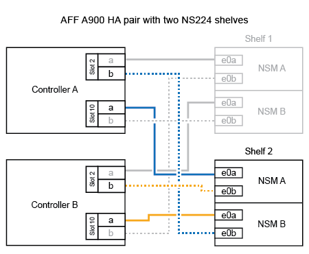
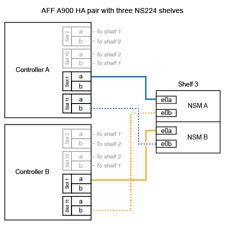

= Ein NS224 Shelf wird mit einem ASA A900 System verkabelt.
:allow-uri-read: 
:icons: font
:imagesdir: ../media/

[role="lead"]
Verbinden Sie Ihr NS224-Shelf per Kabel mit Ihrem ASA A900-System, sodass jedes Shelf über zwei Verbindungen zu jedem Controller im HA-Paar verfügt.

.Über diese Aufgabe
* Bei diesem Verfahren wird vorausgesetzt, dass Ihr HA-Paar mindestens ein vorhandenes NS224-Shelf hat und dass Sie bis zu drei zusätzliche Shelves im laufenden Betrieb hinzufügen.
* Wenn Ihr HA-Paar nur ein vorhandenes NS224-Shelf hat, wird bei diesem Verfahren vorausgesetzt, dass das Shelf über zwei RoCE-fähige 100-GbE-I/O-Module auf jedem Controller verkabelt ist.

.Schritte
. Wenn das NS224-Shelf, das Sie im Hot-Adding befinden, das zweite NS2224-Shelf im HA-Paar ist, führen Sie die folgenden Teilschritte aus.
+
Andernfalls fahren Sie mit dem nächsten Schritt fort.

+
.. Kabel-Shelf NSM A-Port e0a zu Controller A-Steckplatz 10 Port A (e10a)
.. Kabel-Shelf NSM A-Port e0b bis Controller B-Steckplatz 2 Port b (e2b)
.. Kabel-Shelf NSM B-Port e0a zu Controller B-Steckplatz 10 Port A (e10a)
.. Kabel-Shelf NSM B-Port e0b für Controller A-Steckplatz 2-Port B (e2b)
+
Die folgende Abbildung zeigt die zweite Shelf-Verkabelung (und das erste Shelf).

+

. Wenn das NS224-Shelf, das Sie im Hot-Adding befinden, das dritte NS224-Shelf im HA-Paar ist, führen Sie die folgenden Teilschritte aus.
+
Andernfalls fahren Sie mit dem nächsten Schritt fort.

+
.. Kabel-Shelf NSM A Port e0a zu Controller A-Steckplatz 1, Port A (e1a)
.. Kabel-Shelf NSM A-Port e0b zum Controller B-Steckplatz 11 Port b (e11b).
.. Kabel-Shelf NSM B-Port e0a zu Controller B, Steckplatz 1, Port A (e1a)
.. Kabel-Shelf NSM B-Port e0b zum Controller A-Steckplatz 11 Port b (e11b).
+
Die folgende Abbildung zeigt die dritte Shelf-Verkabelung.

+

. Wenn das NS224-Regal, das Sie im Hot-Adding befinden, das vierte NS224-Regal im HA-Paar ist, führen Sie die folgenden Teilschritte aus.
+
Andernfalls fahren Sie mit dem nächsten Schritt fort.

+
.. Kabel-Shelf NSM A Port e0a zu Controller A-Steckplatz 11 Port A (e11a).
.. Kabel-Shelf NSM A-Port e0b zum Controller B-Steckplatz 1 Port b (e1b).
.. Kabel-Shelf NSM B-Port e0a zu Controller B-Steckplatz 11 Port A (e11A)
.. Kabel-Shelf NSM B-Port e0b zum Controller A-Steckplatz 1 Port b (e1b).
+
Die folgende Abbildung zeigt die vierte Shelf-Verkabelung.

+
image::../media/drw_ns224_a900_4shelves.png[Verkabelung für ein AFF/ASA A900 mit vier NS224-Shelfs und vier E/A-Modulen]

. Überprüfen Sie mit https://mysupport.netapp.com/site/tools/tool-eula/activeiq-configadvisor["Active IQ Config Advisor"^].
+
Wenn Verkabelungsfehler auftreten, befolgen Sie die entsprechenden Korrekturmaßnahmen.

.Wie es weiter geht
Wenn Sie die automatische Laufwerkszuordnung im Rahmen der Vorbereitung dieses Vorgangs deaktiviert haben, müssen Sie die Laufwerkszuordnung manuell vornehmen und die automatische Laufwerkszuordnung gegebenenfalls wieder aktivieren. Gehen Sie zu link:hot-add-asa-complete.html["Füllen Sie das Hot Add aus"].

Andernfalls müssen Sie das Hot-Add-Regal verwenden.
