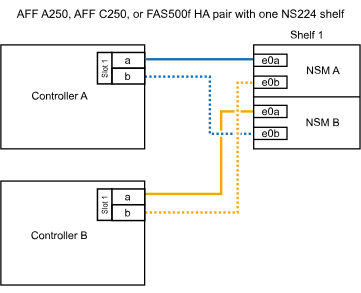

= Hot-Add-Shelf - NS224-Shelves
:allow-uri-read: 
:icons: font
:imagesdir: ../media/

[role="lead"]
Sie können ein NS224-Festplatten-Shelf im laufenden Betrieb hinzufügen, nachdem Ihr HA-Paar bestimmte Anforderungen erfüllt und nachdem die Vorbereitungsaufgaben für Ihr HA-Paar abgeschlossen wurden.

== Anforderungen für einen Hot-Add-Zusatz

Ihr HA-Paar muss bestimmte Anforderungen erfüllen, bevor ein NS2224-Laufwerk-Shelf hinzugefügt werden kann.

* Ihr Plattformmodell und Ihre ONTAP-Version müssen NS224-Shelf und Laufwerke unterstützen, die Sie hinzufügen möchten.
+
https://hwu.netapp.com["NetApp Hardware Universe"^]

* Zum Anschließen des Shelfs müssen Sie die richtige Anzahl und den richtigen Kabeltyp haben.
+
https://hwu.netapp.com["NetApp Hardware Universe"^]

* Das HA-Paar muss über genügend RoCE-fähige Ethernet-Ports verfügen, um die Anzahl der hinzuzufüenden Shelfs zu unterstützen.
+
Für jedes Shelf, das Sie Hot-hinzufügen, benötigen Sie zwei RoCE-fähige Ports auf jedem Controller. Diese Ports können je nach Plattformmodell auf den Controllern, auf RoCE-fähigen PCIe-Karten oder auf RoCE-fähigen I/O-Modulen integriert werden.

+
Wenn Ihr HA-Paar nicht über ausreichende RoCE-fähige Ports verfügt und Ihr Plattformmodell die Verwendung von RoCE-fähigen PCIe-Karten oder I/O-Modulen unterstützt, müssen Sie die zusätzlichen Karten oder I/O-Module entsprechend Ihrem Plattformmodell in die richtigen Controller-Steckplätze installiert haben.

+
** Identifizieren Sie die richtigen Controller-Steckplätze für Ihr Plattformmodell.
+
https://hwu.netapp.com["NetApp Hardware Universe"^]

** Anweisungen zur Installation der PCIe-Karte oder des E/A-Moduls finden Sie in der Dokumentation Ihres Plattformmodells.
+
https://docs.netapp.com/us-en/ontap-systems/index.html["Dokumentation zu ONTAP Hardwaresystemen"]

+
[NOTE]
====
Nicht dedizierte RoCE-fähige Ports müssen für den Storage-Einsatz konfiguriert werden (nicht für den Netzwerkeinsatz).

<<Prepare non-dedicated RoCE-capable ports for a hot-add>>

====

* Wenn Sie über ein AFF A700 HA-Paar verfügen und das erste NS224-Festplatten-Shelf während des laufenden Betrieb hinzufügen (kein NS224-Festplatten-Shelf in Ihrem HA-Paar vorhanden), müssen Sie in jedem Controller ein Core Dump-Modul (X9170A, NVMe 1 TB SSD) installiert haben, um Core Dumps zu unterstützen (speichern Sie Core-Dateien).
+
link:../fas9000/caching-module-and-core-dump-module-replace.html["Ersetzen Sie das Caching-Modul, oder fügen Sie ein Core Dump-Modul hinzu – AFF A700 und FAS9000"^]

* Ihr HA-Paar muss weniger als die maximale Anzahl von unterstützten Shelfs aufweisen, um mindestens die Anzahl der Shelves, die Sie hinzufügen möchten.
+
Sie können nach dem Hinzufügen von Shelfs nicht die Höchstzahl der von Ihrem HA-Paar unterstützten Shelfs überschritten haben.

+
https://hwu.netapp.com["NetApp Hardware Universe"^]

* Wenn Sie ein Shelf zu einem HA-Paar hinzufügen, das bereits über ein NS224-Shelf verfügt, können beim HA-Paar keine Fehlermeldungen bei der Storage-Verkabelung ausgegeben werden. Es muss als Multipath HA verkabelt werden.
+
Sie können Active IQ Config Advisor ausführen, um Fehlermeldungen bei der Storage-Verkabelung sowie die Korrekturmaßnahmen anzuzeigen, die Sie durchführen sollten.

+
https://mysupport.netapp.com/site/tools/tool-eula/activeiq-configadvisor["NetApp Downloads: Config Advisor"^]

* Sie benötigen einen Büroklammer mit einer Seite gerade oder einem schmal gekippten Kugelschreiber.
+
Zum Ändern der Shelf-ID greifen Sie mit dem Büroklammer oder Kugelschreiber auf die Shelf-ID-Taste hinter dem Bedienfeld (ODP) zu.

== Überlegungen für einen Hot-Add-Einsatz

Bevor Sie ein NS224-Festplatten-Shelf im laufenden Betrieb hinzufügen, sollten Sie sich mit Best Practices und Aspekten dieser Vorgehensweise vertraut machen.

* Wenn Sie ein ASA-HA-Paar haben, das NS224-Shelves unterstützt, können Sie dieses Verfahren verwenden.
* *Best Practice:* die beste Praxis ist, dass die aktuelle Version des Disk Qualification Package (DQP) installiert wird, bevor ein Shelf im laufenden Betrieb hinzugefügt wird.
+
Wenn die aktuelle Version des DQP installiert ist, kann Ihr System neu qualifizierte Laufwerke erkennen und verwenden. Dies verhindert, dass Systemereignimeldungen über nicht aktuelle Laufwerksinformationen verfügen und Laufwerkspartitionierung verhindern, da Laufwerke nicht erkannt werden. Das DQP benachrichtigt Sie auch über nicht aktuelle Laufwerk-Firmware.

+
https://mysupport.netapp.com/site/downloads/firmware/disk-drive-firmware/download/DISKQUAL/ALL/qual_devices.zip["NetApp Downloads: Disk Qualification Package"^]

* *Best Practice:* die beste Praxis ist, Active IQ Config Advisor vor und nach dem Hot-Adding eines Regals zu laufen.
+
Wenn Active IQ Config Advisor ausgeführt wird, bevor ein Shelf hinzugefügt wird, ist ein Schnappschuss der vorhandenen Shelf-Ethernet-Konnektivität (ENET) möglich. Es werden die NVMe Shelf-Versionen (NSM) der Firmware-Versionen überprüft und können Sie eine Shelf-ID überprüfen, die bereits im HA-Paar verwendet wird. Wenn Sie Active IQ Config Advisor nach dem Hinzufügen eines Shelfs im laufenden Betrieb ausführen, können Sie überprüfen, ob Shelfs ordnungsgemäß verkabelt sind und dass Shelf-IDs innerhalb des HA-Paars eindeutig sind.

+
https://mysupport.netapp.com/site/tools/tool-eula/activeiq-configadvisor["NetApp Downloads: Config Advisor"^]

* *Best Practice:* die beste Vorgehensweise ist, aktuelle Versionen der NSM-Firmware (NVMe Shelf Module) und der Laufwerk-Firmware auf dem System zu haben, bevor ein neues Shelf hinzugefügt wird.
+
https://mysupport.netapp.com/site/downloads/firmware/disk-shelf-firmware["NetApp Downloads: Festplatten-Shelf Firmware"^]

+
https://mysupport.netapp.com/site/downloads/firmware/disk-drive-firmware["NetApp Downloads: Festplatten-Firmware"^]

+

NOTE: Stellen Sie die Firmware nicht auf eine Version zurück, die Ihr Shelf und seine Komponenten nicht unterstützt.

* Nachdem Sie ein Shelf mit Hot-Zusatz angeschlossen haben, erkennt ONTAP das Shelf:
+
** Wenn die automatische Laufwerkszuweisung aktiviert ist, wird die Laufwerkseigentümer festgelegt.
** Die NSM Shelf- und Laufwerk-Firmware sollte bei Bedarf automatisch aktualisiert werden.
+

NOTE: Firmware-Updates können bis zu 30 Minuten dauern.

== Bereiten Sie sich auf ein Hot-Add vor

Sie müssen die Vorbereitungsaufgaben für Ihr HA-Paar abschließen, bevor Sie ein NS224-Festplatten-Shelf im laufenden Betrieb hinzufügen.

=== Bereiten Sie nicht dedizierte RoCE-fähige Ethernet-Ports für ein Hot-Add vor

Wenn das HA-Paar nicht dedizierte RoCE-fähige Ethernet-Ports aufweist, die Sie verwenden, um ein NS224-Laufwerk-Shelf im laufenden Betrieb hinzuzufügen, müssen Sie sicherstellen, dass die Ports für die Storage-Verwendung konfiguriert sind (nicht für die Netzwerkverwendung).

.Bevor Sie beginnen
Sie müssen die Anforderungen an das Storage-System erfüllt haben, einschließlich der Installation zusätzlicher RoCE-fähiger PCIe-Karten von I/O-Modulen an jedem Controller.

<<Anforderungen für einen Hot-Add-Zusatz>>

.Über diese Aufgabe
* Bei einigen Plattformmodellen wird eine RoCE-fähige PCIe-Karte oder ein I/O-Modul in einem unterstützten Steckplatz an einem Controller installiert. Die Ports werden automatisch für die Storage-Verwendung (statt für das Netzwerk) konfiguriert. Sie sollten jedoch diesen Vorgang abschließen, um zu überprüfen, ob die RoCE-fähigen Ports für die Storage-Nutzung konfiguriert sind.
* Wenn Sie feststellen, dass die nicht-dedizierten RoCE-fähigen Ports in Ihrem HA-Paar nicht für die Storage-Nutzung konfiguriert sind, ist es ein unterbrechungsfreies Konfigurieren der Ports.
+

NOTE: Wenn auf dem HA-Paar eine Version von ONTAP 9.6 ausgeführt wird, müssen Sie die Controller nacheinander neu booten.

+

NOTE: Wenn auf dem HA-Paar ONTAP 9.7 oder höher ausgeführt wird, müssen Sie die Controller nicht neu booten, es sei denn, ein oder beide Controller befinden sich im Wartungsmodus. Für diese Vorgehensweise wird vorausgesetzt, dass sich keiner der Controller im Wartungsmodus befindet.

+

NOTE: Um Ports von Storage- in Netzwerkverwendung zu ändern, geben Sie den Befehl ein, `storage port modify -node _node_name_ -port _port_name_ -mode network`.

.Schritte
. Melden Sie sich beim Cluster über SSH oder den seriellen Konsolenport an.
. Überprüfen Sie, ob die nicht dedizierten Ports im HA-Paar für den Storage konfiguriert sind: `storage port show`
+
Wenn auf Ihrem HA-Paar ONTAP 9.8 oder höher ausgeführt wird, werden die nicht dedizierten Ports angezeigt `storage` Im `Mode` Spalte.

+
Wenn auf dem HA-Paar ONTAP 9.7 oder 9.6 ausgeführt wird, werden die nicht-dedizierten Ports, die angezeigt werden `false` Im `Is Dedicated?` Spalte, auch anzeigen `enabled` Im `State` Spalte.

. Wenn die nicht dedizierten Ports für die Speichernutzung konfiguriert sind, gehen Sie wie folgt vor.
+
Andernfalls müssen Sie die Ports konfigurieren, indem Sie die Schritte 4 bis 7 ausführen.

+
[NOTE]
====
Wenn keine dedizierten Ports für den Storage konfiguriert sind, wird in der Befehlsausgabe Folgendes angezeigt:

Wenn auf Ihrem HA-Paar ONTAP 9.8 oder höher ausgeführt wird, werden die nicht dedizierten Ports angezeigt `network` Im `Mode` Spalte.

Wenn auf dem HA-Paar ONTAP 9.7 oder 9.6 ausgeführt wird, werden die nicht-dedizierten Ports, die angezeigt werden `false` Im `Is Dedicated?`` Spalte, auch anzeigen `disabled` Im `State` Spalte.

====
. Konfigurieren Sie die nicht dedizierten Ports für die Speichernutzung auf einem der Controller-Module:
+
Sie müssen den entsprechenden Befehl für jeden zu konfigurierende Port wiederholen.

+
[cols="1,3"]
|===
| Wenn Ihr HA-Paar läuft... | Dann... 

 a| 
ONTAP 9.8 oder höher
 a| 
`storage port modify -node _node_name_ -port _port_name_ -mode storage`

 a| 
ONTAP 9.7 oder 9.6
 a| 
`storage port enable -node _node_name_ -port _port_name_`

|===
. Wenn auf Ihrem HA-Paar ONTAP 9.6 ausgeführt wird, booten Sie das Controller-Modul neu, damit die Port-Änderungen wirksam werden: `system node reboot -node _node_name_ -reason _reason_for_the_reboot_`.
+
Andernfalls fahren Sie mit dem nächsten Schritt fort.

+

NOTE: Der Neustart kann bis zu 15 Minuten dauern.

. Wiederholen Sie die Schritte für das zweite Controller-Modul:
+
[cols="1,3"]
|===
| Wenn Ihr HA-Paar läuft... | Dann... 

 a| 
ONTAP 9.7 oder höher
 a| 
.. Wiederholen Sie Schritt 4.
.. Fahren Sie mit Schritt 7 fort.

 a| 
ONTAP 9.6
 a| 
.. Wiederholen Sie die Schritte 4 und 5.
+

NOTE: Der erste Controller muss den Neustart bereits abgeschlossen haben.

.. Fahren Sie mit Schritt 7 fort.

|===
. Vergewissern Sie sich, dass die nicht dedizierten Ports beider Controller-Module für den Storage konfiguriert sind: `storage port show`
+
Sie können den Befehl an einem der Controller-Module eingeben.

+
Wenn auf Ihrem HA-Paar ONTAP 9.8 oder höher ausgeführt wird, werden die nicht dedizierten Ports angezeigt `storage` Im `Mode` Spalte.

+
Wenn auf dem HA-Paar ONTAP 9.7 oder 9.6 ausgeführt wird, werden die nicht-dedizierten Ports, die angezeigt werden `false` Im `Is Dedicated?` Spalte, auch anzeigen `enabled` Im `State` Spalte.

=== Bereiten Sie die vorhandene Shelf-Konnektivität vor, bevor Sie zusätzliche Shelfs während des laufenden Betrieb hinzufügen

Bevor Sie zusätzliche Shelfs während des laufenden Betriebs hinzufügen können, müssen Sie je nach Plattformmodell möglicherweise ein vorhandenes Shelf (nachdem die zusätzlichen RoCE-fähigen PCIe-Karten oder I/O-Module installiert wurden) über zwei Portsätze in unterschiedlichen Steckplätzen hinweg neu ausstatten, um eine Ausfallsicherheit bei Steckplatzausfällen zu gewährleisten.

.Bevor Sie beginnen
* Sie müssen die Systemvoraussetzungen erfüllen, einschließlich der Installation zusätzlicher RoCE-fähiger PCIe-Karten oder I/O-Module in jedem Controller.
+
<<Anforderungen für einen Hot-Add-Zusatz>>

* Sie müssen die nicht dedizierten Ports auf den RoCE-fähigen PCIe-Karten oder die von Ihnen installierten I/O-Module für die Storage-Verwendung überprüft haben.
+
<<Prepare non-dedicated RoCE-capable ports for a hot-add>>

.Über diese Aufgabe
* Die Neuverkabeln von Port-Verbindungen ist ein unterbrechungsfreies Verfahren, wenn Ihr Shelf über Multipath-HA-Konnektivität verfügt.
* Sie verschieben jeweils ein Kabel, um während dieses Vorgangs immer die Konnektivität zum Shelf aufrechtzuerhalten.
+

NOTE: Beim Anschließen eines Kabels muss zwischen dem Abziehen des Kabels von einem Anschluss und dem Anschließen an einen anderen Anschluss keine Wartezeit mehr Zeit in Anspruch genommen werden.

* Wenn Sie über ein AFF A1K HA-Paar verfügen und während des Betriebs ein drittes Shelf hinzufügen und ein drittes oder vorges RoCE-fähiges I/O-Modul in jeden Controller installieren, ist das dritte Shelf nur mit den dritten oder dritten und vierten I/O-Modulen verbunden. Sie müssen keine vorhandenen Shelfs erneut vertragen.

.Schritte
. Vorhandene Shelf-Verbindungen können gegebenenfalls über zwei Sätze RoCE-fähiger Ports in verschiedenen Steckplätzen zurückgeführt werden.
+
[cols="1,3"]
|===
| Wenn Sie eine... | Dann... 

 a| 
AFF A70 oder AFF A90 HA-Paar und Sie fügen im laufenden Betrieb ein zweites Shelf hinzu
 a| 
Erstes Shelf über beide RoCE-fähigen I/O-Module hinweg zurückrüsten:

NOTE: Die Teilschritte gehen davon aus, dass das vorhandene Shelf an jedem Controller mit einem RoCE-fähigen I/O-Modul in Steckplatz 11 verbunden ist.

.. Bewegen Sie das Kabel an Controller A von Steckplatz 11 Port b (e11b) in Steckplatz 8 Port b (e8b).
.. Wiederholen Sie das gleiche Kabel, um es bei Controller B zu bewegen
+
[NOTE]
====
Bei Bedarf können Sie Verkabelungsillustrationen, die ein vorhandenes einzelnes Shelf und das neu verkabelte Shelf in einer zwei-Shelf-Konfiguration zeigen, referenzieren.

<<Verkabeln Sie ein Hot-Add-Shelf mit einem AFF A70- oder AFF A90 HA-Paar>>

====

 a| 
AFF A1K HA-Paar und fügen beim laufenden Betrieb ein zweites Shelf hinzu
 a| 
Erstes Shelf über beide RoCE-fähigen I/O-Module hinweg zurückrüsten:

NOTE: Die Teilschritte gehen davon aus, dass das vorhandene Shelf an jedem Controller mit einem RoCE-fähigen I/O-Modul in Steckplatz 11 verbunden ist.

.. Bewegen Sie das Kabel an Controller A von Steckplatz 11 Port b (e11b) in Steckplatz 10 Port b (e10b).
.. Wiederholen Sie das gleiche Kabel, um es bei Controller B zu bewegen
+
[NOTE]
====
Bei Bedarf können Sie Verkabelungsillustrationen, die ein vorhandenes einzelnes Shelf und das neu verkabelte Shelf in einer zwei-Shelf-Konfiguration zeigen, referenzieren.

<<Verkabeln Sie ein Hot-Add-Shelf für ein AFF A1K HA-Paar>>

====

 a| 
AFF A1K HA-Paar und Sie fügen ein zweites Shelf hinzu
 a| 
Wiederbesorgen des dritten Shelfs über die R0CE-fähigen I/O-Module in Steckplatz 9 an jedem Controller:

.. Bewegen Sie das Kabel an Controller A von Steckplatz 9 Port b (e9b) in Steckplatz 8 Port b (e8b).
.. Wiederholen Sie das gleiche Kabel, um es bei Controller B zu bewegen
+
[NOTE]
====
Bei Bedarf können Sie Verkabelungsillustrationen, die ein vorhandenes einzelnes Shelf und das neu verkabelte Shelf in einer zwei-Shelf-Konfiguration zeigen, referenzieren.

<<Verkabeln Sie ein Hot-Add-Shelf für ein AFF A1K HA-Paar>>

====

 a| 
AFF C400 HA-Paar und Sie fügen im laufenden Betrieb ein zweites Shelf hinzu
 a| 
Wiederbesorgen des ersten Shelf über beide RoCE-fähigen Ports auf jedem Controller:

.. Bringen Sie das Kabel an Controller A von Steckplatz 4 Port A (e4a) in Steckplatz 5 Port b (e5b).
.. Wiederholen Sie das gleiche Kabel, um es bei Controller B zu bewegen
+
[NOTE]
====
Bei Bedarf können Sie Verkabelungsabbildungen mit einem vorhandenen Single Shelf und dem neu ablsierten Shelf in einer 2-Shelf-Konfiguration verwenden.

<<Verkabeln Sie ein Hot-Add-Shelf für ein AFF C400 HA-Paar>>

====

 a| 
AFF A800 oder AFF C800 HA-Paar: Sie fügen ein zweites Shelf hinzu
 a| 
Wiederbesorgen des ersten Shelf über beide RoCE-fähigen Ports auf jedem Controller:

NOTE: Die Unterschritte gehen davon aus, dass das vorhandene Shelf in jedem Controller-Steckplatz 5 mit RoCE-fähigen PCIe-Karten verbunden ist.

.. Bewegen Sie das Kabel an Controller A von Steckplatz 5 Port b (e5b) in Steckplatz 3 Port b (e3b).
.. Wiederholen Sie das gleiche Kabel, um es bei Controller B zu bewegen
+
[NOTE]
====
Bei Bedarf können Sie Verkabelungsabbildungen mit einem vorhandenen Single Shelf und dem neu ablsierten Shelf in einer 2-Shelf-Konfiguration verwenden.

<<Verkabeln Sie ein Hot-Add-Shelf mit einem AFF A800- oder AFF C800 HA-Paar>>

====

 a| 
AFF A400 HA-Paar und Sie fügen während des laufenden Betrieb ein zweites Shelf hinzu
 a| 
Wiederbesorgen des ersten Shelf über beide RoCE-fähigen Ports auf jedem Controller:

.. Bewegen Sie das Kabel an Controller A von Port e0d nach Steckplatz 5 Port b (e5b).
.. Wiederholen Sie das gleiche Kabel, um es bei Controller B zu bewegen
+
[NOTE]
====
Bei Bedarf können Sie Verkabelungsabbildungen mit einem vorhandenen Single Shelf und dem neu ablsierten Shelf in einer 2-Shelf-Konfiguration verwenden.

<<Verkabeln Sie ein Hot-Add-Shelf für ein AFF A400 HA-Paar>>

====

 a| 
AFF A700 HA-Paar: Sie fügen ein zweites Shelf hinzu
 a| 
Wiederbesorgen des ersten Shelf über beide RoCE-fähigen Ports auf jedem Controller:

NOTE: Die Unterschritte setzen voraus, dass das vorhandene Shelf in Steckplatz 3 an jedem Controller mit RoCE-fähigen I/O-Modulen verbunden ist.

.. Stellen Sie am Controller A das Kabel von Steckplatz 3 Port b (e3b) in Steckplatz 7 Port b (e7b) um.
.. Wiederholen Sie das gleiche Kabel, um es bei Controller B zu bewegen
+
[NOTE]
====
Bei Bedarf können Sie Verkabelungsabbildungen mit einem vorhandenen Single Shelf und dem neu ablsierten Shelf in einer 2-Shelf-Konfiguration verwenden.

<<Verkabeln Sie ein Hot-Add-Shelf für ein AFF A700 HA-Paar>>

====

|===
. Stellen Sie sicher, dass das neu abltierte Shelf ordnungsgemäß verkabelt ist.
+
Wenn Verkabelungsfehler auftreten, befolgen Sie die entsprechenden Korrekturmaßnahmen.

+
https://mysupport.netapp.com/site/tools/tool-eula/activeiq-configadvisor["NetApp Downloads: Config Advisor"^]

=== Bereiten Sie sich darauf vor, das Laufwerk manuell einem Hot-Add-Vorgang zuzuweisen

Wenn Sie für das NS224-Festplatten-Shelf, das Sie im laufenden Betrieb hinzufügen, manuell Laufwerk-Eigentumsrechte zuweisen, müssen Sie die automatische Laufwerkszuweisung deaktivieren, wenn diese aktiviert ist.

.Bevor Sie beginnen
Sie müssen die Systemanforderungen erfüllt haben.

<<Anforderungen für einen Hot-Add-Zusatz>>

.Über diese Aufgabe
Wenn Sie sich nicht sicher sind, ob Sie die Laufwerkeigentümer manuell zuweisen sollten oder die automatische Zuweisung von Festplatteneigentum für Ihr Storage-System verstehen möchten, lesen Sie https://docs.netapp.com/us-en/ontap/disks-aggregates/disk-autoassignment-policy-concept.html["Allgemeines zur automatischen Zuweisung der Festplatteneigentümer"^]

.Schritte
. Überprüfen Sie, ob die automatische Laufwerkszuweisung aktiviert ist: `storage disk option show`
+
Sie können für beide Nodes den Befehl eingeben.

+
Wenn die automatische Laufwerkszuordnung aktiviert ist, wird die Ausgabe in der Spalte (für jeden Node) angezeigt `on` `Auto Assign` .

. Wenn die automatische Laufwerkszuweisung aktiviert ist, deaktivieren Sie sie: `storage disk option modify -node _node_name_ -autoassign off`
+
Sie müssen die automatische Laufwerkszuweisung auf beiden Nodes deaktivieren.

== Installieren Sie ein Shelf für ein Hot-Add-System

Beim Installieren eines neuen NS224-Shelf wird das Shelf in einem Rack oder Schrank installiert, die Netzkabel (die das Shelf automatisch einschalten) angeschlossen und anschließend die Shelf-ID festgelegt.

.Bevor Sie beginnen
* Stellen Sie sicher, dass Sie eine Büroklammer mit einer begradigten Seite oder einen Kugelschreiber mit schmaler Spitze haben.
+
Während des Shelf-ID-Schritts können Sie mit der Büroklammer oder dem Kugelschreiber auf die Shelf-ID-Taste hinter dem Bedienfeld (ODP) zugreifen.

.Schritte
. Installieren Sie das im Lieferumfang des Regals beiliegende Schienensatz mithilfe des im Lieferumfang enthaltenen Installationsflyer.
+

NOTE: Montieren Sie das Regal nicht mit einem Flansch.

. Montieren und befestigen Sie das Regal mithilfe des Installationsflyers an den Halterungen und Rack oder Schrank.
+

NOTE: Ein voll beladenes NS224-Regal kann bis zu 66.78 kg (30.29 kg) wiegen und erfordert zwei Personen, um einen hydraulischen Aufzug zu heben oder zu verwenden. Entfernen Sie keine Regalkomponenten (von der Vorder- oder Rückseite des Regals), um das Gewicht des Regals zu verringern, da das Regalgewicht unausgeglichen wird.

. Schließen Sie die Netzkabel an das Shelf an, befestigen Sie sie mit der Netzkabelhalterung, wenn es sich um Wechselstrom-Netzteile handelt, oder mit den zwei Flügelschrauben, wenn es sich um Gleichstromnetzteile handelt. Schließen Sie dann die Netzkabel aus Stabilitätsausschluss an verschiedene Stromquellen an.
+
Ein Shelf schaltet sich ein, wenn es mit einer Stromquelle verbunden ist. Es verfügt nicht über Netzschalter. Bei ordnungsgemäßer Funktion leuchtet die zweifarbige LED des Netzteils grün.

. Legen Sie die Shelf-ID auf eine Nummer fest, die innerhalb des HA-Paars eindeutig ist:
+
Weitere Anweisungen finden Sie unter:

+
link:change-shelf-id.html["Shelf-ID ändern – NS224-Einschübe"^]

+
.. Entfernen Sie die linke Endkappe, und suchen Sie die kleine Öffnung rechts neben den LEDs.
.. Setzen Sie das Ende einer Büroklammer oder eines ähnlichen Werkzeugs in die kleine Öffnung ein, um die Shelf-ID-Taste zu erreichen.
.. Halten Sie die Taste (bis zu 15 Sekunden lang) gedrückt, bis die erste Ziffer auf der digitalen Anzeige blinkt. Lassen Sie dann die Taste los.
+

NOTE: Wenn die ID länger als 15 Sekunden dauert, halten Sie die Taste erneut gedrückt, und drücken Sie sie vollständig.

.. Drücken Sie die Taste und lassen Sie sie los, um die Nummer so lange zu drücken, bis Sie die gewünschte Zahl von 0 auf 9 erreicht haben.
.. Wiederholen Sie die Unterschritte 4c und 4d, um die zweite Nummer der Shelf-ID festzulegen.
+
Es kann bis zu drei Sekunden (statt 15 Sekunden) dauern, bis die Ziffer blinkt.

.. Halten Sie die Taste gedrückt, bis die zweite Ziffer nicht mehr blinkt.
+
Nach etwa fünf Sekunden beginnen beide Ziffern zu blinken, und die gelbe LED am ODP leuchtet auf.

.. Schalten Sie das Shelf aus und wieder ein, damit die Shelf-ID übernommen wird.
+
Sie müssen beide Netzkabel aus dem Regal ziehen, 10 Sekunden warten und dann wieder anschließen.

+
Wenn die Stromversorgung wiederhergestellt ist, leuchten die LEDs mit zweifarbigen LEDs grün.

== Verkabeln Sie ein Shelf für ein Hot-Add-Gehäuse

Sie verkabeln jedes NS224-Shelf, das Sie im laufenden Betrieb hinzufügen, so dass jedes Shelf über zwei Verbindungen mit jedem Controller im HA-Paar verfügt.

=== Überlegungen bei der Verkabelung für ein Hot-Add-Kabel

Vor der Verkabelung Ihres hot-added Shelfs können Sie sich mit der richtigen Ausrichtung des Kabelsteckers und der Position und Beschriftung der Anschlüsse an den NS224 NSM-Shelf-Modulen vertraut machen.

* Die Kabel werden mit der Zuglasche des Steckers nach oben eingesetzt.
+
Wenn ein Kabel richtig eingesetzt wird, klickt es an seine Stelle.

+
Nachdem Sie beide Enden des Kabels angeschlossen haben, leuchten die LEDs für Shelf und Controller-Port LNK (grün) auf. Wenn eine LNK-LED-Schnittstelle nicht leuchtet, setzen Sie das Kabel wieder ein.

+
image::../media/oie_cable_pull_tab_up.png[Kabelanschluss mit Zuglasche oben]

* Die folgende Abbildung hilft Ihnen bei der physischen Identifizierung der Shelf-Ports NSM100, e0a und e0b.
+
Ein NS224-Shelf enthält zwei NSM100-Module. Das obere Modul befindet sich in Steckplatz A (NSM A) und das untere Modul in Steckplatz B (NSM B).

+
Jedes NSM100-Modul enthält 2 x 100-GbE-QSFP28-Ports: e0a und e0b.

+
image::../media/drw_ns224_back_ports.png[NS224 NSM100-Modulports e0a und e0b]

=== Verkabeln Sie ein Hot-Add-Shelf mit einem AFF A70- oder AFF A90 HA-Paar

Wenn zusätzlicher Storage (zum internen Shelf) benötigt wird, können Sie im laufenden Betrieb bis zu zwei NS224 Shelfs zu einem AFF A70 oder AFF A90 HA-Paar hinzufügen.

.Bevor Sie beginnen
* Sie müssen die Anforderungen an das Storage-System erfüllt haben.

<<Anforderungen für einen Hot-Add-Zusatz>>

* Sie müssen die entsprechenden Vorbereitungsverfahren abgeschlossen haben.

<<Bereiten Sie sich auf ein Hot-Add vor>>

* Sie müssen die Shelfs installiert und eingeschaltet sowie die Shelf-IDs festlegen.

<<Installieren Sie ein Shelf für ein Hot-Add-System>>

.Über diese Aufgabe
* Bei diesem Verfahren wird vorausgesetzt, dass Ihr HA-Paar nur über internen Storage verfügt (keine externen Shelfs) und dass Sie Hot-Hinzufügen von bis zu zwei zusätzlichen Shelfs und zwei RoCE-fähigen I/O-Modulen pro Controller durchführen.
* Dieses Verfahren behandelt die folgenden Hot-Add-Szenarien:
+
** Hinzufügen des ersten Shelfs zu einem HA-Paar mit einem RoCE-fähigen I/O-Modul pro Controller während des laufenden Betriebs
** Hinzufügen des ersten Shelfs zu einem HA-Paar mit zwei RoCE-fähigen I/O-Modulen pro Controller und während des laufenden Betriebs
** Hot-Hinzufügen des zweiten Shelf zu einem HA-Paar mit zwei RoCE-fähigen I/O-Modulen pro Controller.

.Schritte
. Wenn Sie während des laufenden Betriebs ein Shelf mit einem Satz RoCE-fähiger Ports (ein RoCE-fähiges I/O-Modul) in jedem Controller-Modul hinzufügen, und dies das einzige NS224-Shelf in Ihrem HA-Paar ist, führen Sie die folgenden Teilschritte durch.
+
Andernfalls fahren Sie mit dem nächsten Schritt fort.

+

NOTE: Bei diesem Schritt wird davon ausgegangen, dass Sie das RoCE-fähige I/O-Modul in Steckplatz 11 installiert haben.

+
.. Kabel-Shelf NSM A Port e0a zu Controller A-Steckplatz 11 Port A (e11a).
.. Kabel-Shelf NSM A-Port e0b zum Controller B-Steckplatz 11 Port b (e11b).
.. Kabel-Shelf NSM B-Port e0a zu Controller B-Steckplatz 11 Port A (e11A)
.. Kabel-Shelf NSM B-Port e0b zum Controller A-Steckplatz 11 Port b (e11b).
+
Die folgende Abbildung zeigt die Verkabelung für ein Hot-Added Shelf mit einem RoCE-fähigen I/O-Modul pro Controller-Modul:

+
image::../media/drw_ns224_vino_i_1shelf_1card_ieops-1639.svg[Verkabelung für AFF A70 oder A90 mit einem Shelf und einem IO-Modul]

. Wenn Sie ein oder zwei Shelfs mit zwei Sets von RoCE-fähigen Ports (zwei RoCE-fähige I/O-Module) in jedem Controller-Modul im laufenden Betrieb hinzufügen, füllen Sie die entsprechenden Teilschritte aus.
+

NOTE: Bei diesem Schritt wird davon ausgegangen, dass Sie die RoCE-fähigen I/O-Module in den Steckplätzen 11 und 8 installiert haben.

+
[cols="1,3"]
|===
| Shelfs | Verkabelung 

 a| 
Shelf 1
 a| 
.. Verkabeln Sie den NSM A-Port e0a mit dem Controller A-Steckplatz 11, Port A (e11a).
.. Verkabeln Sie den NSM A-Port e0b mit Controller B-Steckplatz 8, Port b (e8b).
.. Verbinden Sie den NSM B-Port e0a mit Controller B-Steckplatz 11, Port A (e11a).
.. Verkabeln Sie den NSM B-Port e0b mit Controller A-Steckplatz 8, Port b (e8b).
.. Wenn Sie ein zweites Regal heizen, füllen Sie die Unterschritte "`Shelf 2`" aus; andernfalls fahren Sie mit Schritt 3 fort.

Die folgende Abbildung zeigt die Verkabelung für ein Hot-Added Shelf mit zwei RoCE-fähigen I/O-Modulen pro Controller-Modul:

image::../media/drw_ns224_vino_i_1shelf_2cards_ieops-1640.svg[Verkabelung für AFF A70 oder A90 mit einem Shelf und zwei IO-Modulen]

 a| 
Shelf 2
 a| 
.. Verkabeln Sie den NSM A-Port e0a mit dem Controller A-Steckplatz 8, Port A (e8a).
.. Verkabeln Sie den NSM A-Port e0b mit Controller B-Steckplatz 11, Port b (e11b).
.. Verbinden Sie den NSM B-Port e0a mit Controller B-Steckplatz 8, Port A (e8a).
.. Verkabeln Sie den NSM B-Port e0b mit Controller A-Steckplatz 11, Port b (e11b).
.. Fahren Sie mit Schritt 3 fort.

Die folgende Abbildung zeigt die Verkabelung für zwei Hot-Added Shelf mit zwei RoCE-fähigen I/O-Modulen pro Controller-Modul:

image::../media/drw_ns224_vino_i_2shelves_2cards_ieops-1641.svg[Verkabelung für AFF A70 oder A90 mit zwei Einschüben und zwei IO-Modulen]

|===
. Stellen Sie sicher, dass das Hot-Added Shelf ordnungsgemäß verkabelt ist.
+
Wenn Verkabelungsfehler auftreten, befolgen Sie die entsprechenden Korrekturmaßnahmen.

+
https://mysupport.netapp.com/site/tools/tool-eula/activeiq-configadvisor["NetApp Downloads: Config Advisor"^]

. Wenn Sie die automatische Laufwerkszuweisung als Teil der Vorbereitung für dieses Verfahren deaktiviert haben, müssen Sie manuell die Laufwerkseigentümer festlegen und die automatische Laufwerkszuweisung ggf. erneut aktivieren.
+
Andernfalls werden Sie mit diesem Verfahren durchgeführt.

+
<<Füllen Sie das Hot Add aus>>

=== Verkabeln Sie ein Hot-Add-Shelf für ein AFF A1K HA-Paar

Bei laufendem Betrieb können Sie bis zu drei zusätzliche NS224 Shelfs (also insgesamt vier Shelfs) zu einem AFF A1K HA-Paar hinzufügen.

.Bevor Sie beginnen
* Sie müssen die Anforderungen an das Storage-System erfüllt haben.

<<Anforderungen für einen Hot-Add-Zusatz>>

* Sie müssen die entsprechenden Vorbereitungsverfahren abgeschlossen haben.

<<Bereiten Sie sich auf ein Hot-Add vor>>

* Sie müssen die Shelfs installiert und eingeschaltet sowie die Shelf-IDs festlegen.

<<Installieren Sie ein Shelf für ein Hot-Add-System>>

.Über diese Aufgabe
* Bei dieser Vorgehensweise wird vorausgesetzt, dass Ihr HA-Paar mindestens ein vorhandenes NS224-Shelf hat.
* Dieses Verfahren behandelt die folgenden Hot-Add-Szenarien:
+
** Hinzufügen eines zweiten Shelf zu einem HA-Paar mit zwei RoCE-fähigen I/O-Modulen pro Controller während des laufenden Betriebs. (Sie haben ein zweites I/O-Modul installiert und das erste Shelf beiden I/O-Modulen erneut verkabelt oder das erste Shelf bereits mit zwei I/O-Modulen verkabelt. Sie verbinden das zweite Shelf mit beiden I/O-Modulen.)
** Hinzufügen eines dritten Shelf zu einem HA-Paar mit drei RoCE-fähigen I/O-Modulen pro Controller und während des laufenden Betriebs. (Sie haben ein drittes I/O-Modul installiert und verkabeln das dritte Shelf nur mit dem dritten I/O-Modul.)
** Hinzufügen eines dritten Shelf zu einem HA-Paar mit vier RoCE-fähigen I/O-Modulen pro Controller während des laufenden Betriebs (Sie haben ein drittes und viertes I/O-Modul installiert und verbinden das dritte Shelf mit dem dritten und vierten I/O-Modul).
** Hinzufügen eines vierten Shelfs zu einem HA-Paar mit vier RoCE-fähigen I/O-Modulen pro Controller während des laufenden Betriebs (Sie haben ein viertes I/O-Modul installiert und das dritte Shelf erneut mit den dritten und vierten I/O-Modulen verbunden oder das dritte Shelf bereits mit den dritten und vierten I/O-Modulen verkabelt. Sie verbinden das vierte Shelf mit dem dritten und vierten I/O-Modul).

.Schritte
. Wenn das NS224-Shelf, das Sie im Hot-Adding befinden, das zweite NS2224-Shelf im HA-Paar ist, führen Sie die folgenden Teilschritte aus.
+
Andernfalls fahren Sie mit dem nächsten Schritt fort.

+
.. Kabel-Shelf NSM A-Port e0a zu Controller A-Steckplatz 10 Port A (e10a)
.. Kabel-Shelf NSM A-Port e0b zum Controller B-Steckplatz 11 Port b (e11b).
.. Kabel-Shelf NSM B-Port e0a zu Controller B-Steckplatz 10 Port A (e10a)
.. Kabel-Shelf NSM B-Port e0b zum Controller A-Steckplatz 11 Port b (e11b).
+
In der folgenden Abbildung ist die Verkabelung des zweiten Shelf im HA-Paar mit zwei RoCE-fähigen I/O-Modulen pro Controller hervorgehoben:

+
image::../media/drw_ns224_vino_m_2shelves_2cards_ieops-1642.svg[Verkabelung für AFF A1K mit zwei Shelfs und zwei I/O-Modulen]

. Wenn das NS224-Shelf das dritte NS224-Shelf im HA-Paar mit drei RoCE-fähigen I/O-Modulen pro Controller ist, führen Sie die folgenden Teilschritte durch. Andernfalls fahren Sie mit dem nächsten Schritt fort.
+
.. Verkabeln Sie das Shelf NSM A-Port e0a mit Controller A, Steckplatz 9, Port A (e9a).
.. Verkabeln Sie den Port e0b des Shelf NSM A mit Controller B-Steckplatz 9, Port b (e9b).
.. Verkabeln Sie den Shelf NSM B-Port e0a mit Controller B-Steckplatz 9, Port A (e9a).
.. Verkabeln Sie den Shelf NSM B-Port e0b mit Controller A-Steckplatz 9, Port b (e9b).
+
In der folgenden Abbildung ist die Verkabelung des dritten Shelf im HA-Paar mit drei RoCE-fähigen I/O-Modulen pro Controller hervorgehoben:

+
image::../media/drw_ns224_vino_m_3shelves_3cards_ieops-1643.svg[Verkabelung für AFF A1K mit drei Shelfs und drei IO-Modulen]

. Wenn das NS224-Shelf das dritte NS224-Shelf im HA-Paar mit vier RoCE-fähigen I/O-Modulen pro Controller ist, führen Sie die folgenden Teilschritte durch. Andernfalls fahren Sie mit dem nächsten Schritt fort.
+
.. Verkabeln Sie das Shelf NSM A-Port e0a mit Controller A, Steckplatz 9, Port A (e9a).
.. Verkabeln Sie den Port e0b des Shelf NSM A mit Controller B-Steckplatz 8, Port b (e8b).
.. Verkabeln Sie den Shelf NSM B-Port e0a mit Controller B-Steckplatz 9, Port A (e9a).
.. Verkabeln Sie den Shelf NSM B-Port e0b mit Controller A-Steckplatz 8, Port b (e8b).
+
In der folgenden Abbildung ist die Verkabelung des dritten Shelf im HA-Paar mit vier RoCE-fähigen I/O-Modulen pro Controller hervorgehoben:

+
image::../media/drw_ns224_vino_m_3shelves_4cards_ieops-1644.svg[Verkabelung für AFF A1K mit drei Shelfs und vier I/O-Modulen]

. Wenn das NS224-Shelf, das Sie beim Hinzufügen verwenden, das vierte NS224-Shelf im HA-Paar mit vier RoCE-fähigen I/O-Modulen pro Controller ist, führen Sie die folgenden Teilschritte durch.
+
.. Verkabeln Sie das Shelf NSM A-Port e0a mit Controller A, Steckplatz 8, Port A (e8a).
.. Verkabeln Sie den Port e0b des Shelf NSM A mit Controller B-Steckplatz 9, Port b (e9b).
.. Verkabeln Sie den Shelf NSM B-Port e0a mit Controller B-Steckplatz 8, Port A (e8a).
.. Verkabeln Sie den Shelf NSM B-Port e0b mit Controller A-Steckplatz 9, Port b (e9b).
+
In der folgenden Abbildung ist die Verkabelung für das vierte Shelf im HA-Paar mit vier RoCE-fähigen I/O-Modulen pro Controller hervorgehoben:

+
image::../media/drw_ns224_vino_m_4shelves_4cards_ieops-1645.svg[Verkabelung für AFF A1K mit vier Shelfs und vier I/O-Modulen]

. Stellen Sie sicher, dass das Hot-Added Shelf ordnungsgemäß verkabelt ist.
+
Wenn Verkabelungsfehler auftreten, befolgen Sie die entsprechenden Korrekturmaßnahmen.

+
https://mysupport.netapp.com/site/tools/tool-eula/activeiq-configadvisor["NetApp Downloads: Config Advisor"^]

. Wenn Sie die automatische Laufwerkszuweisung als Teil der Vorbereitung für dieses Verfahren deaktiviert haben, müssen Sie manuell die Laufwerkseigentümer festlegen und die automatische Laufwerkszuweisung ggf. erneut aktivieren.
+
Andernfalls werden Sie mit diesem Verfahren durchgeführt.

+
<<Füllen Sie das Hot Add aus>>

=== Verkabeln Sie ein Hot-Add-Shelf für ein AFF A900 HA-Paar

Wenn zusätzlicher Speicher benötigt wird, können Sie bis zu drei zusätzliche NS224 Laufwerk-Shelves (insgesamt vier Shelves) zu einem AFF A900 HA-Paar hinzufügen.

.Bevor Sie beginnen
* Sie müssen die Systemanforderungen erfüllt haben.
+
<<Anforderungen für einen Hot-Add-Zusatz>>

* Sie müssen die entsprechenden Vorbereitungsverfahren abgeschlossen haben.
+
<<Bereiten Sie sich auf ein Hot-Add vor>>

* Sie müssen die Shelfs installiert und eingeschaltet sowie die Shelf-IDs festlegen.
+
<<Install a drive shelf for a hot-add>>

.Über diese Aufgabe
* Bei diesem Verfahren wird vorausgesetzt, dass Ihr HA-Paar mindestens ein vorhandenes NS224-Shelf hat und dass Sie bis zu drei zusätzliche Shelves im laufenden Betrieb hinzufügen.
* Wenn Ihr HA-Paar nur ein vorhandenes NS224-Shelf hat, wird bei diesem Verfahren vorausgesetzt, dass das Shelf über zwei RoCE-fähige 100-GbE-I/O-Module auf jedem Controller verkabelt ist.

.Schritte
. Wenn das NS224-Shelf, das Sie im Hot-Adding befinden, das zweite NS2224-Shelf im HA-Paar ist, führen Sie die folgenden Teilschritte aus.
+
Andernfalls fahren Sie mit dem nächsten Schritt fort.

+
.. Kabel-Shelf NSM A-Port e0a zu Controller A-Steckplatz 10 Port A (e10a)
.. Kabel-Shelf NSM A-Port e0b bis Controller B-Steckplatz 2 Port b (e2b)
.. Kabel-Shelf NSM B-Port e0a zu Controller B-Steckplatz 10 Port A (e10a)
.. Kabel-Shelf NSM B-Port e0b für Controller A-Steckplatz 2-Port B (e2b)

+
Die folgende Abbildung zeigt die zweite Shelf-Verkabelung (und das erste Shelf).

+
image::../media/drw_ns224_a900_2shelves.png[drw ns224 a900 2Shelves]

. Wenn das NS224-Shelf, das Sie im Hot-Adding befinden, das dritte NS224-Shelf im HA-Paar ist, führen Sie die folgenden Teilschritte aus.
+
Andernfalls fahren Sie mit dem nächsten Schritt fort.

+
.. Kabel-Shelf NSM A Port e0a zu Controller A-Steckplatz 1, Port A (e1a)
.. Kabel-Shelf NSM A-Port e0b zum Controller B-Steckplatz 11 Port b (e11b).
.. Kabel-Shelf NSM B-Port e0a zu Controller B, Steckplatz 1, Port A (e1a)
.. Kabel-Shelf NSM B-Port e0b zum Controller A-Steckplatz 11 Port b (e11b).
+
Die folgende Abbildung zeigt die dritte Shelf-Verkabelung.

+
image::../media/drw_ns224_a900_3shelves.png[drw ns224 a900 3Shelves]

. Wenn das NS224-Regal, das Sie im Hot-Adding befinden, das vierte NS224-Regal im HA-Paar ist, führen Sie die folgenden Teilschritte aus.
+
Andernfalls fahren Sie mit dem nächsten Schritt fort.

+
.. Kabel-Shelf NSM A Port e0a zu Controller A-Steckplatz 11 Port A (e11a).
.. Kabel-Shelf NSM A-Port e0b zum Controller B-Steckplatz 1 Port b (e1b).
.. Kabel-Shelf NSM B-Port e0a zu Controller B-Steckplatz 11 Port A (e11A)
.. Kabel-Shelf NSM B-Port e0b zum Controller A-Steckplatz 1 Port b (e1b).
+
Die folgende Abbildung zeigt die vierte Shelf-Verkabelung.

+
image::../media/drw_ns224_a900_4shelves.png[drw ns224 a900 4Shelves]

. Stellen Sie sicher, dass das Hot-Added Shelf ordnungsgemäß verkabelt ist.
+
Wenn Verkabelungsfehler auftreten, befolgen Sie die entsprechenden Korrekturmaßnahmen.

+
https://mysupport.netapp.com/site/tools/tool-eula/activeiq-configadvisor["NetApp Downloads: Config Advisor"]

. Wenn Sie die automatische Laufwerkszuweisung als Teil der Vorbereitung für dieses Verfahren deaktiviert haben, müssen Sie manuell die Laufwerkseigentümer festlegen und die automatische Laufwerkszuweisung ggf. erneut aktivieren.
+
Andernfalls werden Sie mit diesem Verfahren durchgeführt.

+
<<Füllen Sie das Hot Add aus>>

=== Verkabeln Sie ein Hot-Add-Shelf für ein HA-Paar AFF A250, AFF C250 oder FAS500f

Wenn zusätzlicher Storage benötigt wird, können Sie ein NS224-Festplatten-Shelf zu einem FAS500f- oder AFF A250-HA-Paar hinzufügen.

.Bevor Sie beginnen
* Sie müssen die Systemanforderungen erfüllt haben.
+
<<Anforderungen für einen Hot-Add-Zusatz>>

* Sie müssen die entsprechenden Vorbereitungsverfahren abgeschlossen haben.
+
<<Bereiten Sie sich auf ein Hot-Add vor>>

* Sie müssen die Shelfs installiert und eingeschaltet sowie die Shelf-IDs festlegen.
+
<<Install a drive shelf for a hot-add>>

.Über diese Aufgabe
Wenn Sie von der Rückseite des Plattform-Chassis aus betrachtet werden, ist der RoCE-fähige Karten-Port auf der linken Seite Port „A“ (e1a) und der Port auf der rechten Seite der Port „b“ (e1b).

.Schritte
. Shelf-Verbindungen verkabeln:
+
.. Kabel-Shelf NSM A Port e0a zu Controller A-Steckplatz 1, Port A (e1a)
.. Kabel-Shelf NSM A-Port e0b zum Controller B-Steckplatz 1 Port b (e1b).
.. Kabel-Shelf NSM B-Port e0a zu Controller B, Steckplatz 1, Port A (e1a)
.. Kabel-Shelf NSM B-Port e0b zum Controller A-Steckplatz 1 Port b (e1b). + die folgende Abbildung zeigt die Shelf-Verkabelung, wenn der Vorgang abgeschlossen ist.
+

. Stellen Sie sicher, dass das Hot-Added Shelf ordnungsgemäß verkabelt ist.
+
Wenn Verkabelungsfehler auftreten, befolgen Sie die entsprechenden Korrekturmaßnahmen.

+
https://mysupport.netapp.com/site/tools/tool-eula/activeiq-configadvisor["NetApp Downloads: Config Advisor"^]

. Wenn Sie die automatische Laufwerkszuweisung als Teil der Vorbereitung für dieses Verfahren deaktiviert haben, müssen Sie manuell die Laufwerkseigentümer festlegen und die automatische Laufwerkszuweisung ggf. erneut aktivieren.
+
Andernfalls werden Sie mit diesem Verfahren durchgeführt.

+
<<Füllen Sie das Hot Add aus>>

=== Verkabeln Sie ein Hot-Add-Shelf für ein AFF A700 HA-Paar

Wie Sie ein NS224-Laufwerk-Shelf in einem AFF A700 HA-Paar verkabeln, hängt von der Anzahl der Shelfs ab, die Sie beim Hinzufügen verwenden, und von der Anzahl der RoCE-fähigen Port-Sätze (ein oder zwei), die Sie auf den Controller-Modulen verwenden.

.Bevor Sie beginnen
* Sie müssen die Systemanforderungen erfüllt haben.
+
<<Anforderungen für einen Hot-Add-Zusatz>>

* Sie müssen die entsprechenden Vorbereitungsverfahren abgeschlossen haben.
+
<<Bereiten Sie sich auf ein Hot-Add vor>>

* Sie müssen die Shelfs installiert und eingeschaltet sowie die Shelf-IDs festlegen.
+
<<Install a drive shelf for a hot-add>>

.Schritte
. Wenn Sie ein Shelf mit nur einem Satz RoCE-fähiger Ports (ein RoCE-fähiges I/O-Modul) im laufenden Betrieb hinzufügen, führen Sie die folgenden Teilschritte aus, wenn Sie das einzige NS224-Shelf im HA-Paar sind.
+
Andernfalls fahren Sie mit dem nächsten Schritt fort.

+

NOTE: Bei diesem Schritt wird vorausgesetzt, dass Sie das RoCE-fähige I/O-Modul an jedem Controller-Modul in Steckplatz 3 anstelle von Steckplatz 7 installiert haben.

+
.. Kabel-Shelf NSM A Port e0a zu Controller A Steckplatz 3 Port a.
.. Kabel-Shelf NSM A Port e0b bis Controller B-Steckplatz 3 Port B.
.. Kabel-Shelf NSM B-Port e0a zu Controller B-Steckplatz 3 Port a.
.. Kabel-Shelf NSM B-Port e0b für Controller A-Steckplatz 3 Port B.
+
Die folgende Abbildung zeigt die Verkabelung für ein Hot-Added Shelf mit einem RoCE-fähigen I/O-Modul pro Controller-Modul:

+
image::../media/drw_ns224_a700_1shelf.png[Verkabelung eines HA-Paars mit einem einzelnen Festplatten-Shelf]

. Wenn Sie ein oder zwei Shelfs mit zwei Sets von RoCE-fähigen Ports (zwei RoCE-fähige I/O-Module) in jedem Controller-Modul im laufenden Betrieb hinzufügen, füllen Sie die entsprechenden Teilschritte aus.
+
[cols="1,3"]
|===
| Shelfs | Verkabelung 

 a| 
Shelf 1
 a| 

NOTE: Diese Unterschritte gehen davon aus, dass Sie die Verkabelung des Shelf-Ports e0a zu dem RoCE-fähigen I/O-Modul in Steckplatz 3 anstatt in Steckplatz 7 beginnen.

.. Verbinden Sie NSM A Port e0a mit Controller A Steckplatz 3 Port a.
.. Kabel NSM A Port e0b an Controller B Steckplatz 7 Port B.
.. Kabel NSM B-Port e0a zu Controller B-Steckplatz 3 Port a.
.. Kabel NSM B Port e0b an Controller A Steckplatz 7 Port B.
.. Wenn Sie ein zweites Regal heizen, füllen Sie die Unterschritte "`Shelf 2`" aus; andernfalls fahren Sie mit Schritt 3 fort.

 a| 
Shelf 2
 a| 

NOTE: In diesen Unterschritten wird vorausgesetzt, dass Sie die Verkabelung von Shelf-Port e0a mit dem RoCE-fähigen I/O-Modul in Steckplatz 7 anstatt in Steckplatz 3 beginnen (das mit den Verkabelungsunterschritten für Shelf 1 korreliert).

.. Verbinden Sie NSM A Port e0a mit Controller A Steckplatz 7 Port a.
.. Kabel NSM A Port e0b an Controller B Steckplatz 3 Port B.
.. Kabel NSM B-Port e0a zu Controller B-Steckplatz 7 Port a.
.. Kabel NSM B Port e0b an Controller A Steckplatz 3 Port B.
.. Fahren Sie mit Schritt 3 fort.

|===
+
Die folgende Abbildung zeigt die Verkabelung der ersten und zweiten Hot-Added Shelves:

+
image::../media/drw_ns224_a700_2shelves.png[Verkabelung eines HA-Paars mit zwei Festplatten-Shelfs]

. Stellen Sie sicher, dass das Hot-Added Shelf ordnungsgemäß verkabelt ist.
+
Wenn Verkabelungsfehler auftreten, befolgen Sie die entsprechenden Korrekturmaßnahmen.

+
https://mysupport.netapp.com/site/tools/tool-eula/activeiq-configadvisor["NetApp Downloads: Config Advisor"^]

. Wenn Sie die automatische Laufwerkszuweisung als Teil der Vorbereitung für dieses Verfahren deaktiviert haben, müssen Sie manuell die Laufwerkseigentümer festlegen und die automatische Laufwerkszuweisung ggf. erneut aktivieren.
+
Andernfalls werden Sie mit diesem Verfahren durchgeführt.

+
<<Füllen Sie das Hot Add aus>>

=== Verkabeln Sie ein Hot-Add-Shelf mit einem AFF A800- oder AFF C800 HA-Paar

Wie Sie ein NS224-Laufwerk-Shelf in einem AFF A800 oder AFF C800 HA-Paar verkabeln, hängt von der Anzahl der hinzuzufüenden Shelfs und der Anzahl der RoCE-fähigen Port-Sätze (ein oder zwei) auf den Controller-Modulen ab.

.Bevor Sie beginnen
* Sie müssen die Systemanforderungen erfüllt haben.
+
<<Anforderungen für einen Hot-Add-Zusatz>>

* Sie müssen die entsprechenden Vorbereitungsverfahren abgeschlossen haben.
+
<<Bereiten Sie sich auf ein Hot-Add vor>>

* Sie müssen die Shelfs installiert und eingeschaltet sowie die Shelf-IDs festlegen.
+
<<Install a drive shelf for a hot-add>>

.Schritte
. Wenn Sie ein Shelf mit nur einem Satz RoCE-fähiger Ports (eine RoCE-fähige PCIe-Karte) im laufenden Betrieb hinzufügen, führen Sie die folgenden Teilschritte aus, wenn Sie das einzige NS224-Shelf in Ihrem HA-Paar sind.
+
Andernfalls fahren Sie mit dem nächsten Schritt fort.

+

NOTE: Bei diesem Schritt wird vorausgesetzt, dass Sie die RoCE-fähige PCIe-Karte in Steckplatz 5 installiert haben.

+
.. Verkabeln Sie das Shelf NSM A-Port e0a mit Controller A, Steckplatz 5, Port A (e5a).
.. Verkabeln Sie den Port e0b des Shelf NSM A mit Controller B-Steckplatz 5, Port b (e5b).
.. Verkabeln Sie den Shelf NSM B-Port e0a mit Controller B-Steckplatz 5, Port A (e5a).
.. Verkabeln Sie den Shelf NSM B-Port e0b mit Controller A-Steckplatz 5, Port b (e5b).
+
Die folgende Abbildung zeigt die Verkabelung für ein Hot-Added Shelf mit einer RoCE-fähigen PCIe-Karte pro Controller-Modul:

+
image::../media/drw_ns224_a800_c800_1shelf_IEOPS-964.svg[drw ns224 a800 c800 1-Shelf-IEOPS 964]

. Wenn Sie ein oder zwei Shelfs mit zwei Sets von RoCE-fähigen Ports (zwei RoCE-fähige PCIe-Karten) an jedem Controller-Modul im laufenden Betrieb hinzufügen, führen Sie die entsprechenden Teilschritte durch.
+

NOTE: Bei diesem Schritt wird vorausgesetzt, dass Sie die RoCE-fähigen PCIe-Karten in Steckplatz 5 und Steckplatz 3 installiert haben.

+
[cols="1,3"]
|===
| Shelfs | Verkabelung 

 a| 
Shelf 1
 a| 

NOTE: Diese Unterschritte gehen davon aus, dass Sie die Verkabelung des Shelf-Ports e0a zu der RoCE-fähigen PCIe-Karte in Steckplatz 5 anstatt in Steckplatz 3 beginnen.

.. Verkabeln Sie den NSM A-Port e0a mit dem Controller A-Steckplatz 5, Port A (e5a).
.. Verkabeln Sie den NSM A-Port e0b mit Controller B-Steckplatz 3, Port b (e3b).
.. Verkabeln Sie den NSM B-Port e0a mit Controller B-Steckplatz 5, Port A (e5a).
.. Verkabeln Sie den NSM B-Port e0b mit Controller A-Steckplatz 3, Port b (e3b).
.. Wenn Sie ein zweites Regal heizen, füllen Sie die Unterschritte "`Shelf 2`" aus; andernfalls fahren Sie mit Schritt 3 fort.

 a| 
Shelf 2
 a| 

NOTE: Diese Unterschritte gehen davon aus, dass Sie die Verkabelung des Shelf-Ports e0a mit der RoCE-fähigen PCIe-Karte in Steckplatz 3 anstatt in Steckplatz 5 beginnen (der mit den Verkabelungsunterschritten für Shelf 1 korreliert).

.. Verkabeln Sie den NSM A-Port e0a mit dem Controller A-Steckplatz 3, Port A (e3a).
.. Verkabeln Sie den NSM A-Port e0b mit Controller B-Steckplatz 5, Port b (e5b).
.. Verbinden Sie den NSM B-Port e0a mit Controller B-Steckplatz 3, Port A (e3a).
.. Verkabeln Sie den NSM B-Port e0b mit Controller A-Steckplatz 5, Port b (e5b).
.. Fahren Sie mit Schritt 3 fort.

|===
+
Die folgende Abbildung zeigt die Verkabelung für zwei Hot-Added Shelves:

+
image::../media/drw_ns224_a800_c800_2shelves_IEOPS-966.svg[drw ns224 a800 c800 2 Shelfs IEOPS 966]

. Stellen Sie sicher, dass das Hot-Added Shelf ordnungsgemäß verkabelt ist.
+
Wenn Verkabelungsfehler auftreten, befolgen Sie die entsprechenden Korrekturmaßnahmen.

+
https://mysupport.netapp.com/site/tools/tool-eula/activeiq-configadvisor["NetApp Downloads: Config Advisor"^]

. Wenn Sie die automatische Laufwerkszuweisung als Teil der Vorbereitung für dieses Verfahren deaktiviert haben, müssen Sie manuell die Laufwerkseigentümer festlegen und die automatische Laufwerkszuweisung ggf. erneut aktivieren.
+
Andernfalls werden Sie mit diesem Verfahren durchgeführt.

+
<<Füllen Sie das Hot Add aus>>

=== Verkabeln Sie ein Hot-Add-Shelf für ein AFF A400 HA-Paar

Wie Sie ein NS224-Laufwerk-Shelf in einem AFF A400 HA-Paar verkabeln, hängt davon ab, wie viele Shelfs Sie Hot-hinzufügen, und wie viele RoCE-fähige Port-Sätze (ein oder zwei) Sie auf den Controller-Modulen verwenden.

.Bevor Sie beginnen
* Sie müssen die Systemanforderungen erfüllt haben.
+
<<Anforderungen für einen Hot-Add-Zusatz>>

* Sie müssen die entsprechenden Vorbereitungsverfahren abgeschlossen haben.
+
<<Bereiten Sie sich auf ein Hot-Add vor>>

* Sie müssen die Shelfs installiert und eingeschaltet sowie die Shelf-IDs festlegen.
+
<<Install a drive shelf for a hot-add>>

.Schritte
. Wenn Sie ein Shelf mit nur einem Satz RoCE-fähiger Ports (Onboard-RoCE-fähige Ports) für jedes Controller-Modul im laufenden Betrieb hinzufügen, führen Sie die folgenden Teilschritte durch.
+
Andernfalls fahren Sie mit dem nächsten Schritt fort.

+
.. Kabel-Shelf NSM A Port e0a zu Controller A Port e0c.
.. Kabel-Shelf NSM A Port e0b zum Controller B Port e0d.
.. Kabel-Shelf NSM B-Port e0a zu Controller B-Port e0c.
.. Kabel-Shelf NSM B-Port e0b für Controller A-Port e0d.
+
Die folgende Abbildung zeigt die Verkabelung für ein Hot-Added Shelf mit einem Satz RoCE-fähiger Ports pro Controller-Modul:

+
image::../media/drw_ns224_a400_1shelf.png[drw ns224 a400, 1 Shelf]

. Wenn Sie ein oder zwei Shelfs mit zwei Sets von RoCE-fähigen Ports (an Bord und PCIe-Karten-RoCE-fähigen Ports) für jedes Controller-Modul im laufenden Betrieb hinzufügen, führen Sie die folgenden Teilschritte durch.
+
[cols="1,3"]
|===
| Shelfs | Verkabelung 

 a| 
Shelf 1
 a| 
.. Verbinden Sie NSM A Port e0a mit Controller A Port e0c.
.. Verkabeln Sie den NSM A-Port e0b mit Controller B-Steckplatz 5, Port 2 (e5b).
.. Verbinden Sie den NSM B-Port e0a mit Controller B-Port e0c.
.. Verkabeln Sie den NSM B-Port e0b mit Controller A-Steckplatz 5, Port 2 (e5b).
.. Wenn Sie ein zweites Regal heizen, füllen Sie die Unterschritte "`Shelf 2`" aus; andernfalls fahren Sie mit Schritt 3 fort.

 a| 
Shelf 2
 a| 
.. Verkabeln Sie den NSM A-Port e0a mit Controller A-Steckplatz 5, Port 1 (e5a).
.. Verbinden Sie den NSM A-Port e0b mit dem Port e0d des Controllers.
.. Verkabeln Sie den NSM B-Port e0a mit Controller B-Steckplatz 5, Port 1 (e5a).
.. Verbinden Sie den NSM B-Port e0b mit Controller A-Port e0d.
.. Fahren Sie mit Schritt 3 fort.

|===
+
Die folgende Abbildung zeigt die Verkabelung für zwei Hot-Added Shelves:

+
image::../media/drw_ns224_a400_2shelves_IEOPS-983.svg[drw ns224 a400 2 Shelfs IEOPS 983]

. Stellen Sie sicher, dass das Hot-Added Shelf ordnungsgemäß verkabelt ist.
+
Wenn Verkabelungsfehler auftreten, befolgen Sie die entsprechenden Korrekturmaßnahmen.

+
https://mysupport.netapp.com/site/tools/tool-eula/activeiq-configadvisor["NetApp Downloads: Config Advisor"^]

. Wenn Sie die automatische Laufwerkszuweisung als Teil der Vorbereitung für dieses Verfahren deaktiviert haben, müssen Sie manuell die Laufwerkseigentümer festlegen und bei Bedarf die automatische Laufwerkszuweisung wieder aktivieren.
+
Andernfalls werden Sie mit diesem Verfahren durchgeführt.

+
<<Füllen Sie das Hot Add aus>>

=== Verkabeln Sie ein Hot-Add-Shelf für ein AFF C400 HA-Paar

Wie Sie ein NS224-Laufwerk-Shelf in einem AFF C400 HA-Paar verkabeln, hängt von der Anzahl der hinzuzufüenden Shelfs und der Anzahl der RoCE-fähigen Port-Sets (ein oder zwei), die Sie auf den Controller-Modulen verwenden, ab.

.Bevor Sie beginnen
* Sie müssen die Systemanforderungen erfüllt haben.
+
<<Anforderungen für einen Hot-Add-Zusatz>>

* Sie müssen die entsprechenden Vorbereitungsverfahren abgeschlossen haben.
+
<<Bereiten Sie sich auf ein Hot-Add vor>>

* Sie müssen die Shelfs installiert und eingeschaltet sowie die Shelf-IDs festlegen.
+
<<Install a drive shelf for a hot-add>>

.Schritte
. Wenn Sie bei jedem Controller-Modul ein Shelf mit einem Satz RoCE-fähiger Ports hinzufügen und dies das einzige NS224-Shelf in Ihrem HA-Paar ist, führen Sie die folgenden Teilschritte durch.
+
Andernfalls fahren Sie mit dem nächsten Schritt fort.

+
.. Verkabeln Sie das Shelf NSM A-Port e0a mit Controller A, Steckplatz 4, Port 1 (e4a).
.. Verkabeln Sie den Shelf NSM A-Port e0b mit Controller B-Steckplatz 4, Port 2 (e4b).
.. Verkabeln Sie den Shelf NSM B-Port e0a mit Controller B-Steckplatz 4, Port 1 (e4a).
.. Verkabeln Sie den Shelf NSM B-Port e0b mit Controller A-Steckplatz 4, Port 2 (e4b).
+
Die folgende Abbildung zeigt die Verkabelung für ein Hot-Added Shelf mit einem Satz RoCE-fähiger Ports pro Controller-Modul:

+
image::../media/drw_ns224_c400_1shelf_IEOPS-985.svg[drw ns224 c400 1-Shelf-IEOPS 985]

. Wenn Sie ein oder zwei Shelfs im laufenden Betrieb mit zwei Sätzen von RoCE-fähigen Ports an jedem Controller-Modul hinzufügen, führen Sie die folgenden Teilschritte durch.
+
[cols="1,3"]
|===
| Shelfs | Verkabelung 

 a| 
Shelf 1
 a| 
.. Verkabeln Sie den NSM A-Port e0a mit dem Controller A-Steckplatz 4, Port 1 (e4a).
.. Verkabeln Sie den NSM A-Port e0b mit Controller B-Steckplatz 5, Port 2 (e5b).
.. Verbinden Sie den NSM B-Port e0a mit Controller B-Port-Steckplatz 4 Port 1 (e4a).
.. Verkabeln Sie den NSM B-Port e0b mit Controller A-Steckplatz 5, Port 2 (e5b).
.. Wenn Sie ein zweites Regal heizen, füllen Sie die Unterschritte "`Shelf 2`" aus; andernfalls fahren Sie mit Schritt 3 fort.

 a| 
Shelf 2
 a| 
.. Verkabeln Sie den NSM A-Port e0a mit Controller A-Steckplatz 5, Port 1 (e5a).
.. Verkabeln Sie den NSM A-Port e0b mit Controller B-Steckplatz 4, Port 2 (e4b).
.. Verkabeln Sie den NSM B-Port e0a mit Controller B-Steckplatz 5, Port 1 (e5a).
.. Verkabeln Sie den NSM B-Port e0b mit Controller A-Steckplatz 4, Port 2 (e4b).
.. Fahren Sie mit Schritt 3 fort.

|===
+
Die folgende Abbildung zeigt die Verkabelung für zwei Hot-Added Shelves:

+
image::../media/drw_ns224_c400_2shelves_IEOPS-984.svg[drw ns224 c400 2 Shelfs IEOPS 984]

. Stellen Sie sicher, dass das Hot-Added Shelf ordnungsgemäß verkabelt ist.
+
Wenn Verkabelungsfehler auftreten, befolgen Sie die entsprechenden Korrekturmaßnahmen.

+
https://mysupport.netapp.com/site/tools/tool-eula/activeiq-configadvisor["NetApp Downloads: Config Advisor"^]

. Wenn Sie die automatische Laufwerkszuweisung als Teil der Vorbereitung für dieses Verfahren deaktiviert haben, müssen Sie manuell die Laufwerkseigentümer festlegen und bei Bedarf die automatische Laufwerkszuweisung wieder aktivieren.
+
Andernfalls werden Sie mit diesem Verfahren durchgeführt.

+
<<Füllen Sie das Hot Add aus>>

=== Verkabeln Sie ein Hot-Add-Shelf für ein AFF A320 HA-Paar

Wenn zusätzlicher Storage benötigt wird, verkabeln Sie ein zweites NS224-Laufwerk-Shelf mit einem vorhandenen HA-Paar.

.Bevor Sie beginnen
* Sie müssen die Systemanforderungen erfüllt haben.
+
<<Anforderungen für einen Hot-Add-Zusatz>>

* Sie müssen die entsprechenden Vorbereitungsverfahren abgeschlossen haben.
+
<<Bereiten Sie sich auf ein Hot-Add vor>>

* Sie müssen die Shelfs installiert und eingeschaltet sowie die Shelf-IDs festlegen.
+
<<Install a drive shelf for a hot-add>>

.Über diese Aufgabe
Bei diesem Verfahren wird vorausgesetzt, dass Ihr AFF A320 HA-Paar über ein vorhandenes NS224-Shelf verfügt und dass Sie im laufenden Betrieb ein zweites Shelf hinzufügen.

.Schritte
. Verkabeln Sie das Shelf mit den Controller-Modulen.
+
.. Verbinden Sie NSM A Port e0a mit Controller A Port e0e.
.. Kabel NSM A Port e0b an Controller B Port e0b.
.. Verbinden Sie den NSM B-Port e0a mit Controller B-Port e0e.
.. Kabel NSM B Port e0b für Controller A Port e0b. + die folgende Abbildung zeigt die Verkabelung für das Hot-Added Shelf (Shelf 2):
+
image::../media/drw_ns224_a320_2shelves_direct_attached.png[drw ns224 a320 2Shelfs mit Direktanschluss]

. Stellen Sie sicher, dass das Hot-Added Shelf ordnungsgemäß verkabelt ist.
+
Wenn Verkabelungsfehler auftreten, befolgen Sie die entsprechenden Korrekturmaßnahmen.

+
https://mysupport.netapp.com/site/tools/tool-eula/activeiq-configadvisor["NetApp Downloads: Config Advisor"^]

. Wenn Sie die automatische Laufwerkszuweisung als Teil der Vorbereitung für dieses Verfahren deaktiviert haben, müssen Sie manuell die Laufwerkseigentümer festlegen und bei Bedarf die automatische Laufwerkszuweisung wieder aktivieren.
+
Andernfalls werden Sie mit diesem Verfahren durchgeführt.

+
<<Füllen Sie das Hot Add aus>>

== Füllen Sie das Hot Add aus

Wenn Sie die automatische Laufwerkszuweisung im Rahmen der Vorbereitung auf das NS224-Festplatten-Shelf-Hot-Add deaktiviert haben, müssen Sie die Laufwerkseigentümer manuell zuweisen und bei Bedarf die automatische Laufwerkszuweisung erneut aktivieren.

.Bevor Sie beginnen
Sie müssen das Shelf bereits wie angewiesen über Ihr HA-Paar angeschlossen haben.

<<Cable a drive shelf for a hot-add>>

.Schritte
. Alle Laufwerke ohne Besitzer anzeigen: `storage disk show -container-type unassigned`
+
Sie können den Befehl an einem der Controller-Module eingeben.

. Weisen Sie jedes Laufwerk zu: `storage disk assign -disk disk_name -owner owner_name`
+
Sie können den Befehl an einem der Controller-Module eingeben.

+
Sie können den Platzhalter verwenden, um mehr als ein Laufwerk gleichzeitig zuzuweisen.

. Bei Bedarf die automatische Laufwerkszuweisung erneut aktivieren: `storage disk option modify -node node_name -autoassign on`
+
Sie müssen die automatische Laufwerkszuweisung auf beiden Controller-Modulen erneut aktivieren.

