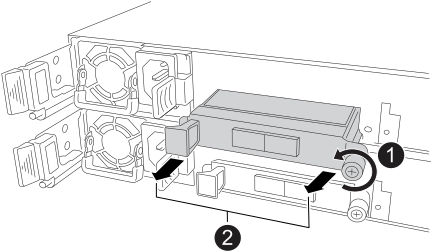

= Ersetzen Sie das Ethernet-I/O-Modul NS224-Shelfs durch NSM100B-Module
:allow-uri-read: 
:icons: font
:imagesdir: ../media/

[role="lead"]
Sie können ein ausgefallenes Ethernet-I/O-Modul unterbrechungsfrei in einem NS224-Laufwerk-Shelf austauschen, das eingeschaltet ist und während I/O-Vorgänge ausgeführt werden. Dieses Verfahren gilt nur für NS224-Shelfs mit NSM100B-Modulen.

.Bevor Sie beginnen
* Der Partner-NSM des Shelfs muss betriebsbereit sein und ordnungsgemäß verkabelt sein, damit das Shelf weiterhin verbunden bleibt, wenn Sie den ausgefallenen NSM entfernen.
+
https://mysupport.netapp.com/site/tools/tool-eula/activeiq-configadvisor["NetApp Downloads: Config Advisor"^]

* Alle anderen Komponenten im System müssen ordnungsgemäß funktionieren.

.Über diese Aufgabe
* Mindestens 70 Sekunden zwischen dem aus- und Einbau des NVMe-Shelf-Moduls (NSM) zulassen.
+
So bleibt ONTAP genügend Zeit, um das NSM-Entfernungsereignis zu bearbeiten.

* *Best Practice:* die Best Practice besteht darin, aktuelle Versionen der NSM-Firmware (NVMe Shelf Module) und der Laufwerk-Firmware auf dem System zu haben, bevor FRU-Komponenten ersetzt werden.
+
https://mysupport.netapp.com/site/downloads/firmware/disk-shelf-firmware["NetApp Downloads: Festplatten-Shelf Firmware"^]

+
https://mysupport.netapp.com/site/downloads/firmware/disk-drive-firmware["NetApp Downloads: Festplatten-Firmware"^]

+
[NOTE]
====
Stellen Sie die Firmware nicht auf eine Version zurück, die Ihr Shelf und seine Komponenten nicht unterstützt.

====
* Shelf- (NSM)-Firmware wird automatisch (unterbrechungsfrei) auf einem neuen NSM aktualisiert, das über eine nicht aktuelle Firmware-Version verfügt.
+
Die NSM-Firmware wird alle 10 Minuten überprüft. Eine Aktualisierung der NSM-Firmware kann bis zu 30 Minuten dauern.

* Bei Bedarf können Sie die blauen LEDs am Shelf einschalten, um die physische Suche nach dem betroffenen Shelf zu erleichtern: `storage shelf location-led modify -shelf-name _shelf_name_ -led-status on`
+
Wenn Sie den nicht kennen `shelf_name` Führen Sie den aus `storage shelf show` Befehl.

+
Ein Regal hat drei Standort-LEDs: Eine auf dem Bedienfeld und eine auf jedem NSM. Die Standort-LEDs leuchten 30 Minuten lang. Sie können sie deaktivieren, indem Sie denselben Befehl eingeben, jedoch die Option verwenden `off`.

* Wenn Sie den Ersatz-NSM auspacken, bewahren Sie alle Verpackungsmaterialien zur Verwendung auf, wenn Sie den fehlerhaften NSM zurücksenden.
+
Wenn Sie die RMA-Nummer oder zusätzliche Hilfe beim Ersatzverfahren benötigen, wenden Sie sich an den technischen Support unter https://mysupport.netapp.com/site/global/dashboard["NetApp Support"^], 888-463-8277 (Nordamerika), 00-800-44-638277 (Europa) oder +800-800-80-800 (Asien/Pazifik).

.Schritte
. Richtig gemahlen.
. Trennen Sie die Verkabelung vom NSM, der die FRU enthält, die Sie ersetzen:
+
.. Ziehen Sie das Netzkabel vom Netzteil ab, indem Sie den Netzkabelhalter öffnen, wenn es sich um ein Netzteil handelt, oder die beiden Flügelschrauben lösen, wenn es sich um ein Gleichstromnetzteil handelt, und ziehen Sie dann das Netzkabel vom Netzteil ab.
+
Die Netzteile haben keinen Netzschalter.

.. Trennen Sie die Speicherkabel von den NSM-Ports.
+
Notieren Sie sich die NSM-Ports, an die jedes Kabel angeschlossen ist. Schließen Sie die Kabel wieder an die gleichen Ports an, wenn Sie den NSM wieder einsetzen.

. Entfernen Sie die NSM:
+
image::../media/drw_g_and_t_handles_remove_ieops-1837.svg[Entfernen Sie den NSM.]

+
[cols="1,4"]
|===

 a| 
image::../media/icon_round_1.png[Legende Nummer 1]
 a| 
Drücken Sie an beiden Enden des NSM die vertikalen Verriegelungslaschen nach außen, um die Griffe zu lösen.

 a| 
image::../media/icon_round_2.png[Legende Nummer 2]
 a| 
** Ziehen Sie die Griffe zu sich, um den NSM aus der Mittelplatine zu lösen.
+
Beim Ziehen ziehen die Griffe aus dem Regal heraus. Wenn du Widerstand spürst, ziehe weiter.

** Schieben Sie den NSM aus dem Regal und legen Sie ihn auf eine Ebene, stabile Oberfläche.
+
Stellen Sie sicher, dass Sie die Unterseite des NSM stützen, während Sie ihn aus dem Regal ziehen.

 a| 
image::../media/icon_round_3.png[Legende Nummer 3]
 a| 
Drehen Sie die Griffe aufrecht (neben den Laschen), um sie aus dem Weg zu bewegen.

|===
. Entfernen Sie das fehlerhafte I/O-Modul aus dem NSM:
+

+
[cols="1,4"]
|===

 a| 
image::../media/icon_round_1.png[Legende Nummer 1]
 a| 
Drehen Sie die Flügelschraube des E/A-Moduls gegen den Uhrzeigersinn, um sie zu lösen.

 a| 
image::../media/icon_round_2.png[Legende Nummer 2]
 a| 
Ziehen Sie das E/A-Modul mithilfe der Anschlusslasche links und der Rändelschraube aus dem NSM.

|===
. Setzen Sie das Ersatz-E/A-Modul in den Zielsteckplatz ein:
+
.. Richten Sie das E/A-Modul an den Kanten des Schlitzes aus.
.. Drücken Sie das E/A-Modul vorsichtig bis zum Steckplatz, und achten Sie darauf, dass das Modul ordnungsgemäß in den Anschluss eingesetzt wird.
+
Sie können die Lasche auf der linken Seite und die Flügelschraube verwenden, um das E/A-Modul einzudrücken.

.. Drehen Sie die Rändelschraube im Uhrzeigersinn, um sie festzuziehen.

. Setzen Sie den NSM in das Regal ein:
+
image::../media/drw_g_and_t_handles_reinstall_ieops-1838.svg[Ersetzen Sie die NSM.]

+
[cols="1,4"]
|===

 a| 
image::../media/icon_round_1.png[Legende Nummer 1]
 a| 
Wenn Sie die NSM-Griffe senkrecht (neben den Laschen) gedreht haben, um sie während der Wartung des NSM aus dem Weg zu bewegen, drehen Sie sie nach unten in die horizontale Position.

 a| 
image::../media/icon_round_2.png[Legende Nummer 2]
 a| 
Richten Sie die Rückseite des NSM mit der Öffnung im Regal aus, und drücken Sie den NSM vorsichtig mit den Griffen, bis er vollständig sitzt.

 a| 
image::../media/icon_round_3.png[Legende Nummer 3]
 a| 
Drehen Sie die Griffe in die aufrechte Position, und fixieren Sie sie mit den Laschen.

|===
. NSM wieder verstellen.
+
.. Schließen Sie die Speicherverkabelung wieder an die beiden NSM-Ports an.
+
Die Kabel werden mit der Zuglasche des Steckers nach oben eingesetzt. Wenn ein Kabel richtig eingesetzt wird, klickt es an seine Stelle.

.. Schließen Sie das Netzkabel wieder an das Netzteil an, und befestigen Sie das Netzkabel mit der Netzkabelhalterung, wenn es sich um ein Netzteil handelt. Ziehen Sie die beiden Flügelschrauben fest, wenn es sich um ein Gleichstromnetzteil handelt, und ziehen Sie dann das Netzkabel aus dem Netzteil.
+
Bei ordnungsgemäßer Funktion leuchtet die zweifarbige LED des Netzteils grün.

+
Außerdem leuchten beide NSM-Port-LNK-LEDs (grün) auf. Wenn eine LNK-LED nicht leuchtet, setzen Sie das Kabel wieder ein.

. Vergewissern Sie sich, dass die Warn-LEDs am NSM, der das ausgefallene I/O-Modul enthält, und am Shelf-Bedienfeld nicht mehr leuchten
+
Die NSM-Warn-LEDs werden nach dem Neustart des NSM ausgeschaltet und erkennen kein E/A-Modul mehr. Dies kann drei bis fünf Minuten dauern.

. Überprüfen Sie, ob der NSM ordnungsgemäß verkabelt ist, indem Sie Active IQ Config Advisor ausführen.
+
Wenn Verkabelungsfehler auftreten, befolgen Sie die entsprechenden Korrekturmaßnahmen.

+
https://mysupport.netapp.com/site/tools/tool-eula/activeiq-configadvisor["NetApp Downloads: Config Advisor"^]

