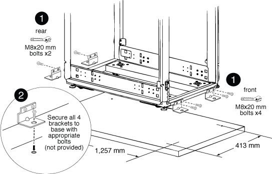

= Den Schraubensatz einbauen
:allow-uri-read: 
:icons: font
:imagesdir: ../media/

[role="lead"]
Sie können den Systemschrank am Boden befestigen, indem Sie das optionale Verschraubkit einbauen. Durch die Installation des Kits wird verhindert, dass die Systemschränke nicht mehr in Position gebracht werden.

Für jede einzelne Abschraubenhalterung müssen Sie die entsprechende Verankerungsschraube für Ihren Boden bereitstellen.

. Markieren Sie den Bereich auf Ihrem Boden, in dem der Systemschrank installiert werden soll, und Rollen Sie den Schrank dann in die richtige Position.
+

+
|===

 a| 
image:../media/legend_icon_01.png["Legende Nummer 1"]

 a| 
Vordere und hintere Schraubhalterungen

 a| 
image:../media/legend_icon_02.png["Legende Nummer 2"]

 a| 
Position des Bodenankerungspunkts an der Halterung

|===
. Markieren Sie die Verankerungspunkte, an denen die hinteren Schraubhalterungen am Boden verankert werden, und bohren Sie dann die Löcher für die Halterungen.
+
Achten Sie darauf, die entsprechenden Schraubengrößen und -Typen für Ihren Boden zu verwenden.

. Wenn die Schraubhalterungen zu niedrig sind, um sie an den Befestigungspunkten des Systemschrankrahmens auszurichten, setzen Sie eine Distanzhalterung über die Öffnung im Boden.
. Schrauben Sie die hinteren Halterungen lose am Boden an, und Schrauben Sie dann mit den Kit-Schrauben die Halterungen am Schrankrahmen fest.
. Markieren Sie die Verankerungspunkte, an denen die vorderen Schraubhalterungen am Boden verankert werden, und bohren Sie dann die Löcher für die Halterungen.
. Wenn die Schraubhalterungen zu niedrig sind, um sie an den Befestigungspunkten des Systemschrankrahmens auszurichten, setzen Sie eine Distanzhalterung über die Öffnung im Boden.
. Schrauben Sie die vorderen Halterungen am Boden fest, und Schrauben Sie dann mit den Kit-Schrauben die Halterungen am Schrankrahmen fest.
. Senken Sie die Nivellierfüße nach Bedarf ab, und ziehen Sie dann die hinteren Verschraubhalterungen am Boden fest.

