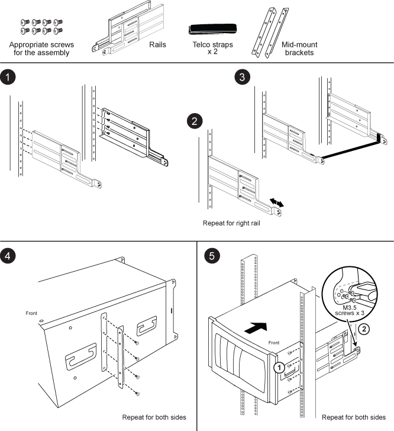

= Installationsanleitung für den Schienen-Kit mit zwei Stützverbindungen – AFF A700 und FAS9000
:allow-uri-read: 
:icons: font
:imagesdir: ../media/

[role="lead"]
Es gibt zwei Schienensatz mit zwei Säulen für die Unterstützung, die zusammen mit den Systemen FAS9000 und AFF A700 verwendet werden können. Mit einem Kit können Sie Ihr System im zweiposten Rack bündig montieren, und mit dem anderen Kit können Sie Ihr System im Rack mit zwei Pfosten montieren.

== Installieren Sie den Mid-Mount-Schienensatz mit zwei Säulen

== Installieren Sie den zweiposten Flush-Mount-Schienensatz

image::../media/drw_telco_front_mount_1.png[drw-Telekommunikationshalterung 1]
