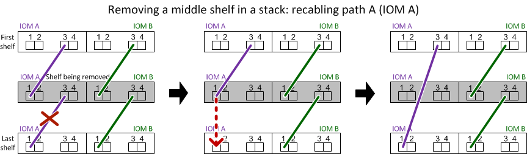

= Regal für die Warmentferne - Regale mit IOM12/IOM12B-Modulen
:allow-uri-read: 
:icons: font
:imagesdir: ../media/

[role="lead"]
Sie können ein Platten-Shelf in Betrieb nehmen mit IOM12/IOM12B-Modulen (ein Platten-Shelf kann unterbrechungsfrei von einem System entfernt werden, das eingeschaltet ist und I/O im Gange ist), wenn Sie ein Platten-Shelf verschieben oder ersetzen müssen. Sie können ein oder mehrere Platten-Shelfs innerhalb eines Stacks mit Platten-Shelfs Hot-entfernen oder einen Stack von Festplatten-Shelfs entfernen.

.Bevor Sie beginnen
* Ihr System muss eine Multipath HA-, Multipath-, Quad-Path-Konfiguration oder Quad-Path-Konfiguration sein.
+
Bei Plattformen mit integriertem Storage, wie z. B. AFF A200, AFF A220, FAS2600 Serie und FAS2700 Systemen, muss der externe Storage als Multipath HA oder Multipath verkabelt werden.

+

NOTE: Das System ist für ein Single-Controller-System der FAS2600 Serie mit dem externen Storage, der mit Multipath-Konnektivität verbunden ist, eine Konfiguration mit gemischten Pfaden, da der interne Storage über Single Path-Konnektivität verfügt.

* Ihr System kann keine Fehlermeldungen bei der SAS-Verkabelung haben.
+
Sie können Active IQ Config Advisor herunterladen und ausführen, um alle Fehlermeldungen der SAS-Verkabelung sowie die Korrekturmaßnahmen anzuzeigen, die Sie ergreifen sollten.

+
https://mysupport.netapp.com/site/tools/tool-eula/activeiq-configadvisor["NetApp Downloads: Config Advisor"]

* DIE HA-Paar-Konfigurationen können nicht im Übernahmemodus liegen.
* Sie müssen alle Aggregate von den Festplatten entfernt haben (die Festplatten müssen Ersatzteile sein) in den Festplatten-Regalen, die Sie entfernen.
+

NOTE: Wenn Sie dieses Verfahren mit Aggregaten auf dem Festplatten-Shelf versuchen, entfernen Sie, könnten Sie das System mit mehreren fehlerhaften Festplatten fehlschlagen.

+
Sie können das verwenden `storage aggregate offline -aggregate _aggregate_name_` Befehl und dann der `storage aggregate delete -aggregate _aggregate_name_` Befehl.

* Wenn Sie ein oder mehrere Platten-Shelfs aus einem Stack entfernen, müssen Sie die Entfernung berücksichtigt haben, um die entfernenden Platten-Shelfs zu umgehen. Wenn die aktuellen Kabel nicht lang genug sind, müssen Sie längere Kabel zur Verfügung haben.

.Über diese Aufgabe
* *Best Practice:* die beste Praxis ist, Festplatten Eigentum zu entfernen, nachdem Sie die Aggregate von den Festplatten in den Platten-Shelves, die Sie entfernen.
+
Durch das Entfernen von Besitzinformationen von einer Ersatzfestplatte kann das Festplattenlaufwerk (je nach Bedarf) ordnungsgemäß in einen anderen Knoten integriert werden.

[NOTE]
====
Um das Eigentum von Festplatten zu entfernen, müssen Sie die automatische Zuweisung der Festplatteneigentümer deaktivieren. Am Ende dieses Vorgangs wird die automatische Zuweisung zum Festplattenbesitzer wieder aktiviert.

https://docs.netapp.com/us-en/ontap/disks-aggregates/index.html["Überblick über Festplatten und Aggregate"]

====
* Bei einem Clustered ONTAP System mit mehr als zwei Nodes empfiehlt es sich, Epsilon auf ein anderes HA-Paar zuzuweisen, das während der geplanten Wartung arbeitet.
+
Das erneute Signieren des Epsilon minimiert das Risiko unvorhergesehener Fehler, die auf alle Nodes in einem Clustered ONTAP System beeinträchtigt werden. Anhand der folgenden Schritte können Sie feststellen, ob der Knoten Epsilon und Epsilon bei Bedarf neu zugewiesen werden:

+
.. Legen Sie die Berechtigungsebene auf erweitert fest: `set -privilege advanced`
.. Bestimmen Sie, auf welchem Node das Epsilon enthalten ist: `cluster show`
+
Der Knoten, auf dem das Epsilon steht, wird angezeigt `true` Im `Epsilon` Spalte. (Die Knoten, die die Epsilon-Anzeige nicht halten `false`.)

.. Wenn der Node im HA-Paar, das gerade gewartet wird, angezeigt wird `true` (Hält Epsilon), dann Epsilon vom Knoten entfernen: `cluster modify -node _node_name_ -epsilon false`
.. Epsilon einem Node in einem anderen HA-Paar zuweisen: `cluster modify -node _node_name_ -epsilon true`
.. Zurück zur Administratorberechtigungsebene: `set -privilege admin`

* Wenn Sie ein Platten-Shelf im laufenden Betrieb aus einem Stapel entfernen (jedoch den Stack behalten), können Sie erneut einen Pfad nach nacheinander überprüfen (Pfad A dann Pfad B), um das Festplatten-Shelf, das Sie entfernen, zu umgehen, damit Sie stets die Single-Path-Verbindung von den Controllern zum Stack aufrechterhalten.
+

NOTE: Wenn Sie die Single-Path-Konnektivität von den Controllern nicht zum Stack aufrechterhalten, wenn Sie den Stack neu verkabeln, um das Festplatten-Shelf zu umgehen, das Sie entfernen, können Sie das System mit einer Multidisk-Panik fehlschlagen.

* *Möglicher Regalschaden:* Wenn Sie ein DS460C-Regal entfernen und es in einen anderen Teil des Rechenzentrums verschieben oder an einen anderen Ort transportieren, lesen Sie den Abschnitt, <<Verschieben oder Transport von DS460C Shelfs>> Am Ende dieses Verfahrens.

.Schritte
. Vergewissern Sie sich, dass Ihre Systemkonfiguration genau ist `Multi-Path HA`, `Multi-Path`, `Quad-path HA`, Oder `Quad-path`: `sysconfig`
+
Sie führen diesen Befehl aus dem nodeshell von beiden Controllern. Es kann bis zu einer Minute dauern, bis das System die Erkennung abgeschlossen hat.

+
Die Konfiguration ist im aufgeführt `System Storage Configuration` Feld.

+

NOTE: Für ein Single-Controller-System der FAS2600 Serie, das über den externen Storage verfügt, der mit Multipath-Konnektivität verbunden ist, wird die Ausgabe als angezeigt `mixed-path` Weil im internen Storage Single Path-Konnektivität verwendet wird.

. Überprüfen Sie, ob die Festplatten in den Festplatten-Shelves, die Sie entfernen, keine Aggregate haben (sind Ersatzteile) und das Eigentum entfernt wird:
+
.. Geben Sie in der Clustershell eines der Controller den folgenden Befehl ein: `storage disk show -shelf _shelf_number_`
.. Überprüfen Sie die Ausgabe, um zu überprüfen, ob die Festplatten-Shelfs, die Sie entfernen, keine Aggregate sind.
+
Festplatten ohne Aggregate haben einen Strich in das `Container Name` Spalte.

.. Überprüfen Sie die Ausgabe, um zu überprüfen, ob die Festplatten auf den zu entfernenden Festplatten-Shelfs vollständig entfernt wurden.
+
Festplatten ohne Eigentümerschaft haben einen Bindestrich in der `Owner` Spalte.

+

NOTE: Wenn ausgefallene Festplatten im zu entfernenden Shelf vorhanden sind, sind sie in der beschädigt `Container Type` Spalte. (Ausgefallenes Laufwerk ist nicht Eigentum.)

+
In der folgenden Ausgabe werden Laufwerke auf dem Festplatten-Shelf, das entfernt wird, angezeigt (Festplatten-Shelf 3), die sich in einem korrekten Status zum Entfernen des Festplatten-Shelf befinden. Die Aggregate werden auf allen Festplatten entfernt. Daher wird im ein Bindestrich angezeigt `Container Name` Spalte für jedes Laufwerk. Eigentumsrechte werden auch auf allen Festplatten entfernt. Daher wird im ein Bindestrich angezeigt `Owner` Spalte für jedes Laufwerk.

+
[listing]
----
cluster::> storage disk show -shelf 3

           Usable           Disk   Container   Container
Disk         Size Shelf Bay Type   Type        Name       Owner
-------- -------- ----- --- ------ ----------- ---------- ---------
...
1.3.4           -     3   4 SAS    spare                -         -
1.3.5           -     3   5 SAS    spare                -         -
1.3.6           -     3   6 SAS    broken               -         -
1.3.7           -     3   7 SAS    spare                -         -
...
----
. Suchen Sie physisch nach den zu entfernenden Platten-Shelves.
+
Bei Bedarf können Sie die (blauen) LEDs des Festplatten-Shelfs einschalten, um Hilfe bei der physischen Suche nach dem betroffenen Festplatten-Shelf zu leisten: `storage shelf location-led modify -shelf-name _shelf_name_ -led-status on`

+

NOTE: Ein Platten-Shelf hat drei Positionen-LEDs: Eine auf der Bedienkonsole und eine auf jedem IOM12-Modul. Die Standort-LEDs leuchten 30 Minuten lang. Sie können sie ausschalten, indem Sie denselben Befehl eingeben, jedoch die Option „aus“ verwenden.

. Wenn Sie einen kompletten Stapel an Platten-Shelves entfernen, führen Sie die folgenden Teilschritte durch; andernfalls fahren Sie mit dem nächsten Schritt fort:
+
.. Entfernen Sie alle SAS-Kabel von Pfad A (IOM A) und Pfad B (IOM B).
+
Dazu gehören Controller- und Shelf-Kabel sowie Shelf-zu-Shelf-Kabel für alle Festplatten-Shelfs im zu entfernenden Stack.

.. Fahren Sie mit Schritt 9 fort.

. Wenn Sie ein oder mehrere Platten-Shelfs aus einem Stapel entfernen (jedoch den Stapel behalten), können Sie den Pfad A (IOM A)-Stack-Verbindungen neu verwenden, um die zu entfernenden Platten-Shelves zu umgehen, indem Sie die entsprechenden Unterschritte ausführen:
+
Wenn Sie mehr als ein Festplatten-Shelf im Stack entfernen, führen Sie den entsprechenden Satz der Unterschritte für jeweils ein Festplatten-Shelf aus.

+

NOTE: Warten Sie mindestens 10 Sekunden, bevor Sie den Anschluss anschließen. Die SAS-Kabelanschlüsse sind codiert. Wenn sie sich korrekt in einen SAS-Port orientieren, klicken sie auf ihren Platz und die Festplatten-Shelf-SAS-Port LNK-LED leuchtet grün. Bei Festplatten-Shelfs stecken Sie einen SAS-Kabelanschluss mit nach unten (auf der Unterseite des Connectors) gerichteter Zuglasche.

+
[cols="2*"]
|===
| Wenn Sie entfernen... | Dann... 

 a| 
Ein Festplatten-Shelf am Ende (logisches erstes oder letztes Festplatten-Shelf) eines Stacks
 a| 
.. Entfernen Sie jede Shelf-zu-Shelf-Verkabelung von IOM A-Ports auf dem Festplatten-Shelf, das Sie entfernen und beiseite legen.
.. Trennen Sie alle Controller-zu-Stack-Kabel, die mit IOM A-Ports am Festplatten-Shelf verbunden sind. Diese werden entfernt und an dieselben IOM A-Ports am nächsten Festplatten-Shelf im Stack angeschlossen.
+
Das „`nächste`“ Festplatten-Shelf kann über oder unter dem Festplatten-Shelf liegen, aus dem Sie entfernen, abhängig davon, aus welchem Ende des Stacks Sie das Festplatten-Shelf entfernen.

 a| 
Ein Platten-Shelf aus der Mitte des Stacks Ist Ein Festplatten-Shelf in der Mitte des Stacks nur mit anderen Festplatten-Shelfs verbunden – nicht mit einem Controller.
 a| 
.. Entfernen Sie alle Shelf-zu-Shelf-Kabel von IOM A-Ports 1 und 2 oder von den Ports 3 und 4 auf dem Festplatten-Shelf, das Sie entfernen, und IOM A des nächsten Festplatten-Shelfs und legen Sie sie beiseite.
.. Trennen Sie die verbleibenden Shelf-zu-Shelf-Verkabelung, die mit IOM A-Ports am Festplatten-Shelf verbunden ist. Sie werden entfernt und an dieselben IOM A-Ports am nächsten Festplatten-Shelf im Stack angeschlossen. Das „`nächste`“ Festplatten-Shelf kann über oder unter dem Festplatten-Shelf liegen, je nachdem, aus welchem IOM A-Ports (1 und 2 oder 3 und 4) Sie die Verkabelung entfernt haben.

|===
+
Sie können sich die folgenden Verkabelungsbeispiele nennen, wenn Sie ein Festplatten-Shelf aus einem Ende eines Stacks oder der Mitte eines Stacks entfernen. Beachten Sie die folgenden Verkabelungsbeispiele:

+
** Die IOM12-Module werden nebeneinander wie in einem DS224C oder DS212C Festplatten-Shelf angeordnet; bei einem DS460C werden die IOM12-Module übereinander angeordnet.
** Der Stack in jedem Beispiel ist mit einer standardmäßigen Shelf-to-Shelf-Verkabelung verbunden, die in Stacks mit Multipath HA oder Multipath-Konnektivität verwendet wird.
+
Sie können die Neuaufteilung beschreiben, wenn der Stack über HA mit Quad-Path oder Quad-Path-Konnektivität verbunden ist, wobei doppelt breite Shelf-to-Shelf-Verkabelung verwendet wird.

** Die Verkabelungsbeispiele zeigen die Neuauftragung eines der Pfade: Pfad A (IOM A).
+
Sie wiederholen die Neuauftragung für Pfad B (IOM B).

** Das Verkabelungsbeispiel zum Entfernen eines Festplatten-Shelfs vom Ende eines Stacks zeigt, wie das logische letzte Festplatten-Shelf in einem Stack entfernt wird, der mit Multipath HA-Konnektivität verbunden ist.
+
Sie können die Neuablung schließen, wenn Sie das erste logische Platten-Shelf in einem Stack entfernen oder ob Ihr Stack über Multipath-Konnektivität verfügt.

+
image::../media/drw_hotremove_end.gif[drw-Hotremove-Ende]

+

. Überprüfen Sie, ob Sie die Festplatten-Shelfs, die Sie entfernen, umgangen und die Verbindungen des Pfads A (IOM A)-Stacks ordnungsgemäß wiederhergestellt haben: `storage disk show -port`
+
Für HA-Paar-Konfigurationen führen Sie diesen Befehl über die Clustershell eines der beiden Controller aus. Es kann bis zu einer Minute dauern, bis das System die Erkennung abgeschlossen hat.

+
Die ersten beiden Ausgabelinien zeigen Festplatten mit Konnektivität sowohl über Pfad A als auch Pfad B an In den letzten beiden Zeilen der Ausgabe werden die Festplatten mit Konnektivität durch einen Single-Path, Pfad B. angezeigt

+
[listing]
----
cluster::> storage show disk -port

PRIMARY  PORT SECONDARY      PORT TYPE SHELF BAY
-------- ---- ---------      ---- ---- ----- ---
1.20.0   A    node1:6a.20.0  B    SAS  20    0
1.20.1   A    node1:6a.20.1  B    SAS  20    1
1.21.0   B    -              -    SAS  21    0
1.21.1   B    -              -    SAS  21    1
...
----
. Der nächste Schritt hängt vom ab `storage disk show -port` Befehlsausgabe:
+
[cols="2*"]
|===
| Wenn die Ausgabe zeigt... | Dann... 

 a| 
Alle Festplattenlaufwerke im Stack sind über Pfad A und Pfad B verbunden, mit Ausnahme der Festplatten-Shelves, die Sie getrennt haben, die nur über Pfad B verbunden sind
 a| 
Fahren Sie mit dem nächsten Schritt fort.

Sie haben die Festplatten-Shelfs, die Sie entfernen und wieder hergestellt haben, auf den verbleibenden Festplattenlaufwerken im Stack umgangen.

 a| 
Alles andere als oben
 a| 
Wiederholen Sie Schritt 5 und Schritt 6.

Sie müssen die Verkabelung korrigieren.

|===
. Führen Sie die folgenden Teilschritte für die Festplatten-Shelfs (im Stack) aus, die Sie entfernen:
+
.. Wiederholen Sie Schritt 5 bis Schritt 7 für Pfad B.
+

NOTE: Wenn Sie Schritt 7 wiederholen und den Stack korrekt neu eingerichtet haben, sollten Sie nur alle übrigen Laufwerke sehen, die über Pfad A und Pfad B verbunden sind

.. Wiederholen Sie Schritt 1, um sicherzustellen, dass Ihre Systemkonfiguration genau so ist wie zuvor, bevor Sie ein oder mehrere Platten-Shelfs aus einem Stack entfernt haben.
.. Fahren Sie mit dem nächsten Schritt fort.

. Wenn Sie die Eigentümerschaft von den Festplatten entfernt haben (als Teil der Vorbereitung für dieses Verfahren), haben Sie die automatische Zuweisung für die Festplatteneigentümer deaktiviert, aktivieren Sie sie durch Eingabe des folgenden Befehls erneut. Andernfalls fahren Sie mit dem nächsten Schritt fort: `storage disk option modify -autoassign on`
+
Für HA-Paar-Konfigurationen führen Sie den Befehl über die Clustershell beider Controller aus.

. Schalten Sie die getrennten Platten-Shelfs aus und ziehen Sie die Netzkabel von den Festplatten-Shelfs ab.
. Entfernen Sie die Festplatten-Shelfs aus dem Rack oder dem Schrank.
+
Damit ein Platten-Shelf leichter und leichter zu manövrieren kann, entfernen Sie die Netzteile und I/O-Module (IOMs).

+
Bei DS460C Festplatten-Shelfs kann ein vollständig beladenes Shelf ca. 247 112 kg wiegen. Gehen Sie daher beim Entfernen eines Shelfs aus einem Rack oder Schrank folgendermaßen vor.

+

CAUTION: Es wird empfohlen, einen mechanischen Aufzug oder vier Personen mit den Hubgriffen zu verwenden, um ein DS460C-Regal sicher zu bewegen.

+
Ihre DS460C-Sendung wurde mit vier abnehmbaren Hebegriffen (zwei pro Seite) verpackt. Um die Hebegriffe zu verwenden, installieren Sie sie, indem Sie die Laschen der Griffe in die Schlitze an der Seite des Regals einsetzen und nach oben drücken, bis sie einrasten. Wenn Sie dann das Festplatten-Shelf auf die Schienen schieben, lösen Sie mithilfe der Daumenverriegelung jeweils einen Satz von Griffen. Die folgende Abbildung zeigt, wie ein Hubgriff befestigt wird.

+
image::../media/drw_ds460c_handles.gif[drw ds460c Griffe]

+
Wenn Sie das DS460C Shelf zu einem anderen Teil des Datacenters verschieben oder an einen anderen Ort transportieren, finden Sie im folgenden Abschnitt: <<Verschieben oder Transport von DS460C Shelfs>>.

.Verschieben oder Transport von DS460C Shelfs
Wenn Sie ein DS460C Shelf zu einem anderen Teil des Datacenters verschieben oder das Shelf an einen anderen Ort transportieren, müssen Sie die Laufwerke aus den Laufwerksfächern entfernen, um mögliche Beschädigungen der Laufwerkfächer und Laufwerke zu vermeiden.

* Wenn Sie DS460C Shelfs als Teil Ihrer neuen Systeminstallation oder des Shelf-Hot-Add installiert haben, haben Sie das Verpackungsmaterial des Laufwerks gespeichert. Verpacken Sie die Laufwerke erst dann, wenn Sie sie verschoben haben.
+
Wenn Sie das Verpackungsmaterial nicht gespeichert haben, sollten Sie Antriebe auf gepolsterten Oberflächen platzieren oder eine alternative gepolsterte Verpackung verwenden. Laufwerke nie aufeinander stapeln.

* Tragen Sie vor der Handhabung der Antriebe ein ESD-Handgelenkband, das auf einer unbemalten Oberfläche des Gehäuses geerdet ist.
+
Wenn ein Handgelenkband nicht verfügbar ist, berühren Sie eine unlackierte Oberfläche des Speichergehäuses, bevor Sie ein Laufwerk handhaben.

* Sie sollten Maßnahmen ergreifen, um Laufwerke sorgfältig zu behandeln:
+
** Verwenden Sie immer zwei Hände, wenn Sie ein Laufwerk entfernen, installieren oder tragen, um sein Gewicht zu halten.
+

CAUTION: Legen Sie keine Hände auf die Laufwerkplatinen, die auf der Unterseite des Laufwerkträgers ausgesetzt sind.

** Achten Sie darauf, Laufwerke nicht gegen andere Oberflächen zu stoßen.
** Laufwerke sollten von magnetischen Geräten ferngehalten werden.
+

CAUTION: Magnetfelder können alle Daten auf einem Laufwerk zerstören und irreparable Schäden an der Antriebsschaltung verursachen.

