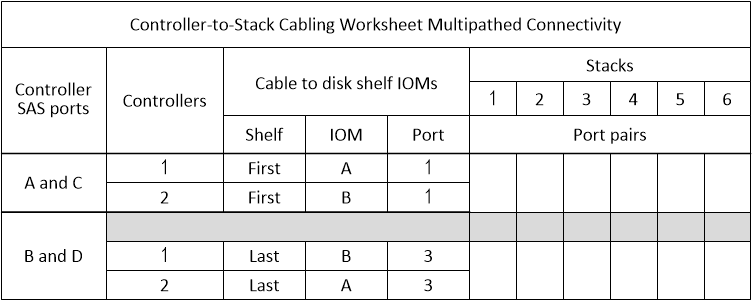
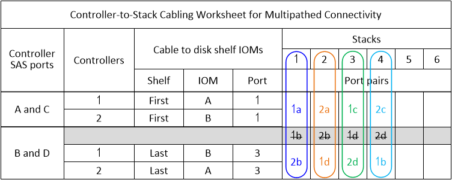
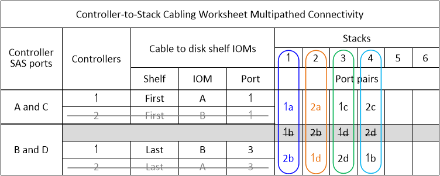

= Verkabelungsübersicht für DS212C, DS224C oder DS460C Multipath-Konnektivität
:allow-uri-read: 
:icons: font
:imagesdir: ../media/

[role="lead"]
Mithilfe eines Verkabelungsplans können die SAS-Portpaare der Controller definiert werden, die zur Verkabelung von Controllern mit Stacks von Festplatten-Shelfs verwendet werden können, um eine multipath-fähige Konnektivität in einer HA-Paar- oder Einzelcontroller-Konfiguration zu erreichen. Der ausgefüllte Plan kann außerdem dazu verwendet werden, die Verkabelung der multipath-fähigen Verbindungen für die jeweilige Konfiguration Schritt für Schritt nachzuvollziehen.

.Bevor Sie beginnen
Wenn Sie über eine Plattform mit internem Speicher verfügen, verwenden Sie das folgende Arbeitsblatt:

link:install-cabling-worksheets-examples-fas2600.html["Verkabelungsarbeitsblätter und Beispiele für Plattformen mit internem Storage für den Controller-to-Stack-Stack"]

.Über diese Aufgabe
* Diese Prozedur und Arbeitsblattvorlage können für die Verkabelung von Multipath HA- oder Multipath-Konfigurationen mit einem oder mehreren Stacks angewendet werden.
+
Beispiele für abgeschlossene Worksheets finden Sie für Multipath HA- und Multipath-Konfigurationen.

+
Für die Beispiele im Arbeitsblatt wird eine Konfiguration mit zwei quad-port SAS-HBAs und zwei Stapeln von Disk Shelves mit IOM12, IOM12B oder IOM12C Modulen verwendet.

* Die Arbeitsblattvorlage ermöglicht bis zu sechs Stapel. Bei Bedarf müssen weitere Spalten hinzugefügt werden.
* Bei Bedarf können Sie sich auf die beziehen link:install-cabling-rules.html["SAS-Verkabelungsregeln und -Konzepte"] Weitere Informationen zu unterstützten Konfigurationen finden Sie auf der Konvention zur Nummerierung von Controller-Steckplätzen, Shelf-to-Shelf-Konnektivität und Controller/Shelf-Konnektivität (einschließlich Verwendung von Port-Paaren).
* Falls erforderlich, können Sie nach dem Ausfüllen des Arbeitsblatts auf lesen link:install-cabling-worksheets-how-to-read-multipath.html["Lesen eines Arbeitsblatts zur Verkabelung von Controller-zu-Stack-Verbindungen für Multipath-Konnektivität"]

.Schritte
. Listen Sie in den Feldern über den grauen Feldern alle SAS A-Ports auf Ihrem System und dann alle SAS C-Ports auf Ihrem System in einer Reihe von Steckplätzen (0, 1, 2, 3 usw.) auf.
+
Beispiel: 1a, 2a, 1c, 2c

. Führen Sie in den grauen Feldern alle SAS B-Ports auf Ihrem System und dann alle SAS-D-Ports auf Ihrem System in einer Reihe von Steckplätzen (0, 1, 2, 3 usw.) auf.
+
Beispiel: 1b, 2b, 1d, 2d

. Schreiben Sie in den Feldern unter den grauen Feldern die Liste der D- und B-Anschlüsse neu, so dass der erste Port in der Liste an das Ende der Liste verschoben wird.
+
Beispiel: 2b, 1d, 2d, 1b

. Kreis (bestimmen) ein Portpaar für jeden Stack.
+
Wenn alle Portpaare zur Verkabelung der Stacks in Ihrem System verwendet werden, setzen Sie Portpaare in der Reihenfolge ein, in der sie im Arbeitsblatt definiert sind (aufgelistet).

+
In einer Multipath HA-Konfiguration mit acht SAS-Ports und vier Stacks ist das Port-Paar 1a/2b mit Stack 1 verkabelt, das Port-Paar 2a/1d ist mit Stack 2 verbunden, das Port-Paar 1c/2d ist mit stapel3 verkabelt, und das Port-Paar 2c/1b ist mit Stack 4 verbunden.

+

+
Wenn nicht alle Portpaare zur Verkabelung der Stacks in Ihrem System benötigt werden, überspringen Sie Portpaare (verwenden Sie jedes andere Portpaar).

+
Beispielsweise ist bei einer Multipath HA-Konfiguration mit acht SAS-Ports und zwei Stacks das Port-Paar 1a/2b mit Stack 1 verbunden und das Port-Paar 1c/2d wird mit Stack 2 verbunden. Wenn später zwei weitere Stacks im laufenden Betrieb hinzugefügt werden, ist das Port-Paar 2a/1d mit Stack 3 verbunden, und das Port-Paar 2c/1b wird mit Stack 4 verbunden.

+

NOTE: Wenn Sie mehr Port-Paare haben, als Sie die Stacks in Ihrem System verkabeln müssen, sollten Sie die Best Practice Port-Paare überspringen, um die SAS-Ports auf Ihrem System zu optimieren. Durch die Optimierung von SAS-Ports optimieren Sie die Performance Ihres Systems.

+
image::../media/drw_worksheet_mpha_skipped_template.gif[Arbeitsblatt für die Multipath HA-Verkabelung, aus dem übersprungene Port-Paare hervorgeht]

+
Sie können das ausgefüllte Arbeitsblatt verwenden, um das System zu verkabeln.

. Wenn Sie eine Single-Controller-(Multipath-)Konfiguration haben, geben Sie die Informationen für Controller 2 durch.
+

+
Sie können das ausgefüllte Arbeitsblatt verwenden, um das System zu verkabeln.

