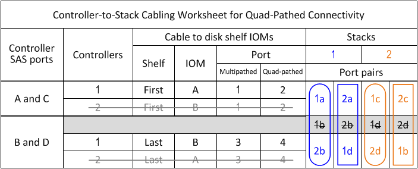

= Arbeitsblatt-Vorlage für Controller-to-Stack-Verkabelung für Quad-Pathed-Konnektivität - Shelfs mit IOM12/IOM12B-Modulen
:allow-uri-read: 
:icons: font
:imagesdir: ../media/

[role="lead"]
Durch Ausfüllen der Worksheet-Vorlage können Sie die SAS-Port-Paare des Controllers definieren, mit denen Controller mit IOM12/IOM12B-Modulen verbunden werden können. So lassen sich Quad-Pathing-Verbindungen in einem HA-Paar oder in einer Single-Controller-Konfiguration erzielen. Sie können auch das ausgefüllte Arbeitsblatt verwenden, um sich durch die Verkabelung der Quad-Pathed-Verbindungen für Ihre Konfiguration zu führen.

.Über seine Aufgabe
* Dieses Verfahren und die Arbeitsblattvorlage können für die Verkabelung von Quad-Pathed-Verbindungen für eine Quad-Path HA- oder Quad-Path-Konfiguration mit einem oder mehreren Stacks verwendet werden.
+
Beispiele für abgeschlossene Arbeitsblätter finden Sie für HA-Konfigurationen mit vier Pfaden und Konfigurationen mit vier Pfaden.

+
Für die Arbeitsblattbeispiele wird eine Konfiguration mit zwei Quad-Port-SAS-HBAs und zwei Stacks an Platten-Shelfs mit IOM12/IOM12B-Modulen verwendet.

* Die Arbeitsblattvorlage ermöglicht bis zu zwei Stapel. Bei Bedarf müssen weitere Spalten hinzugefügt werden.
* Quad-pathed Konnektivität für Controller-zu-Stack Verbindungen besteht aus zwei Sets von multipathed Verkabelung: Der erste Satz von Verkabelung wird als "`multipathed`" bezeichnet; der zweite Satz von Verkabelung wird als "`Quad-pathed`" bezeichnet.
+
Der zweite Verkabelungssatz wird als „`Quad-Pathed`“ bezeichnet, da Sie durch das Abschließen dieser Verkabelungssatz die Quad-Pathed-Konnektivität von einem Controller zu einem Stack in einem HA-Paar- oder Single-Controller-Konfiguration erhalten.

* Die Festplatten-Shelf-IOM-Ports 1 und 3 werden immer für Multipath-Verkabelung verwendet, und die IOM-Ports 2 und 4 werden immer für Quad-Pathing-Kabel verwendet, wie in den Spaltenüberschriften des Arbeitsblatts angegeben.
* In den Beispielen des Arbeitsblatts sind Portpaare für Multipath-Kabel oder Quad-Pathed-Kabel zum jeweiligen Stack bestimmt.
+
Jedes Anschlusspaar, das für multipathed Cabling bestimmt ist, ist durch ein Oval umgeben, das die Farbe ist, die mit dem Stapel verbunden ist, mit dem es verkabelt ist. Jedes Port-Paar, das für Quad-Pathed-Kabel bestimmt ist, wird durch ein Rechteck umkreist, das die Farbe ist, die dem Stack zugeordnet ist, mit dem er verkabelt ist. Stapel 1 ist mit der Farbe blau verknüpft; Stapel 2 ist mit der Farbe orange verknüpft.

* Bei Bedarf können Sie sich auf beziehen link:install-cabling-rules.html["SAS-Verkabelungsregeln und -Konzepte"] Weitere Informationen zur Nummerierung der Controller-Steckplätze, Shelf-zu-Shelf-Konnektivität und Controller/Shelf-Konnektivität (einschließlich der Verwendung von Port-Paaren)
* Falls erforderlich, können Sie nach dem Ausfüllen des Arbeitsblatts auf lesen link:install-cabling-worksheets-how-to-read-quadpath.html["Lesen eines Arbeitsblatts zur Verkabelung von Controller-zu-Stack-Verbindungen für Quad-Pathed-Konnektivität"].

image::../media/drw_worksheet_quad_pathed_template_nau.gif[Vorlage für das Arbeitsblatt „Quad Path Cabling“]

.Schritte
. Listen Sie in den Feldern über den grauen Feldern alle SAS A-Ports auf Ihrem System und dann alle SAS C-Ports auf Ihrem System in einer Reihe von Steckplätzen (0, 1, 2, 3 usw.) auf.
+
Beispiel: 1a, 2a, 1c, 2c

. Führen Sie in den grauen Feldern alle SAS B-Ports auf Ihrem System und dann alle SAS-D-Ports auf Ihrem System in einer Reihe von Steckplätzen (0, 1, 2, 3 usw.) auf.
+
Beispiel: 1b, 2b, 1d, 2d

. Schreiben Sie in den Feldern unter den grauen Feldern die Liste der D- und B-Anschlüsse neu, so dass der erste Port in der Liste an das Ende der Liste verschoben wird.
+
Beispiel: 2b, 1d, 2d, 1b

. Identifizieren Sie die beiden Portpaare, die an Stapel 1 angeschlossen werden sollen, indem Sie ein Oval um den ersten Satz von Portpaaren ziehen und ein Rechteck um den zweiten Satz von Portpaaren.
+
Beide Kabel sind erforderlich, um Quad-Pathing-Konnektivität zwischen jedem Controller und Stack 1 in Ihrer HA-Paar- oder Single-Controller-Konfiguration zu erreichen.

+
Im folgenden Beispiel wird das Portpaar 1a/2b für die mehrpathige Verkabelung und das Portpaar 2a/1d für die Quad-Pathed-Verkabelung zu Stack 1 verwendet.

+
image::../media/drw_worksheet_qpha_slots_1_and_2_two_4porthbas_two_stacks_set1_circled_nau.gif[Arbeitsblatt für die HA-Verkabelung des Quad Path, das die mit Stack 1 verbundenen Port-Paare zeigt]

. Identifizieren Sie die beiden Portpaare, die an Stack 2 angeschlossen werden sollen, indem Sie ein Oval um den ersten Satz von Portpaaren und ein Rechteck um den zweiten Satz von Portpaaren ziehen.
+
Beide Kabel sind erforderlich, um Quad-Pathing-Konnektivität zwischen jedem Controller und Stack 1 in Ihrer HA-Paar- oder Single-Controller-Konfiguration zu erreichen.

+
Im folgenden Beispiel wird das Portpaar 1c/2d für die mehrpathige Verkabelung und das Portpaar 2c/1b für die Quad-Pathed-Verkabelung zu Stack 2 verwendet.

+
image::../media/drw_worksheet_qpha_slots_1_and_2_two_4porthbas_two_stacks_nau.gif[Arbeitsblatt für die Quad Path HA-Verkabelung, das die mit Stack 2 verbundenen Port-Paare zeigt]

. Wenn Sie über eine Quad-Path-Konfiguration (Single Controller) verfügen, ziehen Sie die Informationen für Controller 2 ab. Sie benötigen nur Informationen zu Controller 1, um die Verbindungen zwischen Controller und Stack zu verkabeln.
+
Das folgende Beispiel zeigt, dass die Informationen für Controller 2 überschritten werden.

+

