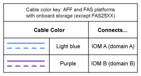

= Verkabelungspläne für DS212C, DS224C oder DS460C Shelves mit internen Storage-Plattformen
:allow-uri-read: 
:icons: font
:imagesdir: ../media/

[role="lead"]
Die ausgefüllten Arbeitsblätter zur Controller-zu-Stack-Verkabelung und die Verkabelungsbeispiele ermöglichen die Verkabelung von Plattformen mit internem Speicher. Dies gilt für Shelves mit IOM12, IOM12B oder IOM12C Modulen.

* Bei Bedarf können Sie sich auf beziehen link:install-cabling-rules.html["SAS-Verkabelungsregeln und -Konzepte"] Weitere Informationen zu unterstützten Konfigurationen, Shelf-zu-Shelf-Konnektivität und Controller-zu-Shelf-Konnektivität
* Beispiele für Verkabelungen zeigen Controller-zu-Stack-Kabel als solide oder gestrichelt, um Controller-0b/0b1-Port-Verbindungen von Controller-0a-Port-Verbindungen zu unterscheiden.
+
image::../media/drw_fas2600_controller_to_stack_cable_type_key_IEOPS-947.svg[Kabelschlüssel für Plattformen mit integriertem Speicher]

* Verkabelungsbeispiele zeigen Controller-zu-Stack-Verbindungen und Shelf-zu-Shelf-Verbindungen in zwei verschiedenen Farben, um die Konnektivität durch IOM A (Domäne A) und IOM B (Domäne B) zu unterscheiden.
+

== FAS2820 Plattform in einer Multipath HA-Konfiguration ohne externe Shelfs

Das folgende Beispiel zeigt, dass für eine Multipath HA-Konnektivität keine Verkabelung erforderlich ist:

image::../media/drw_fas2800_noshelf_mpha_IEOPS-954.svg[FAS2820 Multipath HA ohne externe Shelfs]

== FAS2820 Plattform in einer HA-Konfiguration mit drei Pfaden ohne externe Shelfs

Das folgende Verkabelungsbeispiel zeigt die erforderliche Verkabelung zwischen den beiden Controllern, um eine Tri-Path-Konnektivität zu erreichen:

image::../media/drw_fas2800_noshelf_tpha_IEOPS-955.svg[Fas2800 Tri-Path HA-Verkabelung Beispiel ohne externe Regale]

== FAS2820 Plattform in einer Multipath HA-Konfiguration mit einem Multi-Shelf Stack

Im folgenden Arbeitsblatt und in der Verkabelung wird das Portpaar 0a/0b1 verwendet:

image::../media/drw_fas2800_worksheet_IEOPS-948.svg[FAS2820 Arbeitsblatt für die HA-Verkabelung mit drei Pfaden, die Port-Paare für Stack 1 zeigen]

image::../media/drw_fas2800_withshelves_tpha_IEOPS-949.svg[FAS2820 HA-Verkabelung von drei Pfaden zu einem Stack]

== Plattformen mit internem Storage in einer Multipath HA-Konfiguration mit einem Multi-Shelf Stack

Im folgenden Arbeitsblatt und Verkabelungsbeispiel werden Port-Paar 0a/0b verwendet:

NOTE: Dieser Abschnitt gilt nicht für FAS2820 Systeme.

image::../media/drw_fas2600_mpha_worksheet_IEOPS-1255.svg[Arbeitsblatt für die Multipath HA-Verkabelung für Plattformen mit internem Storage und einem Stack]

image::../media/drw_fas2600_mpha_IEOPS-1256.svg[Beispiel: Multipath HA-Verkabelung bei Plattformen mit internem Storage]
