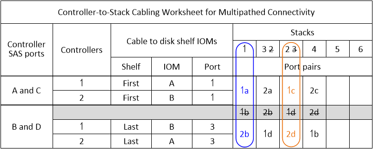

= Verkabelungsarbeitsblätter für Multipath-HA-Konfigurationen – DS212C, DS224C oder DS460C
:allow-uri-read: 
:icons: font
:imagesdir: ../media/

[role="lead"]
Sie können die Arbeitsblätter und Verkabelungsbeispiele zur Controller-Stack-Verkabelung verwenden, um Ihr HA-Paar als Multipath-HA-Konfiguration zu verkabeln. Dies gilt für Shelves mit IOM12/IOM12B-Modulen.

NOTE: Diese Informationen gelten für Plattformen ohne internen Speicher.

* Bei Bedarf können Sie sich auf beziehen link:install-cabling-rules.html["SAS-Verkabelungsregeln und -Konzepte"] Weitere Informationen zu unterstützten Konfigurationen finden Sie auf der Konvention zur Nummerierung von Controller-Steckplätzen, Shelf-to-Shelf-Konnektivität und Controller/Shelf-Konnektivität (einschließlich der Verwendung von Port-Paaren).
* Bei Bedarf können Sie sich auf beziehen link:install-cabling-worksheets-how-to-read-multipath.html["Lesen eines Arbeitsblatts zur Verkabelung von Controller-zu-Stack-Verbindungen für Multipath-Konnektivität"].
* Verkabelungsbeispiele zeigen Kabel zwischen Controller und Stack als fest oder gestrichelt, um Controller A- und C-Port-Verbindungen von Controller B- und D-Port-Verbindungen zu unterscheiden.
+
image::../media/drw_controller_to_stack_cable_type_key.gif[Schlüssel des Multipath HA-Konfigurationskabels]

* Kabel in den Verkabelungsbeispielen und den entsprechenden Port-Paaren in den Worksheets werden farbcodiert, um die Konnektivität zu jedem Stack im HA-Paar zu unterscheiden.
+

* Arbeitsblätter und Beispiele für Verkabelung zeigen die Port-Paare in der Reihenfolge an, in der sie im Arbeitsblatt aufgeführt sind.

== Verkabelungsarbeitsblätter und Beispiele für Controller-to-Stack für Multipath HA-Konfigurationen mit Quad Port SAS HBAs

Sie können die ausgefüllten Verkabelungsarbeitsblätter und Beispiele für Controller zum Stack verwenden, um allgemeine Multipath HA-Konfigurationen mit Quad-Port SAS HBAs zu verkabeln. Diese Controller haben keine integrierten SAS-Ports.

=== Multipath HA mit einem Quad-Port SAS HBA und einem Single-Shelf Stack

Im folgenden Arbeitsblatt und Verkabelungsbeispiel wird das Port-Paar 1a/1d verwendet:

image::../media/drw_worksheet_mpha_slot_1_one_4porthba_one_singleshelf_stack.gif[Arbeitsblatt für die Multipath HA-Verkabelung für einen Quad Port SAS HBA und einen einzelnen Shelf-Stack]

image::../media/drw_mpha_slot_1_one_4porthba_one_singleshelf_stack.gif[Beispiel für eine Multipath HA-Verkabelung bei einem SAS HBA mit vier Ports und einem einzelnen Shelf-Stack]

=== Multipath HA mit einem Quad-Port-SAS-HBA und zwei Single-Shelf-Stacks

Im folgenden Arbeitsblatt und Verkabelungsbeispiel werden die Port-Paare 1a/1d und 1c/1b verwendet:

image::../media/drw_worksheet_mpha_slot_1_one_4porthba_two_singleshelf_stacks.gif[Arbeitsblatt für die Multipath HA-Verkabelung für einen SAS HBA mit vier Ports und zwei einzelne Shelf-Stacks]

image::../media/drw_mpha_slot_1_one_4porthba_two_singleshelf_stacks.gif[Beispiel für eine Multipath HA-Verkabelung bei einem SAS HBA mit vier Ports und zwei einzelnen Shelf-Stacks]

=== Multipath HA mit zwei Quad-Port SAS HBAs und zwei Multi-Shelf-Stacks

Für diese Konfiguration sind vier Portpaare verfügbar: 1a/2b, 2a/1d, 1c/2d und 2c/1b. Sie können Port-Paare in der Reihenfolge, in der sie identifiziert werden (aufgeführt im Arbeitsblatt) oder Sie können jedes andere Port-Paar (überspringen Port-Paare) verkabeln.

NOTE: Wenn Sie mehr Port-Paare haben, als Sie die Stacks in Ihrem System verkabeln müssen, sollten Sie die Best Practice Port-Paare überspringen, um die SAS-Ports auf Ihrem System zu optimieren. Durch die Optimierung von SAS-Ports optimieren Sie die Performance Ihres Systems.

Das folgende Arbeitsblatt und das folgende Verkabelungsbeispiel zeigen Portpaare, die in der Reihenfolge verwendet werden, in der sie im Arbeitsblatt aufgeführt sind: 1a/2b, 2a/1d, 1c/2d und 2c/1b.

image::../media/drw_worksheet_mpha_slots_1_and_2_two_4porthbas_two_stacks.gif[Arbeitsblatt für die Multipath HA-Verkabelung für zwei SAS HBAs mit vier Ports und zwei Multi-Shelf-Stacks]

image::../media/drw_mpha_slots_1_and_2_4porthbas_4_stacks.gif[Beispiel für eine Multipath HA-Verkabelung bei zwei SAS HBAs mit vier Ports und zwei Multi-Shelf-Stacks]

Das folgende Arbeitsblatt und das folgende Verkabelungsbeispiel zeigen, dass Portpaare übersprungen werden, um alle anderen in der Liste zu verwenden: 1a/2b und 1c/2d.

NOTE: Wenn später ein dritter Stapel hinzugefügt wird, verwenden Sie das Portpaar, das übersprungen wurde.

image::../media/drw_mpha_slots_1_and_2_two_4porthbas_two_stacks_skipped.gif[Beispiel für eine Multipath HA-Verkabelung bei zwei SAS HBAs mit vier Ports und zwei Multi-Shelf-Stacks mit übersprungenen Port-Paaren]

== Verkabelungsarbeitsblätter und Beispiele für Controller-to-Stack für Multipath HA-Konfigurationen mit vier integrierten SAS-Ports

Sie können die ausgefüllten Verkabelungsarbeitsblätter und Beispiele für Controller nach Stack verwenden, um allgemeine Multipath HA-Konfigurationen mit vier integrierten SAS-Ports zu verkabeln.

=== Multipath HA mit vier integrierten SAS-Ports und einem Single Shelf Stack

Im folgenden Arbeitsblatt und Kabel-Beispiel wird Port-Paar 0a/0d verwendet:

image::../media/drw_worksheet_mpha_slot_0_4ports_one_singleshelf_stack.gif[Arbeitsblatt für die Multipath HA-Verkabelung für vier integrierte Ports und einen einzelnen Shelf-Stack]

image::../media/drw_mpha_slot_0_4ports_one_singleshelf_stack.gif[Beispiel für eine Multipath HA-Verkabelung für vier integrierte Ports und einen einzelnen Shelf-Stack]

=== Multipath HA mit vier integrierten SAS-Ports und zwei Single Shelf-Stacks

Im folgenden Arbeitsblatt und Kabel-Beispiel werden Port-Paare 0a/0d und 0c/0b verwendet:

image::../media/drw_worksheet_mpha_slot_0_4ports_two_singleshelf_stacks.gif[Arbeitsblatt zur Multipath HA-Verkabelung für vier integrierte Ports und zwei einzelne Shelf-Stacks]

image::../media/drw_mpha_slot_0_4ports_two_singleshelf_stacks.gif[Beispiel für eine Multipath HA-Verkabelung für vier integrierte Ports und zwei einzelne Shelf-Stacks]

=== Multipath HA mit vier integrierten SAS-Ports, einem Quad-Port SAS HBA und zwei Multi-Shelf-Stacks

Für diese Konfiguration sind vier Port-Paare verfügbar: 0a/1b, 1a/0d, 0c/1d und 1c/0b. Sie können Port-Paare in der Reihenfolge, in der sie identifiziert werden (aufgeführt im Arbeitsblatt) oder Sie können jedes andere Port-Paar (überspringen Port-Paare) verkabeln.

NOTE: Wenn Sie mehr Port-Paare haben, als Sie die Stacks in Ihrem System verkabeln müssen, sollten Sie die Best Practice Port-Paare überspringen, um die SAS-Ports auf Ihrem System zu optimieren. Durch die Optimierung von SAS-Ports optimieren Sie die Performance Ihres Systems.

Im folgenden Arbeitsblatt und Verkabelungsbeispiel sind Port-Paare aufgeführt, die in der Reihenfolge verwendet werden, in der sie im Arbeitsblatt aufgeführt sind: 0a/1b, 1a/0d, 0c/1d und 1c/0b.

image::../media/drw_worksheet_mpha_slots_0_and_1_8ports_4stacks.gif[Arbeitsblatt für die Multipath HA-Verkabelung für vier integrierte SAS Ports, SAS HBA mit vier Ports und zwei Multi-Shelf-Stacks]

image::../media/drw_mpha_slots_0_and_1_8ports_4_stacks.gif[Beispiel für eine Multipath HA-Verkabelung mit vier integrierten SAS Ports, einem SAS HBA mit vier Ports und zwei Multi-Shelf-Stacks]

Im folgenden Arbeitsblatt und Verkabelungsbeispiel werden Port-Paare angezeigt, die nicht ausgelassen werden, um alle anderen in der Liste zu verwenden: 0a/1b und 0c/1d.

NOTE: Wenn später ein dritter Stapel hinzugefügt wird, verwenden Sie das Portpaar, das übersprungen wurde.

image::../media/drw_worksheet_mpha_slots_0_and_1_8ports_two_stacks_skipped.gif[Arbeitsblatt für die Multipath HA-Verkabelung für vier Onboard Ports, SAS HBA mit vier Ports und zwei Multi-Shelf-Stacks mit übersprungenen Port-Paaren]

image::../media/drw_mpha_slots_0_and_1_8ports_two_stacks_skipped.gif[Beispiel für eine Multipath HA-Verkabelung für vier Onboard Ports, einen SAS HBA mit vier Ports und zwei Multi-Shelf-Stacks mit übersprungenen Port-Paaren]
