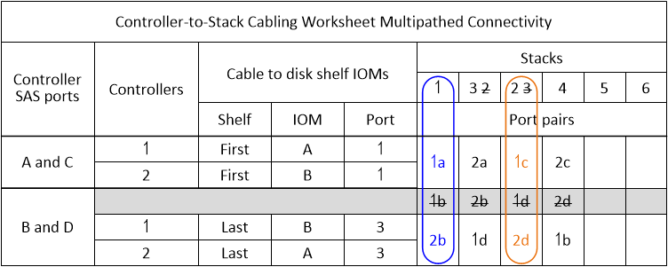
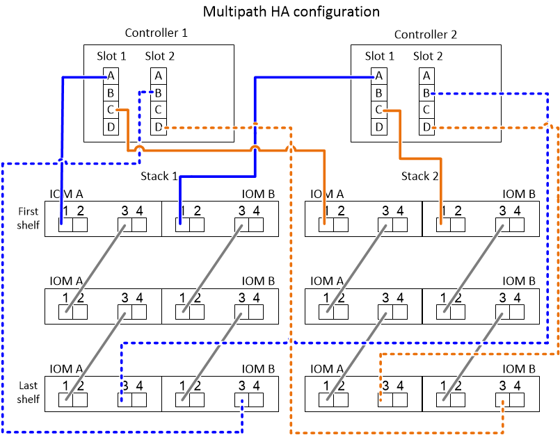

= Lesen eines Arbeitsblatts zur Verkabelung von Controller-zu-Stack-Verbindungen für multipathed Konnektivität - Regale mit IOM12/IOM12B-Modulen
:allow-uri-read: 
:icons: font
:imagesdir: ../media/

[role="lead"]
Mit diesem Beispiel können Sie die Vorgehensweise beim Lesen und Anwenden eines ausgefüllten Arbeitsblatts erläutern, um Controller-zu-Stack-Verbindungen für Platten-Shelves mit IOM12/IOM12B-Modulen für Multipath-Konnektivität zu verkabeln.

.Bevor Sie beginnen
Wenn Sie über eine Plattform mit internem Speicher verfügen, verwenden Sie das folgende Arbeitsblatt:

link:install-cabling-worksheets-examples-fas2600.html["Verkabelungsarbeitsblätter und Beispiele für Plattformen mit internem Storage für den Controller-to-Stack-Stack"]

.Über diese Aufgabe
* Gehen Sie wie folgt vor, um ein Arbeitsblatt und eine Verkabelung zu lesen, um Verbindungen zwischen Controller und Stack zu verkabeln.
+
Die in diesem Beispiel verwendete Konfiguration ist eine Multipath HA-Konfiguration mit zwei Quad-Port SAS HBAs (acht SAS-Ports) auf jedem Controller und zwei Platten-Shelfs mit IOM12/IOM12B-Modulen. Port-Paare werden verkabelt, indem sie jedes andere Port-Paar im Arbeitsblatt überspringen.

+

NOTE: Wenn Sie mehr Port-Paare haben, als Sie die Stacks in Ihrem System verkabeln müssen, sollten Sie die Best Practice Port-Paare überspringen, um die SAS-Ports auf Ihrem System zu optimieren. Durch die Optimierung von SAS-Ports optimieren Sie die Performance Ihres Systems.

* Wenn Sie eine Single-Controller-Konfiguration haben, überspringen Sie die Unterschritte b und d für die Verkabelung zu einem zweiten Controller.
* Bei Bedarf können Sie sich auf beziehen link:install-cabling-rules.html["SAS-Verkabelungsregeln und -Konzepte"] Weitere Informationen zur Nummerierung der Controller-Steckplätze, Shelf-zu-Shelf-Konnektivität und Controller/Shelf-Konnektivität (einschließlich der Verwendung von Port-Paaren)

Die Port-Paare sind über jedes andere Port-Paar im Arbeitsblatt verkabelt: 1a/2b und 1c/2d.

.Schritte
. Kabel-Port-Paar 1a/2b an jedem Controller zu Stack 1:
+
.. Kabel-Controller 1-Port 1a zu Stack 1, erstes Shelf-IOM A-Port 1.
.. Verkabeln Sie Controller 2-Port 1a mit Stack 1, erster Shelf-IOM B-Port 1.
.. Kabel-Controller 1-Port 2b zu Stack 1, letzter Shelf IOM B-Port 3.
.. Kabel-Controller 2-Port 2b zu Stack 1, letztes Shelf IOM A-Port 3.

. Kabel-Port-Paar 1c/2d auf jedem Controller zu Stack 2:
+
.. Kabel-Controller 1-Port 1c zu Stack 2, erstes Shelf-IOM A-Port 1.
.. Kabel-Controller 2-Port 1c zu Stack 2, erster Shelf-IOM B-Port 1.
.. Kabel-Controller 1-Port 2d zu Stack 2, letzter Shelf IOM B-Port 3.
.. Kabel-Controller 2-Port 2d zu Stack 2, letztes Shelf IOM A-Port 3.

