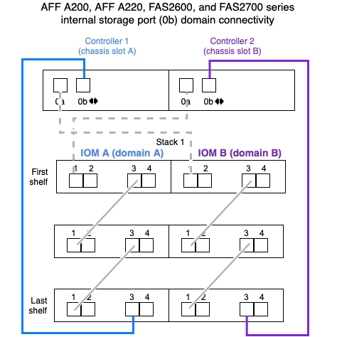

= SAS-Verkabelungsregeln – Shelfs mit IOM12/IOM12B-Modulen
:allow-uri-read: 
:icons: font
:imagesdir: ../media/

[role="lead"]
Platten-Shelfs mit IOM12/IOM12B-Modulen können unter Anwendung der SAS-Verkabelungsregeln in HA-Paar- und Single-Controller-Konfigurationen (für unterstützte Plattformen) verkabelt werden: Konfigurationsregeln, Controller-Slot-Nummerierungsregeln, Shelf-to-Shelf-Verbindungsregeln, Controller-to-Stack-Verbindungsregeln und gegebenenfalls optische Kabelregeln für Mini-SAS HD SAS.

NOTE: Die in diesem Leitfaden beschriebenen Regeln für die SAS-Verkabelung zu den Nummerierungsregeln für Controller-Steckplätze, Shelf-to-Shelf-Verbindungsregeln und die in diesem Leitfaden beschriebenen Regeln für alle SAS-Platten-Shelves gelten, unabhängig davon, ob sie IOM12/IOM12B, IOM6 oder IOM3-Module besitzen. Die Informationen in diesem Leitfaden betreffen jedoch die einzigartigen Eigenschaften von Platten-Shelfs mit IOM12-Modulen und ihre Verwendung in unterstützten Konfigurationen.

Die in diesem Leitfaden beschriebenen SAS-Verkabelungsregeln zu Konfigurationsregeln und optischen Mini-SAS-HD-SAS-SAS-Kabelregeln gelten speziell für Platten-Shelves mit IOM12/IOM12B-Modulen.

Die in diesem Leitfaden beschriebenen SAS-Verkabelungsregeln ausgleichen SAS-Ports zwischen integrierten SAS-Ports und SAS-Ports für Host Bus Adapter, um hochverfügbare Storage Controller-Konfigurationen bereitzustellen und folgende Ziele zu erreichen:

* Einen einzigen, leicht verständlichen universellen Algorithmus für alle SAS-Produkte und -Konfigurationen bereitstellen
* Geben Sie die gleiche physische Verkabelung bei der Erstellung der Stückliste (Stückliste), gefolgt im Werk und im Feld ein
* Werden durch Software und Tools zur Konfigurationsprüfung überprüfbar
* Sorgen Sie für maximale Ausfallsicherheit, um die Verfügbarkeit aufrechtzuerhalten und die Abhängigkeit von Controller-Takeovers zu minimieren

Sie sollten vermeiden, von den Regeln zu abweichen; Abweichungen können Zuverlässigkeit, Universalität und Gemeinsamkeit reduzieren.

== Konfigurationsregeln

Platten-Shelfs mit IOM12-Modulen werden bei spezifischen Typen von HA-Paar- und Single-Controller-Konfigurationen unterstützt.

NOTE: Die FAS25XX Plattformen werden in diesem Bereich nicht behandelt.

* HA-Paar-Konfigurationen müssen als Multipath HA oder Quad-Path HA-Konfigurationen mit den folgenden Ausnahmen verkabelt werden:
+
** Plattformen mit internem Storage, einschließlich FAS2600 Serie, AFF A200, FAS2700 Serie, AFF A220, Und später kann es als Single-Path-HA-Konfigurationen verkabelt werden, um die Verbindung zu einem externen SAS-Band-Backup-Gerät zu unterstützen.
** Plattformen mit internem Storage, einschließlich FAS2600 Serie, AFF A200, FAS2700 Serie, AFF A220, Und später, keine Unterstützung für Quad-Path HA-Konnektivität

* Single Controller-Konfigurationen müssen als Multipath- oder Quad-Path-Konfigurationen verkabelt werden, mit folgenden Ausnahmen:
+
** Single Controller-Konfigurationen der FAS2600 Serie (mit externen Festplatten-Shelfs) können als Single-Path-Konfigurationen verkabelt werden.
+
Da der interne Storage Single Path-Konnektivität verwendet, gibt ONTAP gelegentlich Warnungen aus, ob gemischte Pfade erkannt werden. Um diese Warnungen zu vermeiden, können Sie Single-Path-Verbindungen zu den externen Festplatten-Shelfs verwenden. Darüber hinaus können Sie Single-Path-Konnektivität verwenden, wenn ein externes SAS-Bandsicherungsgerät verwendet wird.

** Konfigurationen der Single Controller-Serie FAS2600 unterstützen keine Quad-Path-Konnektivität.

== Regeln für die Nummerierung von Controller-Steckplätzen

Zum Einsatz von Verkabelungsregeln für alle unterstützten HA-Paare und Single Controller-Konfigurationen wird eine Nummerierungskonvention für Controller-Steckplätze verwendet.

* Für alle HA-Paare und Single Controller-Konfigurationen gilt:
+
** Ein SAS-HBA in einem physischen PCI-Steckplatz wird als PCI-Steckplatz 1, 2, 3 usw. belegt, unabhängig vom physischen Etikett des Steckplatzes auf einem Controller.
+
Wenn beispielsweise SAS-HBAs physische PCI-Steckplätze 3, 5 und 7 belegt, würden sie als Steckplätze 1, 2 und 3 zur Anwendung der SAS-Verkabelungsregeln bezeichnet.

** Ein Onboard-SAS-HBA ist definiert als belegen PCI-Steckplatz 0, wie er auf einem Controller gekennzeichnet ist.
** Jeder Port in jedem Steckplatz ist so definiert, wie er auf einem Controller gekennzeichnet ist. Beispielsweise wird Steckplatz 0 mit zwei Ports als 0a und 0b bezeichnet. Steckplatz 1 mit vier Ports wird als 1a, 1b, 1c und 1d bezeichnet.
+
In diesem Dokument werden Steckplätze und Steckplatzanschlüsse wie folgt dargestellt:

+
image::../media/slot0_rules.png[Slot0-Regeln]

== Verbindungsregeln für Shelf-zu-Shelf

Wenn Sie mehr als ein Platten-Shelf in einem Stapel an Platten-Shelfs haben, werden diese über die jeweiligen SAS-Domänen (IOM A und IOM B) mit den entsprechenden Shelf-to-Shelf-Kabeln „`standard`“ oder „`double-wide`“ miteinander verbunden. Ihre Verwendung von Shelf-to-Shelf-Verkabelungen zwischen "`standard`" oder "`double-wide`" hängt von der Konfiguration ab.

=== Standard-Shelf-zu-Shelf-Konnektivität

* Die standardmäßigen Shelf-to-Shelf-Konnektivität wird in Multipath HA-, Multipath-, Single Path-Konfigurationen und Single Path-Konfigurationen verwendet.
* Shelf-to-Shelf-Konnektivität ist genau das, was in vorhandenen SAS-Storage-Konfigurationen mit IOM3- und IOM6-Modulen verwendet wird: Zwischen den Festplatten-Shelfs in jeder Domäne ist eine Kabelverbindung erforderlich – Domänen-A (IOM A) und Domäne B (IOM B).
* Als Best Practice wird empfohlen, die IOM-Ports 3 und 1 für die Standard-Shelf-Konnektivität zu verwenden.
+
Vom logischen ersten Shelf zum logischen letzten Shelf in einem Stack verbinden Sie IOM-Port 3 mit dem IOM-Port 1 des nächsten Shelfs in Domäne A und dann Domäne B.

image::../media/drw_shelf_to_shelf_standard.gif[drw-Shelf auf Shelf-Standard]

=== Doppelte breite Shelf-to-Shelf-Konnektivität

* Die doppelte Shelf-to-Shelf-Konnektivität wird in Quad-Pathed-Konfigurationen (Quad-Path HA und Quad-Path) verwendet.
* Für eine doppelte Shelf-to-Shelf-Konnektivität sind zwei Kabelverbindungen zwischen Festplatten-Shelfs in jeder Domäne – Domäne A (IOM A) und Domäne B (IOM B) erforderlich.
+
Die erste Kabelverbindung ist als Standard-Shelf-Konnektivität verkabelt (über IOM-Ports 3 und 1). Die zweite Kabelverbindung ist als doppelte Shelf-Verbindung verkabelt (über die IOM-Ports 4 und 2).

+
Vom logischen ersten Shelf zum logischen letzten Shelf in einem Stack verbinden Sie IOM-Port 3 mit dem IOM-Port 1 des nächsten Shelfs in Domäne A und dann Domäne B. Vom logischen ersten Shelf zum logischen letzten Shelf in einem Stack verbinden Sie IOM-Port 4 mit dem IOM-Port 2 des nächsten Shelfs in Domäne A und dann Domäne B. (IOM-Ports, die als doppelte Verbindung verkabelt sind, werden mit blau angezeigt.)

image::../media/drw_shelf_to_shelf_double_wide.gif[drw-Shelf für doppelt breite Einlegeboden]

== Verbindungsregeln für Controller zu Stack

Sie können die SAS-Verbindungen von jedem Controller korrekt mit jedem Stack in einem HA-Paar oder in einer Single-Controller-Konfiguration verkabeln, indem Sie verstehen, dass SAS-Platten-Shelves softwarebasierte Platten-Ownership verwenden, wie die Controller-Ports A/C und B/D mit Stacks verbunden sind, Wie die Controller-Ports A/C und B/D in Port-Paaren organisiert sind und wie Plattformen mit internem Storage ihre Controller-Ports mit Stacks verbunden haben.

=== Softwarebasierte Platten-Shelf-Besitzregel für die SAS-Festplatten

SAS-Festplatten-Shelfs verwenden softwarebasierte Platten-Eigentumsrechte (keine hardwarebasierte Eigentumsrechte). Das bedeutet, dass das Festplatteneigentum auf dem Festplattenlaufwerk gespeichert wird und nicht durch die Topologie der physischen Verbindungen des Storage-Systems bestimmt wird (wie es sich um Hardware-basierte Festplattenbesitzer handelt). Insbesondere wird die Eigentümerschaft der Festplatte von ONTAP (automatisch oder über CLI-Befehle) zugewiesen, nicht indem Sie die Controller-zu-Stack-Verbindungen verkabeln.

SAS-Festplatten-Shelfs sollten niemals über das hardwarebasierte Eigentumsschema für Festplatten verkabelt werden.

=== Regeln für die Verbindung von Controller A und C Ports (für Plattformen ohne internen Speicher)

* A- und C-Ports sind immer die primären Pfade zu einem Stack.
* A- und C-Ports stellen immer eine Verbindung zum logischen ersten Festplatten-Shelf in einem Stack her.
* A- und C-Ports stellen immer eine Verbindung zu IOM-Ports für Festplatten-Shelfs 1 und 2 her.
+
IOM Port 2 wird nur für HA- und Quad-Path-Konfigurationen mit Quad-Path verwendet.

* Controller 1 A- und C-Ports stellen immer eine Verbindung zu IOM A (Domäne A) her.
* Controller 2 A- und C-Ports stellen immer eine Verbindung zu IOM B (Domäne B) her.

Die folgende Abbildung zeigt, wie Controller-Ports A und C in einer Multipath HA-Konfiguration mit einem Quad Port HBA und zwei Festplatten-Shelfs verbunden sind. Die Anschlüsse zum Stapel 1 werden blau angezeigt. Die Verbindungen zum Stapel 2 werden orange dargestellt.

image::../media/drw_controller_to_stack_rules_ports_a_and_c_example.gif[drw-Controller für Stapelregeln Ports a und c Beispiel]

=== Regeln für die Verbindung von Controller B und D-Ports (für Plattformen ohne internen Storage)

* B- und D-Ports sind immer die sekundären Pfade zu einem Stack.
* B- und D-Ports stellen immer eine Verbindung zum logischen letzten Festplatten-Shelf im Stack her.
* B- und D-Ports verbinden immer mit IOM-Ports für Festplatten-Shelfs 3 und 4.
+
IOM Port 4 wird nur für HA- und Quad-Path-Konfigurationen verwendet.

* Controller 1 B- und D-Ports stellen immer eine Verbindung zu IOM B (Domäne B) her.
* Controller 2 B- und D-Ports stellen immer eine Verbindung zu IOM A (Domäne A) her.
* B- und D-Ports werden mit den Stacks verbunden, indem die Reihenfolge der PCI-Steckplätze durch einen ersetzt wird, so dass der erste Port am ersten Steckplatz zuletzt verkabelt ist.

Die folgende Abbildung zeigt, wie Controller-Ports B und D in einer Multipath HA-Konfiguration mit einem Quad-Port HBA und zwei Festplatten-Shelfs verbunden werden. Die Anschlüsse zum Stapel 1 werden blau angezeigt. Die Verbindungen zum Stapel 2 werden orange dargestellt.

image::../media/drw_controller_to_stack_rules_ports_b_and_d_example.gif[drw-Controller zu stapeln Regeln die Ports b und d Beispiel]

=== Verbindungsregeln für Port-Paare (für Plattformen ohne internen Speicher)

Controller SAS-Ports A, B, C und D werden mithilfe einer Methode in Port-Paare organisiert, die alle SAS-Ports für Systemstabilität und -Konsistenz nutzt, wenn Sie Controller-zu-Stack-Verbindungen in HA-Paar- und Single-Controller-Konfigurationen verkabeln.

* Port-Paare bestehen aus einem Controller A oder C SAS-Port und einem Controller B oder D SAS-Port.
+
A- und C-SAS-Ports werden mit dem logischen ersten Shelf in einem Stack verbunden. B- und D-SAS-Ports werden mit dem logischen letzten Shelf in einem Stack verbunden.

* Port-Paare verwenden alle SAS Ports auf jedem Controller in Ihrem System.
+
Sie steigern die Ausfallsicherheit des Systems, indem Sie alle SAS Ports (einen HBA in einem physischen PCI-Steckplatz [Steckplatz 1–N] und den Controller [Steckplatz 0]) in Port-Paare integrieren. Schließen Sie keine SAS-Ports aus.

* Port-Paare werden wie folgt identifiziert und organisiert:
+
.. Listen Sie A-Ports und dann C-Ports in der Reihenfolge der Steckplätze auf (0,1, 2, 3 usw.).
+
Beispiel: 1a, 2a, 3a, 1c, 2c, 3c

.. Listen Sie B-Ports und anschließend D-Ports in der Reihenfolge der Steckplätze auf (0,1, 2, 3 usw.).
+
Beispiel: 1b, 2b, 3b, 1d, 2d, 3d

.. Schreiben Sie die Liste der Anschlüsse D und B neu, sodass der erste Port in der Liste zum Ende der Liste verschoben wird.
+
Beispiel: image:../media/drw_gen_sas_cable_step2.png[""]

+
Wenn mehr als ein Steckplatz mit SAS-Ports zur Verfügung steht, wird die Reihenfolge der Steckplätze durch ein Gleichgewicht zwischen Port-Paaren und mehreren Steckplätzen ausgeglichen (physische PCI-Steckplätze und integrierte Steckplätze). So wird verhindert, dass ein Stack mit einem einzelnen SAS HBA verbunden wird.

.. Koppeln Sie Die A- und C-Ports (aufgeführt in Schritt 1) mit den D- und B-Ports (aufgeführt in Schritt 2) in der Reihenfolge, in der sie aufgeführt sind.
+
Beispiel: 1a/2b, 2a/3b, 3a/1d, 1c/2d, 2c/3d, 3c/1b.

+

NOTE: Für ein HA-Paar gilt die Liste der Port-Paare, die Sie für den ersten Controller identifizieren, auch für den zweiten Controller.

* Bei der Verkabelung Ihres Systems können Sie Portpaare in der Reihenfolge verwenden, in der Sie sie identifiziert haben, oder Sie können Portpaare überspringen:
+
** Verwenden Sie Portpaare in der Reihenfolge, in der Sie sie identifiziert (aufgelistet) haben, wenn alle Portpaare benötigt werden, um die Stacks in Ihrem System zu verkabeln.
+
Wenn Sie beispielsweise sechs Portpaare für Ihr System identifiziert haben und sechs Stapel als Multipath verkabelt haben, verkabeln Sie die Portpaare in der Reihenfolge, in der Sie sie aufgeführt haben:

+
1a/2b, 2a/3b, 3a/1d, 1c/2d, 2c/3d, 3c/1b

** Überspringen Sie Port-Paare (verwenden Sie jedes andere Port-Paar), wenn nicht alle Port-Paare benötigt werden, um die Stacks in Ihrem System zu verkabeln.
+
Wenn Sie beispielsweise sechs Portpaare für Ihr System identifiziert haben und drei Stacks als Multipath verkabelt werden müssen, müssen Sie jedes andere Portpaar in Ihrer Liste verkabeln:

+
image::../media/drw_portpair_connection_rules_list_skip.gif[drw Portpaar Verbindungsregeln Liste überspringen]

+

NOTE: Wenn Sie mehr Port-Paare haben, als Sie die Stacks in Ihrem System verkabeln müssen, sollten Sie die Best Practice Port-Paare überspringen, um die SAS-Ports auf Ihrem System zu optimieren. Durch die Optimierung von SAS-Ports optimieren Sie die Performance Ihres Systems.

Verkabelungsarbeitsblätter für Controller-to-Stack sind bequeme Tools für die Identifizierung und Organisation von Port-Paaren, sodass Sie die Verbindungen zwischen Controller und Stack für Ihre HA-Paar- oder Single-Controller-Konfiguration verkabeln können.

link:install-cabling-worksheet-template-multipath.html["Vorlage für das Verkabelungsarbeitsblatt für den Controller-zu-Stack für Multipath-Konnektivität"]

link:install-cabling-worksheet-template-quadpath.html["Vorlage für Verkabelungsarbeitsblatt für den Controller-zu-Stack für Quad-Pathed-Konnektivität"]

=== Verbindungsregeln für Controller 0b und 0a Port für Plattformen mit internem Storage

Plattformen mit internem Storage, einschließlich FAS2600 Serie, AFF A200, FAS2700 Serie, AFF A220, Und später sollten spezielle Verbindungsregeln gelten, da jeder Controller dieselbe Domänenkonnektivität zwischen dem internen Speicher (Port 0b) und dem Stack aufrechterhalten muss. Dies bedeutet, dass, wenn sich ein Controller in Steckplatz A des Chassis (Controller 1) befindet, er sich in Domäne A (IOM A) befindet und daher Port 0b mit IOM A im Stack verbinden muss. Wenn sich ein Controller in Steckplatz B des Chassis (Controller 2) befindet, befindet er sich in Domäne B (IOM B). Daher muss Port 0b mit IOM B im Stack verbunden werden.

NOTE: Die FAS25XX Plattformen werden in diesem Bereich nicht berücksichtigt.

NOTE: Wenn Sie den Port 0b nicht mit der richtigen Domäne (Cross-Connect-Domänen) verbinden, setzen Sie das System mit Stabilitätsproblemen konfrontiert, die eine sichere Ausführung von unterbrechungsfreien Abläufen verhindern.

* Controller 0b Port (interner Storage-Port):
+
** Controller 1 0b Port stellt immer eine Verbindung mit IOM A (Domäne A) her.
** Controller 2 0b Port stellt immer eine Verbindung mit IOM B (Domäne B) her.
** Port 0b ist immer der primäre Pfad.
** Port 0b stellt immer eine Verbindung mit dem logischen letzten Festplatten-Shelf in einem Stack her.
** Port 0b stellt immer eine Verbindung mit Festplatten-Shelf-IOM-Port 3 her.

* Controller 0a Port (interner HBA-Port):
+
** Controller 1 0a Port stellt immer eine Verbindung zu IOM B (Domäne B) her.
** Controller 2 0a Port stellt immer eine Verbindung mit IOM A (Domäne A) her.
** Port 0a ist immer der sekundäre Pfad.
** Port 0a stellt immer eine Verbindung zum logischen ersten Festplatten-Shelf in einem Stack her.
** Port 0a stellt immer eine Verbindung zu Festplatten-Shelf-IOM-Port 1 her.

Die folgende Abbildung zeigt die Konnektivität der internen Storage Port-Domäne (0b) für eine FAS2600 Serie, AFF A200, FAS2700 Serie, AFF A220 und höher für Multipath HA-Konfiguration:

== Kabelregeln für optische Mini-SAS-HD-SAS-Kabel

Sie können Mini-SAS-HD-SAS-optische Kabel verwenden - Multimode-Aktivkabel (AOC) mit Mini-SAS-HD-zu-Mini-SAS-HD-Anschlüssen und OM4-Breakout-Kabeln mit Mini-SAS-HD-zu-LC-Anschlüssen - für SAS-Verbindungen über große Entfernungen bei bestimmten Konfigurationen mit Platten-Shelves mit IOM12-Modulen.

* Ihre Plattform und Version von ONTAP müssen den Einsatz von Mini-SAS HD SAS optischen Kabeln unterstützen: Multimode-Aktivkabel (AOC) mit Mini-SAS-HD-zu-Mini-SAS-HD-Anschlüssen und Multimode-Breakout-Kabeln (OM4) mit Mini-SAS-HD-zu-LC-Anschlüssen.
+
https://hwu.netapp.com["NetApp Hardware Universe"]

* Optische SAS-Multimode-AOC-Kabel mit Mini-SAS-HD-Mini-SAS-HD-Anschlüssen können für Controller-Stack- und Shelf-to-Shelf-Verbindungen verwendet werden und sind in einer Länge von bis zu 50 Metern erhältlich.
* Wenn Sie SAS-OM4-Breakout-Kabel (optical Multimode) mit Mini-SAS-HD-to-LC-Anschlüssen (für Patchpanels) verwenden, gelten die folgenden Regeln:
+
** Diese Kabel können für Controller-/Stack- und Shelf-zu-Shelf-Verbindungen verwendet werden.
+
Wenn Sie Multimode-Breakout-Kabel für Shelf-Verbindungen verwenden, können Sie diese Kabel nur einmal in einem Festplatten-Shelf-Stack verwenden. Um die verbleibenden Shelf-zu-Shelf-Verbindungen zu verbinden, müssen Sie Multimode-AOC-Kabel verwenden.

+
Wenn Sie für Quad-Path-Konfigurationen und Quad-Path-Konfigurationen Multimode-Breakout-Kabel für die doppelten Shelf-Verbindungen zwischen zwei Platten-Shelves verwenden, empfiehlt es sich, identische Breakout-Kabel zu verwenden.

** Sie müssen alle acht (vier Paare) der LC-Breakout-Anschlüsse an das Patchfeld anschließen.
** Sie müssen die Patch-Panels und Kabel zwischen den Schalttafeln bereitstellen.
+
Die Kabel zwischen den Schaltern müssen den gleichen Modus wie das Breakout-Kabel sein: OM4 Multimode.

** Bis zu ein Paar Patch Panels können in einem Pfad verwendet werden.
** Der Punkt-zu-Punkt-Pfad (Mini-SAS HD-to-Mini-SAS HD) eines beliebigen Multimode-Kabels darf 100 Meter nicht überschreiten.
+
Der Pfad umfasst den Satz von Breakout-Kabeln, Patch-Panels und Kabel zwischen den Schalttafeln.

** Der gesamte End-to-End-Pfad (Summe der Point-to-Point-Pfade vom Controller zum letzten Shelf) darf nicht mehr als 300 Meter umfassen.
+
Der Gesamtpfad umfasst die Kabelgruppe für Breakout-Kabel, Patch-Panels und Kabel zwischen den Schalttafeln.

* Bei den SAS-Kabeln können SAS-Kupfer, optische SAS-Kabel oder eine Kombination aus beidem sein.
+
Wenn Sie eine Mischung aus SAS-Kupferkabeln und optischen SAS-Kabeln verwenden, gelten die folgenden Regeln:

+
** Die Shelf-zu-Shelf-Verbindungen in einem Stack müssen alle SAS-Kupferkabel oder alle optischen SAS-Kabel sein.
** Wenn es sich bei den Shelf-zu-Shelf-Verbindungen um optische SAS-Kabel handelt, müssen die Verbindungen zwischen Controller und Stack zu diesem Stack auch optische SAS-Kabel sein.
** Wenn es sich bei den Shelf-zu-Shelf-Verbindungen um SAS-Kupferkabel handelt, können die Controller-zu-Stack-Verbindungen zu diesem Stack aus optischen SAS-Kabeln oder SAS-Kupferkabeln bestehen.

