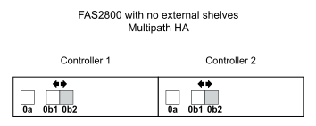
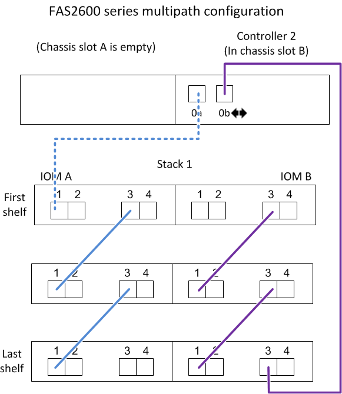

= Verkabelungsarbeitsblätter und Verkabelungsbeispiele für Plattformen mit internem Speicher - Regale mit IOM12/IOM12B-Modulen
:allow-uri-read: 
:icons: font
:imagesdir: ../media/

[role="lead"]
Sie können die vollständigen Controller-to-Stack-Verkabelungs-Worksheets und Verkabelungsbeispiele verwenden, um Plattformen mit internem Speicher zu verkabeln.

NOTE: Diese Informationen gelten nicht für Plattformen des FAS25XX.

* Bei Bedarf können Sie sich auf beziehen link:install-cabling-rules.html["SAS-Verkabelungsregeln und -Konzepte"] Weitere Informationen zu unterstützten Konfigurationen, Shelf-zu-Shelf-Konnektivität und Controller-zu-Shelf-Konnektivität
* Beispiele für Verkabelungen zeigen Controller-zu-Stack-Kabel als solide oder gestrichelt, um Controller-0b/0b1-Port-Verbindungen von Controller-0a-Port-Verbindungen zu unterscheiden.
+
image::../media/drw_fas2600_controller_to_stack_cable_type_key_IEOPS-947.svg[drw fas2600 Controller zu Stack Kabeltyp Schlüssel IEOPS 947]

* Verkabelungsbeispiele zeigen Controller-zu-Stack-Verbindungen und Shelf-zu-Shelf-Verbindungen in zwei verschiedenen Farben, um die Konnektivität durch IOM A (Domäne A) und IOM B (Domäne B) zu unterscheiden.
+
image::../media/drw_fas2600_cable_color_key.png[drw fas2600-Kabelfarbschlüssel]

== FAS2800 Plattform in einer Multipath HA-Konfiguration ohne externe Shelfs

Das folgende Beispiel zeigt, dass für eine Multipath HA-Konnektivität keine Verkabelung erforderlich ist:

== FAS2800 Plattform in einer HA-Konfiguration mit drei Pfaden ohne externe Shelfs

Das folgende Verkabelungsbeispiel zeigt die erforderliche Verkabelung zwischen den beiden Controllern, um eine Tri-Path-Konnektivität zu erreichen:

image::../media/drw_fas2800_noshelf_tpha_IEOPS-955.svg[drw fas2800 noshelf tpha IEOPS 955]

== FAS2800 Plattform in einer Multipath HA-Konfiguration mit einem Multi-Shelf Stack

Im folgenden Arbeitsblatt und in der Verkabelung wird das Portpaar 0a/0b1 verwendet:

image::../media/drw_fas2800_worksheet_IEOPS-948.svg[drw fas2800 Arbeitsblatt IEOPS 948]

image::../media/drw_fas2800_withshelves_tpha_IEOPS-949.svg[drw fas2800 mit Shelfs tpha IEOPS 949]

== Plattformen mit internem Storage in einer Multipath HA-Konfiguration mit einem Multi-Shelf Stack

Im folgenden Arbeitsblatt und Verkabelungsbeispiel werden Port-Paar 0a/0b verwendet:

NOTE: Dieser Abschnitt gilt nicht für FAS2800 oder FAS25XX Systeme.

image::../media/drw_fas2600_mpha_worksheet_IEOPS-1255.svg[drw fas2600 mpha Arbeitsblatt IEOPS 1255]

image::../media/drw_fas2600_mpha_IEOPS-1256.svg[drw fas2600 mpha IEOPS 1256]

== FAS2600 Serie Multipath-Konfiguration mit einem Multi-Shelf-Stack

Die folgenden Worksheets und Verkabelungsbeispiele verwenden das Port-Paar 0a/0b.

In diesem Beispiel ist der Controller in Steckplatz A des Chassis installiert. Wenn sich ein Controller in Steckplatz A des Chassis befindet, befindet sich sein interner Speicherport (0b) in Domäne A (IOM A). Daher muss Port 0b mit Domäne A (IOM A) im Stack verbunden sein.

image::../media/drw_fas2600_mp_slot_a_worksheet.png[drw fas2600 mp Steckplatz A Arbeitsblatt]

image::../media/drw_fas2600_mp_slot_a.png[drw fas2600 mp Steckplatz A]

In diesem Beispiel ist der Controller in Steckplatz B des Chassis installiert. Wenn sich ein Controller in Steckplatz B des Chassis befindet, befindet sich sein interner Speicherport (0b) in Domäne B (IOM B). Daher muss Port 0b mit Domäne B (IOM B) im Stack verbunden sein.

image::../media/drw_fas2600_mp_slot_b_worksheet.png[drw fas2600 mp-Steckplatz b-Arbeitsblatt]

