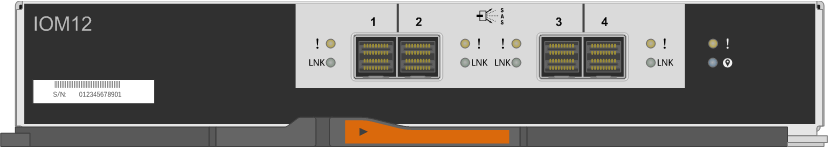
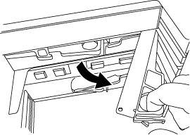

= Ein DS212C, DS224C oder DS460C IOM-Modul kann im laufenden Betrieb ausgetauscht oder ersetzt werden.
:allow-uri-read: 
:icons: font
:imagesdir: ../media/

[role="lead"]
Die Systemkonfiguration bestimmt, ob ein unterbrechungsfreier Shelf IOM Hot-Swap oder ein unterbrechender Shelf IOM Austausch durchgeführt werden kann, wenn ein IOM12, IOM12B oder IOM12C Shelf IOM ausfällt.

.Über diese Aufgabe
* Dieses Verfahren gilt für Regale mit IOM12, IOM12B oder IOM12C Modulen.
+

NOTE: Dieses Verfahren ist für gleichwertige Shelf-IOM-Hot-Swaps oder -Austausche vorgesehen. Das bedeutet, dass ein IOM12-Modul nur durch ein anderes IOM12-Modul, ein IOM12B-Modul nur durch ein anderes IOM12B-Modul oder ein IOM12C-Modul nur durch ein anderes IOM12C-Modul ersetzt werden kann.

* Die Module IOM12, IOM12B oder IOM12C lassen sich anhand ihres Aussehens unterscheiden:
+
Die IOM12-Module zeichnen sich durch ein "IOM12"-Label aus:

+

+
Die IOM12B-Module zeichnen sich durch einen blauen Streifen und ein „IOM12B“-Label aus:

+
image::../media/iom12b.png[Vorderseite des IOM12B]

+
Die IOM12C Module sind durch einen blauen und grauen Streifen sowie die Aufschrift "IOM12C" gekennzeichnet:

+
image::../media/drw_iom12c_ieops-2175.svg[Vorderseite von IOM12C]

* Bei Multipath (Multipath HA oder Multipath), Tri-Path-HA und Quad-Pathed (Quad Path HA oder Quad Path) Konfigurationen können Sie ein Shelf IOM im laufenden Betrieb austauschen (unterbrechungsfreies Ersetzen eines Shelf IOM in einem System, das eingeschaltet ist und Daten bereitstellt – I/O wird ausgeführt).
* Für FAS2700 Serie Single-Path HA-Konfigurationen ist eine Übernahme- und Rückgabeoperation erforderlich, um ein Shelf-IOM in einem eingeschalteten System zu ersetzen, das Daten bereitstellt und bei dem E/A-Vorgänge im Gange sind.
+

CAUTION: Wenn Sie versuchen, ein Shelf-IOM auf einem Festplatten-Shelf durch eine Single-Path-Verbindung zu tauschen, gehen alle Zugriffe auf die Festplattenlaufwerke im Festplatten-Shelf und alle darunter liegenden Festplatten-Shelfs verloren. Sie könnten auch Ihr gesamtes System herunterbringen.

* Die Festplatten-Shelf- (IOM)-Firmware wird auf einem neuen Shelf-IOM automatisch mit einer nicht aktuellen Firmware-Version aktualisiert (unterbrechungsfrei).
+
Shelf IOM Firmware-Prüfungen finden alle zehn Minuten statt. Eine Aktualisierung der IOM-Firmware kann bis zu 30 Minuten dauern.

* Bei Bedarf können Sie die (blauen) LEDs des Festplatten-Shelfs einschalten, um Hilfe bei der physischen Suche nach dem betroffenen Festplatten-Shelf zu leisten: `storage shelf location-led modify -shelf-name _shelf_name_ -led-status on`
+
Ein Festplatten-Shelf verfügt über drei Standort-LEDs: Eine auf der Bedieneranzeige und eine an jedem Shelf-IOM. Die Standort-LEDs leuchten 30 Minuten lang. Sie können sie ausschalten, indem Sie denselben Befehl eingeben, jedoch die Option „aus“ verwenden.

* Bei Bedarf finden Sie im link:service-monitor-leds.html#operator-display-panel-leds["Überwachung der Festplatten-Shelf-LEDs"] Handbuch Informationen zur Bedeutung und Position der LEDs der Festplattenablagen auf dem Bedienerdisplay und den FRU-Komponenten.

.Bevor Sie beginnen
* Alle anderen Komponenten im System, einschließlich des anderen IOM12, IOM12B oder IOM12C Moduls, müssen ordnungsgemäß funktionieren.
* *Best Practice*: Stellen Sie sicher, dass Ihr System über die aktuelle Version der Disk Shelf (IOM)-Firmware und der Festplatten-Firmware verfügt, bevor Sie neue Disk Shelfs, Shelf-FRU-Komponenten oder SAS-Kabel hinzufügen. Besuchen Sie die NetApp Support-Website, um  https://mysupport.netapp.com/site/downloads/firmware/disk-shelf-firmware["Disk Shelf-Firmware herunterladen"] Und  https://mysupport.netapp.com/site/downloads/firmware/disk-drive-firmware["Laden Sie die Firmware für das Festplattenlaufwerk herunter"] .

.Schritte
. Richtig gemahlen.
. Packen Sie das neue Shelf-IOM aus und stellen Sie es auf eine Ebene Fläche nahe dem Festplatten-Shelf ein.
+
Speichern Sie alle Verpackungsmaterialien zum Verwenden der Rücksendung des fehlerhaften Shelf-IOM.

. Identifizieren Sie das ausgefallene Shelf-IOM physisch über die Warnmeldung der Systemkonsole und die LED für leuchtende Warnung (gelb) auf dem ausgefallenen Shelf-IOM.
. Führen Sie eine der folgenden Aktionen auf der Grundlage der Art der Konfiguration aus:
+
[cols="2*"]
|===
| Wenn Sie ein... | Dann... 

 a| 
Multipath HA, Tri-Path HA, Multipath, Quad-Path HA oder Quad-Path-Konfiguration
 a| 
Fahren Sie mit dem nächsten Schritt fort.

 a| 
FAS2700 Serie Single Path HA Konfiguration
 a| 
.. Ermitteln Sie den Ziel-Node (der Node, zu dem das ausgefallene Shelf-IOM gehört).
+
IOM A gehört zu Controller 1. IOM B gehört zu Controller 2.

.. Übernehmen des Ziel-Node: `storage failover takeover -bynode _partner HA node_`

|===
. Trennen Sie die Verkabelung vom Shelf-IOM, das Sie entfernen.
+
Notieren Sie sich die Shelf-IOM-Ports, mit denen jedes Kabel verbunden ist.

. Drücken Sie die orangefarbene Verriegelung am IOM-Nockengriff des Shelfs, bis sie wieder freigegeben wird. Öffnen Sie dann den Nockengriff vollständig, um das IOM-Shelf aus der mittleren Ebene zu lösen.
+
image::../media/drw_iom_latch.png[Entriegelungsriegel für Nockengriff]

+

. Schieben Sie das Shelf-IOM mithilfe des Nockengriffs aus dem Festplatten-Shelf heraus.
+
Verwenden Sie bei der Handhabung eines IOM-Regals immer zwei Hände, um sein Gewicht zu unterstützen.

. Warten Sie mindestens 70 Sekunden nach dem Entfernen des Shelf-IOM, bevor Sie das neue Shelf-IOM installieren.
+
Durch das Warten auf mindestens 70 Sekunden kann der Fahrer die Shelf-ID korrekt registrieren.

. Mit zwei Händen, wobei der Nockengriff des neuen EAM-Regals in der offenen Position steht, stützen und ausrichten Sie die Kanten des neuen EAM-Regals an der Öffnung im Platten-Shelf, und drücken Sie dann das neue Shelf-EAM fest, bis es auf die mittlere Ebene trifft.
+

NOTE: Verwenden Sie keine übermäßige Kraft, wenn Sie das Shelf-IOM in das Festplatten-Shelf schieben, da die Anschlüsse beschädigt werden können.

. Schließen Sie den Nockengriff, so dass die Verriegelung in die verriegelte Position einrastet und das EAM-Shelf fest sitzt.
. Schließen Sie die Verkabelung wieder an.
+
Die SAS-Kabelanschlüsse sind keyed. Wenn sie korrekt an einen IOM-Port ausgerichtet sind, klickt der Anschluss an seine Position, und die LNK-LED für den IOM-Port leuchtet grün. Sie stecken einen SAS-Kabelanschluss in einen IOM-Port, wobei die Pull-Lasche nach unten (auf der Unterseite des Connectors) ausgerichtet ist.

. Führen Sie eine der folgenden Aktionen auf der Grundlage der Art der Konfiguration aus:
+
[cols="2*"]
|===
| Wenn Sie ein... | Dann... 

 a| 
Multipath HA, Tri-Path HA, Multipath, Quad-Path HA oder Quad-Path-Konfiguration
 a| 
Fahren Sie mit dem nächsten Schritt fort.

 a| 
FAS2700 Serie Single Path HA Konfiguration
 a| 
Geben Sie den Ziel-Node zurück: `storage failover giveback -fromnode partner_HA_node`

|===
. Vergewissern Sie sich, dass die Links für den Shelf-IOM-Port eingerichtet wurden.
+
Für jeden Modulport, den Sie verkabelt haben, leuchtet die LNK (grün) LED auf, wenn eine oder mehrere der vier SAS-Lanes eine Verbindung (entweder mit einem Adapter oder einem anderen Festplatten-Shelf) hergestellt haben.

. Senden Sie das fehlerhafte Teil wie in den dem Kit beiliegenden RMA-Anweisungen beschrieben an NetApp zurück.
+
Wenden Sie sich an den technischen Support unter https://mysupport.netapp.com/site/global/dashboard["NetApp Support"], 888-463-8277 (Nordamerika), 00-800-44-638277 (Europa) oder +800-800-80-800 (Asien/Pazifik) wenn Sie die RMA-Nummer oder zusätzliche Hilfe beim Ersatzverfahren benötigen.

