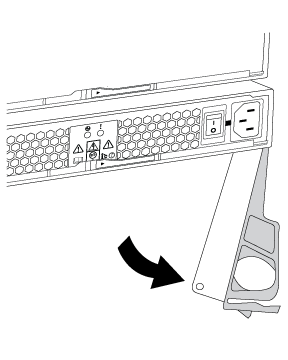

= Hot-Swap eines Netzteils – DS212C, DS224C oder DS460C
:allow-uri-read: 
:icons: font
:imagesdir: ../media/

[role="lead"]
Sie können ein ausgefallenes Netzteil im laufenden Betrieb in einem Festplatten-Shelf DS460C, DS224C oder DS212C austauschen.

Dieses Verfahren gilt für Regale mit IOM12- oder IOM12B-Modulen.

.Bevor Sie beginnen
* Alle anderen Komponenten im System - einschließlich des anderen Netzteils - müssen ordnungsgemäß funktionieren.
* Wenn Sie mehrere Netzteile ersetzen, müssen Sie dies nacheinander ausführen, damit das Festplatten-Shelf die Stromversorgung aufrecht erhalten kann.
* Sie müssen ein Netzteil innerhalb von zwei Minuten nach dem Entfernen ersetzen, um Unterbrechungen des Luftstroms des Festplatten-Shelfs zu minimieren.
* Verwenden Sie immer zwei Hände, wenn Sie ein Netzteil entfernen, installieren oder tragen, um das Gewicht zu halten.
* *Best Practice*: Stellen Sie sicher, dass Ihr System über die aktuelle Version der Disk Shelf (IOM)-Firmware und der Festplatten-Firmware verfügt, bevor Sie neue Disk Shelfs, Shelf-FRU-Komponenten oder SAS-Kabel hinzufügen. Besuchen Sie die NetApp Support-Website, um  https://mysupport.netapp.com/site/downloads/firmware/disk-shelf-firmware["Disk Shelf-Firmware herunterladen"] Und  https://mysupport.netapp.com/site/downloads/firmware/disk-drive-firmware["Laden Sie die Firmware für das Festplattenlaufwerk herunter"] .
* Bei Bedarf können Sie die (blauen) LEDs des Festplatten-Shelfs einschalten, um Hilfe bei der physischen Suche nach dem betroffenen Festplatten-Shelf zu leisten: `storage shelf location-led modify -shelf-name _shelf_name_ -led-status on`
+
Ein Festplatten-Shelf verfügt über drei Standort-LEDs: Eine auf der Bedieneranzeige und eine an jedem Shelf-IOM. Die Standort-LEDs leuchten 30 Minuten lang. Sie können sie ausschalten, indem Sie denselben Befehl eingeben, jedoch die Option „aus“ verwenden.

* Bei Bedarf können Sie sich an die link:/sas3/service-monitor-leds.html#operator-display-panel-leds["Überwachung der Festplatten-Shelf-LEDs"] Informationen zur Bedeutung und Position der Festplatten-Einbau-LEDs auf dem Bedienfeld und den FRU-Komponenten finden Sie im Handbuch.

.Schritte
. Richtig gemahlen.
. Packen Sie das neue Netzteil aus und stellen Sie es auf eine Ebene Fläche in der Nähe des Regals ein.
+
Bewahren Sie alle Verpackungsmaterialien auf, wenn Sie das defekte Netzteil zurücksenden.

. Ermitteln Sie das ausgefallene Netzteil über die Warnmeldung zur Systemkonsole und die LED für leuchtende Warnung (gelb) am Netzteil.
. Schalten Sie das ausgefallene Netzteil aus, und trennen Sie das Netzkabel:
+
.. Schalten Sie den Netzschalter am Netzteil aus.
.. Öffnen Sie die Netzkabelhalterung, und ziehen Sie das Netzkabel vom Netzteil ab.
.. Ziehen Sie das Netzkabel von der Stromversorgung ab.

. Drücken Sie die orangefarbene Verriegelung am Handgriff der Netzteilkamera, bis sie wieder loslässt, und öffnen Sie dann den Nockengriff, um die Stromversorgung vollständig aus der Mittelebene zu lösen.
+
Die folgende Abbildung gilt für ein Netzteil, das in einem DS224C oder DS212C Festplatten-Shelf verwendet wird. Der Entriegelungshebel funktioniert jedoch auf die gleiche Weise bei Netzteilen, die in DS460C Festplatten-Shelfs verwendet werden.

+

. Schieben Sie das Netzteil mithilfe des Nockengriffs aus dem Platten-Shelf heraus.
+
Wenn Sie ein DS224C- oder DS212C-Festplattenfach besitzen, schwenkt beim Entfernen des Netzteils eine Klappe ein, um den leeren Schacht zu verschließen. Dies trägt zur Aufrechterhaltung der Luftzirkulation und Kühlung bei.

+

NOTE: Verwenden Sie bei der Handhabung eines Netzteils immer zwei Hände, um sein Gewicht zu stützen.

. Stellen Sie sicher, dass sich der ein-/Ausschalter des neuen Netzteils in der Stellung aus befindet.
. Halten Sie den Nockengriff des neuen Netzteils in geöffneter Position und stützen Sie es mit beiden Händen, um die Kanten an der Öffnung im Festplattenfach auszurichten. Drücken Sie das neue Netzteil dann fest hinein, bis es die Mittelebene berührt.
+

CAUTION: Beim Einschieben des Netzteils in das Festplatten-Shelf keine übermäßige Kraft verwenden, da die Anschlüsse beschädigt werden können.

. Schließen Sie den Nockengriff, so dass die Verriegelung in die verriegelte Position einrastet und das Netzteil vollständig eingesetzt ist.
. Schließen Sie das Netzkabel wieder an, und schalten Sie das neue Netzteil ein:
+
.. Schließen Sie das Netzkabel wieder an die Stromquelle an.
.. Schließen Sie das Netzkabel wieder an das Netzteil an, und befestigen Sie das Netzkabel mit der Netzkabelhalterung.
.. Schalten Sie den Netzschalter ein.
+
Die grüne Betriebs-LED und die gelbe Achtung-LED des Netzteils leuchten. Innerhalb von 40 Sekunden erlischt die gelbe Achtung-LED.

. Senden Sie das fehlerhafte Teil wie in den dem Kit beiliegenden RMA-Anweisungen beschrieben an NetApp zurück.
+
Wenden Sie sich an den technischen Support unter https://mysupport.netapp.com/site/global/dashboard["NetApp Support"], 888-463-8277 (Nordamerika), 00-800-44-638277 (Europa) oder +800-800-80-800 (Asien/Pazifik) wenn Sie die RMA-Nummer oder zusätzliche Hilfe beim Ersatzverfahren benötigen.

