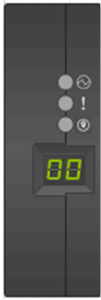

= Überwachen Sie Platten-Shelf-LEDs – Shelfs mit IOM12/IOM12B-Modulen
:allow-uri-read: 
:icons: font
:imagesdir: ../media/

[role="lead"]
Sie können den Zustand Ihres Festplatten-Shelf überwachen, indem Sie die Standort- und Statusbedingungen der LEDs an den Festplatten-Shelf-Komponenten verstehen.

== LEDs auf der Bedieneranzeige

Die LEDs auf der Bedienfeldanzeige des Festplatten-Shelf zeigen an, ob Ihr Festplatten-Shelf ordnungsgemäß funktioniert oder keine Probleme mit der Hardware auftreten.

In der folgenden Tabelle werden die drei LEDs auf dem Bedienerdisplay beschrieben, das in den Festplatten-Shelfs DS460C, DS224C und DS212C verwendet wird:

[cols="4*"]
|===
| LED-Symbol | LED-Name | Bundesland | Beschreibung 

 a| 
image:../media/drw_sas_power_icon.png[""]
 a| 
Strom
 a| 
Leuchtet grün
 a| 
Mindestens ein Netzteil liefert Strom für das Festplatten-Shelf.

.2+| image:../media/drw_sas_fault_icon.png[""] .2+| Achtung  a| 
Leuchtet gelb
 a| 
Bei der Funktion einer weiteren FRU ist ein Fehler aufgetreten: Das Platten-Shelf, die Laufwerke, IOM12/IOM12B-Module oder die Netzteile.

Überprüfen Sie Ereignismeldungen, um zu ermitteln, welche Korrekturmaßnahmen ergriffen werden müssen.

 a| 
Blinkt gelb
 a| 
Die Shelf-ID befindet sich in einem ausstehenden Status.

Schalten Sie das Festplatten-Shelf aus und wieder ein, damit die Shelf-ID Auswirkungen hat.

 a| 
image:../media/drw_sas3_location_icon.gif[""]
 a| 
Standort
 a| 
Leuchtet blau
 a| 
Der Systemadministrator aktivierte diese LED-Funktion, um die physische Suche nach dem zu serviceenden Festplatten-Shelf zu erleichtern.

Wenn diese LED-Funktion aktiviert ist, leuchten die Standort-LED auf dem Bedienfeld und beide IOM12/IOM12B-Module auf. Nach 30 Minuten schalten sich die Standort-LEDs automatisch aus.

|===
Je nach Ihrem Festplatten-Shelf-Modell sieht die Bedieneranzeige anders aus; die drei LEDs sind jedoch in der gleichen Weise angeordnet.

Die folgende Abbildung zeigt eine DS224C Festplatten-Shelf-Bedieneranzeige mit aufgelaufter Endkappe:

== LEDs für IOM12/IOM12B-Modul

Die LEDs am IOM12/IOM12B-Modul zeigen an, ob das Modul normal funktioniert, ob es für I/O-Datenverkehr bereit ist und ob es Probleme mit der Hardware gibt.

In der folgenden Tabelle werden die LEDs des IOM12/IOM12B-Moduls beschrieben, die mit der Funktion des Moduls und der Funktion der einzelnen SAS-Ports auf dem Modul verbunden sind.

Das IOM12/IOM12B Modul wird in den Festplatten-Shelfs DS460C, DS224C und DS212C verwendet.

[cols="4*"]
|===
| LED-Symbol | LED-Name | Bundesland | Beschreibung 

 a| 
image:../media/drw_sas_fault_icon.png[""]
 a| 
Achtung
 a| 
Leuchtet gelb
 a| 
Funktion des IOM12/IOM12B-Moduls: Bei der Funktion des IOM12/IOM12B-Moduls ist ein Fehler aufgetreten.

SAS-Port-Funktion: Weniger als alle vier SAS-Lanes haben einen Link eingerichtet (mit einem Adapter oder einem anderen Festplatten-Shelf).

Überprüfen Sie Ereignismeldungen, um zu ermitteln, welche Korrekturmaßnahmen ergriffen werden müssen.

 a| 
LNK
 a| 
Port-Link
 a| 
Leuchtet grün
 a| 
Mindestens eine der vier SAS Lanes hat einen Link eingerichtet (mit einem Adapter oder einem anderen Festplatten-Shelf).

 a| 
image:../media/drw_sas3_location_icon.gif[""]
 a| 
Standort
 a| 
Leuchtet blau
 a| 
Der Systemadministrator hat diese LED-Funktion aktiviert, um das Festplatten-Shelf mit dem ausgefallenen IOM12/IOM12B Modul physisch zu lokalisieren.

Wenn diese LED-Funktion aktiviert ist, leuchten die Standort-LED auf dem Bedienfeld und beide IOM12/IOM12B-Module auf. Nach 30 Minuten schalten sich die Standort-LEDs automatisch aus.

|===
Die folgende Abbildung ist für ein IOM12-Modul dargestellt:

image::../media/drw_iom12.gif[drw iom12]

Die IOM12B-Module zeichnen sich durch einen blauen Streifen und ein „IOM12B“-Label aus:

image::../media/iom12b.png[Iom12b]

== Netzteil-LEDs

Die LEDs am Netzteil zeigen an, ob das Netzteil normal funktioniert oder es Hardwareprobleme gibt.

In der folgenden Tabelle werden die beiden LEDs an den Netzteilen beschrieben, die in den Festplatten-Shelfs DS460C, DS224C und DS212C verwendet werden:

[cols="4*"]
|===
| LED-Symbol | LED-Name | Bundesland | Beschreibung 

.2+| image:../media/drw_sas_power_icon.png[""] .2+| Strom  a| 
Leuchtet grün
 a| 
Das Netzteil funktioniert ordnungsgemäß.

 a| 
Aus
 a| 
Das Netzteil ist ausgefallen, der Netzschalter ist ausgeschaltet, das Netzkabel ist nicht richtig installiert oder der Strom wird nicht ordnungsgemäß an die Stromversorgung angeschlossen.

Überprüfen Sie Ereignismeldungen, um zu ermitteln, welche Korrekturmaßnahmen ergriffen werden müssen.

 a| 
image:../media/drw_sas_fault_icon.png[""]
 a| 
Achtung
 a| 
Leuchtet gelb
 a| 
Bei der Funktion des Netzteils ist ein Fehler aufgetreten.

Überprüfen Sie Ereignismeldungen, um zu ermitteln, welche Korrekturmaßnahmen ergriffen werden müssen.

|===
Je nach Platten-Shelf-Modell können die Netzteile unterschiedlich sein, was den Standort der beiden LEDs diktiert.

Die folgende Abbildung zeigt ein Netzteil, das in einem DS460C Festplatten-Shelf verwendet wird.

Die beiden LED-Symbole wirken wie die Etiketten und LEDs, was bedeutet, dass die Symbole selbst leuchten - es gibt keine benachbarten LEDs.

image::../media/28_dwg_e2860_de460c_psu.gif[28 DWG e2860 de460c psu]

Die folgende Abbildung gilt für ein Netzteil, das in einem DS224C oder DS212C Festplatten-Shelf verwendet wird:

image::../media/drw_powersupply_913w_vsd.gif[drw-Netzteil 913W vsd]

== Lüfter-LEDs auf DS460C Festplatten-Shelfs

Die LEDs der DS460C Lüfter geben an, ob der Lüfter normal funktioniert oder es zu Hardwareproblemen kommt.

In der folgenden Tabelle werden die LEDs der in den DS460C Festplatten-Shelfs verwendeten Lüfter beschrieben:

[cols="4*"]
|===
| Element | LED-Name | Bundesland | Beschreibung 

 a| 
image:../media/legend_icon_01.png[""]
 a| 
Achtung
 a| 
Leuchtet gelb
 a| 
Bei der Funktion des Lüfters ist ein Fehler aufgetreten.

Überprüfen Sie Ereignismeldungen, um zu ermitteln, welche Korrekturmaßnahmen ergriffen werden müssen.

|===
image:../media/28_dwg_e2860_de460c_single_fan_canister_with_led_callout.gif[""]

== Festplatten-LEDs

Die LEDs auf einem Festplattenlaufwerk zeigen an, ob es ordnungsgemäß funktioniert oder dass Probleme mit der Hardware bestehen.

=== Festplatten-LEDs für DS224C und DS212C Festplatten-Shelfs

In der folgenden Tabelle werden die beiden LEDs auf den in DS224C und DS212C verwendeten Festplattenlaufwerken beschrieben:

[cols="4*"]
|===
| Legende | LED-Name | Bundesland | Beschreibung 

.2+| image:../media/legend_icon_01.png[""] .2+| Aktivität  a| 
Leuchtet grün
 a| 
Das Laufwerk ist mit Strom versorgt.

 a| 
Blinkt grün
 a| 
Das Laufwerk verfügt über Strom und E/A-Vorgänge werden ausgeführt.

 a| 
image:../media/legend_icon_02.png[""]
 a| 
Achtung
 a| 
Leuchtet gelb
 a| 
Bei der Funktion des Festplattenlaufwerks ist ein Fehler aufgetreten.

Überprüfen Sie Ereignismeldungen, um zu ermitteln, welche Korrekturmaßnahmen ergriffen werden müssen.

|===
Je nach Festplatten-Shelf-Modell sind die Festplatten im Festplatten-Shelf vertikal oder horizontal angeordnet. Dies bestimmt die Position der beiden LEDs.

Die folgende Abbildung gilt für ein Festplattenlaufwerk, das in einem DS224C Festplatten-Shelf verwendet wird.

DS224C Festplatten-Shelfs verwenden 2.5-Zoll-Festplatten, die vertikal im Festplatten-Shelf angeordnet sind.

image::../media/drw_diskdrive_ds224c.gif[drw-Festplattenlaufwerk ds224c]

Die folgende Abbildung zeigt sich für ein Festplattenlaufwerk, das in einem DS212C Festplatten-Shelf verwendet wird.

DS212C Festplatten-Shelfs verwenden 3.5-Zoll-Festplattenlaufwerke oder 2.5-Zoll-Festplattenlaufwerke in Trägern, die horizontal im Festplatten-Shelf angeordnet sind.

image::../media/drw_diskdrive_ds212c.gif[drw-Disklaufwerk ds212c]

=== Festplatten-LEDs für DS460C Festplatten-Shelfs

In der folgenden Abbildung und in der Tabelle werden die Aktivitäts-LEDs am Laufwerkschublade und ihre Betriebszustände beschrieben:

image::../media/2860_dwg_drive_drawer_leds.gif[2860-Dwg-laufwerksschublade-leds]

[cols="4*"]
|===
| Standort | LED | Statusanzeige | Beschreibung 

.3+| 1 .3+| Achtung: Schublade Achtung für jede Schublade  a| 
Leuchtet gelb
 a| 
Eine Komponente in der Laufwerksschublade muss vom Bediener beachtet werden.

 a| 
Aus
 a| 
Kein Laufwerk oder eine andere Komponente in der Schublade erfordert Aufmerksamkeit, und kein Laufwerk in der Schublade ist aktiv.

 a| 
Blinkt gelb
 a| 
Ein Vorgang zum Auffinden des Laufwerks ist für jedes Laufwerk in der Schublade aktiv.

.3+| 2-13 .3+| Aktivität: Laufwerksaktivität für Laufwerke 0 bis 11 in der Laufwerkschublade  a| 
Grün
 a| 
Das Laufwerk ist eingeschaltet und das Laufwerk arbeitet normal.

 a| 
Blinkt grün
 a| 
Das Laufwerk verfügt über einen Stromantrieb, und I/O-Vorgänge werden ausgeführt.

 a| 
Aus
 a| 
Der Strom ist ausgeschaltet.

|===
Wenn die Laufwerksschublade geöffnet ist, wird vor jedem Laufwerk eine Warnungs-LED angezeigt.

image::../media/2860_dwg_amber_on_drive.gif[2860 g Bernstein auf Antrieb]

[cols="10,90"]
|===

 a| 
image:../media/legend_icon_01.png[""]
| Die Warnungs-LED leuchtet auf 
|===