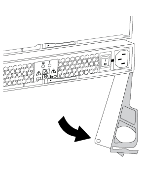

= Hot-Swap-A-Netzteil – Regale mit IOM12/IOM12B-Modulen
:allow-uri-read: 
:icons: font
:imagesdir: ../media/

[role="lead"]
Sie können ein ausgefallenes Netzteil im laufenden Betrieb in einem Festplatten-Shelf DS460C, DS224C oder DS212C austauschen.

Alle anderen Komponenten im System - einschließlich des anderen Netzteils - müssen ordnungsgemäß funktionieren.

.Über diese Aufgabe
* Wenn Sie mehrere Netzteile ersetzen, müssen Sie dies nacheinander ausführen, damit das Festplatten-Shelf die Stromversorgung aufrecht erhalten kann.
* Sie müssen ein Netzteil innerhalb von zwei Minuten nach dem Entfernen ersetzen, um Unterbrechungen des Luftstroms des Festplatten-Shelfs zu minimieren.
* Verwenden Sie immer zwei Hände, wenn Sie ein Netzteil entfernen, installieren oder tragen, um das Gewicht zu halten.
* Als Best Practice wird empfohlen, die aktuellen Versionen der Festplatten-Shelf- (IOM) und Festplatten-Firmware auf dem System zu installieren, bevor neue Festplatten-Shelfs, Shelf-FRU-Komponenten oder SAS-Kabel hinzugefügt werden.
+
Aktuelle Versionen der Firmware finden Sie auf der NetApp Support Site.

+
https://mysupport.netapp.com/site/downloads/firmware/disk-shelf-firmware["NetApp Downloads: Festplatten-Shelf Firmware"]

+
https://mysupport.netapp.com/site/downloads/firmware/disk-drive-firmware["NetApp Downloads: Festplatten-Firmware"]

* Bei Bedarf können Sie die (blauen) LEDs des Festplatten-Shelfs einschalten, um Hilfe bei der physischen Suche nach dem betroffenen Festplatten-Shelf zu leisten: `storage shelf location-led modify -shelf-name _shelf_name_ -led-status on`
+
Ein Platten-Shelf hat drei Positionen-LEDs: Eine auf der Bedienkonsole und eine auf jedem IOM12-Modul. Die Standort-LEDs leuchten 30 Minuten lang. Sie können sie ausschalten, indem Sie denselben Befehl eingeben, jedoch die Option „aus“ verwenden.

* Falls erforderlich, finden Sie Informationen über die Bedeutung und Lage der Festplatten-Shelf-LEDs auf der Bedieneranzeige und den FRU-Komponenten.

.Schritte
. Richtig gemahlen.
. Packen Sie das neue Netzteil aus und stellen Sie es auf eine Ebene Fläche in der Nähe des Regals ein.
+
Bewahren Sie alle Verpackungsmaterialien auf, wenn Sie das defekte Netzteil zurücksenden.

. Ermitteln Sie das ausgefallene Netzteil über die Warnmeldung zur Systemkonsole und die LED für leuchtende Warnung (gelb) am Netzteil.
. Schalten Sie das ausgefallene Netzteil aus, und trennen Sie das Netzkabel:
+
.. Schalten Sie den Netzschalter am Netzteil aus.
.. Öffnen Sie die Netzkabelhalterung, und ziehen Sie das Netzkabel vom Netzteil ab.
.. Ziehen Sie das Netzkabel von der Stromversorgung ab.

. Drücken Sie die orangefarbene Verriegelung am Handgriff der Netzteilkamera, bis sie wieder loslässt, und öffnen Sie dann den Nockengriff, um die Stromversorgung vollständig aus der Mittelebene zu lösen.
+
Die folgende Abbildung gilt für ein Netzteil, das in einem DS224C oder DS212C Festplatten-Shelf verwendet wird. Der Entriegelungshebel funktioniert jedoch auf die gleiche Weise bei Netzteilen, die in DS460C Festplatten-Shelfs verwendet werden.

+

. Schieben Sie das Netzteil mithilfe des Nockengriffs aus dem Platten-Shelf heraus.
+
Wenn Sie über ein DS224C oder DS212C Festplatten-Shelf verfügen, während Sie das Netzteil entfernen, schwingt eine Klappe an ihrer Stelle, um den leeren Schacht zu blockieren. Dadurch wird der Luftstrom und die Kühlung aufrechterhalten.

+

NOTE: Verwenden Sie bei der Handhabung eines Netzteils immer zwei Hände, um sein Gewicht zu stützen.

. Stellen Sie sicher, dass sich der ein-/Ausschalter des neuen Netzteils in der Stellung aus befindet.
. Mit zwei Händen, wobei der Nockengriff des neuen Netzteils in der offenen Position liegt, stützen und richten Sie die Kanten des neuen Netzteils an der Öffnung im Platten-Shelf aus. Drücken Sie dann das neue Netzteil fest, bis es auf die mittlere Ebene trifft.
+

NOTE: Beim Einschieben des Netzteils in das Festplatten-Shelf keine übermäßige Kraft verwenden, da die Anschlüsse beschädigt werden können.

. Schließen Sie den Nockengriff, so dass die Verriegelung in die verriegelte Position einrastet und das Netzteil vollständig eingesetzt ist.
. Schließen Sie das Netzkabel wieder an, und schalten Sie das neue Netzteil ein:
+
.. Schließen Sie das Netzkabel wieder an die Stromquelle an.
.. Schließen Sie das Netzkabel wieder an das Netzteil an, und befestigen Sie das Netzkabel mit der Netzkabelhalterung.
.. Schalten Sie den Netzschalter ein.
+
Die Strom- (grüne) LED und die Warnungs-LED (gelb) des Netzteils leuchten auf, und die Warnungs-LED (gelb) erlischt innerhalb von 40 Sekunden.

. Senden Sie das fehlerhafte Teil wie in den dem Kit beiliegenden RMA-Anweisungen beschrieben an NetApp zurück.
+
Wenden Sie sich an den technischen Support unter https://mysupport.netapp.com/site/global/dashboard["NetApp Support"], 888-463-8277 (Nordamerika), 00-800-44-638277 (Europa) oder +800-800-80-800 (Asien/Pazifik) wenn Sie die RMA-Nummer oder zusätzliche Hilfe beim Ersatzverfahren benötigen.

